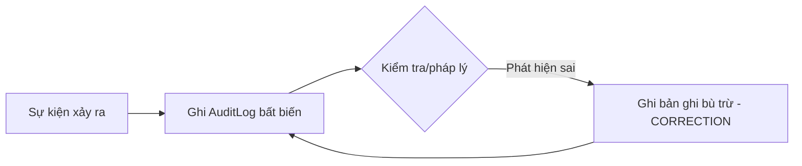
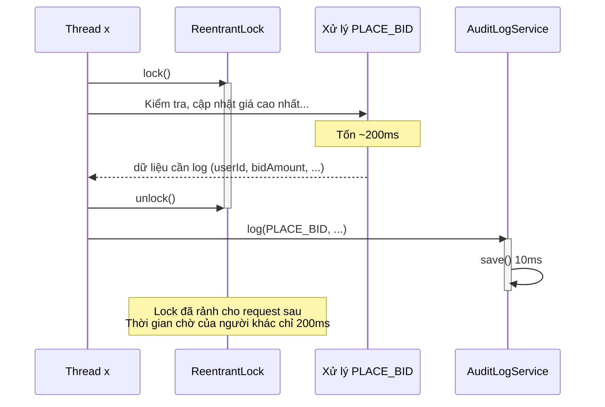

Chào bạn,

Hôm nay chúng ta cùng nhau khám phá một mảnh ghép quan trọng trong kiến trúc BidHub: **Audit Log – thiết kế bất biến, pattern DAO và các quyết định kỹ thuật đằng sau nó**. Giống như Bài 0.3 đã giúp bạn làm chủ JavaFX Task và luồng, phần này sẽ cho bạn cái nhìn thấu đáo về cách hệ thống ghi lại mọi hành động mà không phá vỡ tính toàn vẹn dữ liệu, không ảnh hưởng đến hiệu năng và quan trọng nhất là “chống cháy” cho các xử lý nghiệp vụ chính.

Tài liệu này không phải là danh sách câu hỏi – đáp án khô khan, mà là một buổi trò chuyện, nơi bạn sẽ hiểu **tại sao chúng ta chọn cách này thay vì cách kia**, và làm thế nào những nguyên tắc ấy được hiện thực hóa ngay trong code của nhóm.

---

## 🧩 Lộ trình tìm hiểu

Chúng ta sẽ lần lượt làm rõ sáu câu hỏi trong phần 0.4:

1. **Tính bất biến của AuditLog** – Tại sao không setter, không updatedAt?
2. **AuditActions – Interface constant hay Enum?** – Cuộc chiến giữa type‑safety và linh hoạt.
3. **Lưu userId = null** – JDBC có ghi NULL không, cần lưu ý gì?
4. **Vì sao AuditLogService.log() không được ném lỗi?** – Bài học về “fire‑and‑forget”.
5. **Bảng không có updated_at – hack constructor?** – Hy sinh nhỏ cho đúng triết lý.
6. **Log trong hay sau lock?** – Cuộc chiến nanosecond trong đấu giá đồng thời.

Hãy bắt đầu với câu hỏi cốt lõi nhất: triết lý thiết kế của AuditLog.

---

### 1. Tại sao AuditLog là immutable? Cách “sửa” một sự kiện đã ghi



**Trả lời ngắn gọn:**  
Audit log (nhật ký kiểm toán) là bằng chứng lịch sử. Bất kỳ ai, kể cả quản trị viên, **không được phép sửa đổi quá khứ**. Nếu cho phép `setUserId(...)` hoặc `setDetails(...)`, bạn sẽ phá hủy tính tin cậy của toàn bộ hệ thống truy vết.

Trong BidHub, lớp `AuditLog` được khai báo:
- **Không có setter** nào cả.
- Các trường `userId`, `action`, `details` đều được gán qua constructor và là `final` (ngầm định, vì không có phương thức thay đổi).
- Kế thừa từ `Entity`, nhưng `Entity` cũng không cung cấp setter cho `id`, `createdAt` hay `updatedAt` (chỉ có getter).

Khi bạn cần “sửa” một thông tin đã log – ví dụ: log ghi nhầm người dùng A thực hiện hành động, nhưng thực ra là người dùng B – **bạn không UPDATE hàng cũ**. Thay vào đó, bạn **ghi một bản ghi mới** với action = `"CORRECTION"` (hoặc một mã tương tự), trong `details` mô tả rõ: *“Sửa cho sự kiện có id = xxx: thực tế người dùng B mới là người thực hiện”*. Như vậy lịch sử vẫn còn nguyên vẹn, và người kiểm toán có thể thấy cả hành động gốc lẫn hành động sửa.

Đây là mẫu thiết kế **Immutable Record** kết hợp **Compensating Transaction** – cực kỳ phổ biến trong các hệ thống tài chính, ngân hàng. Nó cũng giúp `AuditLog` an toàn tuyệt đối khi được chia sẻ giữa nhiều thread mà không lo dữ liệu bị thay đổi bất ngờ.

```java
// Ví dụ AuditLog bất biến (rút gọn)
public final class AuditLog extends Entity {
    private final String userId;
    private final String action;
    private final String details;

    public AuditLog(String userId, String action, String details) {
        super(); // id + createdAt tự sinh
        this.userId = userId;
        this.action = action;
        this.details = details;
    }
    // Chỉ có getter, không setter
}
```

---

### 2. `AuditActions` là interface constant, không phải enum – Trade‑off là gì?

**Góc nhìn của BidHub:**  
`AuditActions` chứa các hằng số như `USER_LOGIN`, `PLACE_BID`, `AUCTION_CLOSED`… Chúng được dùng trực tiếp trong câu lệnh SQL (cột `action TEXT`) và trong code Java (so sánh, gán). Vậy tại sao không dùng enum?

| Tiêu chí | Interface constant (`String`) | Enum |
|----------|-------------------------------|------|
| **Lưu trữ trong DB** | Giá trị String gốc, không cần convert. | Cần gọi `.name()` hoặc custom converter. |
| **Mở rộng** | Thêm constant mới không ảnh hưởng code cũ, không cần biên dịch lại mọi nơi dùng interface. | Thêm enum constant yêu cầu biên dịch lại tất cả module phụ thuộc. |
| **Type‑safety** | Không có – có thể vô tình truyền `"LOGIN_USER"` sai chính tả. | Có – compiler bắt lỗi ngay nếu dùng sai. |
| **Sử dụng với DB** | So sánh trực tiếp `WHERE action = ?` với String. | Vẫn phải map sang String. Nếu dùng ordinal thì nguy hiểm khi thay đổi thứ tự. |
| **Tập giá trị đóng/mở** | Mở – ai cũng có thể truyền String bất kỳ. | Đóng – chỉ những giá trị đã định nghĩa mới hợp lệ. |

**Vậy trong BidHub, chúng ta chọn interface constant vì:**
- Hệ thống đang phát triển nhanh, mỗi tuần có thể thêm action mới (`ITEM_DELETED`, `AUCTION_EXTENDED`…) mà không muốn sửa enum rồi phải biên dịch lại toàn bộ server (enum là một class, thay đổi nó kéo theo rất nhiều class khác).
- Dữ liệu audit thường được lưu text thuần, và các công cụ kiểm tra (ví dụ: SQL trực tiếp) cũng thao tác với text dễ hơn.
- Rủi ro sai chính tả được giảm thiểu vì chúng ta chỉ dùng các hằng số đã định nghĩa trong interface, không hardcode “LOGIN” lung tung. Khi cần tạo action mới, lập trình viên sẽ thêm vào `AuditActions` trước, tạo một “từ điển” tập trung.

**Khi nào nên chọn Enum?** Khi tập action là cố định và nhỏ, bạn muốn compiler bảo vệ bạn khỏi lỗi gõ sai, và không cần mở rộng thường xuyên. Ví dụ: trạng thái đấu giá `AuctionStatus` dùng enum vì chỉ có `UPCOMING`, `ACTIVE`, `CLOSED` – ba giá trị đó sẽ không đổi.

---

### 3. `ps.setString(2, log.getUserId())` với userId = null – JDBC có ghi NULL không?

**Câu trả lời ngắn:** Có, JDBC sẽ ghi giá trị SQL `NULL` vào cột `user_id`. Bạn không cần làm gì đặc biệt.

Khi bạn gọi `PreparedStatement.setString(2, null)`, JDBC driver (ở đây là SQLite) hiểu rằng tham số thứ 2 là `NULL`, và câu lệnh SQL `INSERT ... VALUES (?, ?, ...)` sẽ chèn `NULL` vào cột tương ứng. Điều này hoàn toàn hợp lệ vì cột `user_id` trong bảng `audit_logs` được định nghĩa là `TEXT` (không có ràng buộc `NOT NULL`). Hành động này tương đương với việc bạn viết trực tiếp `INSERT INTO audit_logs ... VALUES (..., NULL, ...)`.

**Cần kiểm tra gì thêm?**
- Chỉ cần đảm bảo rằng logic nghiệp vụ của bạn chấp nhận `user_id = NULL`. Trong trường hợp system action (ví dụ: `AUCTION_CLOSED` do hết thời gian, không có người dùng cụ thể), thì đây là mong muốn.
- Nếu cột có ràng buộc NOT NULL, JDBC sẽ ném `SQLException` – nhưng schema của chúng ta không có ràng buộc đó.
- Với các driver khác (MySQL, PostgreSQL), hành vi tương tự cũng đúng.

Vậy nên code `ps.setString(2, log.getUserId());` là an toàn, ngay cả khi userId là `null`. Không cần điều kiện `if (userId != null) ps.setString(...) else ps.setNull(...)`; JDBC đã làm điều đó ngầm cho bạn.

---

### 4. Tại sao `AuditLogService.log()` không được ném exception ra ngoài?

**Bối cảnh:** Tuần 5, khi `handleLogin()` xử lý đăng nhập thành công, nó sẽ gọi `auditLogService.log(USER_LOGIN, ...)`. Nếu `log()` bên trong gọi `auditLogDao.save()`, mà `save()` lỡ ném `SQLException` (ví dụ: lỗi DB đầy, lock bảng…), chuyện gì xảy ra?

- Nếu bạn **không bắt** exception trong `log()`:
  - Exception sẽ lan lên `RequestHandler.handle()`, rồi vào `catch (Exception e)` ở đó, biến thành response lỗi `"Lỗi hệ thống nội bộ"` gửi về client.
  - Hậu quả: **Người dùng đã đăng nhập đúng, nhưng nhận về báo lỗi**, thậm chí có thể bị khóa tài khoản nếu logic phía trên không cẩn thận. Chưa kể, `handleLogin` đã cập nhật token, lưu session – nhưng client lại tưởng thất bại.

- **Cách đúng:** `AuditLogService.log()` phải là **fire‑and‑forget**. Nó phải **bắt tất cả `Exception`**, ghi log ra console / file (bằng `System.err.println` hoặc logging framework), và **không bao giờ ném ra ngoài**.

```java
// Trong AuditLogService (giả định Tuần 5)
public void log(String action, String userId, String details) {
    try {
        AuditLog logEntry = new AuditLog(userId, action, details);
        auditLogDao.save(logEntry);
    } catch (Exception e) {
        // ❌ Tuyệt đối không throw e;
        // ✅ Chỉ ghi nhận lỗi nội bộ
        System.err.println("[AuditLogService] Không thể ghi audit: " + e.getMessage());
    }
}
```

Như vậy, business flow chính (login, bid, …) không bị ảnh hưởng bởi sự thất bại của audit. Đây là nguyên tắc **“audit không được cản trở nghiệp vụ”**. Nếu cần, bạn có thể gửi log thất bại sang một hàng đợi để retry sau, nhưng tại thời điểm xử lý request, nó là “nice to have, not critical to response”.

---

### 5. Vì sao bảng `audit_logs` không có `updated_at`, và constructor hack bằng `createdAt`?

**Ngắn gọn:** Audit log không bao giờ được cập nhật – vậy `updated_at` là thừa. Việc dùng chung `createdAt` cho cả `updatedAt` của lớp cha `Entity` là một **“trade‑off kỹ thuật” chấp nhận được**.

Phân tích kỹ hơn:
- Lớp `Entity` (từ bidhub-common) có hai trường: `createdAt` và `updatedAt`. Tất cả domain class (User, Item, Auction, …) đều kế thừa `Entity` và mapping với bảng DB có cả hai cột hoặc ít nhất constructor nhận cả hai tham số.
- Riêng `AuditLog`, bảng `audit_logs` chỉ có `created_at`, không có `updated_at`. Nếu chúng ta bắt `Entity` phải có `updatedAt`, mà bảng không có, có hai lựa chọn:
  1. **Thêm cột `updated_at` vào bảng** – nhưng cột này sẽ luôn NULL hoặc bằng `created_at`, gây lãng phí và làm sai lệch ý nghĩa: “audit log có thể cập nhật?” Thực tế là không.
  2. **Giữ nguyên bảng, nhưng trong constructor DB‑load của AuditLog, truyền `createdAt` cho cả hai tham số của `Entity`.**  
     `super(id, createdAt, createdAt);`  
     Như vậy, `updatedAt` sẽ trỏ đến cùng một giá trị `createdAt`. Dù không chính xác về ngữ nghĩa, nhưng **không gây lỗi logic** vì không có code nào kiểm tra `updatedAt` của audit log (và cũng không có setter cho `createdAt` / `updatedAt` trong Entity, nên không thể vô tình thay đổi). Method `getUpdatedAt()` trả về thời điểm tạo – điều này có thể chấp nhận vì audit log không bao giờ thay đổi, nên “thời điểm cập nhật cuối” cũng chính là thời điểm tạo.

Đây là một cách làm thực dụng để giữ cho hệ thống nhất quán với base class mà không phải tạo ra một phiên bản `Entity` riêng cho audit log hay thêm cột vô nghĩa. Trong các project thực tế, gặp tình huống tương tự, người ta thường chọn cách này (hoặc tạo interface `Auditable` riêng không có `updatedAt`, nhưng BidHub chọn cách nhanh gọn hơn).

---

### 6. [Nâng cao] Gọi `auditLogService.log()` trong hay sau lock? Ảnh hưởng đến concurrency ra sao?



**Trả lời:**
Bạn nên gọi `auditLogService.log()` **SAU KHI giải phóng lock** (unlock). Lý do:

- Lock (ví dụ `ReentrantLock`) đang bảo vệ trạng thái của một phiên đấu giá. Chúng ta không muốn giữ lock lâu hơn mức cần thiết. Nếu bạn đặt `log()` bên trong `try { lock... }`, mỗi request `PLACE_BID` sẽ giữ lock thêm 10ms (thời gian ghi DB của audit). Với 50 request đồng thời, tổng thời gian lock tích lũy tăng đáng kể, khiến các request khác phải xếp hàng chờ.
- Khi bạn capture các thông tin cần thiết vào biến cục bộ ngay trong khối lock (ví dụ: `winningBidder`, `newPrice`), sau đó unlock rồi mới gọi `auditLogService.log(...)`, **lock được trả về ngay sau khi hoàn tất thay đổi trạng thái**. Audit lúc này là tác vụ phụ, có thể chạy song song với request tiếp theo đang chờ lock.

**Ảnh hưởng cụ thể nếu `save()` mất 10ms:**
- **Trường hợp log trong lock:** Mỗi request giữ lock 200ms (xử lý chính) + 10ms (audit) = 210ms. Với 50 request đồng thời, request cuối cùng có thể phải chờ tổng thời gian của 49 request trước đó. Nếu giả sử các request đến nối đuôi nhau, thời gian chờ tối đa của request thứ 50 vào khoảng `49 * 210ms ≈ 10 giây`. Tăng pool thread lên 50 không giải quyết được vì bottleneck không phải do thread, mà do **khóa tuần tự trên cùng một ReentrantLock**.
- **Trường hợp log sau lock:** Mỗi request chỉ giữ lock 200ms. Request thứ 50 chỉ phải chờ `49 * 200ms ≈ 9.8 giây` (giảm 0.5s). Nghe có vẻ ít, nhưng nếu audit ghi vào DB chậm (ví dụ 100ms vì network), sự khác biệt là rất lớn. Hơn nữa, việc log sau lock cho phép audit được thực hiện đồng thời với các request khác (trên thread khác) và không cản trở những người đấu giá kế tiếp đang chờ lock.

Vì vậy, pattern chuẩn sẽ là:

```java
public void placeBid(String auctionId, BidRequest bid) {
    lock.lock();
    try {
        // ... kiểm tra, cập nhật auction ...
        // Ghi nhớ dữ liệu cần log
        this.logAction = AuditActions.PLACE_BID;
        this.logUserId = bid.getUserId();
        this.logDetails = "{\"amount\":" + bid.getAmount() + "}";
    } finally {
        lock.unlock();
    }
    // Sau khi unlock, gọi audit
    auditLogService.log(logAction, logUserId, logDetails);
}
```

**Lưu ý:** Nếu bạn muốn ghi log bên trong lock để đảm bảo rằng log **chắc chắn** được ghi trong cùng transaction với thay đổi, thì bạn cần sử dụng cơ chế transactional (ví dụ: DB transaction rollback nếu audit fail). Tuy nhiên, trong BidHub chúng ta không dùng transaction phân tán, và audit được coi là “best‑effort”, vì vậy đưa ra ngoài lock là tối ưu nhất cho hiệu năng.

---

## 📋 Tổng kết (cheat sheet)

| Nguyên tắc | Giải thích | Áp dụng trong BidHub |
|------------|------------|----------------------|
| **AuditLog bất biến** | Bảo vệ tính toàn vẹn lịch sử, không setter, không `updated_at`. | Class `AuditLog` chỉ có getter, constructor DB‑load truyền `createdAt` cho `updatedAt` của `Entity`. |
| **Interface constant cho action** | Linh hoạt mở rộng, không ép biên dịch lại toàn bộ; chấp nhận giảm type‑safety. | `AuditActions` chứa hằng số String, dùng trong SQL và code. |
| **JDBC setString với null** | Ghi giá trị SQL NULL, cần cột không có NOT NULL. | `user_id TEXT` nullable, không cần xử lý đặc biệt. |
| **log() không ném exception** | Audit là fire‑and‑forget, không được làm hỏng business flow. | `AuditLogService.log()` bắt mọi exception, chỉ in lỗi. |
| **Log sau lock** | Giảm thời gian giữ lock, tăng throughput cho đấu giá đồng thời. | `placeBid()` capture data → unlock → gọi `auditLogService.log()`. |
| **Dùng createdAt cho updatedAt** | Tránh cột thừa, giữ base class chung. | `super(id, createdAt, createdAt)` – chấp nhận hy sinh nhỏ về ngữ nghĩa. |

Hi vọng qua phần này, bạn không chỉ biết cách viết code AuditLog đúng, mà còn hiểu sâu sắc **tại sao** nhóm lại chọn những giải pháp đó. Khi đứng trước giảng viên hay review chéo, bạn sẽ giải thích được từng quyết định thiết kế một cách tự tin.

Chúc cả nhóm hoàn thành Tuần 4 thật vững chắc!
