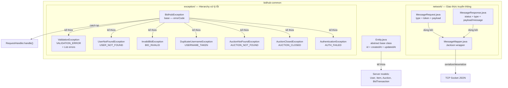
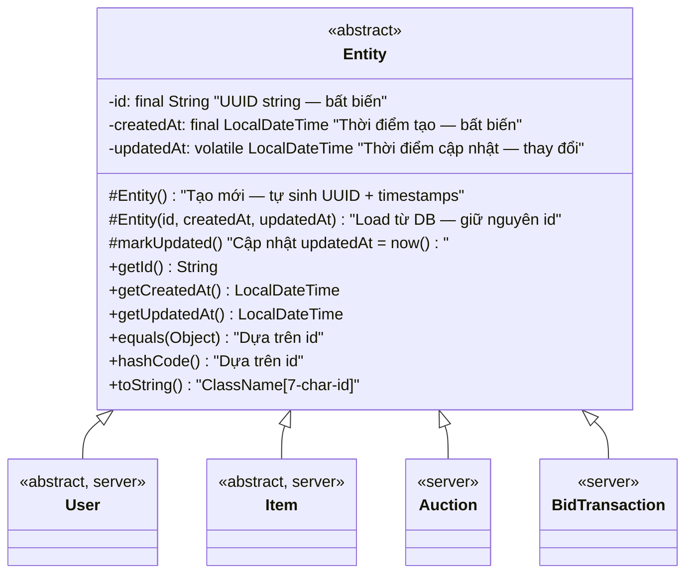
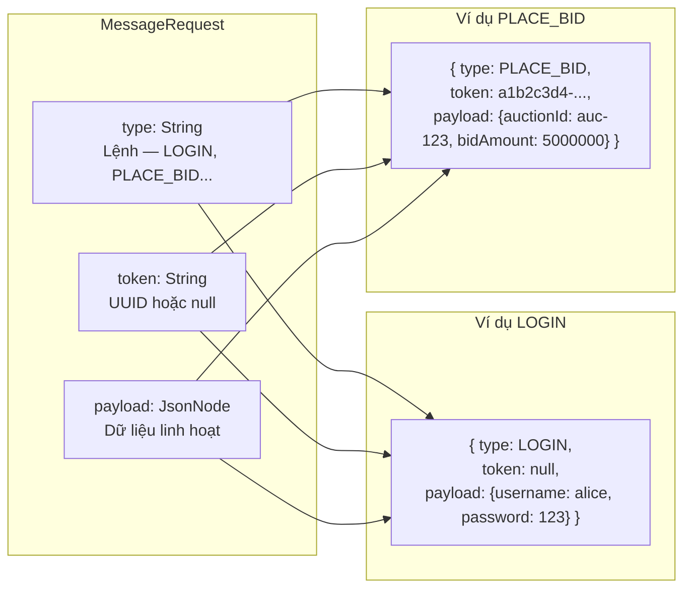
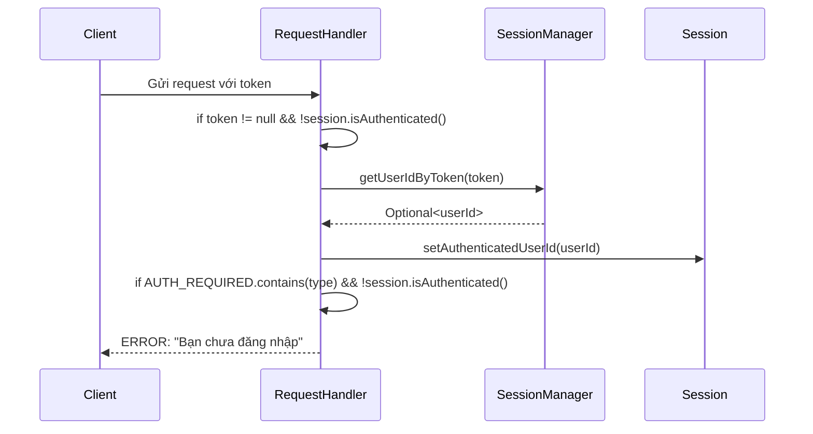
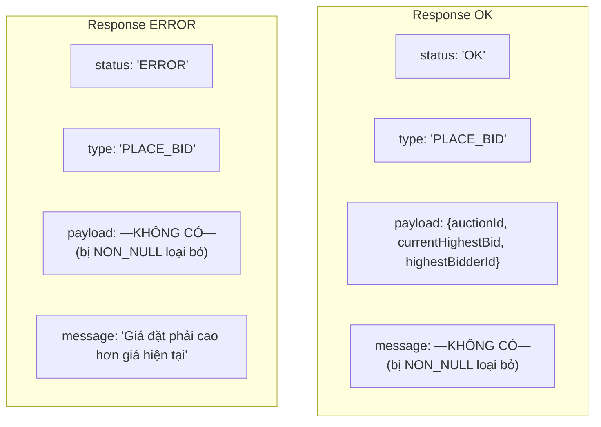
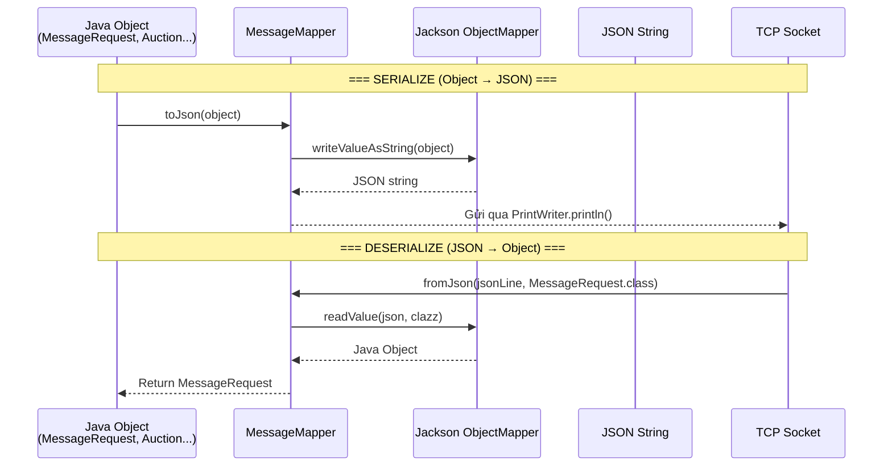
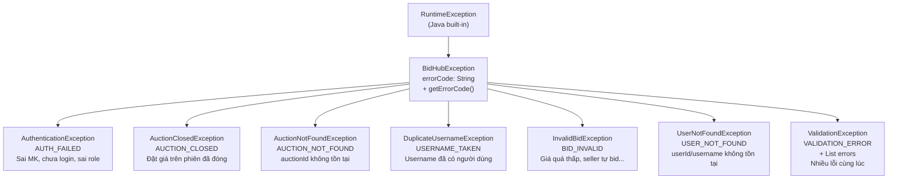
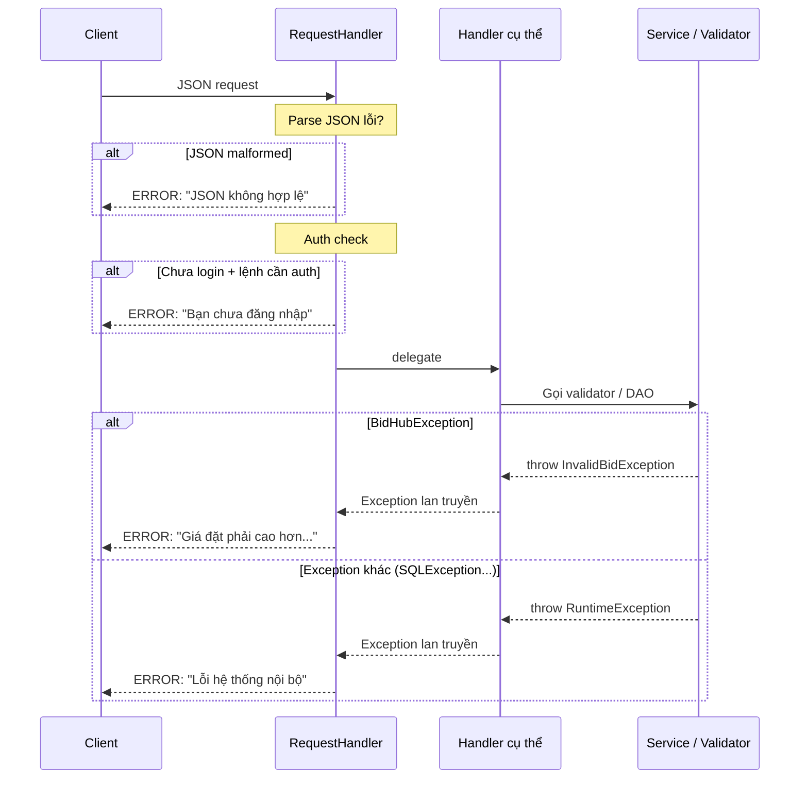
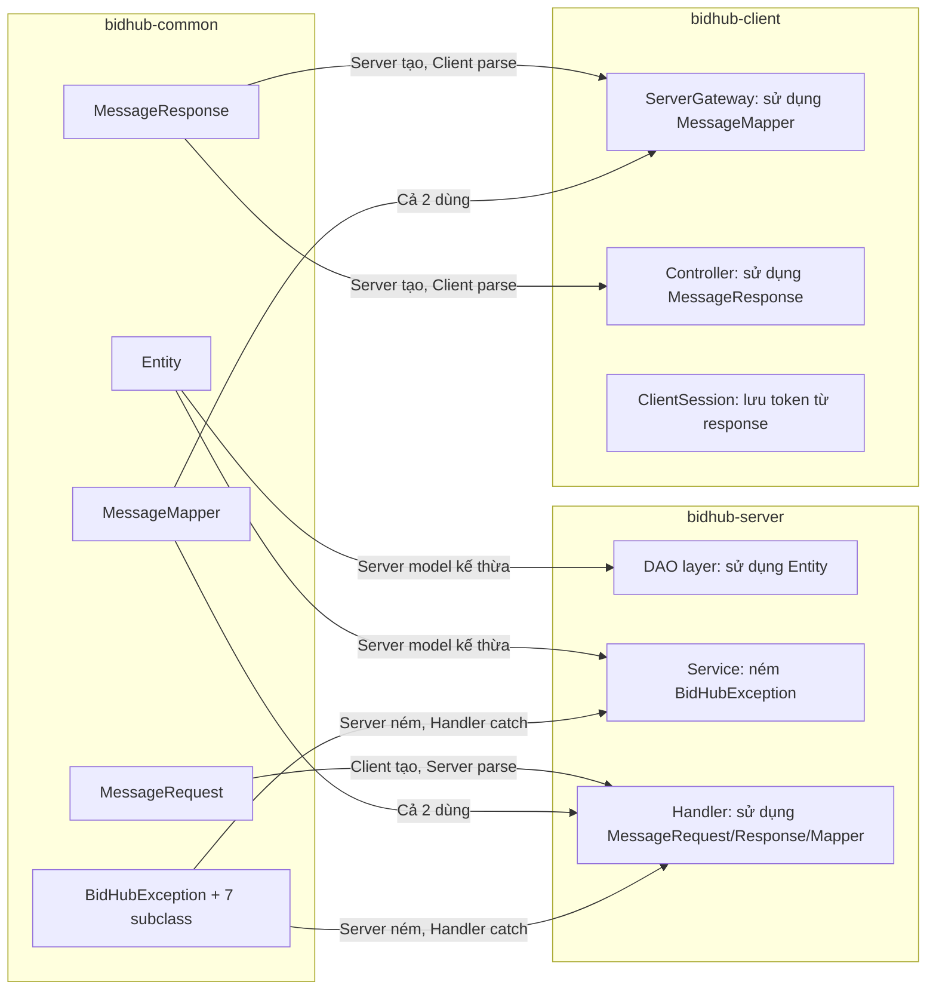
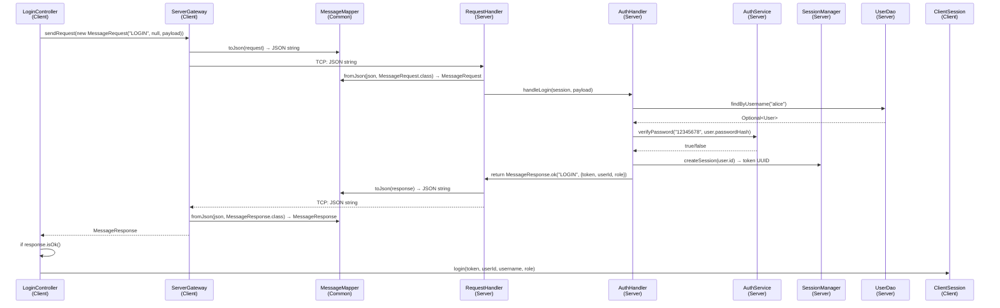

# 📦 BidHub Auction System — Part 2: Module Common — Giao Thức, Mô Hình & Exception

> **Mục tiêu**: Hiểu SÂU mọi class trong `bidhub-common` — tại sao tồn tại, logic hoạt động, và cách áp dụng trong BidHub. Module Common là **móng nhà** — Server và Client đều đứng trên nó.

---

## 📋 Lộ Trình Học Tập Part 2

| Giai đoạn | Nội dung | Mức độ |
|-----------|----------|--------|
| 1 | Tổng quan Module Common — Vai trò & Cấu trúc | Cơ bản |
| 2 | Entity — Lớp cơ sở trừu tượng cho mọi object | Trung bình |
| 3 | MessageRequest — Cấu trúc request & tại sao mỗi field được chọn | Trung bình |
| 4 | MessageResponse — Factory Method & JsonInclude | Trung bình |
| 5 | MessageMapper — Jackson wrapper & tối ưu performance | Nâng cao |
| 6 | Exception Hierarchy — 8 class & chiến lược xử lý lỗi | Nâng cao |
| 7 | Mối liên kết giữa Common ↔ Server ↔ Client | Tổng hợp |
| 8 | Cheat Sheet | Ôn tập |

---

## Giai đoạn 1: Tổng Quan Module Common

### 1.1 Sơ đồ tổng quan



### 1.2 Tại sao cần module Common?

**Vấn đề**: Server và Client đều cần:
- Cùng định dạng JSON (request/response)
- Cùng class cơ sở (Entity)
- Cùng loại exception

**Nếu không có Common**, bạn phải:
1. Copy `MessageRequest.java` vào cả server và client → sửa 1 chỗ, quên chỗ kia → **bug**
2. Không có exception chung → server ném `InvalidBidException` nhưng client không hiểu class này → **ClassNotFound**
3. Entity riêng cho mỗi module → id/createdAt logic bị duplicate → **code smell**

**Với Common**: Sửa 1 lần ở Common → cả server lẫn client đều cập nhật tự động vì đều dependency vào `bidhub-common`.

### 1.3 Cấu hình Maven dependency

```xml
<!-- bidhub-server/pom.xml -->
<dependency>
    <groupId>com.bidhub</groupId>
    <artifactId>bidhub-common</artifactId>
    <version>${project.version}</version>
</dependency>

<!-- bidhub-client/pom.xml — tương tự -->
```

Điều này đảm bảo: khi build server/client, Maven tự động kéo `bidhub-common.jar` vào classpath.

---

## Giai đoạn 2: Entity — Lớp Cơ Sở Trừu Tượng

### 2.1 Sơ đồ class Entity



### 2.2 Giải thích chi tiết từng logic

#### Constructor 1 — Tạo entity mới

```java
protected Entity() {
    this.id = UUID.randomUUID().toString();     // Sinh UUID string ngẫu nhiên
    this.createdAt = LocalDateTime.now();      // Timestamp hiện tại
    this.updatedAt = this.createdAt;           // Ban đầu = createdAt
}
```

**Logic**: Khi tạo object mới (ví dụ: `new Bidder("alice", hash, "alice@mail.com")`), subclass gọi `super()` → constructor này chạy. UUID đảm bảo id là duy nhất toàn hệ thống. `createdAt` và `updatedAt` ban đầu bằng nhau vì entity chưa bị sửa.

**Tại sao `UUID.randomUUID()`?** Không dùng auto-increment (1, 2, 3...) vì:
- **Distributed-safe**: Nếu sau này chia server thành nhiều node, auto-increment sẽ xung đột
- **Không lộ thông tin**: Auto-increment tiết lộ tổng số entity (user thứ 5 → biết chỉ có ~5 user)
- **Merge dễ dàng**: Không cần coordination khi merge data từ nhiều nguồn

**Tại sao dùng kiểu `String` chứa UUID thay vì kiểu `UUID`?** Thực tế codebase BidHub chọn `String` làm kiểu cho field `id`. Lý do: đơn giản hóa tương thích với DAO layer (SQLite lưu id dạng TEXT, JDBC trả về String), không cần chuyển đổi qua lại giữa `UUID` và `String` khi đọc/ghi database. `UUID.randomUUID().toString()` trả về chuỗi hex chuẩn (ví dụ `"550e8400-e29b-41d4-a716-446655440000"`). Khi so sánh, `String.equals()` hoạt động chính xác. Khi serialize sang JSON, String được Jackson ghi thẳng thành chuỗi JSON.

#### Constructor 2 — Load từ database

```java
protected Entity(String id, LocalDateTime createdAt, LocalDateTime updatedAt) {
    Objects.requireNonNull(id, "id không được null");
    Objects.requireNonNull(createdAt, "createdAt không được null");
    Objects.requireNonNull(updatedAt, "updatedAt không được null");
    this.id = id;
    this.createdAt = createdAt;
    this.updatedAt = updatedAt;
}
```

**Logic**: Khi đọc từ DB, entity đã có id rồi — **KHÔNG tạo UUID mới**. Nếu dùng constructor 1 → mỗi lần đọc từ DB, entity có id mới → equals/hashCode sai → bug nghiêm trọng khi dùng trong Set/Map.

**`Objects.requireNonNull()`** — Fail-fast: Nếu bất kỳ field nào null → ném NPE ngay lập tức với message rõ ràng, thay vì để null âm thầm gây lỗi ở nơi khác.

#### `markUpdated()` — Cập nhật thời gian

```java
protected final void markUpdated() {
    this.updatedAt = LocalDateTime.now();
}
```

**Tại sao `protected final`?**
- `protected`: Chỉ subclass mới gọi được — class ngoài không thể fake "đã cập nhật"
- `final`: Subclass không thể override — đảm bảo logic luôn nhất quán

**Khi nào gọi?** Mỗi khi field quan trọng thay đổi:
- `User.setPasswordHash()` → gọi `markUpdated()`
- `Auction.setCurrentHighestBid()` → gọi `markUpdated()`
- `Item.setName()` → gọi `markUpdated()`

**Tại sao `updatedAt` là `volatile`?** `volatile` đảm bảo giá trị được ghi thẳng vào main memory, không nằm trong CPU cache. Nếu thread A cập nhật `updatedAt`, thread B đọc ngay sau đó sẽ thấy giá trị mới nhất. Không có `volatile` → thread B có thể đọc giá trị cũ từ cache.

#### `equals()` & `hashCode()` — Dựa trên id

```java
@Override
public boolean equals(Object o) {
    if (this == o) return true;                    // Cùng object trong bộ nhớ
    if (o == null || getClass() != o.getClass()) return false;  // Khác class
    Entity other = (Entity) o;
    return Objects.equals(id, other.id);           // So sánh id
}

@Override
public int hashCode() {
    return Objects.hash(id);
}
```

**Tại sao so sánh theo id thay vì toàn bộ field?** Ví dụ: Load `User alice` từ DB 2 lần → 2 object khác nhau trong bộ nhớ nhưng cùng id → **cùng 1 thực thể** trong domain. Nếu dùng `==` → false (2 object khác nhau). Nếu so toàn bộ field → giá nào thay đổi thì equals trả về false → **sai ngữ nghĩa**.

**Hợp đồng equals-hashCode**: Nếu 2 object `equals()` → phải có cùng `hashCode()`. BidHub dùng cùng field `id` cho cả 2 → thỏa mãn hợp đồng. `String.hashCode()` được triển khai tối ưu trong JVM.

**Ứng dụng**: Khi dùng Entity trong `HashSet` hoặc `HashMap`, Java gọi `hashCode()` trước, rồi `equals()` nếu cần. Nếu 2 auction cùng id → được coi là trùng → Set chỉ giữ 1 bản.

---

## Giai đoạn 3: MessageRequest — Cấu Trúc Request

### 3.1 Sơ đồ cấu trúc



### 3.2 Giải thích từng field

#### Annotation lớp — `@JsonIgnoreProperties(ignoreUnknown = true)`

```java
@JsonIgnoreProperties(ignoreUnknown = true)
public class MessageRequest {
    // ...
}
```

**Tại sao cần?** Khi server thêm field mới vào response (ví dụ thêm `traceId`), client dùng phiên bản Common cũ sẽ nhận được JSON có field không nhận diện được. Không có annotation này → Jackson ném `UnrecognizedPropertyException` → client crash. Có annotation → Jackson bỏ qua field không quen thuộc → **backward compatible**.

#### Constructors

```java
// No-arg constructor — dùng bởi Jackson khi deserialize
public MessageRequest() {}

// 3-param constructor — dùng khi tạo request từ code
public MessageRequest(String type, String token, JsonNode payload) {
    this.type = type;
    this.token = token;
    this.payload = payload;
}
```

**Tại sao cần cả 2 constructor?** No-arg constructor bắt buộc để Jackson deserialize JSON thành object (Jackson cần tạo object rỗng trước, rồi set field qua reflection). 3-param constructor cho phép tạo request gọn gàng từ code client/server: `new MessageRequest("LOGIN", null, payload)` thay vì tạo object rồi set từng field.

#### `type` — Định danh lệnh

```java
private String type;
```

**Logic**: Server dùng `type` để phân loại request trong `switch` expression:

```java
return switch (type) {
    case "PING"           -> handlePing(session);
    case "LOGIN"          -> authHandler.handleLogin(session, payload);
    case "PLACE_BID"      -> auctionHandler.handlePlaceBid(session, payload);
    // ... các lệnh khác
    default               -> MessageResponse.error(type, "Lệnh không xác định");
};
```

**33 giá trị type hợp lệ** (23 lệnh yêu cầu xác thực — AUTH_REQUIRED):
PING, LOGIN, REGISTER, LOGOUT, CREATE_ITEM, GET_ITEM_LIST, GET_ITEM_DETAIL, DELETE_ITEM, LIST_MY_ITEMS, CREATE_AUCTION, GET_USER_LIST, LOCK_USER, UNLOCK_USER, PLACE_BID, GET_AUCTION_LIST, GET_AUCTION_DETAIL, SUBSCRIBE_AUCTION, GET_AUCTION_REPORT, GET_BID_HISTORY_REPORT, GET_AUDIT_LOG, RUN_INTEGRITY_CHECK, GET_HOME_STATS, SEND_NOTIFICATION, GET_NOTIFICATIONS, GET_MY_AUCTIONS, UPDATE_ITEM, CANCEL_AUCTION, MARK_NOTIFICATION_READ, MARK_PAID, SELLER_CANCEL_FINISHED, ADMIN_STOP_AUCTION, ADMIN_DELETE_AUCTION

**`isValid()`** — Kiểm tra tối thiểu:

```java
public boolean isValid() {
    return type != null && !type.isBlank();
}
```

Chỉ cần type tồn tại. Token và payload có thể null tùy loại lệnh (PING không cần gì, GET_ITEM_LIST không cần token nếu không yêu cầu auth).

**Tiêu chí chấm điểm**: Tại sao MessageRequest dùng JsonNode cho payload thay vì class cụ thể? Vì mỗi API có cấu trúc payload khác nhau — nếu tạo 33 class payload riêng → code bloat, khó bảo trì. JsonNode cho phép truy xuất linh hoạt với path() an toàn (không NPE). Ưu điểm: thêm API mới không cần sửa Common module, dễ mở rộng, backward compatible.

#### `token` — Xác thực phiên đăng nhập

```java
private String token;
```

**Logic luồng xác thực**:



**Tại sao check token ở RequestHandler thay vì mỗi handler?** Vì đây là **cross-cutting concern** (vấn đề cắt ngang) — mọi handler đều cần auth. Xử lý 1 lần ở dispatcher → DRY (Don't Repeat Yourself).

**Token có thể null**: Trong 33 API, có 10 lệnh không yêu cầu đăng nhập (AUTH_REQUIRED không bao gồm): PING, GET_ITEM_LIST, GET_AUCTION_LIST, GET_HOME_STATS, LOGIN, REGISTER — không yêu cầu đăng nhập. 23 lệnh còn lại yêu cầu token hợp lệ.

#### `payload` — Dữ liệu linh hoạt

```java
private JsonNode payload;
```

**Tại sao `JsonNode`?** Mỗi loại request có cấu trúc payload khác nhau:

| type | payload |
|------|---------|
| LOGIN | `{username, password}` |
| CREATE_ITEM | `{name, description, startingPrice, itemType, extras, imageUrl}` |
| PLACE_BID | `{auctionId, bidAmount}` |
| SUBSCRIBE_AUCTION | `{auctionId}` |
| SEND_NOTIFICATION | `{title, message, type}` |

Nếu dùng class cụ thể → phải tạo 33 class payload → bloat. `JsonNode` cho phép truy xuất linh hoạt:

```java
// Lấy field an toàn — không ném NPE nếu field không tồn tại
String username = payload.path("username").asText(""); // Trả về "" nếu không có

// Kiểm tra field có tồn tại
if (payload.has("imageUrl")) {
    String url = payload.get("imageUrl").asText("");
}

// Lấy số
double bidAmount = payload.path("bidAmount").asDouble(0.0);
```

**`path()` vs `get()`**: `path()` trả về MissingNode nếu field không tồn tại → gọi `.asText("")` an toàn. `get()` trả về `null` → gọi `.asText()` sẽ NPE.

---

## Giai đoạn 4: MessageResponse — Factory Method & JsonInclude

### 4.1 Hai dạng response



### 4.2 Giải thích Factory Method

#### Annotation lớp

```java
@JsonInclude(JsonInclude.Include.NON_NULL)
@JsonIgnoreProperties(ignoreUnknown = true)
public class MessageResponse {
    // ...
}
```

- **`@JsonInclude(NON_NULL)`**: Loại bỏ field có giá trị `null` khỏi JSON output → giảm băng thông, client không cần check null.
- **`@JsonIgnoreProperties(ignoreUnknown = true)`**: Bỏ qua field không quen thuộc khi deserialize → backward compatible khi server thêm field mới.

#### Factory methods

```java
// Tạo response thành công
public static MessageResponse ok(String type, Object payload) {
    MessageResponse r = new MessageResponse();
    r.status = STATUS_OK;
    r.type = type;
    r.payload = payload;
    return r;
}

// Tạo response lỗi
public static MessageResponse error(String type, String message) {
    MessageResponse r = new MessageResponse();
    r.status = STATUS_ERROR;
    r.type = type;
    r.message = message;
    return r;
}
```

**So sánh với cách sai**:

```java
// ❌ Cách sai — Constructor trực tiếp, dễ nhầm
new MessageResponse("OK", "LOGIN", payload, null)  // Thứ 3 là payload hay message?

// ✅ Cách đúng — Factory method, ý nghĩa rõ ràng
MessageResponse.ok("LOGIN", payload)     // Rõ ràng: thành công + dữ liệu
MessageResponse.error("LOGIN", "Sai MK") // Rõ ràng: lỗi + thông báo
```

**Tiêu chí chấm điểm**: Factory Method Pattern trong MessageResponse áp dụng nguyên tắc nào? Đóng gói (Encapsulation) — logic tạo OK/Error nằm trong factory method, caller không cần biết chi tiết. Đọc được (Readability) — ok('LOGIN', payload) rõ ràng hơn new MessageResponse('OK', 'LOGIN', payload, null). An toàn (Safety) — không thể vô tình tạo response có cả payload lẫn message (mutually exclusive). Đây là ví dụ điển hình của Static Factory Method Pattern — thay vì để caller tự new(), cung cấp method có tên rõ ràng.

**`@JsonInclude(JsonInclude.Include.NON_NULL)`** — Loại bỏ field null khỏi JSON output:

```json
// OK response — KHÔNG có field "message"
{"status":"OK","type":"LOGIN","payload":{"token":"...","userId":"..."}}

// ERROR response — KHÔNG có field "payload"
{"status":"ERROR","type":"LOGIN","message":"Sai mật khẩu."}
```

Nếu không có `@JsonInclude` → OK response sẽ chứa `"message":null` → tốn băng thông, client phải check null.

**`isOk()`** — Helper cho client:

```java
public boolean isOk() {
    return STATUS_OK.equals(status);
}

// Client dùng:
MessageResponse res = gateway.sendRequest(req);
if (res.isOk()) {
    // Xử lý payload
} else {
    // Hiển thị res.getMessage()
}
```

---

## Giai đoạn 5: MessageMapper — Jackson Wrapper & Tối Ưu Performance

### 5.1 Sơ đồ luồng serialize/deserialize



### 5.2 Giải thích chi tiết

#### Utility class — `public final`

```java
public final class MessageMapper {
    private static final ObjectMapper MAPPER = new ObjectMapper();

    static {
        MAPPER.registerModule(new JavaTimeModule());
        MAPPER.disable(SerializationFeature.WRITE_DATES_AS_TIMESTAMPS);
    }

    // Private constructor — ngăn tạo instance
    private MessageMapper() {}

    public static String toJson(Object obj) { ... }
    public static <T> T fromJson(String json, Class<T> clazz) { ... }

    /** Trả về bản sao ObjectMapper — dùng cho các thao tác nội bộ hoặc bên thứ 3. */
    public static ObjectMapper getMapper() {
        return MAPPER.copy();
    }
}
```

**Tại sao `public final`?** `final` ngăn subclass — utility class không được kế thừa. `private` constructor ngăn tạo instance từ bên ngoài. Đây là pattern chuẩn cho utility class (theo Effective Java, Item 4).

**Tiêu chí chấm điểm**: Tại sao MessageMapper dùng utility class (static methods) thay vì Singleton? Vì MessageMapper KHÔNG CÓ STATE — không lưu dữ liệu nào giữa các lần gọi. ObjectMapper là static final field, dùng chung cho mọi thread. Singleton dành cho class có state (AuctionManager, SessionManager). Utility class cho class stateless — không cần tạo instance, không cần quản lý vòng đời.

#### ObjectMapper static final — Tối ưu performance

**ObjectMapper khởi tạo mất ~65ms** (Jackson phải quét annotation, đăng ký serializer/deserializer...). Nếu tạo mới mỗi request → 1000 request/giây × 65ms = 65 giây chỉ dành cho tạo ObjectMapper! Với `static final`, tạo 1 lần duy nhất khi class load → **tiết kiệm hàng giây CPU**.

**ObjectMapper thread-safe sau khi cấu hình** — An toàn cho multi-thread access. Tất cả method `writeValueAsString()` và `readValue()` đều có thể gọi đồng thời từ nhiều thread. Lưu ý: thread-safe chỉ đảm bảo SAU KHI hoàn tất cấu hình trong `static {}` block. Không được thay đổi cấu hình ObjectMapper lúc runtime.

**`JavaTimeModule`** — Hỗ trợ `LocalDateTime`:

```json
// Không có JavaTimeModule → LocalDateTime thành mảng số:
{"startTime":[2024,5,18,14,30,0]}  ← Khó đọc, khó parse

// Có JavaTimeModule + disable timestamps → Chuỗi ISO:
{"startTime":"2024-05-18T14:30:00"}  ← Dễ đọc, dễ parse, tương thích tốt
```

#### `toJson()` — Serialize an toàn

```java
public static String toJson(Object obj) {
    try {
        return MAPPER.writeValueAsString(obj);
    } catch (Exception e) {
        try {
            // Fallback: tạo error JSON thủ công
            Map<String, String> errMap = Map.of(
                "status", "ERROR", "type", "SYSTEM",
                "message", "Serialization error: " + e.getMessage());
            return MAPPER.writeValueAsString(errMap);
        } catch (JsonProcessingException ignored) {
            // Fallback cuối cùng: JSON string cứng
            return "{\"status\":\"ERROR\",\"type\":\"SYSTEM\",\"message\":\"Fatal serialization error\"}";
        }
    }
}
```

**Logic 3 tầng bảo vệ**:
1. Thử serialize bình thường → thành công thì trả về
2. Nếu lỗi → tạo error JSON thủ công → client nhận được lỗi thay vì crash
3. Nếu cả error JSON cũng lỗi → trả về JSON string cứng → **luôn luôn** trả về JSON hợp lệ

**Tại sao phải luôn trả về JSON?** Client đang chờ response. Nếu `toJson()` ném exception → `ClientConnectionThread` crash → client bị treo vĩnh viễn. Luôn trả về JSON → client ít nhất nhận được thông báo lỗi.

#### `fromJson()` — Deserialize chặt chẽ

```java
public static <T> T fromJson(String json, Class<T> clazz) 
        throws JsonProcessingException {
    return MAPPER.readValue(json, clazz);
}
```

**Khác với `toJson()`**: `fromJson()` NÉM exception ra ngoài. Tại sao? Vì JSON malformed là lỗi NGHIÊM TRỌNG — không thể "đoán" object từ JSON hỏng. Ném ra ngoài để `RequestHandler.handle()` catch và trả về error response:

```java
// RequestHandler.handle()
try {
    req = MessageMapper.fromJson(jsonLine, MessageRequest.class);
} catch (Exception e) {
    return MessageMapper.toJson(
        MessageResponse.error("UNKNOWN", "JSON không hợp lệ: " + e.getMessage()));
}
```

---

## Giai đoạn 6: Exception Hierarchy — 8 Class & Chiến Lược Xử Lý Lỗi

### 6.1 Sơ đồ phân cấp Exception



### 6.2 BidHubException — Lớp cơ sở

```java
public class BidHubException extends RuntimeException {
    private final String errorCode;  // SCREAMING_SNAKE_CASE

    // Constructor 1: Lỗi với errorCode cụ thể
    public BidHubException(String message, String errorCode) {
        super(message);
        this.errorCode = errorCode;
    }

    // Constructor 2: Lỗi không xác định errorCode — fallback "UNKNOWN_ERROR"
    protected BidHubException(String message) {
        super(message);
        this.errorCode = "UNKNOWN_ERROR";
    }

    // Constructor 3: Wrap exception gốc — giữ nguyên cause chain
    public BidHubException(String message, String errorCode, Throwable cause) {
        super(message, cause);  // Wrap exception gốc
        this.errorCode = errorCode;
    }
}
```

**Tại sao `extends RuntimeException` (unchecked)?**

| Loại exception | Ưu điểm | Nhược điểm |
|---------------|---------|------------|
| `Checked` (extends Exception) | Compiler bắt buộc xử lý | Phải khai báo `throws` ở mọi method → code dài, khó đọc |
| `Unchecked` (extends RuntimeException) ✅ | Không bắt buộc khai báo; Catch khi cần | Có thể quên catch → runtime crash |

BidHub chọn `RuntimeException` vì: exception nghiệp vụ (sai mật khẩu, bid không hợp lệ) không phải lỗi hệ thống — chỉ cần catch 1 lần ở `RequestHandler.handle()`, không cần khai báo ở mọi tầng.

**Tiêu chí chấm điểm**: Tại sao BidHub chọn RuntimeException (unchecked) thay vì checked exception? Vì exception nghiệp vụ (sai mật khẩu, bid không hợp lệ) là lỗi NGƯỜI DÙNG, không phải lỗi hệ thống. Checked exception bắt buộc khai báo throws ở mọi tầng → code dài, khó đọc. BidHub catch 1 lần duy nhất ở RequestHandler.handle() → không cần khai báo ở DAO, Service, Handler. Ưu điểm: code gọn, tách biệt error handling, dễ thêm exception mới.

**`errorCode`** — Mã lỗi ngắn gọn cho client:

```json
// Tương lai: client xử lý theo errorCode
{"status":"ERROR","type":"PLACE_BID","errorCode":"BID_INVALID","message":"Giá đặt phải cao hơn..."}
```

Client có thể check `errorCode` thay vì parse `message`:
```javascript
if (response.errorCode === "BID_INVALID") showBidError();
else if (response.errorCode === "AUCTION_CLOSED") showAuctionEnded();
```

**Constructor 3 tham số — Wrap exception gốc**:

```java
// Ví dụ: SQLException trong DAO → wrap thành BidHubException
try {
    ps.executeUpdate();
} catch (SQLException e) {
    throw new BidHubException("Lưu thất bại", "DB_ERROR", e);
    // e là "cause" → log có thể in full stack trace
}
```

### 6.3 Mỗi subclass — Khi nào ném & Tại sao

#### AuthenticationException — `AUTH_FAILED`

**Khi nào ném**:
- `SecurityContext.requireAuthenticated()` — Chưa đăng nhập
- `SecurityContext.requireRole()` — Sai role (BIDDER cố tạo item)
- `AuthHandler.handleLogin()` — Sai mật khẩu (dùng message khác)

**Cách dùng trong BidHub**:
```java
// SecurityContext.java
public static String requireRole(Session session, UserRole required) {
    String userId = requireAuthenticated(session); // Chưa login → ném ở đây
    // Nếu session chưa có role → load từ DB qua UserDao
    if (session.getUserRole() == null) {
        Optional<User> userOpt = USER_DAO.findById(userId);
        if (userOpt.isEmpty())
            throw new AuthenticationException("Nguoi dung khong ton tai.");
        session.setUserRole(userOpt.get().getRole());
    }
    if (session.getUserRole() != required)
        throw new AuthenticationException("Khong du quyen. Yeu cau role: " + required.getDisplayName());
    return userId;
}

// Bị catch tại RequestHandler.handle():
catch (BidHubException e) {
    return MessageMapper.toJson(MessageResponse.error(type, e.getMessage()));
}
```

#### AuctionClosedException — `AUCTION_CLOSED`

**Khi nào ném**: `BidValidator.validate()` — Auction không ở trạng thái RUNNING (FINISHED, CANCELED, PAID). Lưu ý: nếu auction ở trạng thái OPEN, BidValidator ném `InvalidBidException` thay vì `AuctionClosedException`.

**2 constructor**:
```java
// AuctionClosedException.java
public class AuctionClosedException extends BidHubException {
    public static final String ERROR_CODE = "AUCTION_CLOSED";

    // Constructor 1: Tạo message từ auctionId + status
    public AuctionClosedException(String auctionId, String status) {
        super("Phiên đấu giá " + auctionId + " đã đóng (status: " + status + ")", ERROR_CODE);
    }

    // Constructor 2: Tạo từ message tùy chỉnh (dùng trong BidValidator)
    public AuctionClosedException(String message) {
        super(message, ERROR_CODE);
    }
}
```

**Phân biệt với InvalidBidException**:
- `AuctionClosedException`: **Trạng thái phiên** sai → không thể đặt giá VÌ PHIÊN ĐÃ ĐÓNG
- `InvalidBidException`: **Giá trị bid** sai → phiên còn mở nhưng giá không hợp lệ

```java
// BidValidator.validate()
if (auction.getStatus() == AuctionStatus.OPEN) {
    throw new InvalidBidException("Phiên đấu giá chưa bắt đầu. Vui lòng chờ đến giờ.");
} else if (auction.getStatus() != AuctionStatus.RUNNING) {
    throw new AuctionClosedException(
            "Phiên đấu giá đã kết thúc. Trạng thái: " + auction.getStatus().name());
}
// vs
if (bidAmount <= auction.getCurrentHighestBid()) {
    throw new InvalidBidException(
            "Gia dat phai cao hon gia hien tai (" + auction.getCurrentHighestBid() + ").");
}
```

#### InvalidBidException — `BID_INVALID`

**5 điều kiện ném** trong `BidValidator.validate()`:

| # | Điều kiện | Message thực tế |
|---|-----------|---------|
| 1 | Auction chưa bắt đầu (OPEN) | "Phiên đấu giá chưa bắt đầu. Vui lòng chờ đến giờ." |
| 2 | Bidder đang dẫn đầu | "Ban dang la nguoi dan dau." |
| 3 | Bidder là seller | "Seller khong the tu dau gia san pham cua minh." |
| 4 | Giá <= giá hiện tại | "Gia dat phai cao hon gia hien tai (X)." |
| 5 | Bước giá < minimumIncrement | "Buoc gia toi thieu la X. Ban dat thieu Y." |

#### DuplicateUsernameException — `USERNAME_TAKEN`

**Khi nào ném**: `AuthHandler.handleRegister()` — Username đã tồn tại trong hệ thống

```java
// AuthHandler.handleRegister()
if (userDao.findByUsername(username).isPresent()) {
    throw new DuplicateUsernameException(username);
    // Message thực tế: "Tên đăng nhập '" + username + "' đã tồn tại trong hệ thống"
}
```

**Tại sao không dùng ValidationException?** Vì đây là lỗi đặc thù nghiệp vụ (business rule), không phải lỗi định dạng input. `DuplicateUsernameException` có errorCode riêng `USERNAME_TAKEN` → client có thể xử lý riêng (ví dụ: gợi ý username khác).

#### UserNotFoundException — `USER_NOT_FOUND`

**Khi nào ném**: Tìm kiếm người dùng không tồn tại — dùng trong `AdminHandler` hoặc `AuthHandler` khi cần truy vấn user theo id/username nhưng không tìm thấy.

```java
// UserNotFoundException.java
public class UserNotFoundException extends BidHubException {
    public static final String ERROR_CODE = "USER_NOT_FOUND";

    public UserNotFoundException(String identifier) {
        super("Không tìm thấy người dùng: " + identifier, ERROR_CODE);
    }
}
```

**Tại sao constructor nhận `identifier`?** Tham số `identifier` có thể là username HOẶC userId — cả hai đều được dùng để tìm kiếm user. Constructor tự động tạo message hoàn chỉnh, caller chỉ cần truyền giá trị tìm kiếm.

**Tại sao không dùng ValidationException?** Vì đây là lỗi đặc thù nghiệp vụ — user không tồn tại trong DB, không phải lỗi định dạng input. `UserNotFoundException` có errorCode riêng `USER_NOT_FOUND` → client có thể xử lý riêng (ví dụ: hiển thị "Tài khoản không tồn tại" thay vì "Dữ liệu không hợp lệ").

#### ValidationException — `VALIDATION_ERROR`

**Đặc biệt**: Chứa `List<String> errors` — cho phép báo **nhiều lỗi cùng lúc**:

```java
// ValidationException.java
public class ValidationException extends BidHubException {
    public static final String ERROR_CODE = "VALIDATION_ERROR";
    private final List<String> errors;

    // Constructor 1 lỗi duy nhất
    public ValidationException(String errorMessage) {
        super(Objects.requireNonNull(errorMessage, "errorMessage không được null"), ERROR_CODE);
        this.errors = List.of(errorMessage);
    }

    // Constructor nhiều lỗi
    public ValidationException(List<String> errors) {
        super(validateErrors(errors), ERROR_CODE);
        this.errors = Collections.unmodifiableList(new ArrayList<>(errors));
    }

    private static String validateErrors(List<String> errors) {
        if (errors == null || errors.isEmpty()) {
            throw new IllegalArgumentException("ValidationException cần ít nhất 1 lỗi");
        }
        return errors.size() + " lỗi validation: " + String.join("; ", errors);
    }

    public List<String> getErrors() { return errors; }
    public int getErrorCount() { return errors.size(); }
}
```

**Cách dùng (trong handler)**:
```java
String auctionId = payload.path("auctionId").asText("");
if (auctionId.isBlank()) {
    throw new ValidationException("auctionId không được để trống");
}
```

**Tại sao `Collections.unmodifiableList()`?** Defensive copy — sau khi tạo exception, không ai có thể sửa danh sách lỗi. Nếu không → code ngoài có thể thêm/xóa lỗi → audit log không chính xác.

### 6.4 Luồng xử lý lỗi tổng thể



**2 tầng catch trong `RequestHandler.handle()`**:

```java
try {
    return switch (type) { ... };
} catch (BidHubException e) {
    // Lỗi nghiệp vụ → message tiếng Việt cho người dùng
    return MessageMapper.toJson(MessageResponse.error(type, e.getMessage()));
} catch (Exception e) {
    // Lỗi hệ thống → message chung, chi tiết chỉ ghi log
    logger.error("Lỗi xử lý {}: {}", type, e.getMessage(), e);
    return MessageMapper.toJson(MessageResponse.error(type, "Lỗi hệ thống nội bộ."));
}
```

**Tại sao không gửi chi tiết lỗi hệ thống cho client?** Vì có thể chứa thông tin nhạy cảm (tên bảng DB, SQL query, stack trace...) → attacker lợi dụng.

---

## Giai đoạn 7: Mối Liên Kết Common ↔ Server ↔ Client

### 7.1 Sơ đồ dependency



### 7.2 Ví dụ luồng end-to-end: LOGIN



**Mỗi bước đều dùng class từ Common**:
- `MessageRequest` — Tạo request ở client, parse ở server
- `MessageResponse` — Tạo response ở server, parse ở client
- `MessageMapper` — Serialize/deserialize JSON ở cả 2 bên
- `BidHubException` (subclass) — Ném ở server, catch ở RequestHandler, message trả về client
- `Entity` — User kế thừa Entity, DAO load từ DB dùng constructor Entity(id, createdAt, updatedAt)

---

## Giai đoạn 8: Cheat Sheet — Module Common

### Entity — Nhớ 3 điểm

| Điểm | Chi tiết |
|------|----------|
| 2 constructor | `Entity()` tạo mới (UUID string tự sinh), `Entity(String id, ...)` load từ DB |
| `markUpdated()` | `protected final` — chỉ subclass gọi, không override được |
| `equals/hashCode` | Dựa trên `id` (kiểu String) — 2 entity cùng id = cùng 1 thực thể |

### MessageRequest — Nhớ 3 field + 1 annotation

| Field / Annotation | Kiểu | Mục đích |
|-------|------|----------|
| `@JsonIgnoreProperties(ignoreUnknown=true)` | — | Bỏ qua field không quen thuộc khi deserialize |
| `type` | String | 33 lệnh: LOGIN, PLACE_BID... (23 AUTH_REQUIRED) |
| `token` | String | UUID hoặc null |
| `payload` | JsonNode | Dữ liệu linh hoạt, dùng `path()` an toàn |

### MessageResponse — Nhớ 2 factory + 2 annotation

| Factory / Annotation | Khi dùng | Field có |
|---------|----------|----------|
| `@JsonInclude(NON_NULL)` | — | Loại bỏ field null khỏi JSON |
| `@JsonIgnoreProperties(ignoreUnknown=true)` | — | Bỏ qua field không quen thuộc |
| `ok(type, payload)` | Thành công | status + type + payload |
| `error(type, message)` | Thất bại | status + type + message |

### MessageMapper — Nhớ 5 điểm

| Điểm | Chi tiết |
|------|----------|
| `public final class` + private constructor | Utility class — không tạo instance, không kế thừa |
| `static final ObjectMapper` | Tạo 1 lần, thread-safe sau cấu hình, tiết kiệm 65ms/request |
| `JavaTimeModule` | LocalDateTime → ISO string, không phải mảng số |
| `toJson()` 3 tầng bảo vệ | Thường → Fallback JSON → JSON cứng |
| `getMapper()` | Trả về `MAPPER.copy()` — bản sao ObjectMapper cho bên thứ 3 |

### Exception — Nhớ 8 class

| Exception | errorCode | Khi nào ném |
|-----------|-----------|-------------|
| `BidHubException` | Tùy subclass | Base — KHÔNG ném trực tiếp |
| `AuthenticationException` | AUTH_FAILED | Chưa login, sai role |
| `AuctionClosedException` | AUCTION_CLOSED | Đặt giá trên phiên đã đóng (2 constructor: auctionId+status hoặc message) |
| `AuctionNotFoundException` | AUCTION_NOT_FOUND | auctionId không tồn tại |
| `DuplicateUsernameException` | USERNAME_TAKEN | Đăng ký username trùng |
| `InvalidBidException` | BID_INVALID | 5 điều kiện giá không hợp lệ |
| `UserNotFoundException` | USER_NOT_FOUND | userId/username không tồn tại |
| `ValidationException` | VALIDATION_ERROR | Nhiều lỗi validation + `List<String>` + `getErrorCount()` |

### Xử lý lỗi — Nhớ 2 tầng catch

```
BidHubException → Message tiếng Việt cho người dùng
Exception khác  → "Lỗi hệ thống nội bộ" + chi tiết chỉ trong log
```

---

> **Tiếp theo**: Part 3 sẽ phân tích **Module Server** — toàn bộ logic xử lý của 5 Handler (Auth, Item, Auction, Admin, Report) + 11 Service (AuthService, SessionManager, AuctionManager, BidValidator, AntiSnipingEngine, NotificationBroker, AuctionLifecycleTask, DataIntegrityService, ReportService, AdminUserService, AuditLogService) + 5 DAO + Cấu hình (ConfigLoader, DbConnectionProvider, MigrationRunner) + 20 Model class.
