# BidHub Auction System — Part 3: Module Server — Toàn Bộ Logic Xử Lý & Luồng Hoạt Động

> **Mục tiêu**: Hiểu RÕ TỪNG DÒNG LOGIC trong module Server — từ lúc nhận request đến lúc trả response, từ cấu hình khởi động đến các engine chạy nền. Mỗi handler, service, DAO đều được giải thích **chức năng**, **luồng hoạt động**, và **tại sao thiết kế như vậy**.

---

## Lộ Trình Học Tập Part 3

| Giai đoạn | Nội dung | Mức độ |
|-----------|----------|--------|
| 1 | Tổng quan Module Server — Cấu trúc & Tầng kiến trúc | Cơ bản |
| 2 | Cấu hình khởi động: ConfigLoader, DbConnectionProvider, MigrationRunner | Cơ bản |
| 3 | Tầng DAO: 5 class & Pattern chung — CRUD với SQLite | Trung bình |
| 4 | Tầng Network: RequestHandler dispatcher + 5 Handler delegate | Nâng cao |
| 5 | AuthHandler — LOGIN, REGISTER, LOGOUT (chi tiết luồng) | Trung bình |
| 6 | ItemHandler — CRUD sản phẩm + Factory Method + enrichItems | Nâng cao |
| 7 | AuctionHandler — Tạo phiên, Đặt giá (transaction+lock), Subscribe, Hủy, Won/Paid/Cancel Finished | Nâng cao |
| 8 | AdminHandler — Quản lý user, Audit, Notification, Admin actions | Trung bình |
| 9 | ReportHandler — Auction Report & Bid History Report | Trung bình |
| 10 | Service Layer: 11 service & mối liên kết | Nâng cao |
| 11 | AntiSnipingEngine — Cơ chế gia hạn tự động | Nâng cao |
| 12 | AuctionLifecycleTask — Lifecycle tự động OPEN→RUNNING→FINISHED | Nâng cao |
| 13 | DataIntegrityService — Kiểm tra toàn vẹn dữ liệu | Trung bình |
| 14 | Cheat Sheet | Ôn tập |

---

## Giai đoạn 1: Tổng Quan Module Server

### 1.1 Sơ đồ phân tầng

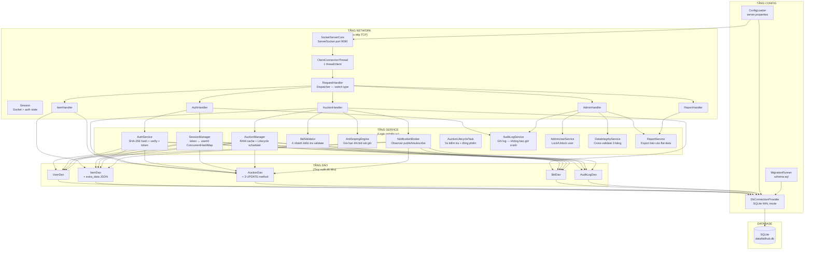

### 1.2 Nguyên tắc phân tầng

| Nguyên tắc | Giải thích | Ví dụ |
|------------|------------|-------|
| **Network chỉ điều phối** | Handler không chứa logic nghiệp vụ, chỉ parse payload + gọi service + format response | `AuthHandler.handleLogin()` gọi `AuthService.verifyPassword()` |
| **Service chứa logic** | Mọi quy tắc nghiệp vụ nằm ở service | `BidValidator.validate()` kiểm tra 6 nhánh |
| **DAO chỉ CRUD** | Không chứa logic, chỉ map giữa object và SQL | `UserDao.save()` chỉ INSERT |
| **Config ở đáy** | Các tầng trên đều dependency xuống Config | `DbConnectionProvider` cung cấp connection cho DAO |

---

## Giai đoạn 2: Cấu Hình Khởi Động

### 2.1 ConfigLoader — Đọc cấu hình tĩnh

```java
// server.properties
server.port=9090
db.path=data/bidhub.db
snipe.threshold=60
snipe.extension=60
```

**Logic**: `ConfigLoader` đọc file `server.properties` từ classpath **1 lần duy nhất** khi class được load (static initializer). Nếu key không tồn tại → `getString()` ném `IllegalArgumentException` → server không khởi động → **fail-fast**.

**`getIntOrDefault()`** — An toàn cho config tùy chọn:
```java
int poolSize = ConfigLoader.getIntOrDefault("server.poolSize", 30); // Không có key → dùng 30
int threshold = ConfigLoader.getIntOrDefault("snipe.threshold", 60); // Có key → đọc giá trị
```

### 2.2 DbConnectionProvider — Singleton quản lý JDBC

```java
private DbConnectionProvider() {
    String dbPath = ConfigLoader.getString("db.path");
    // Tạo thư mục cha nếu chưa có
    Files.createDirectories(path.getParent());
    this.jdbcUrl = "jdbc:sqlite:" + dbPath;
    // Bật WAL mode — Write-Ahead Logging
    stmt.execute("PRAGMA journal_mode=WAL");
}
```

**Tại sao WAL mode?** Mặc định SQLite dùng **journal mode** — khi ghi, khóa toàn bộ DB → không đọc được. WAL mode cho phép **đọc và ghi đồng thời** → phù hợp cho server nhiều thread.

**Mỗi DAO gọi `getConnection()` → connection mới**: Không dùng connection pool vì SQLite chỉ cho 1 ghi tại 1 thời điểm. Connection mới → dùng xong → đóng → tránh leak.

**Constructor inject cho test**: DAO có 2 constructor — production dùng `DbConnectionProvider`, test inject connection in-memory SQLite.

### 2.3 MigrationRunner — Tự động tạo schema

**Logic**:
1. Đọc `schema.sql` từ classpath
2. Split theo `;\n` → thực thi từng statement
3. `CREATE TABLE IF NOT EXISTS` → chạy nhiều lần an toàn
4. `ALTER TABLE users ADD COLUMN is_locked` → Migration cho DB cũ, catch exception nếu cột đã tồn tại

**Tại sao migration dùng try-catch thay vì check?** SQLite không hỗ trợ `IF NOT EXISTS` cho `ALTER TABLE`. Check cột tồn tại phức tạp hơn (phải query `PRAGMA table_info`). Catch exception đơn giản và hiệu quả hơn.

---

## Giai đoạn 3: Tầng DAO — 5 Class & Pattern Chung

### 3.1 Pattern DAO chung

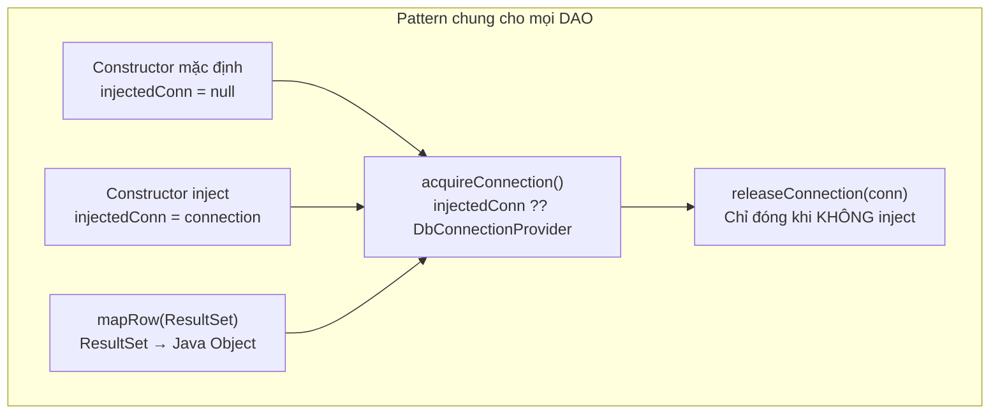

**Tại sao 2 constructor?** Constructor inject cho phép test DAO với **in-memory SQLite** (`jdbc:sqlite::memory:`) — mỗi test chạy DB sạch, không ảnh hưởng production. `releaseConnection()` chỉ đóng khi KHÔNG inject → tránh đóng shared connection trong test.

### 3.2 UserDao — CRUD + Polymorphism

**Logic mapRow — Tạo đúng subclass**:

```java
private User mapRow(ResultSet rs) throws SQLException {
    UserRole role = UserRole.valueOf(rs.getString("role"));
    User user = switch (role) {
        case BIDDER -> new Bidder(id, createdAt, updatedAt, username, passwordHash, email, extraInt, locked);
        case SELLER -> new Seller(id, createdAt, updatedAt, username, passwordHash, email, extraInt, locked);
        case ADMIN  -> new Admin(id, createdAt, updatedAt, username, passwordHash, email, adminLevel, locked);
    };
    return user;
}
```

**Cột `extra_int` đa năng**: Tùy `role` mà map vào field khác nhau — `totalBidsPlaced` (Bidder), `totalItemsListed` (Seller), `adminLevel` (Admin). Đây là **Single Table Inheritance** — 1 bảng cho nhiều subclass, phân biệt bằng cột `role`.

**`updateLocked()`** — Dùng cho Admin khóa/mở khóa:
```java
public void updateLocked(String userId, boolean locked) {
    // UPDATE users SET is_locked = ?, updated_at = ? WHERE id = ?
}
```

### 3.3 ItemDao — extra_data JSON

**Logic lưu trữ**: Subclass field (brand, artist, manufacturer...) → serialize thành JSON → lưu vào cột `extra_data`.

```java
// Lưu: Java Object → JSON
ps.setString(7, MAPPER.writeValueAsString(buildExtras(item)));

// Đọc: JSON → Java Object
Map<String, Object> extras = MAPPER.readValue(rs.getString("extra_data"), MAP_TYPE);
```

**`buildExtras()`** — Tạo map từ Item:
```java
switch (item.getItemType()) {
    case ELECTRONICS -> {
        extras.put("brand", e.getBrand());
        extras.put("warrantyMonths", e.getWarrantyMonths());
    }
    case ART -> { extras.put("artist", a.getArtist()); extras.put("yearCreated", a.getYearCreated()); }
    case VEHICLE -> { extras.put("manufacturer", v.getManufacturer()); extras.put("year", v.getYear()); extras.put("mileageKm", v.getMileageKm()); }
}
if (item.getImageUrl() != null) extras.put("imageUrl", item.getImageUrl());
```

**`imageUrl` nằm trong extra_data** — Không có cột riêng. Khi client gửi `imageUrl` trong `CREATE_ITEM`, handler set vào item object, rồi `buildExtras()` đưa vào JSON.

**`updateItem()`** — Dùng `COALESCE` SQL:
```sql
UPDATE items SET
    name = COALESCE(?, name),          -- null → giữ nguyên
    description = COALESCE(?, description),
    starting_price = COALESCE(?, starting_price),
    extra_data = ?,                     -- Luôn cập nhật (chứa imageUrl)
    updated_at = ?
WHERE id = ?
```

`COALESCE(?, name)` — Nếu tham số là null → giữ giá trị cũ. Tránh phải viết câu UPDATE riêng cho mỗi trường.

### 3.4 AuctionDao — 3 method UPDATE riêng

**Tại sao 3 UPDATE thay vì 1?** Vì mỗi thao tác chỉ cần sửa 1-2 trường:

| Method | Cột sửa | Khi gọi |
|--------|---------|---------|
| `updateStatus()` | `status, updated_at` | LifecycleTask chuyển trạng thái |
| `updateHighestBid()` | `current_highest_bid, highest_bidder_id, updated_at` | Bid thành công |
| `updateEndTime()` | `end_time, updated_at` | Anti-Sniping gia hạn |

Nếu dùng 1 UPDATE duy nhất → phải truyền toàn bộ field → nguy cơ ghi đè field không thay đổi → **partial update bug**.

**`getItemAuctionStatusMap()`** — Map itemId → trạng thái auction:
```java
// Dùng trong ItemHandler.enrichItems()
// Trả về Map: itemId → trạng thái auction
// RUNNING có ưu tiên ghi đè: nếu item có auction RUNNING,
// status RUNNING sẽ thay thế bất kỳ status nào khác cho cùng itemId
```

**Quy tắc ưu tiên**: Nếu 1 item có nhiều auction, **chỉ RUNNING có quyền ghi đè** — khi duyệt qua các auction, nếu gặp auction RUNNING cho itemId đã có status khác, RUNNING sẽ thay thế. Các status khác không có thứ tự ưu tiên, status cuối cùng được duyệt sẽ được giữ lại.

Tại sao chỉ RUNNING được ưu tiên? Vì nếu item đang có auction RUNNING thì phải hiển thị "AUCTIONING" cho người dùng, không quan tâm đến auction FINISHED hay CANCELED cũ. Các trạng thái khác không cần ưu tiên vì không ảnh hưởng đến trải nghiệm người dùng đang đấu giá.

### 3.5 BidDao — Đặc biệt getHighestBid()

```java
public Optional<BidTransaction> getHighestBid(String auctionId) {
    String sql = """
    SELECT * FROM bid_transactions
    WHERE auction_id = ?
    ORDER BY bid_amount DESC, bid_time ASC
    LIMIT 1
    """;
}
```

**`ORDER BY bid_amount DESC, bid_time ASC`** — Lấy giá cao nhất. Nếu 2 bid cùng giá → lấy bid đặt trước (bid_time ASC). Dùng khi đóng auction để xác định winner.

---

## Giai đoạn 4: RequestHandler — Dispatcher Chính

### 4.1 Sơ đồ luồng xử lý 1 request

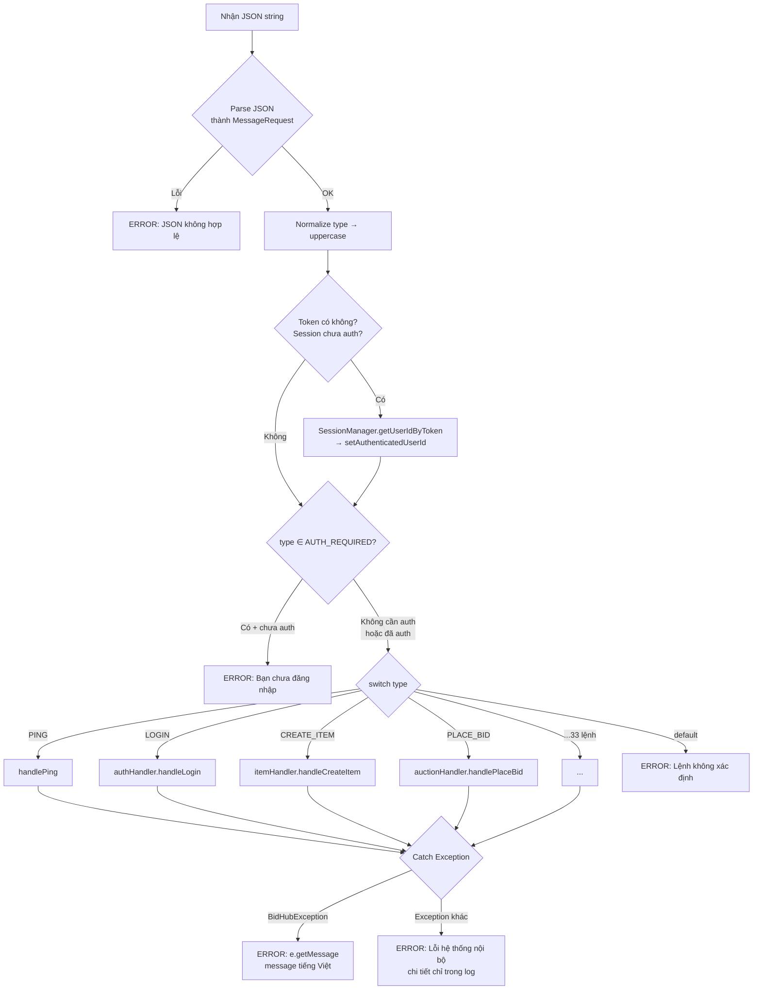

### 4.2 AUTH_REQUIRED Set — Bảo vệ 23 lệnh

```java
private static final Set<String> AUTH_REQUIRED = Set.of(
    "LOGOUT", "CREATE_ITEM", "DELETE_ITEM", "LIST_MY_ITEMS",
    "CREATE_AUCTION", "PLACE_BID",
    "GET_USER_LIST", "LOCK_USER", "UNLOCK_USER",
    "GET_BID_HISTORY_REPORT", "GET_AUDIT_LOG", "RUN_INTEGRITY_CHECK",
    "SEND_NOTIFICATION", "GET_NOTIFICATIONS",
    "GET_MY_AUCTIONS", "UPDATE_ITEM", "CANCEL_AUCTION",
    "MARK_NOTIFICATION_READ",
    "ADMIN_STOP_AUCTION", "ADMIN_DELETE_AUCTION",
    "GET_WON_AUCTIONS", "MARK_PAID", "SELLER_CANCEL_FINISHED"
);
```

**10 lệnh KHÔNG cần auth**: PING, LOGIN, REGISTER, GET_ITEM_LIST, GET_ITEM_DETAIL, GET_AUCTION_LIST, GET_AUCTION_DETAIL, SUBSCRIBE_AUCTION, GET_HOME_STATS, GET_AUCTION_REPORT (nhưng cần SELLER/ADMIN role).

**Token auto-restore**: Nếu session chưa auth nhưng request có token hợp lệ → `SessionManager.getUserIdByToken()` → set authenticated. Điều này cho phép client reconnect với token cũ.

### 4.3 Delegate Handler Pattern

RequestHandler giữ reference đến 5 handler chuyên biệt, mỗi handler nhận `RequestHandler` (để truy cập DAO) và trả về JSON string:

```java
public RequestHandler() {
    // Khởi tạo DAO + Service
    this.authHandler = new AuthHandler(this);
    this.itemHandler = new ItemHandler(this);
    this.auctionHandler = new AuctionHandler(this);
    this.adminHandler = new AdminHandler(this);
    this.reportHandler = new ReportHandler(this);
}
```

**Tại sao handler nhận `RequestHandler`?** Vì handler cần truy cập DAO và Service được tạo trong RequestHandler. Đây là **Mediator Pattern** — RequestHandler đóng vai trò trung gian cung cấp dependency.

---

## Giai đoạn 5: AuthHandler — LOGIN, REGISTER, LOGOUT

### 5.1 Luồng LOGIN chi tiết

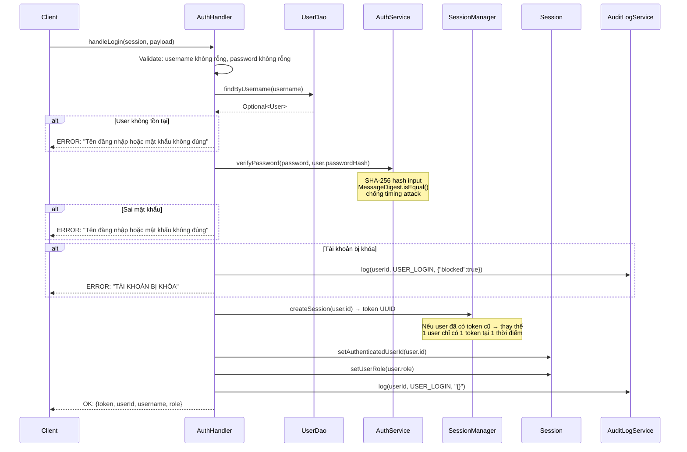

### 5.2 Giải thích chi tiết LOGIN

**Bảo mật — Không tiết lộ lý do thất bại cụ thể**:

```java
// Sai — Tiết lộ user tồn tại hay không
if (userOpt.isEmpty()) return error("Tên đăng nhập không tồn tại.");
if (!verifyPassword()) return error("Mật khẩu sai.");

// Đúng — Thông báo chung
if (userOpt.isEmpty() || !verifyPassword())
    return error("Tên đăng nhập hoặc mật khẩu không đúng.");
```

Tại sao? Attacker có thể dùng 2 message khác nhau để dò xem username nào tồn tại (username enumeration).

**`AuthService.verifyPassword()` — Chống timing attack**:

```java
public static boolean verifyPassword(String plain, String hashed) {
    byte[] computedHash = hashPassword(plain).getBytes(UTF_8);
    byte[] storedHash = hashed.getBytes(UTF_8);
    return MessageDigest.isEqual(computedHash, storedHash); // Constant-time!
}
```

`String.equals()` so sánh từng byte, dừng ngay khi gặp byte khác → thời gian phản hồi khác nhau tùy số byte khớp → attacker đoán từng ký tự. `MessageDigest.isEqual()` luôn so sánh toàn bộ → thời gian không phụ thuộc nội dung.

**SessionManager.createSession() — 1 user = 1 token**:

```java
public synchronized String createSession(String userId) {
    String token = AuthService.generateToken(); // UUID.randomUUID()
    String oldToken = userIdToToken.put(userId, token);
    if (oldToken != null) tokenToUserId.remove(oldToken); // Xóa token cũ
    tokenToUserId.put(token, userId);
    return token;
}
```

Nếu user login từ thiết bị khác → token cũ bị xóa → thiết bị cũ tự động mất auth.

### 5.3 REGISTER — Kiểm tra & Tạo user

```java
String handleRegister(Session session, JsonNode payload) {
    // 1. Validate: username, password ≥ 8 ký tự, email chứa @
    // 2. Không cho đăng ký ADMIN
    // 3. Kiểm tra username trùng
    // 4. Tạo đúng subclass dựa trên role (SELLER/BIDDER)
    // 5. Hash mật khẩu → userDao.save()
    // 6. Ghi audit log
    // 7. Trả về userId, username, role
}
```

**Tại sao không cho đăng ký ADMIN?** Nếu cho phép → ai cũng có quyền admin → mất kiểm soát. ADMIN chỉ được tạo bằng cách sửa trực tiếp DB hoặc migration script.

### 5.4 LOGOUT

```java
String handleLogout(Session session, String token) {
    if (userId != null) auditLogService.log(userId, USER_LOGOUT, "{}");
    if (token != null) SessionManager.getInstance().invalidateSession(token);
    session.setAuthenticatedUserId(null);  // Xóa auth state
    session.setUserRole(null);
    return MessageResponse.ok("LOGOUT", Map.of("message", "Đăng xuất thành công."));
}
```

**3 việc**: (1) Ghi audit log, (2) Xóa token khỏi SessionManager, (3) Reset session auth state.

**Bug đã phát hiện**: Client `LoginController` không kiểm tra response LOGOUT — luôn chuyển về màn hình login dù server lỗi. Nhưng LOGOUT luôn trả OK nên không gây vấn đề thực tế.

---

## Giai đoạn 6: ItemHandler — CRUD Sản Phẩm

### 6.1 Sơ đồ CRUD Item

```mermaid
graph TD
    subgraph "CREATE_ITEM<br/>(SELLER only)"
        CI1[SecurityContext.requireRole SELLER]
        CI2[Validate name, price, itemType]
        CI3[ItemCreator.forType → createItem]
        CI4[Set imageUrl nếu có]
        CI5[itemDao.save]
        CI6[Audit log]
    end

    subgraph "GET_ITEM_LIST<br/>(Public)"
        GI1[itemDao.findAll]
        GI2[auctionDao.getItemAuctionStatusMap]
        GI3[userDao.findAll → sellerNames]
        GI4[enrichItems → thêm auctionStatus + sellerName]
    end

    subgraph "UPDATE_ITEM<br/>(Owner only)"
        UI1[Check ownership: item.sellerId == userId]
        UI2[Update name/desc/price/imageUrl]
        UI3[itemDao.updateItem — COALESCE SQL]
    end

    subgraph "DELETE_ITEM<br/>(Owner only)"
        DI1[Check ownership]
        DI2[itemDao.deleteById]
        DI3[Audit log]
    end

    CI1 --> CI2 --> CI3 --> CI4 --> CI5 --> CI6
    GI1 --> GI2 --> GI3 --> GI4
    UI1 --> UI2 --> UI3
    DI1 --> DI2 --> DI3
```

### 6.2 Factory Method — ItemCreator

`ItemCreator` là **abstract class** áp dụng Factory Method Pattern:

```java
public abstract class ItemCreator {
    // Abstract method — mỗi subclass tạo loại Item riêng
    public abstract Item createItem(String name, String description,
            double startingPrice, String sellerId, Map<String, Object> extras);

    // Static factory — trả về concrete creator phù hợp
    public static ItemCreator forType(ItemType type) {
        return switch (type) {
            case ELECTRONICS -> new ElectronicsCreator();
            case ART         -> new ArtCreator();
            case VEHICLE     -> new VehicleCreator();
        };
    }

    // Protected helpers — dùng chung cho mọi concrete creator
    protected static String requireString(Map<String, Object> extras, String key) {
        Object val = extras.get(key);
        if (val == null) throw new ValidationException(key + " là bắt buộc");
        return val.toString();
    }

    protected static int requireInt(Map<String, Object> extras, String key) {
        Object val = extras.get(key);
        if (val == null) throw new ValidationException(key + " là bắt buộc");
        return ((Number) val).intValue();
    }
}
```

**3 Concrete Creator**:
- `ElectronicsCreator` → gọi `requireString(extras, "brand")` + `requireInt(extras, "warrantyMonths")` → tạo `Electronics`
- `ArtCreator` → gọi `requireString(extras, "artist")` + `requireInt(extras, "yearCreated")` → tạo `Art`
- `VehicleCreator` → gọi `requireString(extras, "manufacturer")` + `requireInt(extras, "year")` + `requireInt(extras, "mileageKm")` → tạo `Vehicle`

**ItemType enum** — 3 giá trị với nhãn tiếng Việt:
```java
public enum ItemType {
    ELECTRONICS("Đồ điện tử"),
    ART("Tác phẩm nghệ thuật"),
    VEHICLE("Phương tiện");
}
```

**Luồng tạo item**:

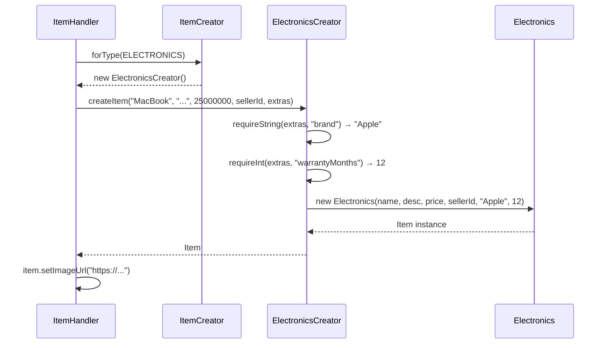

**Tại sao Factory Method thay vì if-else?**

```java
// Sai — vi phạm Open/Closed Principle
if (itemType == ELECTRONICS) item = new Electronics(...);
else if (itemType == ART) item = new Art(...);
else if (itemType == VEHICLE) item = new Vehicle(...);
// Thêm JEWELRY → phải sửa file này

// Đúng — Thêm JEWELRY chỉ cần tạo JewelryCreator + thêm 1 case vào forType()
```

### 6.3 enrichItems — Thêm metadata cho item list

```java
private List<Map<String, Object>> enrichItems(List<Item> items,
        Map<String, String> statusMap, Map<String, String> userNames,
        boolean includeSeller, boolean includeItemIdField) {
    // Với mỗi item, thêm:
    // - auctionStatus: AVAILABLE / AUCTIONING / SOLD
    // - sellerName: Tên người bán
    // - imageUrl: URL ảnh sản phẩm
}
```

**Mapping auctionStatus (theo code hiện tại)**:

| DB status (auctions) | API status (items) | Ý nghĩa |
|----------------------|--------------------|----------|
| `null` (không có auction) | `AVAILABLE` | Sản phẩm chưa đấu giá |
| `OPEN` | `AUCTIONING` | Sắp đấu giá — phiên đã mở nhưng chưa bắt đầu chạy |
| `RUNNING` | `AUCTIONING` | Đang đấu giá |
| `FINISHED` | `AVAILABLE` | Phiên kết thúc — chưa thanh toán, có thể đấu giá lại |
| `PAID` | `SOLD` | Đã thanh toán — giao dịch hoàn tất |
| `CANCELED` | `AVAILABLE` | Bị hủy — sản phẩm vẫn còn |

**Logic mapping trong code**:
```java
// 4 nhánh logic:
if (rawStatus == null)                    → "AVAILABLE"
else if ("RUNNING".equals(rawStatus)
         || "OPEN".equals(rawStatus))     → "AUCTIONING"  // OPEN cũng map sang AUCTIONING!
else if ("PAID".equals(rawStatus))        → "SOLD"
else                                      → "AVAILABLE"  // FINISHED, CANCELED
```

Tại sao OPEN→AUCTIONING? Vì phiên ở trạng thái OPEN đã được tạo và chờ startTime — item đã được "dành" cho phiên đấu giá, hiển thị AUCTIONING để người dùng biết sắp có phiên. Tại sao PAID→SOLD mà FINISHED→AVAILABLE? Vì **PAID = đã thanh toán** (giao dịch hoàn tất, sản phẩm đã bán), còn **FINISHED** chỉ là phiên kết thúc, winner chưa chắc đã thanh toán → sản phẩm vẫn có thể đấu giá lại → AVAILABLE. Nhánh `else` bao gồm `FINISHED` và `CANCELED` — cả hai đều mang ý nghĩa "sản phẩm có thể tương tác" từ góc nhìn người dùng.

**Ưu tiên trong getItemAuctionStatusMap()**: Chỉ RUNNING có quyền ghi đè — nếu 1 item có nhiều auction (ví dụ 1 FINISHED cũ + 1 RUNNING mới), status RUNNING sẽ ghi đè status FINISHED, đảm bảo item hiển thị "AUCTIONING" khi đang có phiên hoạt động.

---

## Giai đoạn 7: AuctionHandler — Luồng Đấu Giá

### 7.0 AuctionStatus — State Pattern

AuctionStatus là **enum áp dụng State Pattern** — mỗi trạng thái định nghĩa rõ hành vi hợp lệ:

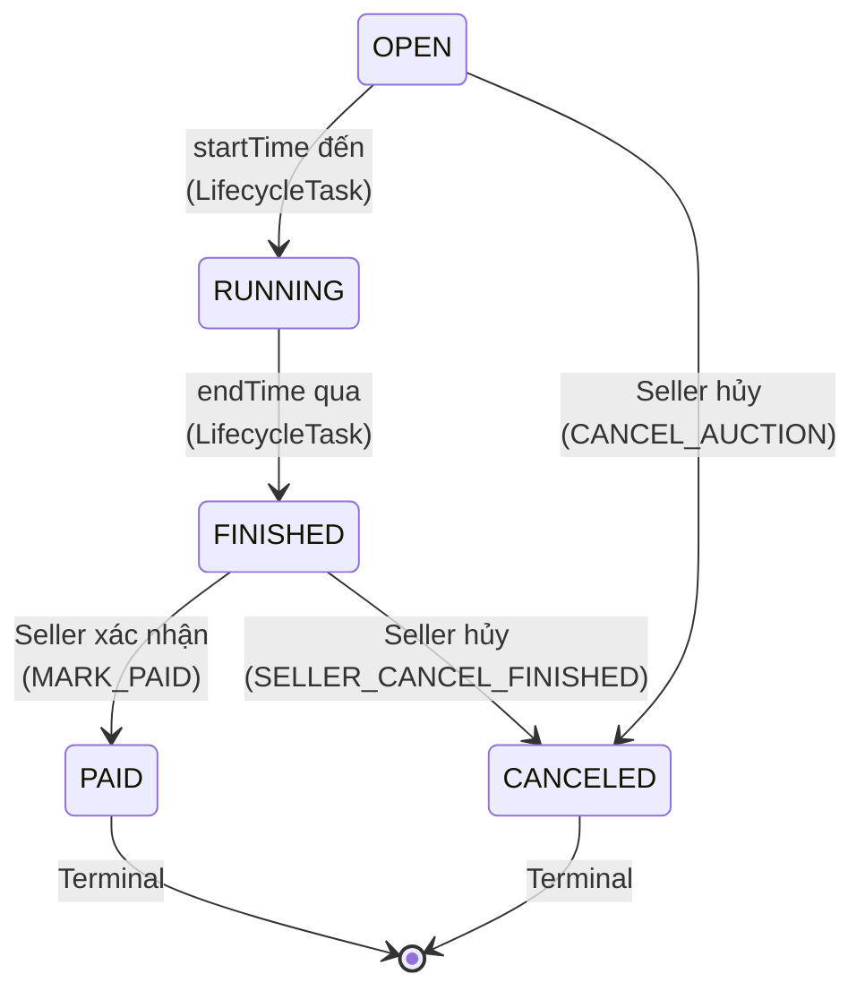

**5 trạng thái**: OPEN, RUNNING, FINISHED, PAID, CANCELED

**3 method cốt lõi**:

| Method | Logic | Mục đích |
|--------|-------|----------|
| `canBid()` | Chỉ `RUNNING` trả về `true` | Kiểm tra có được đặt giá không |
| `isTerminal()` | `PAID` và `CANCELED` trả về `true` | Kiểm tra trạng thái kết thúc |
| `canTransitionTo(target)` | Kiểm tra chuyển đổi hợp lệ | Ngược chuyển đổi không hợp lệ |

**Bảng chuyển đổi hợp lệ** (`canTransitionTo`):

| Từ | Đến | Điều kiện |
|----|-----|-----------|
| OPEN | RUNNING | startTime đến — LifecycleTask tự động |
| OPEN | CANCELED | Seller chủ động hủy trước khi bắt đầu |
| RUNNING | FINISHED | endTime qua — LifecycleTask tự động |
| FINISHED | PAID | Seller xác nhận thanh toán |
| FINISHED | CANCELED | Seller hủy (winner không thanh toán) |
| PAID | — | Terminal — không chuyển đổi được |
| CANCELED | — | Terminal — không chuyển đổi được |

**Tại sao dùng State Pattern?** Thay vì để handler tự kiểm tra logic trạng thái (if status == X then...), enum `AuctionStatus` đóng gói quy tắc chuyển đổi. Nếu thêm trạng thái mới (ví dụ `SUSPENDED`), chỉ cần sửa enum — không cần sửa tất cả handler.

### 7.1 CREATE_AUCTION — Tạo phiên đấu giá

```java
String handleCreateAuction(Session session, JsonNode payload) {
    String sellerId = SecurityContext.requireRole(session, UserRole.SELLER);
    // 1. Validate itemId → kiểm tra item tồn tại + thuộc seller
    // 2. Validate startingPrice > 0
    // 3. Validate minimumIncrement >= 0 (default 1.0)
    // 4. Parse startTime, endTime → endTime phải sau startTime
    // 5. new Auction(itemId, startTime, endTime, startingPrice, minimumIncrement)
    //    → status mặc định OPEN
    // 6. auctionDao.save(auction) → Lưu DB
    // 7. AuctionManager.addAuction(auction) → Thêm vào RAM cache
    // 8. Audit log
}
```

**Auction model** — Các trường quan trọng:
- `itemId` — Sản phẩm đấu giá
- `startTime`, `endTime` — Thời gian bắt đầu/kết thúc
- `startingPrice` — Giá khởi điểm
- `currentHighestBid` — Giá cao nhất hiện tại
- `highestBidderId` — ID người dẫn đầu
- `status` — Trạng thái (AuctionStatus enum)
- `minimumIncrement` — Bước giá tối thiểu
- `lock` (ReentrantLock) — Khóa cấp auction, fine-grained locking

**Quan trọng**: Auction được lưu vào CẢ HAI nơi:
1. **SQLite** (qua `auctionDao.save`) — Persistent, tồn tại sau khi restart
2. **RAM** (qua `AuctionManager.addAuction`) — Nhanh, dùng cho bid validation và lifecycle

### 7.2 PLACE_BID — Luồng đặt giá (PHỨC TẠP NHẤT)

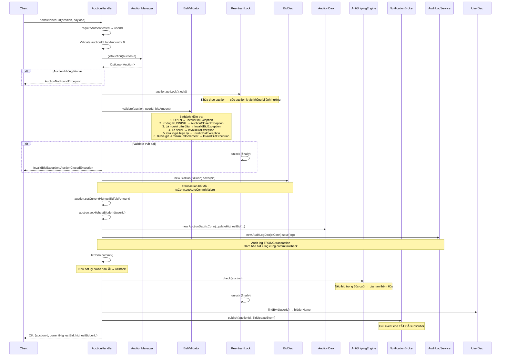

### 7.3 Giải thích chi tiết PLACE_BID

**Tại sao dùng Transaction?** 3 thao tác DB phải là atomic (tất cả thành công hoặc tất cả thất bại):

1. `BidDao.save(bid)` — Lưu bid vào `bid_transactions`
2. `AuctionDao.updateHighestBid()` — Cập nhật giá cao nhất trong `auctions`
3. `AuditLogDao.save(log)` — Ghi audit log

Nếu bước 2 lỗi mà bước 1 đã commit → bid được ghi nhưng giá không cập nhật → **inconsistent**. Transaction đảm bảo: commit khi tất cả OK, rollback khi bất kỳ bước lỗi.

**Tại sao Audit Log nằm TRONG transaction?** Trước đây audit log nằm ngoài transaction → nếu transaction rollback, audit log vẫn ghi → **log sai sự thật**. Đưa vào trong → nếu rollback, log cũng rollback → chính xác.

**Tại sao `auction.getLock().lock()` nằm NGOÀI transaction?** Lock bảo vệ RAM (tránh 2 thread cùng sửa `currentHighestBid`). Transaction bảo vệ DB (atomic commit). Nếu lock nằm trong transaction → giữ lock lâu hơn cần → giảm throughput.

**Tại sao `NotificationBroker.publish()` nằm NGOÀI lock?** Publish gửi socket data — thao tác chậm (network I/O). Nếu publish trong lock → thread khác phải chờ gửi xong mới bid được → chậm. Publish ngoài lock → bid được xử lý nhanh, notify chạy song song.

**AntiSnipingEngine.check() — Chạy TRONG lock nhưng NGOÀI transaction**:
```java
txConn.commit();        // Transaction đã commit
handler.antiSnipingEngine.check(auction);  // Kiểm tra trong lock
// finally: auction.getLock().unlock();
```

Nếu anti-sniping kích hoạt → gia hạn auction (cập nhật RAM + DB). Cần nằm trong lock để tránh race với bid khác.

### 7.4 SUBSCRIBE_AUCTION — Đăng ký nhận event

```java
String handleSubscribeAuction(Session session, JsonNode payload) {
    String auctionId = payload.path("auctionId").asText("");
    if (auctionId.isBlank()) throw new ValidationException("auctionId không được để trống");
    NotificationBroker.getInstance().subscribe(auctionId, session);
    return MessageResponse.ok("SUBSCRIBE_AUCTION",
            Map.of("auctionId", auctionId, "message", "Đã subscribe thành công"));
}
```

**Logic**: Đăng ký session vào danh sách subscriber của auction. Từ lúc này, mỗi khi có `BidUpdateEvent`, `AuctionClosedEvent`, hoặc `AuctionExtendedEvent` → session nhận được JSON push.

**Lưu ý**: SUBSCRIBE_AUCTION là API public — không nằm trong `AUTH_REQUIRED` set. Handler không gọi `SecurityContext.requireAuthenticated()`, session chỉ cần có token hợp lệ (được check ở RequestHandler), không cần kiểm tra thêm.

### 7.5 CANCEL_AUCTION — Hủy phiên

```java
// Chỉ hủy được phiên ở trạng thái OPEN (chưa bắt đầu)
if (auc.getStatus() != AuctionStatus.OPEN) {
    return error("Chỉ có thể hủy phiên đang ở trạng thái Chờ bắt đầu.");
}
handler.auctionDao.deleteById(auctionId);
```

**Logic**: Chỉ seller chủ sở hữu mới hủy được. Chỉ hủy được khi OPEN — nếu đã RUNNING → phải dùng `ADMIN_STOP_AUCTION`. Điều này khớp với `canTransitionTo()`: OPEN có thể chuyển sang CANCELED, nhưng RUNNING thì không (RUNNING chỉ có thể chuyển sang FINISHED).

### 7.6 MARK_PAID — Xác nhận thanh toán

**Authenticated user (owner)**, auction phải ở trạng thái FINISHED.

**Luồng xử lý**:
```
requireAuthenticated → check status==FINISHED → check ownership (item.sellerId==userId) → transitionTo(PAID) → updateStatus(PAID) → audit log
```

**Chi tiết**:
- `SecurityContext.requireAuthenticated(session)` — Yêu cầu đã đăng nhập (không yêu cầu role SELLER cụ thể).
- Check status: auction phải ở trạng thái FINISHED mới có thể đánh dấu đã thanh toán.
- Check ownership: `item.sellerId == userId` — user phải là chủ của item thuộc auction này. Đây là cách kiểm tra quyền thay vì dùng `requireRole(SELLER)` — linh hoạt hơn, vì bất kỳ ai sở hữu item đều có thể xác nhận.
- `auction.transitionTo(AuctionStatus.PAID)` — Chuyển trạng thái FINISHED → PAID. Method `canTransitionTo(PAID)` trả về `true` cho FINISHED → chuyển đổi hợp lệ.
- `auctionDao.updateStatus(auctionId, AuctionStatus.PAID)` — Cập nhật DB.
- Audit log ghi lại hành động MARK_PAID.

**Không kiểm tra hasActiveAuction**: Khác với CREATE_AUCTION, MARK_PAID không kiểm tra item có auction RUNNING khác hay không. Vì MARK_PAID chỉ thao tác trên auction đã FINISHED — không ảnh hưởng đến auction khác.

Tại sao cần MARK_PAID? Vì FINISHED chỉ là trạng thái kết thúc phiên, chưa chắc winner đã thanh toán. MARK_PAID là bước xác nhận thủ công của seller — tương tự quy trình thực tế: người thắng cần liên hệ seller, thanh toán, seller xác nhận. Đây là ví dụ của State Pattern: FINISHED.canTransitionTo(PAID) = true, PAID.isTerminal() = true. Sau khi PAID, auction không thể chuyển sang trạng thái khác nữa.

### 7.7 SELLER_CANCEL_FINISHED — Hủy sau kết thúc

**Authenticated user (owner)**, auction phải ở trạng thái FINISHED.

**Luồng xử lý**:
```
requireAuthenticated → check status==FINISHED → check ownership (item.sellerId==userId) → transitionTo(CANCELED) → updateStatus(CANCELED) → audit log
```

**Chi tiết**:
- `SecurityContext.requireAuthenticated(session)` — Yêu cầu đã đăng nhập (không yêu cầu role SELLER cụ thể).
- Check status: auction phải ở trạng thái FINISHED mới có thể hủy.
- Check ownership: `item.sellerId == userId` — user phải là chủ của item thuộc auction này. Tương tự MARK_PAID, dùng ownership check thay vì requireRole.
- `auction.transitionTo(AuctionStatus.CANCELED)` — Chuyển trạng thái FINISHED → CANCELED. Method `canTransitionTo(CANCELED)` trả về `true` cho FINISHED → chuyển đổi hợp lệ.
- `auctionDao.updateStatus(auctionId, AuctionStatus.CANCELED)` — Cập nhật DB.
- Audit log ghi lại hành động SELLER_CANCEL_FINISHED.

Khi nào seller cần hủy sau khi kết thúc? Khi winner không thanh toán hoặc từ chối mua. Thay vì để auction mãi ở FINISHED, seller có thể hủy → sản phẩm trở về AVAILABLE → có thể tạo auction mới. Ưu điểm: linh hoạt xử lý edge case thực tế, không phải nhờ Admin.

### 7.8 GET_WON_AUCTIONS — Phiên đấu giá đã thắng

**Authenticated user**, trả về các auction mà user là người dẫn đầu (highest bidder) ở trạng thái FINISHED hoặc PAID.

**Luồng xử lý**:
```
requireAuthenticated → bidderId → findAll auctions → filter: status IN (FINISHED, PAID) AND highestBidderId == bidderId → enrich with item/seller info → return
```

**Chi tiết**:
- `SecurityContext.requireAuthenticated(session)` — Yêu cầu đã đăng nhập, lấy `bidderId`.
- Load tất cả auction từ DB (`auctionDao.findAll()`).
- Filter: chỉ giữ auction có `status == FINISHED` hoặc `status == PAID`, VÀ `highestBidderId == bidderId`.
- Với mỗi auction kết quả, enrich thêm thông tin: `itemName`, `imageUrl`, `description`, `sellerName` (lookup từ `itemDao` và `userDao`).
- Trả về danh sách auction đã thắng.

Tại sao cần GET_WON_AUCTIONS? Để bidder theo dõi các phiên mình đã thắng — đặc biệt quan trọng khi cần thanh toán (FINISHED) hoặc xác nhận giao dịch (PAID). Không cần role cụ thể — bất kỳ user đã đăng nhập nào cũng có thể xem danh sách phiên mình thắng.

---

## Giai đoạn 8: AdminHandler — Quản Trị Hệ Thống

### 8.1 Sơ đồ 8 chức năng admin

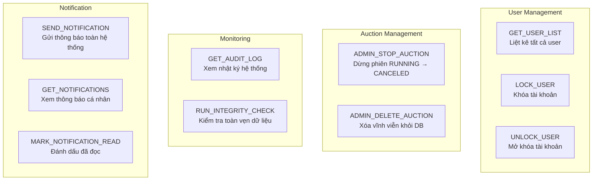

### 8.2 Notification — Cơ chế đặc biệt

**Gửi notification**: Admin gửi → lưu vào `audit_logs` với action = `BROADCAST_NOTIFICATION`, details = JSON `{title, message, type}`.

**Lấy notification**: Đọc `audit_logs` WHERE action = `BROADCAST_NOTIFICATION` → parse details JSON → thêm field `isRead` từ `ConcurrentHashMap` in-memory.

**Bug**: `isRead` được lưu trong RAM (`userReadNotifications`) — **không persistent**. Restart server → tất cả notification đều chưa đọc.

```java
// In-memory read state — KHÔNG lưu vào DB
static final Map<String, Set<String>> userReadNotifications = new ConcurrentHashMap<>();
```

### 8.3 RUN_INTEGRITY_CHECK — 3 kiểm tra

Gọi `DataIntegrityService.runFullCheck()`:

| Kiểm tra | Logic | Ví dụ lỗi |
|----------|-------|-----------|
| `checkBidConsistency()` | `auctions.currentHighestBid` == `MAX(bid_transactions.bid_amount)` | "Giá ghi 5M nhưng bid cao nhất chỉ 3M" |
| `checkAuctionWinners()` | FINISHED auction có bid nhưng `highestBidderId` = null | "Phiên kết thúc có bid nhưng chưa xác định winner" |
| `checkOrphanedItems()` | `items.sellerId` tồn tại trong `users` | "Item thuộc seller đã bị xóa" |

---

## Giai đoạn 9: ReportHandler — Báo Cáo

### 9.1 GET_AUCTION_REPORT — Báo cáo tất cả auction

```java
// Yêu cầu SELLER hoặc ADMIN
// ReportService.exportAuctionReport() → List<Map>
// Mỗi row: auctionId, itemId, itemName, status, startingPrice,
//          currentHighestBid, winnerName, startTime, endTime
```

**Tối ưu batch fetch**: Thay vì N+1 query (mỗi auction query 1 lần item name + user name), ReportService load 1 lần `findAll()` rồi lookup từ Map → **O(1)** thay vì **O(n)**.

### 9.2 GET_BID_HISTORY_REPORT — Lịch sử bid

```java
// auctionId = "ALL" → tất cả bid trong hệ thống
// auctionId = UUID → bid của 1 auction cụ thể
if ("ALL".equalsIgnoreCase(auctionId)) {
    bids = bidDao.findAll();
} else {
    bids = bidDao.findByAuctionId(auctionId);
}
```

**"ALL" là tính năng hợp lệ**, không phải bug — cho phép admin xem toàn bộ lịch sử bid.

---

## Giai đoạn 10: Service Layer — 10 Service & Mối Liên Kết

### 10.1 Sơ đồ mối liên kết

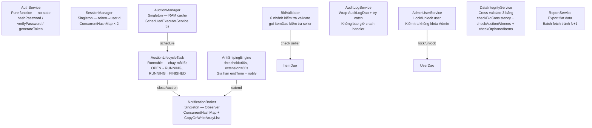

### 10.2 AuditLogService — Không bao giờ crash

```java
public void log(String userId, String action, String details) {
    try {
        AuditLog entry = new AuditLog(userId, action, details);
        auditLogDao.save(entry);
    } catch (Exception e) {
        logger.error("Không thể ghi log: action={}, error={}", action, e.getMessage());
        // KHÔNG ném exception → handler tiếp tục bình thường
    }
}
```

**Tại sao?** Audit log là **side effect** — không ảnh hưởng đến business logic. Nếu ghi log lỗi mà ném exception → bid thành công nhưng handler crash → client nhận lỗi → **sai ngữ nghĩa**.

---

## Giai đoạn 11: AntiSnipingEngine — Cơ Chế Gia Hạn Tự Động

### 11.1 Sơ đồ hoạt động

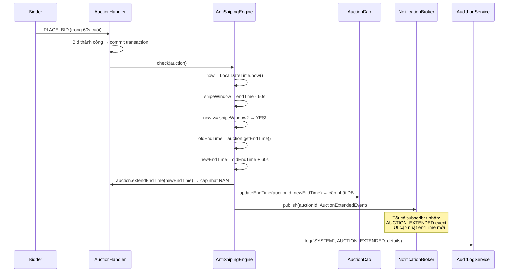

### 11.2 Giải thích

**Snipe window**: Bid đặt trong `threshold` giây cuối (default 60s) → kích hoạt gia hạn.

**Công thức**: `snipeWindow = endTime - thresholdSeconds`. Nếu `now >= snipeWindow` → bid nằm trong cửa sổ snipe → gia hạn.

**Gia hạn**: `newEndTime = oldEndTime + extensionSeconds` (default +60s). Cả RAM và DB đều cập nhật.

**Tại sao cần Anti-Sniping?** Sniping là chiến thuật đặt giá ở giây cuối → người khác không kịp phản ứng. BidHub chống bằng cách: bid sát giờ → tự động gia hạn → mọi người có thêm thời gian.

**Ví dụ**: Auction kết thúc 14:00:00. Bidder A đặt giá lúc 13:59:30 (trong 60s cuối) → endTime mới = 14:01:00. Bidder B đặt lúc 14:00:45 → endTime mới = 14:02:45. Cứ thế cho đến khi không còn bid nào trong 60s cuối.

---

## Giai đoạn 12: AuctionLifecycleTask — Lifecycle Tự Động

### 12.1 Sơ đồ lifecycle

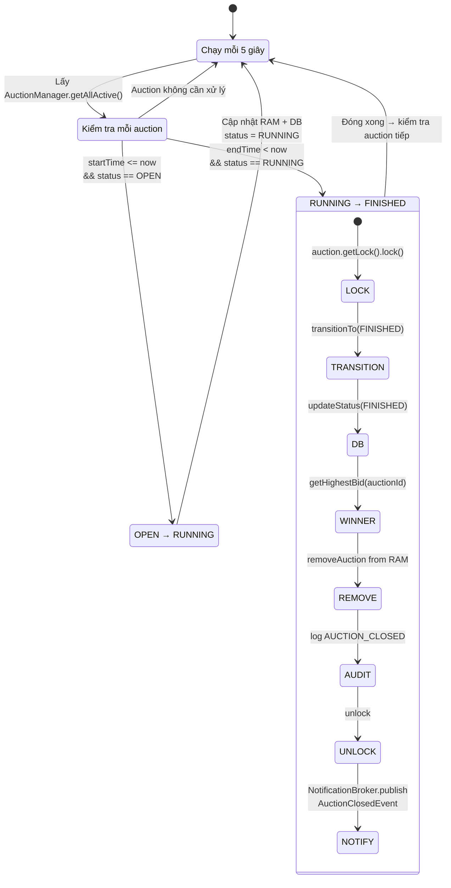

### 12.2 Giải thích chi tiết closeAuction()

```java
private void closeAuction(Auction auction) {
    auction.getLock().lock();  // Lock để tránh race với bid
    try {
        // 1. Chuyển trạng thái
        auction.transitionTo(AuctionStatus.FINISHED);
        // canTransitionTo(FINISHED) = true cho RUNNING → hợp lệ

        // 2. Cập nhật DB
        auctionDao.updateStatus(auctionId, AuctionStatus.FINISHED);

        // 3. Tìm winner
        Optional<BidTransaction> highestBidOpt = bidDao.getHighestBid(auctionId);
        // Có winner → lưu winnerId + winningBid
        // Không có → "phiên kết thúc không có người thắng"

        // 4. Xóa khỏi RAM
        AuctionManager.getInstance().removeAuction(auctionId);

        // 5. Audit log
        auditLogService.log("SYSTEM", AUCTION_CLOSED, details);

    } finally {
        auction.getLock().unlock();
    }

    // 6. Push event NGOÀI lock — tránh block
    NotificationBroker.getInstance().publish(auctionId,
        new AuctionClosedEvent(auctionId, winnerId, winningBid));
}
```

**Tại sao xóa khỏi RAM sau khi đóng?** Auction FINISHED không cần xử lý bid nữa → không cần trong RAM cache → tiết kiệm memory. Nếu client GET_AUCTION_DETAIL → fallback đọc từ DB.

**Tại sao publish NGOÀI lock?** `session.sendMessage()` là network I/O — chậm. Nếu publish trong lock → thread khác chờ bid cho đến khi gửi xong → **độ trễ cao**.

---

## Giai đoạn 13: DataIntegrityService — Kiểm Tra Toàn Vẹn

### 13.1 3 phương pháp kiểm tra

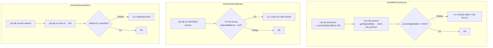

**Khi nào inconsistency xảy ra?**
- **Race condition**: 2 bid đồng thời, 1 rollback nhưng giá đã cập nhật
- **Partial failure**: Bid lưu thành công nhưng updateHighestBid lỗi
- **Manual DB edit**: Sửa DB trực tiếp mà không qua application

---

## Giai đoạn 14: Cheat Sheet — Module Server

### Khởi động — Nhớ 4 bước

| Bước | Code | Mục đích |
|------|------|----------|
| 1 | `MigrationRunner.run()` | Tạo bảng nếu chưa có |
| 2 | `ConfigLoader.getInt("server.port")` | Đọc cấu hình |
| 3 | `AuctionManager.start()` | Load auction vào RAM + chạy lifecycle task |
| 4 | `SocketServerCore.start(9090)` | Blocking — nghe kết nối |

### RequestHandler — Nhớ luồng

```
JSON → Parse → Auth check → Switch 33 type → Delegate 5 Handler → Response
```

### 5 Handler — Nhớ chức năng

| Handler | Lệnh xử lý | Đặc điểm |
|---------|-----------|----------|
| AuthHandler | LOGIN, REGISTER, LOGOUT | SHA-256 hash, token UUID, 1 user = 1 token |
| ItemHandler | CREATE, GET_LIST, GET_DETAIL, DELETE, LIST_MY, UPDATE | Factory Method, enrichItems, ownership check |
| AuctionHandler | CREATE_AUCTION, PLACE_BID, GET_LIST, GET_DETAIL, SUBSCRIBE, GET_MY, CANCEL, GET_WON_AUCTIONS, MARK_PAID, SELLER_CANCEL_FINISHED | Transaction + Lock, Anti-Sniping, Observer, State Pattern |
| AdminHandler | GET_USER_LIST, LOCK/UNLOCK, AUDIT_LOG, INTEGRITY_CHECK, NOTIFICATION, ADMIN_STOP/DELETE | requireRole(ADMIN), không khóa Admin |
| ReportHandler | GET_AUCTION_REPORT, GET_BID_HISTORY_REPORT | Batch fetch, "ALL" = tất cả |

### AuctionStatus — Nhớ 5 trạng thái + chuyển đổi

```
OPEN ──→ RUNNING ──→ FINISHED ──→ PAID (terminal)
 │                      │
 └──→ CANCELED    ──→ CANCELED (terminal)

canBid(): chỉ RUNNING
isTerminal(): PAID, CANCELED
```

### PLACE_BID — Nhớ 4 bước quan trọng

1. **Lock** → `auction.getLock().lock()`
2. **Validate** → `BidValidator.validate()` (6 nhánh kiểm tra)
3. **Transaction** → `save bid + updateHighestBid + auditLog → commit`
4. **Post-process** → `antiSnipingEngine.check()` + `notificationBroker.publish()`

### Anti-Sniping — Nhớ 2 số

- `snipe.threshold = 60s` → Phát hiện bid sát giờ
- `snipe.extension = 60s` → Gia hạn mỗi lần

### Lifecycle — Nhớ 2 chuyển đổi

- `OPEN → RUNNING`: startTime đến (LifecycleTask tự động)
- `RUNNING → FINISHED`: endTime qua (LifecycleTask tự động + tìm winner + notify)

### 11 Service — Nhớ vai trò

| Service | Vai trò | Singleton? |
|---------|---------|------------|
| AuthService | Hash/verify password, generate token | Không (pure function) |
| SessionManager | token ↔ userId | Singleton |
| AuctionManager | RAM cache + lifecycle scheduler | Singleton |
| BidValidator | 6 nhánh kiểm tra đặt giá | Không |
| AntiSnipingEngine | Gia hạn khi bid sát giờ | Không |
| NotificationBroker | Observer publish/subscribe | Singleton |
| AuctionLifecycleTask | Chuyển trạng thái auction tự động | Không |
| AuditLogService | Ghi log (không crash handler) | Không |
| AdminUserService | Lock/unlock user | Không |
| DataIntegrityService | Cross-validate 3 bảng | Không |
| ReportService | Export báo cáo flat | Không |

### DAO — Nhớ pattern

```
2 constructor (production + inject) → acquireConnection() → PreparedStatement → mapRow() → releaseConnection()
```

### Đặc biệt ItemDao

- `extra_data` = JSON → `buildExtras()` + `mapRow()` parse Jackson
- `imageUrl` nằm TRONG `extra_data`, không có cột riêng
- `updateItem()` dùng `COALESCE(?, field)` — null = giữ nguyên

### Đặc biệt AuctionDao

- 3 method UPDATE riêng: `updateStatus`, `updateHighestBid`, `updateEndTime`
- `getItemAuctionStatusMap()` — Map itemId → auction status, chỉ RUNNING có ưu tiên ghi đè

### enrichItems — Nhớ 4 nhánh mapping

```
null              → "AVAILABLE"
RUNNING || OPEN  → "AUCTIONING"   (OPEN cũng map sang AUCTIONING!)
PAID              → "SOLD"
else              → "AVAILABLE"   (FINISHED, CANCELED)
```

---

> **Tổng kết 3 Part**: Đã bao quát toàn bộ hệ thống BidHub — từ kiến trúc 3 module (Part 1), giao thức truyền thông + mô hình dữ liệu + exception (Part 2), đến toàn bộ logic xử lý server + service layer + DAO (Part 3). Mỗi luồng hoạt động đều được giải thích bằng sơ đồ Mermaid + phân tích logic + so sánh với cách sai.
