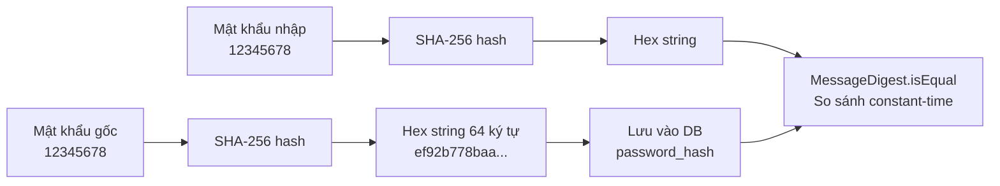
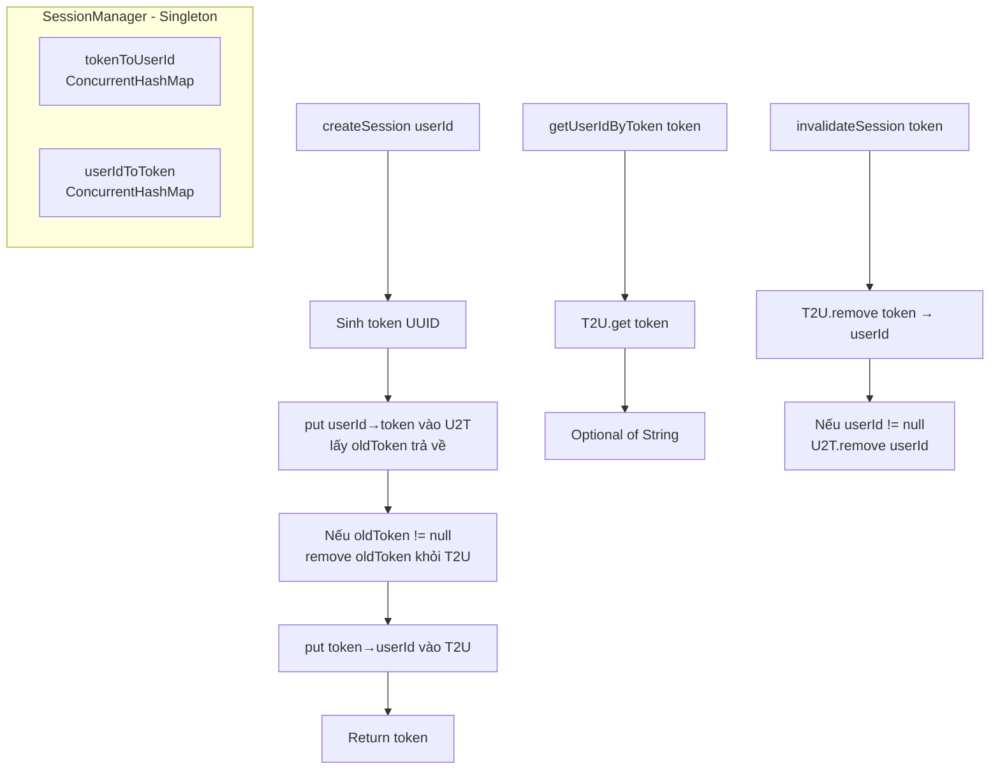
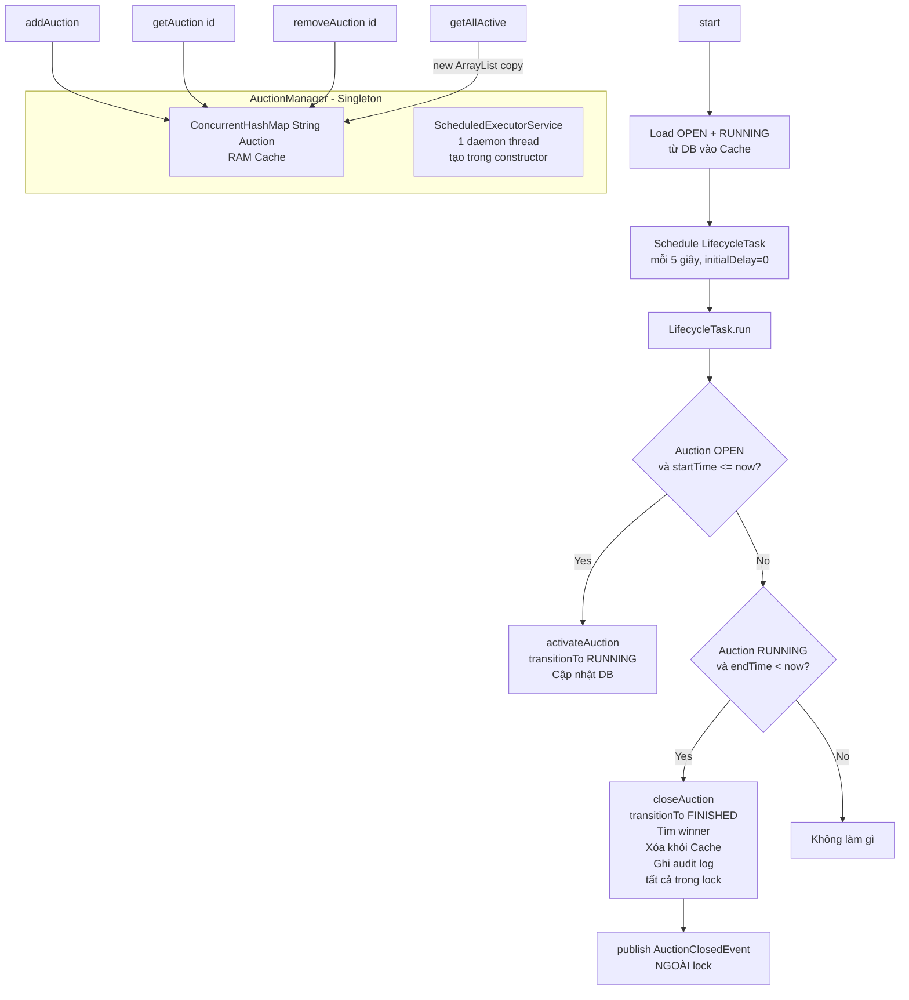
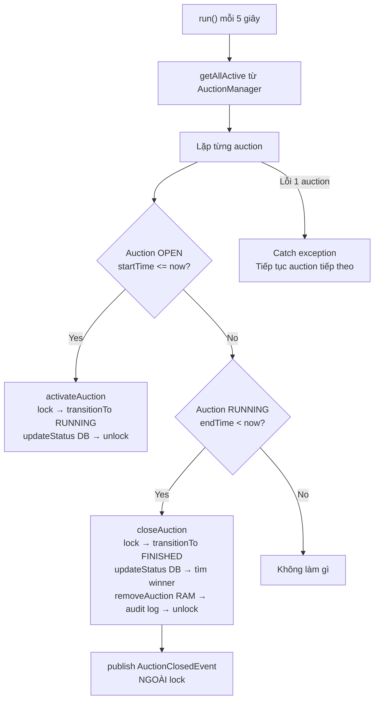
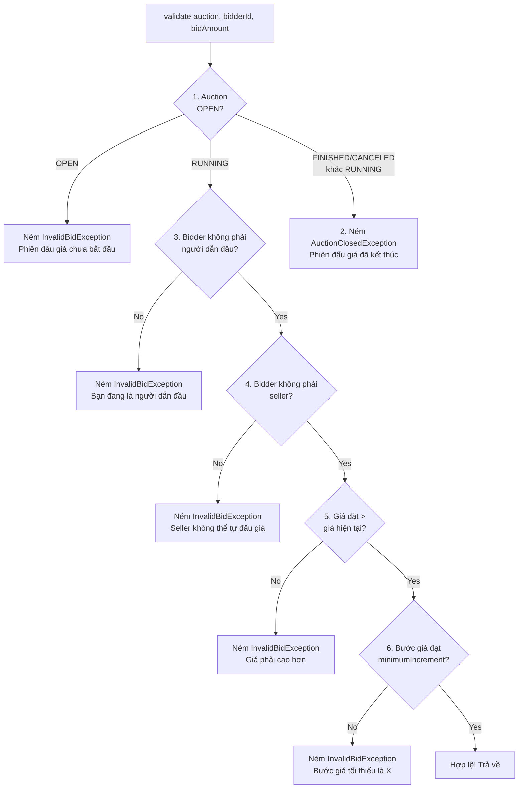
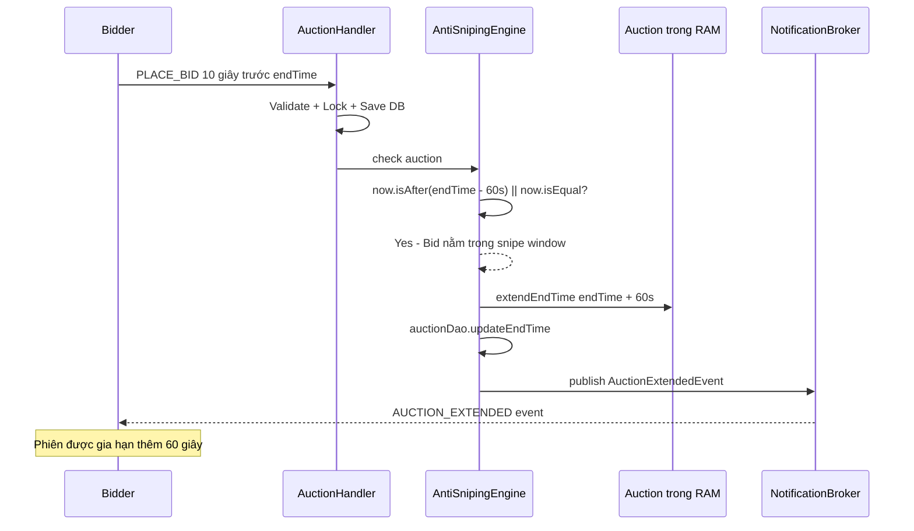
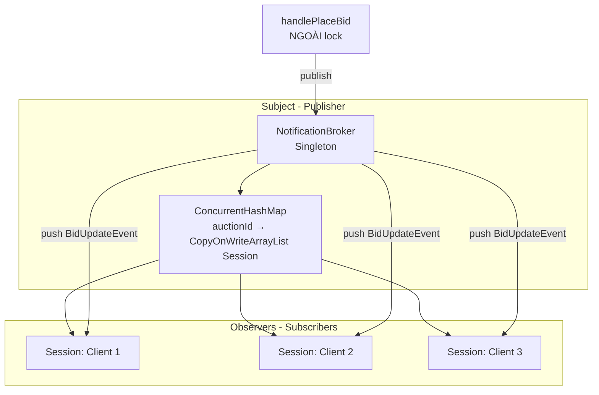
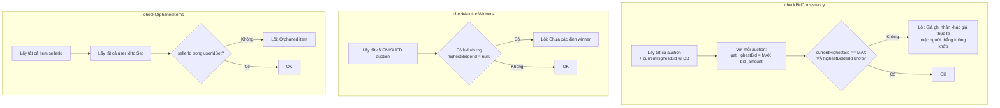

# Part 4: Server — Tầng Service & Business Logic

## Lộ trình học Part 4

| Giai đoạn | Chủ đề | Mục tiêu |
|-----------|--------|----------|
| 4.1 | AuthService | Hiểu hashing SHA-256 + verify constant-time + sinh token |
| 4.2 | SessionManager | Hiểu token↔userId bidirectional map, 1 user = 1 token |
| 4.3 | AuctionManager | Hiểu RAM cache + ScheduledExecutorService lifecycle |
| 4.4 | AuctionLifecycleTask | Hiểu scheduler tự động chuyển trạng thái auction |
| 4.5 | BidValidator | Hiểu 6 nhánh kiểm tra validate + thứ tự kiểm tra fail-fast |
| 4.6 | AntiSnipingEngine | Hiểu cơ chế gia hạn tự động khi bid sát giờ |
| 4.7 | NotificationBroker | Hiểu Observer Pattern push realtime event |
| 4.8 | AuditLogService | Hiểu tại sao audit log không bao giờ crash handler |
| 4.9 | ReportService | Hiểu batch fetch tránh N+1, export flat data |
| 4.10 | AdminUserService | Hiểu lock/unlock + tại sao không khóa Admin |
| 4.11 | DataIntegrityService | Hiểu 3 phương pháp cross-validate toàn vẹn dữ liệu |
| 4.12 | Cheat Sheet | Tổng hợp nhanh toàn bộ Service layer |

---

## Giai đoạn 4.1: AuthService — Bảo Mật Mật Khẩu

### 4.1.1 Vai trò trong hệ thống

AuthService là **pure utility class** — không lưu state, không phải Singleton. Constructor `private`, mọi method đều `static`. Chịu trách nhiệm 3 việc:
1. **Hash mật khẩu** — SHA-256 chuyển password gốc thành hex string 64 ký tự
2. **Verify mật khẩu** — So sánh hash nhập với hash DB bằng `MessageDigest.isEqual()` (constant-time)
3. **Sinh token** — `UUID.randomUUID()` tạo session token duy nhất

### 4.1.2 Sơ đồ luồng hashing + verify



**Giải thích sơ đồ**: Khi đăng ký, mật khẩu gốc đi qua SHA-256 → thành hex 64 ký tự → lưu vào DB. Khi đăng nhập, mật khẩu nhập cũng hash tương tự → so sánh 2 hex string bằng `isEqual()`.

### 4.1.3 Code logic chi tiết

```java
// AuthService.java — 69 lines, private constructor, toàn bộ static methods

public final class AuthService {

    private AuthService() {} // Chống tạo instance

    // HASH: Mật khẩu gốc → Hex string
    public static String hashPassword(String plain) {
        try {
            MessageDigest digest = MessageDigest.getInstance("SHA-256");
            byte[] hashBytes = digest.digest(plain.getBytes(StandardCharsets.UTF_8));
            return HexFormat.of().formatHex(hashBytes); // 64 ký tự hex
        } catch (NoSuchAlgorithmException e) {
            // SHA-256 luôn có trong JDK — không bao giờ xảy ra
            throw new RuntimeException("SHA-256 không khả dụng", e);
        }
    }

    // VERIFY: So sánh constant-time — chống timing attack
    public static boolean verifyPassword(String plain, String hashed) {
        byte[] computedHash = hashPassword(plain).getBytes(StandardCharsets.UTF_8);
        byte[] storedHash = hashed.getBytes(StandardCharsets.UTF_8);
        // Constant-time comparison — không short-circuit khi gặp byte khác
        return MessageDigest.isEqual(computedHash, storedHash);
    }

    // TOKEN: UUID random — 128-bit unique
    public static String generateToken() {
        return UUID.randomUUID().toString();
    }
}
```

**Logic từng method**:
- `hashPassword`: Dùng `MessageDigest` chuẩn của Java → `HexFormat.of().formatHex()` chuyển byte[] thành hex string. Luôn ra cùng 1 hex string cho cùng 1 input. Không có salt — điểm yếu (xem Q&A).
- `verifyPassword`: KHÔNG dùng `String.equals()` mà dùng `MessageDigest.isEqual()`. Lý do: `equals()` dừng so sánh ngay khi gặp ký tự khác → hacker đoán được thời gian → **timing attack**. `isEqual()` luôn duyệt hết cả 2 mảng → thời gian không phụ thuộc nội dung.
- `generateToken`: `UUID.randomUUID()` = 128-bit random → xác suất trùng gần như bằng 0.

### 4.1.4 Functional logic — Tại sao cần?

- **Tại sao hash?** Không bao giờ lưu mật khẩu gốc. DB bị lộ → hacker chỉ có hash → không thể đảo ngược SHA-256.
- **Tại sao constant-time?** Nếu dùng `equals()`, hacker gửi nhiều password → đo thời gian phản hồi → biết ký tự nào đúng → dò được mật khẩu.
- **Tại sao UUID?** Token ngẫu nhiên, không đoán được. 128-bit = 2^128 khả năng — brute force bất khả thi.

### 4.1.5 Q&A phòng vệ

- **"Tại sao không dùng bcrypt?"** → bcrypt có salt tích hợp + adaptive cost — tốt hơn SHA-256. BidHub dùng SHA-256 vì đơn giản, đủ cho đồ án. Production phải dùng bcrypt.
- **"Tại sao không có salt?"** → Không có salt = cùng password → cùng hash → rainbow table tấn công được. Đây là điểm yếu đã ghi nhận trong refactor.
- **"SHA-256 có bị collision không?"** → Lý thuyết có (2 input khác nhau → cùng hash), nhưng thực tế chưa ai tìm ra collision trên SHA-256. Đủ an toàn cho BidHub.

---

## Giai đoạn 4.2: SessionManager — Quản Lý Phiên Đăng Nhập

### 4.2.1 Vai trò trong hệ thống

SessionManager là **Singleton** quản lý ánh xạ 2 chiều giữa `token` và `userId`. Mọi request từ client đều mang token → SessionManager trả về userId tương ứng.

**Quy tắc quan trọng**: 1 user chỉ có 1 token tại 1 thời điểm. Login mới → token cũ bị thay thế.

### 4.2.2 Sơ đồ cấu trúc bên trong



**Giải thích sơ đồ**: 2 HashMap đảo ngược nhau — `tokenToUserId` tìm userId từ token, `userIdToToken` tìm token từ userId. Khi tạo session mới, `userIdToToken.put()` trả về oldToken → xóa oldToken khỏi `tokenToUserId` → đảm bảo 1 user chỉ có 1 token.

### 4.2.3 Code logic chi tiết

```java
// SessionManager.java — 127 lines

public final class SessionManager {

    private static volatile SessionManager instance;

    private final ConcurrentHashMap<String, String> tokenToUserId = new ConcurrentHashMap<>();
    private final ConcurrentHashMap<String, String> userIdToToken = new ConcurrentHashMap<>();

    private SessionManager() {}

    public static SessionManager getInstance() {
        if (instance == null) {
            synchronized (SessionManager.class) {
                if (instance == null) {
                    instance = new SessionManager();
                }
            }
        }
        return instance;
    }

    // TẠO SESSION: synchronized vì thao tác trên 2 map phải atomic
    public synchronized String createSession(String userId) {
        String token = AuthService.generateToken(); // UUID

        // put() trả về oldToken — xóa ánh xạ cũ nếu có
        String oldToken = userIdToToken.put(userId, token);
        if (oldToken != null) {
            tokenToUserId.remove(oldToken);
        }

        tokenToUserId.put(token, userId);
        return token;
    }

    // HỦY SESSION: synchronized vì xóa trên 2 map
    public synchronized void invalidateSession(String token) {
        if (token == null) return;
        String userId = tokenToUserId.remove(token);
        if (userId != null) {
            userIdToToken.remove(userId);
        }
    }

    // TÌM USER: synchronized — đảm bảo nhất quán với write
    // (createSession/invalidateSession cũng dùng synchronized)
    public synchronized Optional<String> getUserIdByToken(String token) {
        if (token == null || token.isBlank()) return Optional.empty();
        return Optional.ofNullable(tokenToUserId.get(token));
    }

    // KIỂM TRA TOKEN: synchronized
    public synchronized boolean isValidToken(String token) {
        return token != null && tokenToUserId.containsKey(token);
    }

    // LẤY TOKEN TỪ USERID: synchronized
    public synchronized Optional<String> getTokenByUserId(String userId) {
        return Optional.ofNullable(userIdToToken.get(userId));
    }

    // XÓA TOÀN BỘ — chỉ dùng cho test
    public synchronized void clearAll() {
        tokenToUserId.clear();
        userIdToToken.clear();
    }

    // ĐẾM SESSION — chỉ dùng cho test/monitor
    public synchronized int activeSessionCount() {
        return tokenToUserId.size();
    }
}
```

**Logic từng method**:
- `createSession`: PHẢI `synchronized` vì xóa-cập nhật 2 map phải là 1 thao tác nguyên tử. `userIdToToken.put()` trả về oldToken → xóa oldToken khỏi `tokenToUserId` → đảm bảo không có token mồ côi.
- `getUserIdByToken`: `synchronized` — đảm bảo nhất quán với write. Nếu không đồng bộ → đọc trong lúc createSession đang sửa 2 map → có thể thấy dữ liệu không nhất quán.
- `invalidateSession`: `synchronized` vì xóa trên cả 2 map phải atomic. Kiểm tra `token == null` trước.
- `isValidToken`, `getTokenByUserId`, `clearAll`, `activeSessionCount`: Tất cả đều `synchronized` để nhất quán.

### 4.2.4 Functional logic — Áp dụng trong BidHub

1. Client gửi LOGIN → `AuthHandler` gọi `createSession(userId)` → trả token
2. Mọi request sau đó client gửi kèm token → `RequestHandler` gọi `getUserIdByToken(token)` → xác thực
3. Client gửi LOGOUT → `AuthHandler` gọi `invalidateSession(token)` → token hết hiệu lực

### 4.2.5 Q&A phòng vệ

- **"Tại sao 2 map thay vì 1?"** → 1 map chỉ tìm được 1 chiều. Cần tìm userId từ token (mỗi request) VÀ tìm token từ userId (khi login mới xóa token cũ). 2 map = O(1) cả 2 chiều.
- **"Tại sao synchronized khi ConcurrentHashMap đã thread-safe?"** → ConcurrentHashMap bảo vệ từng phép ghi riêng lẻ, KHÔNG bảo vệ chuỗi thao tác. `remove(A); remove(B)` — nếu không đồng bộ, thread khác có thể chen giữa 2 lệnh → dữ liệu không nhất quán.
- **"Tại sao getUserIdByToken cũng cần synchronized?"** → Để đảm bảo happens-before relationship với write. Nếu createSession đang sửa 2 map mà getUserIdByToken đọc không đồng bộ → có thể thấy tokenToUserId đã cập nhật nhưng userIdToToken chưa → dữ liệu không nhất quán.
- **"Token có hết hạn không?"** → Hiện tại KHÔNG. Token sống đến khi logout hoặc server restart. Đây là điểm yếu — production cần TTL (time-to-live).

---

## Giai đoạn 4.3: AuctionManager — RAM Cache & Lifecycle Tự Động

### 4.3.1 Vai trò trong hệ thống

AuctionManager là **Singleton** đóng 2 vai trò:
1. **RAM Cache** — Lưu tất cả auction đang hoạt động (OPEN + RUNNING) trong `ConcurrentHashMap`. Mọi thao tác bid/read đều đọc từ RAM, không query DB.
2. **Lifecycle Scheduler** — `ScheduledExecutorService` chạy `AuctionLifecycleTask` mỗi 5 giây để tự động chuyển trạng thái auction.

### 4.3.2 Sơ đồ vòng đời AuctionManager



**Giải thích sơ đồ**: `ScheduledExecutorService` được tạo trong constructor (không phải trong start). Khi server khởi động, `start()` load tất cả auction OPEN + RUNNING từ DB vào RAM. Scheduler chạy mỗi 5s (initialDelay=0) kiểm tra: auction nào đến giờ bắt đầu → chuyển RUNNING, auction nào hết hạn → chuyển FINISHED + tìm winner + xóa khỏi cache. AuctionClosedEvent được publish NGOÀI lock.

### 4.3.3 Code logic chi tiết

```java
// AuctionManager.java — 169 lines

public final class AuctionManager {

    private static volatile AuctionManager instance;

    private final ConcurrentHashMap<String, Auction> auctions;
    private final ScheduledExecutorService scheduler;
    private volatile boolean started = false;

    private AuctionManager() {
        this.auctions = new ConcurrentHashMap<>();
        // Scheduler tạo trong constructor — daemon thread không chặn JVM shutdown
        this.scheduler = Executors.newSingleThreadScheduledExecutor(r -> {
            Thread t = new Thread(r, "auction-lifecycle");
            t.setDaemon(true);
            return t;
        });
    }

    public static AuctionManager getInstance() {
        if (instance == null) {
            synchronized (AuctionManager.class) {
                if (instance == null) {
                    instance = new AuctionManager();
                }
            }
        }
        return instance;
    }

    // START: Chạy 1 lần duy nhất khi server khởi động
    public void start() {
        if (started) return; // Chống gọi 2 lần
        started = true;

        // Load auction đang hoạt động từ DB vào RAM
        AuctionDao auctionDao = new AuctionDao();
        List<Auction> activeAuctions = auctionDao.findActiveAuctions();
        for (Auction auction : activeAuctions) {
            auctions.put(auction.getId(), auction);
        }

        // Schedule lifecycle task — initialDelay=0: xử lý ngay auction hết hạn
        AuctionLifecycleTask task = new AuctionLifecycleTask();
        scheduler.scheduleAtFixedRate(task, 0, 5, TimeUnit.SECONDS);
    }

    // STOP: Graceful shutdown — đợi 5s rồi force
    public void stop() {
        scheduler.shutdown();
        try {
            if (!scheduler.awaitTermination(5, TimeUnit.SECONDS)) {
                scheduler.shutdownNow(); // Force nếu không xong trong 5s
            }
        } catch (InterruptedException e) {
            scheduler.shutdownNow();
            Thread.currentThread().interrupt();
        }
    }

    // THÊM AUCTION: Seller tạo auction mới
    public void addAuction(Auction auction) {
        if (auction != null && auction.getId() != null) {
            auctions.put(auction.getId(), auction);
        }
    }

    // LẤY AUCTION: O(1) từ RAM
    public Optional<Auction> getAuction(String auctionId) {
        return Optional.ofNullable(auctions.get(auctionId));
    }

    // XÓA AUCTION: Khi đã FINISHED
    public void removeAuction(String auctionId) {
        auctions.remove(auctionId);
    }

    // LẤY TẤT CẢ: Tạo copy ArrayList — safe iteration
    public List<Auction> getAllActive() {
        return new ArrayList<>(auctions.values());
    }

    // ĐẾM AUCTION — chỉ dùng cho test
    public int activeCount() {
        return auctions.size();
    }

    // XÓA TOÀN BỘ — chỉ dùng cho test
    public void clearAll() {
        auctions.clear();
    }
}
```

**Logic từng phần**:
- **Constructor**: Tạo `scheduler` ngay — không đợi `start()`. Daemon thread = không chặn JVM tắt.
- `start()`: Kiểm tra `started` flag — chống khởi động 2 lần. Load từ DB một lần, sau đó chỉ đọc ghi RAM. `initialDelay=0` → xử lý ngay auction hết hạn, không đợi 5s đầu tiên.
- `stop()`: Graceful shutdown — gọi `shutdown()` trước, đợi 5s. Nếu task không xong → `shutdownNow()`. Đảm bảo không mất dữ liệu.
- `getAllActive()`: `new ArrayList<>(auctions.values())` — tạo bản sao. Tránh `ConcurrentModificationException` khi LifecycleTask đang iterate.
- `removeAuction()`: Auction FINISHED → xóa khỏi RAM → giải phóng bộ nhớ.

### 4.3.4 Tại sao cần RAM Cache?

- **Không cache**: Mỗi PLACE_BID cần 2-3 DB query (đọc auction, đọc bid cao nhất, cập nhật) → chậm, đặc biệt khi nhiều user bid đồng thời.
- **Có cache**: Đọc auction từ RAM = O(1) nanoseconds. Chỉ ghi DB (UPDATE/INSERT) khi cần persistence.
- **Trade-off**: RAM mất dữ liệu khi tắt server → nên `start()` luôn load lại từ DB.

### 4.3.5 Q&A phòng vệ

- **"Tại sao chỉ cache OPEN + RUNNING?"** → FINISHED/CANCELED không cần thao tác nữa → không cache → tiết kiệm RAM.
- **"Nếu 2 thread cùng modify 1 auction?"** → `Auction` có `ReentrantLock` riêng — bid và close đều phải lock trước khi sửa.
- **"ScheduledExecutorService vs Timer?"** → Timer không xử lý exception (1 lỗi kill toàn bộ timer). ScheduledExecutorService tiếp tục chạy ngay cả khi task ném exception. An toàn hơn.
- **"Tại sao daemon thread?"** → Khi tắt server, daemon thread tự chết → không cần đợi. Non-daemon → JVM phải đợi thread xong mới tắt được.
- **"Tại sao initialDelay=0?"** → Nếu server restart giữa chừng, có auction đã hết hạn trong lúc down → cần xử lý ngay, không đợi 5s đầu tiên.

---

## Giai đoạn 4.4: AuctionLifecycleTask — Scheduler Tự Động Chuyển Trạng Thái

### 4.4.1 Vai trò trong hệ thống

AuctionLifecycleTask implements `Runnable`, được `ScheduledExecutorService` gọi mỗi 5 giây. Tự động:
1. **Kích hoạt** — OPEN → RUNNING khi `startTime <= now`
2. **Đóng** — RUNNING → FINISHED khi `endTime < now`

### 4.4.2 Sơ đồ luồng LifecycleTask



**Giải thích sơ đồ**: LifecycleTask lặp qua tất cả auction active. Nếu 1 auction bị lỗi → catch exception → tiếp tục xử lý auction khác (Fault Isolation). `closeAuction()` thực hiện tất cả thao tác trong lock, nhưng publish event NGOÀI lock để tránh block thread khi gửi socket.

### 4.4.3 Code logic chi tiết

```java
// AuctionLifecycleTask.java — 139 lines

public final class AuctionLifecycleTask implements Runnable {

    private final AuctionDao auctionDao = new AuctionDao();
    private final BidDao bidDao = new BidDao();
    private final AuditLogService auditLogService = new AuditLogService();

    @Override
    public void run() {
        try {
            List<Auction> activeList = AuctionManager.getInstance().getAllActive();
            for (Auction auction : activeList) {
                try {
                    LocalDateTime now = LocalDateTime.now();

                    // OPEN → RUNNING: khi startTime <= now
                    if (auction.getStatus() == AuctionStatus.OPEN
                            && auction.getStartTime() != null
                            && !auction.getStartTime().isAfter(now)) {
                        activateAuction(auction);
                    }

                    // RUNNING → FINISHED: khi endTime < now
                    if (auction.getEndTime() != null
                            && auction.getEndTime().isBefore(now)
                            && auction.getStatus() == AuctionStatus.RUNNING) {
                        closeAuction(auction);
                    }
                } catch (Exception e) {
                    // 1 auction lỗi KHÔNG block các auction khác
                    logger.error("Lỗi xử lý auction {}: {}", auction.getId(), e.getMessage(), e);
                }
            }
        } catch (Exception e) {
            logger.error("Lỗi chung AuctionLifecycleTask: {}", e.getMessage(), e);
        }
    }

    // KÍCH HOẠT: OPEN → RUNNING
    private void activateAuction(Auction auction) {
        auction.getLock().lock();
        try {
            auction.transitionTo(AuctionStatus.RUNNING);
            auctionDao.updateStatus(auction.getId(), AuctionStatus.RUNNING);
        } finally {
            auction.getLock().unlock();
        }
    }

    // ĐÓNG: RUNNING → FINISHED
    private void closeAuction(Auction auction) {
        String winnerId = null;
        double winningBid = 0.0;

        auction.getLock().lock();
        try {
            // 1. Chuyển trạng thái
            auction.transitionTo(AuctionStatus.FINISHED);

            // 2. Cập nhật DB
            auctionDao.updateStatus(auction.getId(), AuctionStatus.FINISHED);

            // 3. Tìm winner
            Optional<BidTransaction> highestBidOpt = bidDao.getHighestBid(auction.getId());
            if (highestBidOpt.isPresent()) {
                winnerId = highestBidOpt.get().getBidderId();
                winningBid = highestBidOpt.get().getBidAmount();
            }

            // 4. Xóa khỏi RAM
            AuctionManager.getInstance().removeAuction(auction.getId());

            // 5. Ghi audit log — TRONG lock
            auditLogService.log("SYSTEM", AuditActions.AUCTION_CLOSED,
                "{\"auctionId\":\"" + auction.getId()
                + "\",\"winnerId\":\"" + (winnerId != null ? winnerId : "none")
                + "\",\"winningBid\":" + winningBid + "}");
        } finally {
            auction.getLock().unlock();
        }

        // 6. Publish event — NGOÀI lock (tránh block khi gửi socket)
        NotificationBroker.getInstance().publish(auction.getId(),
            new AuctionClosedEvent(auction.getId(), winnerId, winningBid));
    }
}
```

**Logic từng bước**:
- `run()`: Lấy danh sách active auction từ `getAllActive()` (bản sao ArrayList). Lặp từng auction — nếu lỗi → catch → tiếp tục auction khác.
- `activateAuction()`: Lock auction → chuyển OPEN→RUNNING → cập nhật DB → unlock. Đơn giản.
- `closeAuction()`: Lock auction → chuyển RUNNING→FINISHED → cập nhật DB → tìm winner → xóa khỏi RAM → ghi audit log → unlock. Cuối cùng publish event **NGOÀI lock** — vì `session.sendMessage()` là I/O có thể chậm, không nên giữ lock.
- **Quan trọng**: `removeAuction()` gọi TRONG lock — đảm bảo auction không còn trong RAM sau khi FINISHED. Không có race condition với bid handler.

### 4.4.4 Functional logic — Tại sao publish NGOÀI lock?

- `publish()` gọi `session.sendMessage()` cho từng subscriber — đây là socket I/O có thể chậm.
- Nếu publish TRONG lock → lock giữ lâu → block bid handler đang đợi lock → giảm throughput.
- Publish NGOÀI lock → lock giải phóng sớm → bid handler có thể hoạt động ngay.
- **An toàn**: Auction đã FINISHED, đã xóa khỏi RAM → bidder không thể bid nữa → không cần giữ lock.

### 4.4.5 Q&A phòng vệ

- **"Tại sao 1 auction lỗi không block auction khác?"** → Fault Isolation. Nếu 1 auction bị lỗi DB → các auction khác vẫn được xử lý bình thường. Try-catch bao quanh từng auction.
- **"Tại sao endTime < now thay vì <=?"** → Auction kết thúc khi endTime đã qua. Nếu endTime == now → vẫn đang chạy (còn đúng 1 giây).
- **"Nếu closeAuction lỗi giữa chừng?"** → Lock đảm bảo atomic. Nếu lỗi → catch ở vòng lặp ngoài → auction vẫn trong RAM → lần chạy tiếp sẽ thử lại.

---

## Giai đoạn 4.5: BidValidator — 6 Nhánh Kiểm Tra Đặt Giá

### 4.5.1 Vai trò trong hệ thống

BidValidator là `public final class` — kiểm tra 6 nhánh trước khi chấp nhận bid. Có 2 constructor: production (tạo ItemDao mới) và test (inject ItemDao). Nếu vi phạm → ném `InvalidBidException` hoặc `AuctionClosedException`.

**Pattern**: Fail-fast / Guard Clause — kiểm tra từng điều kiện, ném exception ngay nếu vi phạm. Kiểm tra rẻ nhất (status) trước, đắt nhất (DB query seller) sau.

### 4.5.2 Sơ đồ luồng validate



**Giải thích sơ đồ**: 6 nhánh kiểm tra tuần tự. Sai ở bất kỳ nhánh nào → ném exception ngay → không kiểm tra tiếp. Nhánh 1 và 2 kiểm tra status: OPEN → InvalidBidException "chưa bắt đầu", không phải RUNNING (FINISHED/CANCELED) → AuctionClosedException "đã kết thúc". Chỉ RUNNING → tiếp tục kiểm tra. Mỗi loại lỗi dùng exception type khác nhau → handler xử lý khác nhau.

### 4.5.3 Code logic chi tiết

```java
// BidValidator.java — 108 lines

public final class BidValidator {

    private final ItemDao itemDao;

    /** Constructor production — tạo ItemDao mới. */
    public BidValidator() {
        this.itemDao = new ItemDao();
    }

    /** Constructor test — inject ItemDao. */
    public BidValidator(ItemDao itemDao) {
        this.itemDao = itemDao;
    }

    public void validate(Auction auction, String bidderId, double bidAmount) {
        // 1. Auction OPEN → chưa bắt đầu
        if (auction.getStatus() == AuctionStatus.OPEN) {
            throw new InvalidBidException("Phiên đấu giá chưa bắt đầu. Vui lòng chờ đến giờ.");
        }

        // 2. Auction không RUNNING → đã kết thúc
        if (auction.getStatus() != AuctionStatus.RUNNING) {
            throw new AuctionClosedException(
                "Phiên đấu giá đã kết thúc. Trạng thái: " + auction.getStatus().name());
        }

        // 3. Bidder không phải người dẫn đầu hiện tại
        if (auction.getHighestBidderId() != null
                && auction.getHighestBidderId().equals(bidderId)) {
            throw new InvalidBidException("Bạn đang là người dẫn đầu.");
        }

        // 4. Bidder không phải seller của item
        String itemOwnerId = getItemOwnerId(auction.getItemId());
        if (itemOwnerId != null && itemOwnerId.equals(bidderId)) {
            throw new InvalidBidException("Seller không thể tự đấu giá sản phẩm của mình.");
        }

        // 5. Giá đặt phải cao hơn giá hiện tại
        if (bidAmount <= auction.getCurrentHighestBid()) {
            throw new InvalidBidException(
                "Giá đặt phải cao hơn giá hiện tại (" + auction.getCurrentHighestBid() + ").");
        }

        // 6. Bước giá phải đạt minimumIncrement
        double increment = bidAmount - auction.getCurrentHighestBid();
        if (increment < auction.getMinimumIncrement()) {
            throw new InvalidBidException(
                "Bước giá tối thiểu là " + auction.getMinimumIncrement()
                + ". Bạn đặt thiếu " + (auction.getMinimumIncrement() - increment) + ".");
        }
    }

    // Helper: Lấy sellerId từ ItemDao
    private String getItemOwnerId(String itemId) {
        if (itemId == null) return null;
        Optional<Item> itemOpt = itemDao.findById(itemId);
        return itemOpt.map(Item::getSellerId).orElse(null);
    }
}
```

**Logic từng nhánh**:
- **Nhánh 1**: OPEN → `InvalidBidException` (chưa bắt đầu, có thể chờ).
- **Nhánh 2**: Không phải RUNNING (FINISHED/CANCELED) → `AuctionClosedException` (đã kết thúc, không thể bid). 2 exception type khác nhau → handler trả message khác nhau.
- **Nhánh 3**: Kiểm tra `getHighestBidderId() != null` trước khi equals — nếu chưa có ai bid thì highestBidderId = null → không so sánh.
- **Nhánh 4**: Dùng `getItemOwnerId()` helper method → query DB qua `itemDao` đã inject. Constructor test có thể inject mock ItemDao → không cần DB thật.
- **Nhánh 5**: `<=` thay vì `<` — giá đặt phải **strictly greater** giá hiện tại. Bằng = không hợp lệ.
- **Nhánh 6**: `increment < minimumIncrement` — đảm bảo mỗi bid tăng ít nhất 1 bước giá. Thêm thông tin "bạn đặt thiếu bao nhiêu" để user biết.

### 4.5.4 Functional logic — Tại sao 6 nhánh kiểm tra?

1. **Auction OPEN** — Phiên chưa bắt đầu, bidder phải chờ. Ném `InvalidBidException` với message hướng dẫn chờ.
2. **Auction không RUNNING** — Phiên đã kết thúc (FINISHED/CANCELED), không thể bid. Ném `AuctionClosedException` → client ẩn nút bid.
3. **Không tự bid lại** — Người dẫn đầu bid lại = tăng giá chính mình = vô lý + có thể tạo vòng lặp.
4. **Seller không tự bid** — Xung đột lợi ích. Seller biết giá reserve, có thể push giá lên.
5. **Giá phải cao hơn** — Đấu giá = giá tăng. Bằng hoặc thấp hơn = không phải đấu giá.
6. **Bước giá tối thiểu** — Tránh bid +1 VNĐ spam. Mỗi bid phải có ý nghĩa.

### 4.5.5 Giải thích chấm điểm — Tại sao kiểm tra tuần tự?

Tại sao BidValidator kiểm tra tuần tự thay vì song song? Vì fail-fast — kiểm tra rẻ nhất (status check trong RAM) trước, đắt nhất (DB query seller) sau. Nếu status sai → không cần query DB → tiết kiệm I/O. Đây là nguyên tắc Guard Clause: kiểm tra điều kiện loại bỏ sớm, tránh deep nesting. Ưu điểm: performance tốt, code dễ đọc, dễ debug (biết ngay lỗi ở bước nào). Mỗi điều kiện ném exception type cụ thể → handler phân biệt được lỗi nào để trả message phù hợp.

### 4.5.6 Q&A phòng vệ

- **"Tại sao kiểm tra tuần tự, không song song?"** → Fail-fast. Kiểm tra rẻ nhất (status) trước, đắt nhất (DB query seller) sau. Nếu status sai → không cần query DB.
- **"Tại sao 2 exception type (InvalidBidException vs AuctionClosedException)?"** → Handler cần phân biệt: AuctionClosedException → client hiển thị "phiên đã kết thúc" + ẩn nút bid. InvalidBidException → hiển thị lỗi cụ thể + cho phép thử lại.
- **"Bước 3 query DB có chậm không?"** → Có, nhưng bắt buộc vì Auction không chứa sellerId. `ItemDao` được inject qua constructor → test có thể dùng mock.
- **"Nếu 2 bid cùng lúc?"** → `ReentrantLock` trong `AuctionHandler.handlePlaceBid()` đảm bảo chỉ 1 thread được validate + save tại 1 thời điểm cho mỗi auction.

---

## Giai đoạn 4.6: AntiSnipingEngine — Chống Bid Giây Cuối

### 4.6.1 Vai trò trong hệ thống

AntiSnipingEngine ngăn chặn **sniping** — đặt giá vào giây cuối khi người khác không kịp phản ứng. Cơ chế: nếu bid nằm trong "snipe window" (60 giây cuối) → tự động gia hạn thêm 60 giây.

**Lưu ý**: AntiSnipingEngine là `public final class` với instance method — không phải static. Có 2 constructor: production (đọc config từ file) và test (inject giá trị config).

### 4.6.2 Sơ đồ timeline Anti-Sniping



**Giải thích sơ đồ**: Sau khi bid thành công, AuctionHandler gọi `AntiSnipingEngine.check()`. Engine tính xem bid có nằm trong 60s cuối không → nếu có → gia hạn endTime thêm 60s → cập nhật RAM + DB → push event cho tất cả subscriber.

### 4.6.3 Code logic chi tiết

```java
// AntiSnipingEngine.java — 116 lines

public final class AntiSnipingEngine {

    private final AuctionDao auctionDao;
    private final int thresholdSeconds;  // default 60s
    private final int extensionSeconds;   // default 60s
    private final AuditLogService auditLogService;

    /** Constructor production — đọc config từ file properties. */
    public AntiSnipingEngine() {
        this.auctionDao = new AuctionDao();
        this.auditLogService = new AuditLogService();
        this.thresholdSeconds = ConfigLoader.getIntOrDefault("snipe.threshold", 60);
        this.extensionSeconds = ConfigLoader.getIntOrDefault("snipe.extension", 60);
    }

    /** Constructor test — inject giá trị config. */
    public AntiSnipingEngine(AuctionDao auctionDao, int thresholdSeconds, int extensionSeconds) {
        this.auctionDao = auctionDao;
        this.auditLogService = new AuditLogService();
        this.thresholdSeconds = thresholdSeconds;
        this.extensionSeconds = extensionSeconds;
    }

    public void check(Auction auction) {
        if (auction == null || auction.getEndTime() == null) return;
        if (auction.getStatus() != AuctionStatus.RUNNING) return;

        LocalDateTime now = LocalDateTime.now();
        LocalDateTime snipeWindow = auction.getEndTime().minusSeconds(thresholdSeconds);

        // Bid nằm trong snipe window?
        if (now.isAfter(snipeWindow) || now.isEqual(snipeWindow)) {
            LocalDateTime oldEndTime = auction.getEndTime();
            LocalDateTime newEndTime = oldEndTime.plusSeconds(extensionSeconds);

            // Cập nhật RAM
            auction.extendEndTime(newEndTime);

            // Cập nhật DB
            auctionDao.updateEndTime(auction.getId(), newEndTime);

            // Push event
            NotificationBroker.getInstance().publish(
                auction.getId(),
                new AuctionExtendedEvent(auction.getId(), newEndTime));

            // Audit log
            auditLogService.log("SYSTEM", AuditActions.AUCTION_EXTENDED,
                "{\"auctionId\":\"" + auction.getId()
                + "\",\"oldEndTime\":\"" + oldEndTime.toString()
                + "\",\"newEndTime\":\"" + newEndTime.toString() + "\"}");
        }
    }
}
```

**Logic từng bước**:
- `thresholdSeconds`: Khoảng thời gian trước endTime được coi là "snipe window". Mặc định 60s, cấu hình được qua `server.properties`.
- `extensionSeconds`: Thời gian gia hạn. Mặc định 60s. Mỗi bid trong snipe window → +60s.
- `now.isAfter(snipeWindow) || now.isEqual(snipeWindow)`: Nếu thời gian hiện tại SAU hoặc BẰNG điểm bắt đầu snipe window → bid nằm trong vùng nguy hiểm → gia hạn. Dùng cả `isEqual()` để bao gồm cả biên.
- `auction.extendEndTime(newEndTime)`: Cập nhật endTime trong RAM. Auction object đang được lock bởi caller.
- `auctionDao.updateEndTime()`: Cập nhật DB để endTime mới được persist.
- `NotificationBroker.publish()`: Push event → tất cả subscriber nhận AUCTION_EXTENDED → UI cập nhật countdown.

### 4.6.4 Functional logic — Tại sao cần Anti-Sniping?

- **Sniping là gì?** Đặt giá vào giây cuối → người khác không kịp phản bid → thắng giá rẻ. Phổ biến trên eBay trước khi có anti-sniping.
- **Cơ chế giống eBay**: Mỗi bid trong 60s cuối → gia hạn thêm 60s → mọi người có thêm thời gian phản bid. Auction chỉ kết thúc khi không ai bid trong 60s cuối.
- **Có thể gia hạn nhiều lần**: Bid A ở T-59s → +60s. Bid B ở T-58s mới → +60s nữa. Tổng cộng có thể kéo dài rất lâu nếu liên tục có bid.

### 4.6.5 Q&A phòng vệ

- **"Tại sao 60 giây, không phải 30 hay 120?"** → 60s là balance: đủ dài để người khác phản ứng, đủ ngắn để không kéo dài vô tận. Cấu hình được qua properties.
- **"Anti-sniping có bị exploit không?"** → Có thể kéo dài auction bằng cách bid liên tục. Nhưng mỗi bid phải hợp lệ (giá cao hơn) → tốn tiền. Không phải exploit thực sự.
- **"Tại sao check SAU khi bid thành công, không TRƯỚC?"** → Nếu check trước → bid chưa thành công đã gia hạn → nếu bid lỗi → gia hạn thừa. Check sau đảm bảo chỉ gia hạn khi bid thực sự thành công.

---

## Giai đoạn 4.7: NotificationBroker — Observer Pattern Push Realtime

### 4.7.1 Vai trò trong hệ thống

NotificationBroker là **Singleton** triển khai Observer Pattern. Cho phép client subscribe vào auction → khi có event (bid mới, auction đóng, gia hạn) → push event JSON tới tất cả subscriber qua socket.

### 4.7.2 Sơ đồ Observer Pattern



**Giải thích sơ đồ**: NotificationBroker giữ map từ auctionId → danh sách Session đã subscribe. Khi `publish()` được gọi → lặp qua tất cả session → gửi event JSON qua `session.sendMessage()`. **Quan trọng**: `publish()` được gọi NGOÀI lock trong handlePlaceBid và closeAuction — tránh block thread khi gửi socket.

### 4.7.3 Code logic chi tiết

```java
// NotificationBroker.java — 172 lines

public final class NotificationBroker {

    private static volatile NotificationBroker instance;

    private final ConcurrentHashMap<String, CopyOnWriteArrayList<Session>> subscribers;

    private NotificationBroker() {
        this.subscribers = new ConcurrentHashMap<>();
    }

    public static NotificationBroker getInstance() {
        if (instance == null) {
            synchronized (NotificationBroker.class) {
                if (instance == null) {
                    instance = new NotificationBroker();
                }
            }
        }
        return instance;
    }

    // SUBSCRIBE: Client muốn nhận event của auction này
    public void subscribe(String auctionId, Session session) {
        if (auctionId == null || session == null) return;
        CopyOnWriteArrayList<Session> list = subscribers.computeIfAbsent(
            auctionId, k -> new CopyOnWriteArrayList<>());
        if (!list.contains(session)) {
            list.add(session); // Tránh duplicate
        }
    }

    // UNSUBSCRIBE: Client rời trang auction detail
    public void unsubscribe(String auctionId, Session session) {
        if (auctionId == null || session == null) return;
        CopyOnWriteArrayList<Session> list = subscribers.get(auctionId);
        if (list != null) {
            list.remove(session);
            // Xóa key khi list rống — tránh memory leak
            if (list.isEmpty()) {
                subscribers.remove(auctionId, list); // Conditional remove
            }
        }
    }

    // UNSUBSCRIBE ALL: Client ngắt kết nối
    public void unsubscribeAll(Session session) {
        if (session == null) return;
        for (CopyOnWriteArrayList<Session> list : subscribers.values()) {
            list.remove(session);
        }
    }

    // PUBLISH: Gửi event cho tất cả subscriber
    public void publish(String auctionId, Object event) {
        if (auctionId == null || event == null) return;
        CopyOnWriteArrayList<Session> list = subscribers.get(auctionId);
        if (list == null || list.isEmpty()) return;

        // Serialize event → JSON
        String eventJson;
        try {
            eventJson = MessageMapper.toJson(event);
        } catch (Exception e) {
            logger.error("Serialize event lỗi: {}", e.getMessage(), e);
            return;
        }

        // Thu thập session lỗi → xóa SAU vòng lặp (tránh O(n²))
        List<Session> failedSessions = new ArrayList<>();
        for (Session session : list) {
            try {
                session.sendMessage(eventJson);
            } catch (Exception e) {
                // 1 session lỗi KHÔNG block các session khác (Fault Isolation)
                logger.error("Gửi event lỗi cho session: {}", e.getMessage(), e);
                failedSessions.add(session);
            }
        }

        // Batch xóa session lỗi — chỉ ghi 1 lần vào CopyOnWriteArrayList
        if (!failedSessions.isEmpty()) {
            list.removeAll(failedSessions);
            if (list.isEmpty()) {
                subscribers.remove(auctionId, list);
            }
        }
    }

    // LẤY SỐ SUBSCRIBER — chỉ dùng cho test
    public int getSubscriberCount(String auctionId) {
        CopyOnWriteArrayList<Session> list = subscribers.get(auctionId);
        return list != null ? list.size() : 0;
    }

    // XÓA TOÀN BỘ — chỉ dùng cho test
    public void clearAll() {
        subscribers.clear();
    }
}
```

**Logic từng method**:
- `subscribe()`: `computeIfAbsent` = tạo list mới nếu chưa có, atomic (tránh TOCTOU race). Kiểm tra `!list.contains(session)` trước khi add → tránh duplicate subscription.
- `unsubscribe()`: Xóa session khỏi list. Nếu list trống → `subscribers.remove(auctionId, list)` — **conditional remove**: chỉ xóa key nếu value vẫn là list này → tránh race khi list đã bị thay thế.
- `unsubscribeAll()`: Duyệt TẤT CẢ auction → xóa session. Gọi khi client ngắt kết nối.
- `publish()`: Serialize event → JSON trước (nếu lỗi → return luôn). Lặp gửi cho từng session. **Quan trọng**: Gom session lỗi vào `failedSessions` → `list.removeAll()` SAU vòng lặp. Không thể xóa trong lúc đang lặp `CopyOnWriteArrayList`. **1 session lỗi không block session khác** → Fault Isolation.
- `getSubscriberCount()`, `clearAll()`: Chỉ dùng cho test.

### 4.7.4 Tại sao CopyOnWriteArrayList?

- **ArrayList thường**: Không thread-safe. Lặp + xóa đồng thời → `ConcurrentModificationException`.
- **CopyOnWriteArrayList**: Mỗi thao tác sửa (add/remove) tạo bản sao mảng mới → lặp trên bản cũ → không conflict. Trade-off: tốn memory hơn, nhưng danh sách subscriber thường ngắn (< 100) → chấp nhận được.

### 4.7.5 Giải thích chấm điểm — Tại sao chọn ConcurrentHashMap + CopyOnWriteArrayList?

Tại sao NotificationBroker dùng ConcurrentHashMap + CopyOnWriteArrayList thay vì synchronized HashMap + ArrayList? Vì ConcurrentHashMap cho phép nhiều thread đọc song song (không lock đọc) → throughput cao hơn. CopyOnWriteArrayList cho phép iterate an toàn khi thread khác modify → không ConcurrentModificationException. Ưu điểm: read-heavy workload (publish >> subscribe) → không bị lock bottleneck. Đây là ví dụ của việc chọn collection phù hợp với access pattern cụ thể.

### 4.7.6 Q&A phòng vệ

- **"Tại sao không dùng HashSet thay vì CopyOnWriteArrayList?"** → `subscribe()` đã kiểm tra `!contains()` trước khi add → không duplicate. CopyOnWriteArrayList cho phép safe iteration. Có thể refactor sang CopyOnWriteArraySet, nhưng List đủ dùng.
- **"Nếu publish chậm?"** → `session.sendMessage()` là I/O (ghi socket). Nếu 1 session chậm → không block session khác (Fault Isolation). BidHub gửi tuần tự vì số subscriber ít. Production nên dùng async queue.
- **"Memory leak không?"** → Có thể nếu client ngắt kết nối bất ngờ mà `unsubscribeAll()` chưa kịp gọi. Nhưng `finally` trong `ClientConnectionThread` luôn gọi → an toàn. `unsubscribe()` cũng xóa key khi list rống → dọn dẹp entry trống.
- **"Tại sao publish() gọi NGOÀI lock?"** → Vì `session.sendMessage()` là socket I/O có thể chậm. Nếu gọi trong lock → block thread lâu → giảm throughput. Publish ngoài lock → lock giải phóng sớm → hệ thống phản hồi nhanh hơn.

---

## Giai đoạn 4.8: AuditLogService — Ghi Log Không Bao Giờ Crash

### 4.8.1 Vai trò trong hệ thống

AuditLogService **wrap AuditLogDao với try-catch** — KHÔNG BAO GIỜ ném exception. Mọi handler gọi `log()` để ghi nhật ký. Nếu DAO lỗi → chỉ log error, không ném ra ngoài → business logic tiếp tục bình thường.

**Đây là Fault Isolation pattern** — lỗi ở component phụ (audit log) không lan sang component chính (handler).

### 4.8.2 Code logic

```java
// AuditLogService.java — 60 lines

public class AuditLogService {

    private final AuditLogDao auditLogDao;

    /** Constructor production — tạo AuditLogDao từ DbConnectionProvider. */
    public AuditLogService() {
        this.auditLogDao = new AuditLogDao();
    }

    /** Constructor test — inject AuditLogDao (ví dụ in-memory SQLite). */
    public AuditLogService(AuditLogDao auditLogDao) {
        this.auditLogDao = auditLogDao;
    }

    /** Ghi 1 bản ghi audit log — KHÔNG BAO GIỜ ném exception. */
    public void log(String userId, String action, String details) {
        try {
            AuditLog entry = new AuditLog(userId, action, details);
            auditLogDao.save(entry);
        } catch (Exception e) {
            // Chỉ log lỗi — không ném lên caller
            logger.error("Không thể ghi log: action={}, userId={}, error={}",
                action, userId, e.getMessage(), e);
        }
    }
}
```

**Logic**: `try-catch` bao toàn bộ thao tác ghi log. Nếu DB lỗi → logger.error() ghi lỗi nhưng **không ném exception** → handler tiếp tục trả response bình thường.

### 4.8.3 Tại sao không bao giờ crash?

- Audit log là **side-effect** — không ảnh hưởng logic chính. Nếu ghi log lỗi mà crash handler → user không nhận được response → nghiêm trọng hơn nhiều.
- Ví dụ: PLACE_BID thành công nhưng audit log lỗi → nếu crash → user không nhận OK → bid lại → double bid.

### 4.8.4 Giải thích chấm điểm — Tại sao audit log không bao giờ ném exception?

Tại sao AuditLogService không bao giờ ném exception? Vì audit log là side-effect — không ảnh hưởng logic chính. Nếu ghi log lỗi mà crash handler → user không nhận response → nghiêm trọng hơn nhiều. Đây là nguyên tắc **Fault Isolation**: lỗi ở component phụ không lan sang component chính. Ưu điểm: hệ thống ổn định, user luôn nhận response, log lỗi chỉ ảnh hưởng audit trail. Test constructor inject AuditLogDao → có thể test mà không cần DB thật.

---

## Giai đoạn 4.9: ReportService — Export Báo Cáo Batch Fetch

### 4.9.1 Vai trò trong hệ thống

ReportService chuyên xuất báo cáo — chuyển dữ liệu từ DAO sang dạng flat `List<Map<String, Object>>` cho client/serializer. Có 2 constructor: production (tạo DAO mới) và test (inject DAO).

### 4.9.2 Code logic

```java
// ReportService.java — 223 lines

public class ReportService {

    private final AuctionDao auctionDao;
    private final BidDao bidDao;
    private final AuditLogDao auditLogDao;
    private final UserDao userDao;
    private final ItemDao itemDao;

    /** Constructor production. */
    public ReportService() {
        this.auctionDao = new AuctionDao();
        this.bidDao = new BidDao();
        this.auditLogDao = new AuditLogDao();
        this.userDao = new UserDao();
        this.itemDao = new ItemDao();
    }

    /** Constructor test — inject các DAO. */
    public ReportService(AuctionDao auctionDao, BidDao bidDao,
            AuditLogDao auditLogDao, UserDao userDao, ItemDao itemDao) {
        this.auctionDao = auctionDao;
        this.bidDao = bidDao;
        this.auditLogDao = auditLogDao;
        this.userDao = userDao;
        this.itemDao = itemDao;
    }

    // Export báo cáo auction — batch fetch tránh N+1
    public List<Map<String, Object>> exportAuctionReport() {
        List<Map<String, Object>> result = new ArrayList<>();
        List<Auction> auctions = auctionDao.findAll();

        // BUILD CACHE: Load 1 lần thay vì query từng auction
        Map<String, String> itemNameCache = buildItemNameCache();
        Map<String, String> userNameCache = buildUserNameCache();

        for (Auction auction : auctions) {
            Map<String, Object> row = new HashMap<>();
            row.put("auctionId", auction.getId());
            row.put("itemId", auction.getItemId());
            row.put("itemName", itemNameCache.getOrDefault(
                auction.getItemId(), "Item " + auction.getItemId()));
            row.put("status", auction.getStatus().name());
            row.put("startingPrice", auction.getStartingPrice());
            row.put("currentHighestBid", auction.getCurrentHighestBid());
            // ... winnerName từ userNameCache, startTime, endTime
            result.add(row);
        }
        return result;
    }

    // Export lịch sử bid — batch fetch
    public List<Map<String, Object>> exportBidHistory(String auctionId) {
        // Tương tự: build cache, lookup O(1)
    }

    // Export audit log gần đây — batch fetch user names
    public List<Map<String, Object>> exportAuditLog(int limit) {
        // Tương tự: build userNameCache, lookup O(1)
    }

    // Batch build cache: 1 query lấy TẤT CẢ item
    private Map<String, String> buildItemNameCache() {
        Map<String, String> cache = new HashMap<>();
        if (itemDao != null) {
            try {
                itemDao.findAll().forEach(item -> cache.put(item.getId(), item.getName()));
            } catch (Exception e) { /* DAO có thể null trong test */ }
        }
        return cache;
    }

    // Batch build cache: 1 query lấy TẤT CẢ user
    private Map<String, String> buildUserNameCache() {
        Map<String, String> cache = new HashMap<>();
        if (userDao != null) {
            try {
                userDao.findAll().forEach(user -> cache.put(user.getId(), user.getUsername()));
            } catch (Exception e) { /* DAO có thể null trong test */ }
        }
        return cache;
    }

    // Batch build cache: auctionId → itemName
    private Map<String, String> buildAuctionItemCache() {
        Map<String, String> cache = new HashMap<>();
        Map<String, String> itemNameCache = buildItemNameCache();
        if (auctionDao != null) {
            try {
                auctionDao.findAll().forEach(auction ->
                    cache.put(auction.getId(),
                        itemNameCache.getOrDefault(auction.getItemId(),
                            "Sản phẩm " + auction.getItemId())));
            } catch (Exception e) { /* DAO có thể null trong test */ }
        }
        return cache;
    }
}
```

**Logic**: Thay vì query DB cho từng auction (N+1 problem), load TẤT CẢ item và user 1 lần → lưu vào Map cache → tra cứu O(1).

### 4.9.3 N+1 Problem là gì?

- **Cách sai**: 100 auction → 100 query lấy itemName + 100 query lấy sellerName = 201 query tổng.
- **Cách đúng (BidHub)**: 1 query lấy tất cả item + 1 query lấy tất cả user + 1 query lấy tất cả auction = 3 query tổng.

### 4.9.4 Q&A phòng vệ

- **"Tại sao dùng HashMap thay vì LinkedHashMap cho row?"** → Thứ tự field không quan trọng khi serialize JSON. LinkedHashMap giữ thứ tự chèn → tốn thêm memory → không cần.
- **"Tại sao try-catch trong buildCache?"** → DAO có thể null trong test → null-safe. Production không bao giờ null.
- **"Nếu dữ liệu thay đổi giữa lúc build cache và xuất báo cáo?"** → Báo cáo là snapshot tại thời điểm query. Không cần transaction-level consistency cho report.

---

## Giai đoạn 4.10: AdminUserService — Lock/Unlock Người Dùng

### 4.10.1 Vai trò trong hệ thống

AdminUserService cung cấp thao tác quản trị: liệt kê, khóa, mở khóa tài khoản. Mọi thao tác đều ghi audit log. Có 2 constructor: production và test (inject DAO).

### 4.10.2 Code logic

```java
// AdminUserService.java — 101 lines

public class AdminUserService {

    private final UserDao userDao;
    private final AuditLogService auditLogService;

    /** Constructor production. */
    public AdminUserService() {
        this.userDao = new UserDao();
        this.auditLogService = new AuditLogService();
    }

    /** Constructor test — inject UserDao và AuditLogService. */
    public AdminUserService(UserDao userDao, AuditLogService auditLogService) {
        this.userDao = userDao;
        this.auditLogService = auditLogService;
    }

    /** Liệt kê toàn bộ người dùng. */
    public List<User> listAllUsers() {
        return userDao.findAll();
    }

    /** Khóa tài khoản — chỉ Admin được gọi. */
    public void lockUser(String targetId, String adminId) {
        User target = userDao.findById(targetId)
            .orElseThrow(() -> new UserNotFoundException(
                "Người dùng không tồn tại: " + targetId));

        // KHÔNG KHÓA ADMIN — bảo vệ mutual
        if (target.getRole() == UserRole.ADMIN) {
            throw new ValidationException("Không thể khóa tài khoản Admin.");
        }

        userDao.updateLocked(targetId, true);
        auditLogService.log(adminId, AuditActions.USER_LOCKED,
            "{\"targetId\":\"" + targetId + "\"}");
    }

    /** Mở khóa tài khoản. */
    public void unlockUser(String targetId, String adminId) {
        User target = userDao.findById(targetId)
            .orElseThrow(() -> new UserNotFoundException(
                "Người dùng không tồn tại: " + targetId));

        userDao.updateLocked(targetId, false);
        auditLogService.log(adminId, AuditActions.USER_UNLOCKED,
            "{\"targetId\":\"" + targetId + "\"}");
    }
}
```

**Logic**: Kiểm tra role → nếu ADMIN → `ValidationException`. Chỉ lock/unlock BIDDER/SELLER. Mọi thao tác đều ghi audit log. `ValidationException` (không phải InvalidBidException) → đúng semantic cho lỗi validation không liên quan đến bid.

### 4.10.3 Tại sao không khóa Admin?

- **Mutual protection**: Nếu Admin A khóa Admin B → B không thể unlock → B mất quyền vĩnh viễn.
- **Production**: Dùng role hierarchy (Super Admin > Admin) hoặc minimum 2 Admin để mutual unlock.

---

## Giai đoạn 4.11: DataIntegrityService — Kiểm Tra Toàn Vẹn Dữ Liệu

### 4.11.1 Vai trò trong hệ thống

DataIntegrityService kiểm tra cross-validation giữa các bảng — phát hiện inconsistency do bug, race condition, hoặc partial failure. Có 2 constructor: production và test (inject DAO).

### 4.11.2 Sơ đồ 3 phương pháp kiểm tra



**Giải thích sơ đồ**: 3 kiểm tra độc lập, mỗi cái phát hiện 1 loại lỗi khác nhau. `runFullCheck()` chạy cả 3 → trả về map kết quả tổng hợp.

### 4.11.3 Code logic — 3 phương pháp

```java
// DataIntegrityService.java — 170 lines

public final class DataIntegrityService {

    private final AuctionDao auctionDao;
    private final BidDao bidDao;
    private final ItemDao itemDao;
    private final UserDao userDao;

    /** Constructor production. */
    public DataIntegrityService() {
        this.auctionDao = new AuctionDao();
        this.bidDao = new BidDao();
        this.itemDao = new ItemDao();
        this.userDao = new UserDao();
    }

    /** Constructor test — inject các DAO. */
    public DataIntegrityService(AuctionDao auctionDao, BidDao bidDao,
            ItemDao itemDao, UserDao userDao) {
        this.auctionDao = auctionDao;
        this.bidDao = bidDao;
        this.itemDao = itemDao;
        this.userDao = userDao;
    }

    // 1. Kiểm tra giá hiện tại có khớp với bid cao nhất không
    //    + Kiểm tra highestBidderId có khớp với người đặt giá cao nhất không
    public List<String> checkBidConsistency() {
        List<String> errors = new ArrayList<>();
        try {
            List<AuctionDao.AuctionBidDto> auctions = auctionDao.findAllWithBidInfo();
            for (AuctionDao.AuctionBidDto row : auctions) {
                Optional<BidTransaction> maxBid = bidDao.getHighestBid(row.id);
                if (maxBid.isPresent()) {
                    double actualMax = maxBid.get().getBidAmount();
                    // Kiểm tra giá
                    if (Math.abs(row.currentHighestBid - actualMax) > 0.001) {
                        errors.add("Sản phẩm '" + row.itemName + "': Giá cao nhất ghi nhận là "
                            + dbHighestBid + " nhưng lịch sử Bid cao nhất thực tế là " + actualMax);
                    }
                    // Kiểm tra người thắng
                    if (row.highestBidderId != null
                            && !row.highestBidderId.equals(maxBid.get().getBidderId())) {
                        errors.add("Người thắng ghi nhận không khớp người đặt giá cao nhất");
                    }
                } else {
                    // Không có bid — currentHighestBid phải = 0
                    if (row.currentHighestBid > 0 && row.highestBidderId != null) {
                        errors.add("Ghi nhận có người thắng nhưng không tồn tại lượt Bid nào");
                    }
                }
            }
        } catch (Exception e) {
            errors.add("Lỗi checkBidConsistency: " + e.getMessage());
        }
        return errors;
    }

    // 2. Kiểm tra FINISHED auction có winner không
    public List<String> checkAuctionWinners() {
        // FINISHED + có bid nhưng highestBidderId = null → lỗi
    }

    // 3. Kiểm tra orphaned items — item có sellerId không tồn tại
    public List<String> checkOrphanedItems() {
        // Lấy tất cả sellerId từ items, kiểm tra có trong users không
    }

    // Chạy toàn bộ kiểm tra — tổng hợp kết quả
    public Map<String, Object> runFullCheck() {
        Map<String, Object> result = new LinkedHashMap<>();
        List<String> bidErrors = checkBidConsistency();
        List<String> winnerErrors = checkAuctionWinners();
        List<String> orphanErrors = checkOrphanedItems();
        int total = bidErrors.size() + winnerErrors.size() + orphanErrors.size();
        result.put("bidConsistencyErrors", bidErrors);
        result.put("auctionWinnerErrors", winnerErrors);
        result.put("orphanedItemErrors", orphanErrors);
        result.put("totalErrors", total);
        result.put("status", total == 0 ? "OK" : "ERRORS_FOUND");
        return result;
    }
}
```

**Khi nào inconsistency xảy ra?**
- **Race condition**: 2 bid đồng thời, 1 rollback nhưng giá đã cập nhật
- **Partial failure**: Bid lưu thành công nhưng updateHighestBid lỗi
- **Manual DB edit**: Sửa DB trực tiếp mà không qua application

### 4.11.4 Q&A phòng vệ

- **"Tại sao cần DataIntegrityService?"** → SQLite không có foreign key enforcement (một số case). Race condition có thể xảy ra. Kiểm tra định kỳ phát hiện sớm lỗi dữ liệu.
- **"Chạy khi nào?"** → Admin gọi `RUN_INTEGRITY_CHECK` API. Nên chạy định kỳ (cron) hoặc sau incident.
- **"Có tự fix không?"** → Không. Chỉ phát hiện. Admin phải fix thủ công hoặc viết migration script.

---

## Giai đoạn 4.12: Cheat Sheet — Tầng Service

### Tổng quan nhanh

| Service | Kiểu | Pattern | Thread-safe | Mục đích chính |
|---------|------|---------|-------------|----------------|
| AuthService | `final class`, private constructor | Utility (static) | N/A (stateless) | Hash + verify password, sinh token |
| SessionManager | `final class` Singleton | volatile + DCL | synchronized methods | Token ↔ userId, 1 user = 1 token |
| AuctionManager | `final class` Singleton | volatile + DCL | ConcurrentHashMap | RAM cache + lifecycle tự động |
| AuctionLifecycleTask | `final class` implements Runnable | Scheduled periodic | Lock per auction | Tự động chuyển trạng thái auction |
| BidValidator | `final class`, 2 constructors | Fail-fast / Guard Clause | N/A (per-call) | 6 nhánh kiểm tra validate bid |
| AntiSnipingEngine | `final class`, 2 constructors | Anti-sniping | N/A (per-call) | Gia hạn 60s khi bid sát giờ |
| NotificationBroker | `final class` Singleton | Observer + volatile DCL | COW List + CHM | Push realtime event |
| AuditLogService | class, 2 constructors | Fault Isolation | N/A (per-call) | Ghi log không crash handler |
| ReportService | class, 2 constructors | Batch fetch | N/A (per-call) | Export flat data, tránh N+1 |
| AdminUserService | class, 2 constructors | Validation | N/A (per-call) | Lock/unlock user, không khóa Admin |
| DataIntegrityService | `final class`, 2 constructors | Cross-validation | N/A (per-call) | 3 phương pháp kiểm tra toàn vẹn |

### 3 cặp đôi quan trọng

| Cặp | Tương tác | Ví dụ |
|-----|-----------|-------|
| AuctionManager + LifecycleTask | RAM cache + scheduler | AuctionManager chứa data, LifecycleTask kiểm tra mỗi 5s |
| AntiSnipingEngine + NotificationBroker | Gia hạn + push event | AntiSnipingEngine gia hạn → Broker thông báo |
| BidValidator + AuctionHandler | Validate + execute | Validator kiểm tra → Handler thực thi nếu OK |

### 5 Singleton trong Server

1. `AuctionManager` — RAM cache + scheduler
2. `SessionManager` — token ↔ userId
3. `NotificationBroker` — Observer subscriptions
4. `DbConnectionProvider` — JDBC connection pool
5. `ConfigLoader` — server.properties (static initializer)

### Quy tắc chọn Collection

| Access Pattern | Collection | Lý do |
|----------------|-----------|-------|
| Read-heavy, concurrent | ConcurrentHashMap | Đọc không lock, ghi segmented lock |
| Iterate + modify concurrent | CopyOnWriteArrayList | Iterate trên snapshot, modify tạo bản sao |
| Snapshot của CHM values | ArrayList | `new ArrayList<>(map.values())` — copy an toàn |
| Atomic across multi-field | synchronized method | ConcurrentHashMap không bảo vệ thao tác ngoài 2 map |
| Single reference visibility | volatile | Đọc luôn từ main memory, ngăn reordering |

### Quy tắc ghi nhớ

- **Singleton** = volatile + double-checked locking
- **Stateless / per-call** = instance method, không cần synchronized, thread-safe trên per-call
- **AuditLog** = KHÔNG BAO GIỜ ném exception lên caller (Fault Isolation)
- **AntiSniping** = check SAU khi bid thành công, không TRƯỚC
- **BidValidator** = fail-fast, kiểm tra rẻ trước, đắt sau; 2 exception type cho 2 loại lỗi
- **LifecycleTask** = publish event NGOÀI lock, 1 auction lỗi không block auction khác
- **NotificationBroker** = 1 session lỗi không block session khác (Fault Isolation)
- **Constructor inject** = mọi Service có 2 constructor (production + test) → dễ unit test
