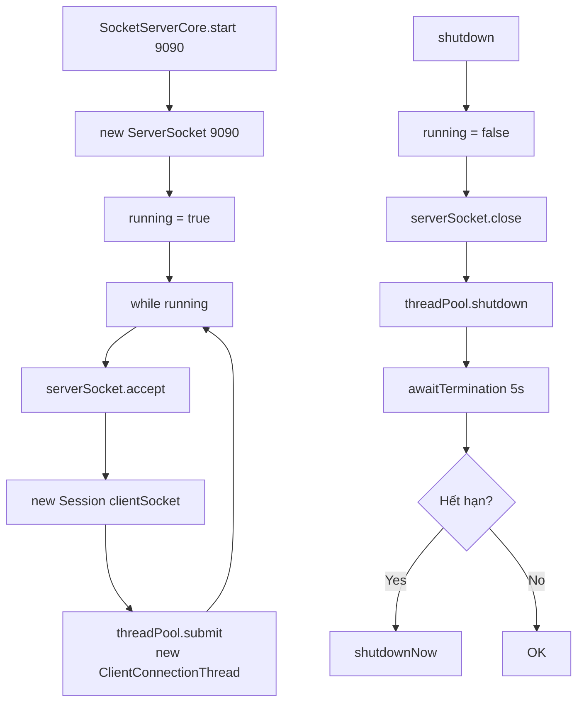
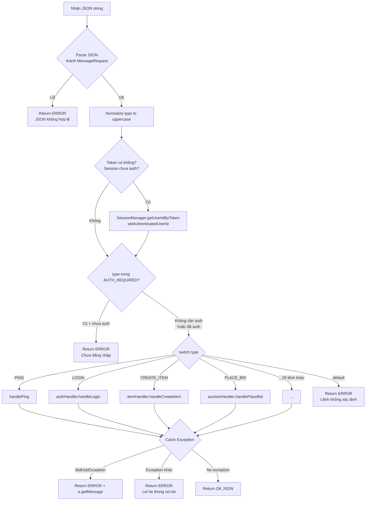
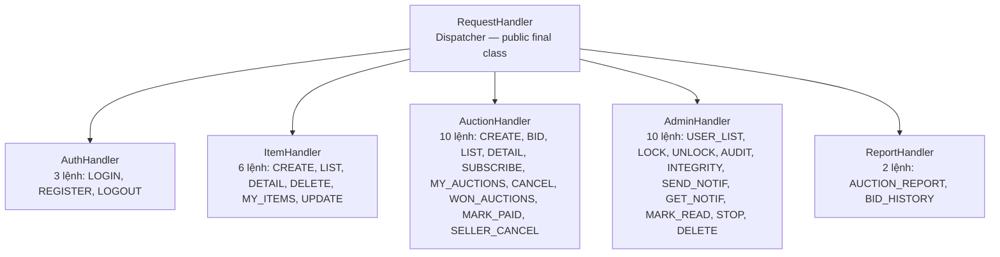
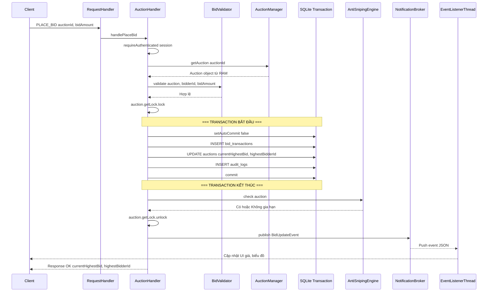

# Part 5: Server — Tầng Network & Request Dispatching

## Lộ trình học Part 5

| Giai đoạn | Chủ đề | Mục tiêu |
|-----------|--------|----------|
| 5.1 | SocketServerCore | Hiểu TCP accept loop + thread pool |
| 5.2 | ClientConnectionThread | Hiểu vòng đời read-handle-send cho mỗi client |
| 5.3 | Session | Hiểu trạng thái kết nối + auth state + thread-safe sendMessage |
| 5.4 | RequestHandler | Hiểu dispatcher chính: parse → auth → switch → delegate |
| 5.5 | SecurityContext | Hiểu requireAuthenticated + requireRole + lazy-load role |
| 5.6 | 5 Sub-Handlers | Hiểu AuthHandler, ItemHandler, AuctionHandler, AdminHandler, ReportHandler |
| 5.7 | PLACE_BID — Luồng đầy đủ | Hiểu flow quan trọng nhất: lock → validate → transaction → antisnipe → notify |
| 5.8 | Cheat Sheet | Tổng hợp nhanh toàn bộ Network layer |

---

## Giai đoạn 5.1: SocketServerCore — TCP Server Chấp Nhận Kết Nối

### 5.1.1 Vai trò trong hệ thống

SocketServerCore là **entry point** của toàn bộ network. Nó mở `ServerSocket` trên port 9090, lặp `accept()` chờ client, rồi giao mỗi client cho 1 thread trong pool.

### 5.1.2 Sơ đồ luồng start + shutdown



**Giải thích sơ đồ**: Vòng lặp chính: `accept()` chờ client → tạo `Session` → submit vào thread pool → tiếp tục chờ. Shutdown: dừng vòng lặp → đóng socket → chờ thread pool 5s → force nếu hết hạn.

### 5.1.3 Code logic chi tiết

```java
// SocketServerCore.java

private static final int DEFAULT_POOL_SIZE = 30;
private final ExecutorService threadPool;
private final RequestHandler handler;
private volatile boolean running = false;
private ServerSocket serverSocket;

public SocketServerCore() {
    int poolSize = ConfigLoader.getIntOrDefault("server.poolSize", DEFAULT_POOL_SIZE);
    this.threadPool = Executors.newFixedThreadPool(poolSize);
    this.handler = new RequestHandler();
}

// START: Blocking — chạy mãi đến khi shutdown
public void start(int port) throws IOException {
    serverSocket = new ServerSocket(port);
    running = true;
    System.out.println("[Server] Đang lắng nghe trên port " + port);

    while (running) {
        try {
            Socket clientSocket = serverSocket.accept(); // Blocking
            Session session = new Session(clientSocket);
            threadPool.submit(new ClientConnectionThread(session, handler));
        } catch (SocketException e) {
            if (!running) break; // Shutdown gây exception — thoát bình thường
            throw e;
        }
    }
}

// SHUTDOWN: Graceful
public void shutdown() {
    running = false;
    try {
        if (serverSocket != null) serverSocket.close();
    } catch (IOException ignored) {}
    threadPool.shutdown();
    try {
        if (!threadPool.awaitTermination(5, TimeUnit.SECONDS)) {
            threadPool.shutdownNow(); // Force sau 5s
        }
    } catch (InterruptedException e) {
        threadPool.shutdownNow();
    }
}
```

**Logic từng phần**:
- `threadPool`: FixedThreadPool 30 thread → tối đa 30 client đồng thời. Thread thừa → client chờ trong queue. Pool size lấy từ `ConfigLoader`, mặc định 30.
- `handler`: 1 instance `RequestHandler` chia sẻ cho TẤT CẢ client → thread-safe vì không có instance state.
- `serverSocket.accept()`: Blocking call → dừng cho đến khi có client kết nối. Mỗi client = 1 `Socket` object.
- `volatile running`: Đọc từ nhiều thread (main + shutdown hook). `volatile` đảm bảo giá trị mới nhất luôn visible.

### 5.1.4 Functional logic — Tại sao FixedThreadPool?

- **CachedThreadPool**: Tạo thread mới khi cần → không giới hạn → 1000 client = 1000 thread → OOM.
- **FixedThreadPool(30)**: Tối đa 30 thread. Client thứ 31 → chờ trong queue → bảo vệ server khỏi overload.
- **30 là đủ?** → Với SQLite (1 writer tại 1 thời điểm), 30 concurrent là nhiều rồi. SQLite bottleneck nằm ở DB, không phải thread.

### 5.1.5 Q&A phòng vệ

- **"Tại sao không dùng NIO (Non-blocking I/O)?"** → NIO phức tạp hơn nhiều. BidHub là đồ án, 30 client đồng thời là đủ. Blocking I/O đơn giản, dễ debug. Production thực tế mới cần NIO (Netty, etc.).
- **"accept() bị block, làm sao shutdown?"** → `serverSocket.close()` → `accept()` ném `SocketException` → bắt exception → kiểm tra `running == false` → thoát vòng lặp.
- **"1 handler cho 30 thread — race condition?"** → `RequestHandler` không có instance state. Mọi state nằm trong `Session` (mỗi client 1 cái) và Singleton services (đã thread-safe).

---

## Giai đoạn 5.2: ClientConnectionThread — Vòng Đời Client

### 5.2.1 Code logic

```java
// ClientConnectionThread.java

public class ClientConnectionThread implements Runnable {
    private final Session session;
    private final RequestHandler handler;

    public ClientConnectionThread(Session session, RequestHandler handler) {
        this.session = session;
        this.handler = handler;
    }

    @Override
    public void run() {
        try (BufferedReader reader = new BufferedReader(
                new InputStreamReader(session.getSocket().getInputStream()))) {
            String line;
            while ((line = reader.readLine()) != null) { // Đọc từng dòng JSON
                String response = handler.handle(line, session); // Xử lý
                session.sendMessage(response); // Trả response
            }
        } catch (IOException e) {
            System.err.println("[CCT] Lỗi I/O: " + e.getMessage());
        } finally {
            // LUÔN dọn dẹp khi client ngắt
            session.disconnect();
            NotificationBroker.unsubscribeAll(session);
        }
    }
}
```

**Logic từng bước**:
1. `reader.readLine()`: Đọc 1 dòng JSON từ socket. Client gửi 1 request = 1 dòng kết thúc bằng `\n`.
2. `handler.handle()`: Xử lý request → trả về JSON response string.
3. `session.sendMessage()`: Ghi response vào socket → gửi về client.
4. `readLine() == null`: Client đóng kết nối → thoát vòng lặp.
5. `finally`: LUÔN chạy — kể cả khi exception. `disconnect()` đóng socket, `unsubscribeAll()` xóa khỏi NotificationBroker.

### 5.2.2 Tại sao finally quan trọng?

- Client có thể ngắt bất ngờ (đóng app, mất mạng). Nếu không cleanup → Session rác trong NotificationBroker → memory leak + gửi event vào socket đã đóng → exception liên tục.

---

## Giai đoạn 5.3: Session — Trạng Thái Kết Nối

### 5.3.1 Code logic

```java
// Session.java

public class Session {
    private final String sessionId;       // UUID — duy nhất
    private final Socket socket;
    private final PrintWriter out;         // autoFlush = true
    private volatile String authenticatedUserId;  // null = chưa login
    private volatile UserRole userRole;           // null = chưa xác định

    public Session(Socket socket) throws IOException {
        this.sessionId = UUID.randomUUID().toString();
        this.socket = socket;
        this.out = new PrintWriter(socket.getOutputStream(), true);
    }

    // THREAD-SAFE: synchronized vì NotificationBroker gọi từ nhiều thread
    public synchronized void sendMessage(String message) {
        if (socket != null && !socket.isClosed()) {
            out.println(message);
        }
    }

    public void setAuthenticatedUserId(String userId) {
        this.authenticatedUserId = userId;
    }

    public void disconnect() {
        try { socket.close(); } catch (IOException ignored) {}
    }
}
```

**Logic quan trọng**:
- `volatile authenticatedUserId`: Đọc từ `RequestHandler` (client thread) + `NotificationBroker` (lifecycle thread) → `volatile` đảm bảo visibility.
- `synchronized sendMessage()`: 
- `PrintWriter(autoFlush=true)`: Mỗi `println()` tự flush → message gửi ngay, không cần gọi `flush()` thủ công.

### 5.3.2 Mô hình 2 kết nối (Dual Socket)

BidHub sử dụng **2 socket connection** cho mỗi client:

| Socket | Hướng | Mục đích |
|--------|-------|----------|
| Socket 1 (Main) | Client ↔ Server | Request/Response — client gửi request, server trả response |
| Socket 2 (Event Push) | Server → Client | Server push event (bid update, notification) — client chỉ nhận |

**Tại sao cần 2 socket?** → Nếu dùng 1 socket, response và event push có thể xen lẫn → client phải phân biệt loại message. Tách 2 socket → mỗi channel chỉ có 1 loại dữ liệu → đơn giản hơn cho client parse.

**Luồng kết nối**:
1. Client mở Socket 1 → server tạo `Session` → submit `ClientConnectionThread` cho Socket 1
2. Client mở Socket 2 → server gán vào cùng `Session` → `NotificationBroker` dùng Socket 2 để push event
3. Khi disconnect → cả 2 socket đều đóng, `NotificationBroker.unsubscribeAll()` dọn dẹp

### 5.3.3 Q&A phòng vệ

- **"Tại sao synchronized sendMessage?"** → Ví dụ: `handlePlaceBid()` trả response + `NotificationBroker.publish()` gửi event. Nếu 2 thread cùng `out.println()` → 2 JSON có thể xen lẫn → client nhận malformed JSON.
- **"Tại sao volatile cho userId?"** → Thread A login → set userId. Thread B (NotificationBroker) check `isAuthenticated()` → cần thấy giá trị mới nhất. Không `volatile` → thread B có thể đọc giá trị cũ (null).

---

## Giai đoạn 5.4: RequestHandler — Dispatcher Chính

### 5.4.1 Vai trò trong hệ thống

`RequestHandler` là **trung tâm điều phối** — nhận JSON string, parse thành `MessageRequest`, kiểm tra auth, switch theo `type`, delegate đến sub-handler phù hợp. Đây là "traffic cop" của server.

**Khai báo class**: `public final class RequestHandler` — `final` vì không cần subclass, đảm bảo dispatcher logic không bị override.

### 5.4.2 Sơ đồ luồng xử lý request



**Giải thích sơ đồ**: 3 giai đoạn: (1) Parse JSON → lỗi thì trả error ngay, (2) Kiểm tra auth → chưa login + lệnh cần auth → error, (3) Switch theo type → delegate → catch exception.

### 5.4.3 Code logic chi tiết

```java
// RequestHandler.java — public final class

private static final Set<String> AUTH_REQUIRED = Set.of(
    "LOGOUT", "CREATE_ITEM", "DELETE_ITEM", "LIST_MY_ITEMS",
    "CREATE_AUCTION", "PLACE_BID",
    "GET_MY_AUCTIONS", "CANCEL_AUCTION",
    "UPDATE_ITEM", "GET_USER_LIST", "LOCK_USER", "UNLOCK_USER",
    "GET_BID_HISTORY_REPORT", "GET_AUDIT_LOG", "RUN_INTEGRITY_CHECK",
    "SEND_NOTIFICATION", "GET_NOTIFICATIONS", "MARK_NOTIFICATION_READ",
    "ADMIN_STOP_AUCTION", "ADMIN_DELETE_AUCTION",
    "GET_WON_AUCTIONS", "MARK_PAID", "SELLER_CANCEL_FINISHED"
);

// 5 delegate handlers — package-private (không có public modifier)
private final AuthHandler authHandler = new AuthHandler(this);
private final ItemHandler itemHandler = new ItemHandler(this);
private final AuctionHandler auctionHandler = new AuctionHandler(this);
private final AdminHandler adminHandler = new AdminHandler(this);
private final ReportHandler reportHandler = new ReportHandler(this);

public String handle(String jsonLine, Session session) {
    MessageRequest request;
    try {
        request = MessageMapper.fromJson(jsonLine, MessageRequest.class);
    } catch (Exception e) {
        return errorJson("JSON không hợp lệ");
    }

    String type = request.getType().toUpperCase();

    // Token resolution: token có trong request + session chưa authenticated
    if (request.getToken() != null && !request.getToken().isBlank()
            && session.getAuthenticatedUserId() == null) {
        Optional<String> userId = SessionManager.getInstance()
            .getUserIdByToken(request.getToken());
        if (userId.isPresent()) {
            session.setAuthenticatedUserId(userId.get());
        }
    }

    // Auth required check
    if (AUTH_REQUIRED.contains(type) && session.getAuthenticatedUserId() == null) {
        return errorJson("Bạn chưa đăng nhập");
    }

    try {
        String result = switch (type) {
            case "PING"              -> handlePing(session);
            case "LOGIN"             -> authHandler.handleLogin(session, request.getPayload());
            case "REGISTER"          -> authHandler.handleRegister(session, request.getPayload());
            case "LOGOUT"            -> authHandler.handleLogout(session);
            case "CREATE_ITEM"       -> itemHandler.handleCreateItem(session, request.getPayload());
            case "GET_ITEM_LIST"     -> itemHandler.handleGetItemList(session);
            case "GET_ITEM_DETAIL"   -> itemHandler.handleGetItemDetail(session, request.getPayload());
            case "DELETE_ITEM"       -> itemHandler.handleDeleteItem(session, request.getPayload());
            case "LIST_MY_ITEMS"     -> itemHandler.handleListMyItems(session);
            case "UPDATE_ITEM"       -> itemHandler.handleUpdateItem(session, request.getPayload());
            case "CREATE_AUCTION"    -> auctionHandler.handleCreateAuction(session, request.getPayload());
            case "PLACE_BID"         -> auctionHandler.handlePlaceBid(session, request.getPayload());
            case "GET_AUCTION_LIST"  -> auctionHandler.handleGetAuctionList(session);
            case "GET_AUCTION_DETAIL"-> auctionHandler.handleGetAuctionDetail(session, request.getPayload());
            case "SUBSCRIBE_AUCTION" -> auctionHandler.handleSubscribeAuction(session, request.getPayload());
            case "GET_MY_AUCTIONS"   -> auctionHandler.handleGetMyAuctions(session);
            case "CANCEL_AUCTION"    -> auctionHandler.handleCancelAuction(session, request.getPayload());
            case "GET_WON_AUCTIONS"   -> auctionHandler.handleGetWonAuctions(session);
            case "MARK_PAID"          -> auctionHandler.handleMarkPaid(session, request.getPayload());
            case "SELLER_CANCEL_FINISHED" -> auctionHandler.handleSellerCancelFinished(session, request.getPayload());
            case "GET_USER_LIST"     -> adminHandler.handleGetUserList(session);
            case "LOCK_USER"         -> adminHandler.handleLockUser(session, request.getPayload());
            case "UNLOCK_USER"       -> adminHandler.handleUnlockUser(session, request.getPayload());
            case "GET_AUDIT_LOG"     -> adminHandler.handleGetAuditLog(session, request.getPayload());
            case "RUN_INTEGRITY_CHECK" -> adminHandler.handleRunIntegrityCheck(session);
            case "SEND_NOTIFICATION" -> adminHandler.handleSendNotification(session, request.getPayload());
            case "GET_NOTIFICATIONS" -> adminHandler.handleGetNotifications(session);
            case "MARK_NOTIFICATION_READ" -> adminHandler.handleMarkNotificationRead(session, request.getPayload());
            case "ADMIN_STOP_AUCTION" -> adminHandler.handleAdminStopAuction(session, request.getPayload());
            case "ADMIN_DELETE_AUCTION" -> adminHandler.handleAdminDeleteAuction(session, request.getPayload());
            case "GET_AUCTION_REPORT" -> reportHandler.handleGetAuctionReport(session);
            case "GET_BID_HISTORY_REPORT" -> reportHandler.handleGetBidHistoryReport(session, request.getPayload());
            case "GET_HOME_STATS"    -> handleGetHomeStats(session);
            default                  -> MessageMapper.toJson(MessageResponse.error(type, "Lệnh không xác định"));
        };
        return result;
    } catch (BidHubException e) {
        return MessageMapper.toJson(MessageResponse.error(type, e.getMessage()));
    } catch (Exception e) {
        logger.severe("Lỗi hệ thống: " + e.getMessage());
        return MessageMapper.toJson(MessageResponse.error(type, "Loi he thong noi bo"));
    }
}
```

**Logic từng giai đoạn**:
1. **Parse JSON**: `MessageMapper.fromJson()` — nếu JSON malformed → return error ngay, không xử lý tiếp.
2. **Token resolution**: Token có trong request + session chưa authenticated → tra `SessionManager.getUserIdByToken()` → set userId vào session. Token chỉ check 1 LẦN cho mỗi session (lần đầu). Sau khi session đã authenticated → bỏ qua token.
3. **AUTH_REQUIRED**: Set chứa 23 lệnh cần auth. Nếu chưa login + lệnh trong set → return error. 10 lệnh public: PING, LOGIN, REGISTER, GET_ITEM_LIST, GET_AUCTION_LIST, GET_AUCTION_DETAIL, GET_AUCTION_REPORT, GET_HOME_STATS, GET_ITEM_DETAIL, SUBSCRIBE_AUCTION. Tổng cộng 33 switch cases.
4. **Switch**: Java 14+ switch expression → mỗi case trả về JSON string. Delegate đến sub-handler tương ứng.
5. **Exception handling**: `BidHubException` = business error (sai password, bid không hợp lệ) → trả message tiếng Việt. `Exception` khác = bug → trả `"Loi he thong noi bo"` + log chi tiết — không lộ stack trace cho client.

### 5.4.4 Package-private handlers

Tất cả 5 sub-handler (AuthHandler, ItemHandler, AuctionHandler, AdminHandler, ReportHandler) đều là **package-private** — không có `public` modifier. Chỉ `RequestHandler` (cùng package) mới có thể truy cập. Đây là **encapsulation** — external code không thể gọi handler trực tiếp, phải thông qua dispatcher.

### 5.4.5 Q&A phòng vệ

- **"Tại sao token chỉ check 1 lần?"** → Sau khi session authenticated, mọi request tiếp theo đã biết userId. Không cần parse token lại → tiết kiệm tra SessionManager.
- **"Tại sao 2 tầng exception?"** → BidHubException = lỗi người dùng → hiển thị message. Exception khác = lỗi code → không lộ chi tiết nội bộ cho client (bảo mật).
- **"Switch 33 case có phải God Class không?"** → ĐÃ refactor thành 5 sub-handlers. RequestHandler chỉ dispatch → mỗi handler tập trung logic nghiệp vụ riêng. Thêm lệnh mới chỉ cần: (1) thêm case vào switch, (2) thêm vào AUTH_REQUIRED nếu cần auth.

Tại sao RequestHandler dùng Dispatcher Pattern? Vì tập trung xử lý auth + logging + error handling ở 1 nơi → DRY (Don't Repeat Yourself). Mỗi handler chỉ quan tâm logic nghiệp vụ riêng. Thêm lệnh mới chỉ cần: (1) thêm case vào switch, (2) thêm vào AUTH_REQUIRED nếu cần auth. Ưu điểm: tách biệt concern, dễ test từng handler riêng, dễ mở rộng.

---

## Giai đoạn 5.5: SecurityContext — Auth Guard

### 5.5.1 Code logic

```java
// SecurityContext.java

public class SecurityContext {

    // Yêu cầu đã login
    public static String requireAuthenticated(Session session) {
        if (session.getAuthenticatedUserId() == null) {
            throw new AuthenticationException("Bạn chưa đăng nhập");
        }
        return session.getAuthenticatedUserId();
    }

    // Yêu cầu role cụ thể
    public static void requireRole(Session session, UserRole requiredRole) {
        requireAuthenticated(session); // Phải login trước

        if (session.getUserRole() == null) {
            // Lazy-load role từ DB (chỉ 1 lần)
            User user = new UserDao().findById(session.getAuthenticatedUserId())
                .orElseThrow(() -> new UserNotFoundException("Không tìm thấy user"));
            session.setUserRole(user.getRole());
        }

        if (session.getUserRole() != requiredRole) {
            throw new AuthenticationException(
                "Yêu cầu quyền " + requiredRole.getDisplayName());
        }
    }
}
```

**Logic**:
- `requireAuthenticated()`: Lấy userId từ session. Null → throw `AuthenticationException`.
- `requireRole()`: Check auth trước, rồi check role. **Lazy-load**: Role chỉ query DB 1 lần rồi cache vào session → request sau không cần query.
- **Tại sao lazy-load?**: Login chỉ set userId, không set role (vì `AuthHandler` trả role trong response payload nhưng không lưu vào session). Lần đầu gọi `requireRole()` → query DB → cache. Lần sau → đọc từ cache → O(1).

---

## Giai đoạn 5.6: 5 Sub-Handlers

### 5.6.1 Sơ đồ phân công



**Phân bổ 33 switch cases**: AuthHandler (3) + ItemHandler (6) + AuctionHandler (10) + AdminHandler (10) + ReportHandler (2) + trực tiếp (2: PING, GET_HOME_STATS) = 33. Tất cả handler đều package-private.

### 5.6.2 AuthHandler — 3 lệnh Authentication

| Lệnh | Logic chính | Return OK |
|------|------------|-----------|
| LOGIN | Validate username/password → check locked → createSession → setAuth | token, userId, username, role |
| REGISTER | Validate username unique → reject ADMIN role → create Bidder/Seller → hash password | userId, username, role |
| LOGOUT | invalidateSession → clear session userId | Logout thành công |

**Code logic LOGIN** (quan trọng nhất):
```java
public String handleLogin(Session session, JsonNode payload) {
    String username = payload.get("username").asText();
    String password = payload.get("password").asText();

    // 1. Tìm user
    User user = userDao.findByUsername(username)
        .orElseThrow(() -> new AuthenticationException(
            "Tên đăng nhập hoặc mật khẩu không đúng")); // Không tiết lộ user nào sai

    // 2. Verify password (constant-time)
    if (!AuthService.verifyPassword(password, user.getPasswordHash())) {
        throw new AuthenticationException(
            "Tên đăng nhập hoặc mật khẩu không đúng"); // Cùng message
    }

    // 3. Check locked
    if (user.isLocked()) {
        auditLogService.log(user.getId(), AuditActions.USER_LOGIN, "{\"blocked\":true}");
        throw new AuthenticationException("TÀI KHOẢN BỊ KHÓA");
    }

    // 4. Tạo session
    String token = SessionManager.getInstance().createSession(user.getId());
    session.setAuthenticatedUserId(user.getId());
    session.setUserRole(user.getRole());

    // 5. Audit log
    auditLogService.log(user.getId(), AuditActions.USER_LOGIN, "{}");

    // 6. Trả response
    Map<String, Object> data = Map.of(
        "token", token, "userId", user.getId(),
        "username", user.getUsername(), "role", user.getRole().name()
    );
    return MessageMapper.toJson(MessageResponse.ok("LOGIN", data));
}
```

**Logic bảo mật**:
- Sai username và sai password trả **cùng message** → hacker không biết user nào tồn tại.
- Check locked SAU khi verify password → không tiết lộ trạng thái account cho người chưa biết password.
- Token tạo SAU khi mọi kiểm tra pass → nếu fail giữa chừng → không tạo token rác.

### 5.6.3 ItemHandler — 6 lệnh Item CRUD

| Lệnh | Auth | Logic chính |
|------|------|------------|
| CREATE_ITEM | SELLER | Factory Method tạo Item subclass (ItemCreator.forType) → setImageUrl → save |
| GET_ITEM_LIST | Public | findAll + enrichItems (thêm auctionStatus + sellerName) |
| GET_ITEM_DETAIL | Public | findById → trả chi tiết + extra_data |
| DELETE_ITEM | Auth + Owner | Check ownership → deleteById |
| LIST_MY_ITEMS | SELLER | findBySellerId(userId) + enrichItems() |
| UPDATE_ITEM | Auth + Owner | Check ownership → update name/desc/price/imageUrl |

**enrichItems() logic** — Thêm metadata cho item list:
```java
private List<Map<String, Object>> enrichItems(List<Item> items) {
    // Build caches
    Map<String, AuctionStatus> itemAuctionStatus = auctionDao.getItemAuctionStatusMap();
    Map<String, String> sellerNames = userDao.findAll().stream()
        .collect(Collectors.toMap(User::getId, User::getUsername));

    List<Map<String, Object>> result = new ArrayList<>();
    for (Item item : items) {
        Map<String, Object> row = new LinkedHashMap<>();
        row.put("id", item.getId());
        row.put("name", item.getName());
        // ...
        AuctionStatus status = itemAuctionStatus.get(item.getId());
        String displayStatus;
        if (status == null) {
            displayStatus = "AVAILABLE";
        } else if (status == AuctionStatus.OPEN || status == AuctionStatus.RUNNING) {
            displayStatus = "AUCTIONING";
        } else if (status == AuctionStatus.PAID) {
            displayStatus = "SOLD";
        } else {
            displayStatus = "AVAILABLE"; // FINISHED, CANCELED
        }
        row.put("auctionStatus", displayStatus);
        row.put("sellerName", sellerNames.getOrDefault(item.getSellerId(), "N/A"));
        result.add(row);
    }
    return result;
}
```

**Logic**: Map auctionStatus thành display text: null → "AVAILABLE", OPEN/RUNNING → "AUCTIONING", PAID → "SOLD", FINISHED/CANCELED → "AVAILABLE". Batch fetch thay vì N+1.

### 5.6.4 AuctionHandler — 10 lệnh Auction

| Lệnh | Auth | Logic chính |
|------|------|------------|
| CREATE_AUCTION | SELLER | Check item ownership → validate thời gian → save DB + addAuction RAM |
| PLACE_BID | Any auth | **Critical path**: lock → validate → transaction → antisnipe → notify |
| GET_AUCTION_LIST | Public | findAll active + item details |
| GET_AUCTION_DETAIL | Public | findById + bid history + bidder names |
| SUBSCRIBE_AUCTION | Public | NotificationBroker.subscribe |
| GET_MY_AUCTIONS | Any auth | Auctions where sellerId = userId |
| CANCEL_AUCTION | Auth + Owner | Chỉ hủy được trạng thái OPEN, verify ownership → deletes from DB |
| GET_WON_AUCTIONS | Any auth | Auctions where highestBidderId = userId + status PAID |
| MARK_PAID | Any auth | Seller đánh dấu auction đã thanh toán → status PAID |
| SELLER_CANCEL_FINISHED | Auth + Owner | Seller hủy auction đã kết thúc, verify ownership |

**Chi tiết handleCreateAuction**: Yêu cầu role SELLER, validate item thuộc sở hữu seller (owner check), tạo object `Auction`, lưu cả DB lẫn RAM (`AuctionManager.addAuction()`) → đảm bảo RAM cache luôn đồng bộ.

**Chi tiết handleCancelAuction**: Yêu cầu auth, verify ownership (chỉ owner mới hủy được), chỉ auction ở trạng thái **OPEN** mới có thể hủy. Khi hủy → xóa auction khỏi DB (không chỉ đổi status).

### 5.6.5 AdminHandler — 10 lệnh Admin

| Lệnh | Logic chính |
|------|------------|
| GET_USER_LIST | listAllUsers → trả danh sách + lock status |
| LOCK_USER / UNLOCK_USER | AdminUserService.lock/unlock → không khóa Admin |
| GET_AUDIT_LOG | findAll with limit (default 50, max 500) |
| RUN_INTEGRITY_CHECK | DataIntegrityService.runFullCheck() |
| SEND_NOTIFICATION | Tạo audit log với action BROADCAST_NOTIFICATION |
| GET_NOTIFICATIONS | Đọc BROADCAST_NOTIFICATION logs → check read status |
| MARK_NOTIFICATION_READ | Lưu vào ConcurrentHashMap userId to Set notifId |
| ADMIN_STOP_AUCTION | Set CANCELED + removeAuction |
| ADMIN_DELETE_AUCTION | Delete from DB + removeAuction |

### 5.6.6 ReportHandler — 2 lệnh Báo cáo

| Lệnh | Auth | Logic |
|------|------|-------|
| GET_AUCTION_REPORT | Public | ReportService.exportAuctionReport() |
| GET_BID_HISTORY_REPORT | Any auth | ReportService.exportBidHistory(auctionId) — hỗ trợ "ALL" |

---

## Giai đoạn 5.7: PLACE_BID — Luồng Đầy Đủ (Quan Trọng Nhất)

### 5.7.1 Sequence diagram



**Giải thích sơ đồ**: Đây là flow phức tạp nhất trong BidHub. 7 bước: (1) Auth, (2) RAM lookup, (3) Validate 5 điều kiện, (4) Lock auction, (5) DB transaction 3 SQL, (6) Anti-sniping check, (7) Unlock + Notify.

### 5.7.2 Code logic chi tiết

```java
// AuctionHandler.handlePlaceBid() — lược bỏ try-catch cho dễ đọc

public String handlePlaceBid(Session session, JsonNode payload) {
    String userId = SecurityContext.requireAuthenticated(session);
    String auctionId = payload.get("auctionId").asText();
    double bidAmount = payload.get("bidAmount").asDouble();

    // 1. Lấy auction từ RAM cache
    Auction auction = AuctionManager.getInstance().getAuction(auctionId)
        .orElseThrow(() -> new AuctionNotFoundException("Phiên đấu giá không tồn tại"));

    // 2. Lock auction — chỉ block các bid cùng auction, auction khác không ảnh hưởng
    auction.getLock().lock();
    try {
        // 3. Validate 5 điều kiện
        BidValidator.validate(auction, userId, bidAmount);

        // 4. Bắt đầu DB transaction (manual JDBC)
        Connection txConn = DbConnectionProvider.getInstance().getConnection();
        try {
            txConn.setAutoCommit(false);

            // 4a. Lưu bid
            BidTransaction bid = new BidTransaction(auctionId, userId, bidAmount, LocalDateTime.now());
            new BidDao(txConn).save(bid);

            // 4b. Cập nhật auction trong RAM + DB
            auction.updateHighestBid(bidAmount, userId);
            new AuctionDao(txConn).updateHighestBid(auctionId, bidAmount, userId);

            // 4c. Audit log TRONG transaction
            new AuditLogDao(txConn).save(new AuditLog(userId, AuditActions.PLACE_BID,
                "Bid " + bidAmount + " on auction " + auctionId));

            txConn.commit(); // === COMMIT ===
        } catch (Exception e) {
            txConn.rollback(); // === ROLLBACK nếu lỗi ===
            throw e;
        } finally {
            txConn.setAutoCommit(true);
            DbConnectionProvider.closeConnection(txConn);
        }

        // 5. Anti-sniping check (SAU commit, TRONG lock)
        AntiSnipingEngine.check(auction);

    } finally {
        // 6. LUÔN unlock — kể cả khi exception
        auction.getLock().unlock();
    }

    // 7. Publish event (NGOÀI lock — tránh block socket I/O)
    String bidderName = new UserDao().findById(userId).map(User::getUsername).orElse("Ẩn danh");
    NotificationBroker.getInstance().publish(auctionId,
        new BidUpdateEvent(auctionId, userId, bidderName, bidAmount, LocalDateTime.now()));

    // 8. Trả response
    return MessageMapper.toJson(MessageResponse.ok("PLACE_BID", Map.of(
        "auctionId", auctionId,
        "currentHighestBid", bidAmount,
        "highestBidderId", userId
    )));
}
```

**Logic từng bước**:
1. **Auth**: `requireAuthenticated()` — phải login mới bid, bất kỳ role nào.
2. **RAM lookup**: `getAuction()` từ ConcurrentHashMap → O(1), không query DB.
3. **Lock**: `ReentrantLock` per auction → bid auction A không block bid auction B.
4. **Transaction**: `setAutoCommit(false)` — manual JDBC transaction. 3 SQL (INSERT bid + UPDATE auction + INSERT audit) chạy atomic. Nếu 1 cái lỗi → rollback tất cả.
5. **Anti-sniping**: Check SAU commit, TRONG lock → đảm bảo bid đã persist trước khi gia hạn.
6. **Unlock**: `finally` block đảm bảo LUÔN unlock → tránh deadlock.
7. **Notify**: NGOÀI lock → gửi event không block bid tiếp theo. Nếu notification chậm → không ảnh hưởng performance.
8. **Response**: Trả bidAmount mới + winnerId.

### 5.7.3 Tại sao ReentrantLock thay vì synchronized?

- **synchronized(auction)**: Khóa toàn bộ object — bao gồm cả read-only operations.
- **ReentrantLock**: Fine-grained — chỉ lock critical section (bid + close). Read operations không cần lock.
- **Reentrant**: Cùng 1 thread có thể lock lại (ví dụ: bid → anti-sniping gia hạn → close). `synchronized` cũng reentrant nhưng kém linh hoạt hơn.
- **tryLock()**: Có thể thử lock với timeout → tránh deadlock vĩnh viễn (tuy BidHub chưa dùng).

### 5.7.4 Tại sao notify NGOÀI lock?

- `NotificationBroker.publish()` lặp qua tất cả session → gọi `session.sendMessage()` → I/O chậm.
- Nếu publish TRONG lock → bid tiếp theo phải đợi publish xong → latency cao.
- Publish NGOÀI lock → bid tiếp vào ngay → latency thấp. Trade-off: subscriber nhận event hơi trễ (microseconds), nhưng không đáng kể.

---

## Giai đoạn 5.8: Cheat Sheet — Tầng Network

### Tổng quan nhanh

| Component | Pattern | Thread-safe | Mục đích |
|-----------|---------|-------------|----------|
| SocketServerCore | TCP Server | volatile running | Accept loop + FixedThreadPool(30) |
| ClientConnectionThread | Worker | finally cleanup | Read → handle → send |
| Session | State holder | volatile + synchronized | Dual socket + auth state |
| RequestHandler | Dispatcher | Stateless (public final) | Parse → auth → switch → delegate |
| SecurityContext | Guard | Stateless | requireAuth + requireRole |
| AuthHandler | Sub-handler (package-private) | Stateless | 3 lệnh: LOGIN, REGISTER, LOGOUT |
| ItemHandler | Sub-handler (package-private) | Stateless | 6 lệnh CRUD item |
| AuctionHandler | Sub-handler (package-private) | Stateless | 10 lệnh auction |
| AdminHandler | Sub-handler (package-private) | Stateless | 10 lệnh admin |
| ReportHandler | Sub-handler (package-private) | Stateless | 2 lệnh report |

### Thứ tự xử lý 1 request

1. `SocketServerCore.accept()` → tạo Session
2. `ClientConnectionThread.run()` → đọc JSON
3. `RequestHandler.handle()` → parse + auth + switch
4. Sub-handler → validate + business logic + DB
5. Exception → BidHubException (business) hoặc generic (internal: "Loi he thong noi bo")
6. `Session.sendMessage()` → trả JSON về client
7. `finally` → cleanup nếu client ngắt

### Auth flow tóm tắt

| Bước | Kiểm tra | Nếu fail |
|------|----------|----------|
| 1 | Parse JSON | ERROR: JSON không hợp lệ |
| 2 | Token → SessionManager.getUserIdByToken | Bỏ qua nếu không có token |
| 3 | AUTH_REQUIRED.contains(type) — 23 lệnh | ERROR: Chưa đăng nhập |
| 4 | SecurityContext.requireRole() | ERROR: Yêu cầu quyền X |
| 5 | Handler-specific validate | ERROR: message tiếng Việt |

### API phân loại theo auth

| Loại | Lệnh | Số lượng |
|------|------|----------|
| Public (không cần auth) | PING, LOGIN, REGISTER, GET_ITEM_LIST, GET_AUCTION_LIST, GET_AUCTION_DETAIL, GET_AUCTION_REPORT, GET_HOME_STATS, GET_ITEM_DETAIL, SUBSCRIBE_AUCTION | 10 |
| Cần auth (bất kỳ role) | LOGOUT, PLACE_BID, GET_MY_AUCTIONS, CANCEL_AUCTION, UPDATE_ITEM, DELETE_ITEM, GET_BID_HISTORY_REPORT, GET_NOTIFICATIONS, MARK_NOTIFICATION_READ, GET_WON_AUCTIONS, MARK_PAID, SELLER_CANCEL_FINISHED | 12 |
| Cần role SELLER | CREATE_ITEM, LIST_MY_ITEMS, CREATE_AUCTION | 3 |
| Cần role ADMIN | GET_USER_LIST, LOCK_USER, UNLOCK_USER, GET_AUDIT_LOG, RUN_INTEGRITY_CHECK, SEND_NOTIFICATION, ADMIN_STOP_AUCTION, ADMIN_DELETE_AUCTION | 8 |
| **Tổng** | | **33** |

### PLACE_BID tóm tắt

1. Auth → RAM lookup → Lock
2. BidValidator (5 điều kiện)
3. Transaction: INSERT bid + UPDATE auction + INSERT audit → commit
4. AntiSnipingEngine.check()
5. Unlock
6. NotificationBroker.publish() — NGOÀI lock
7. Return OK
