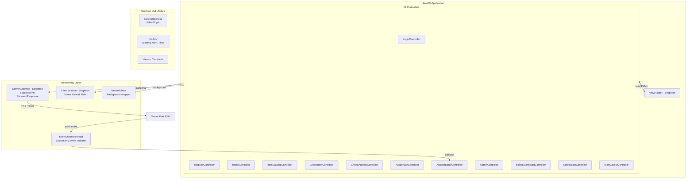
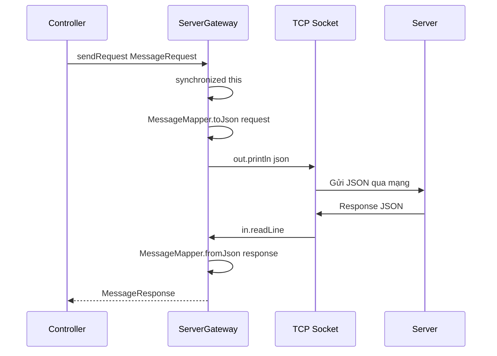
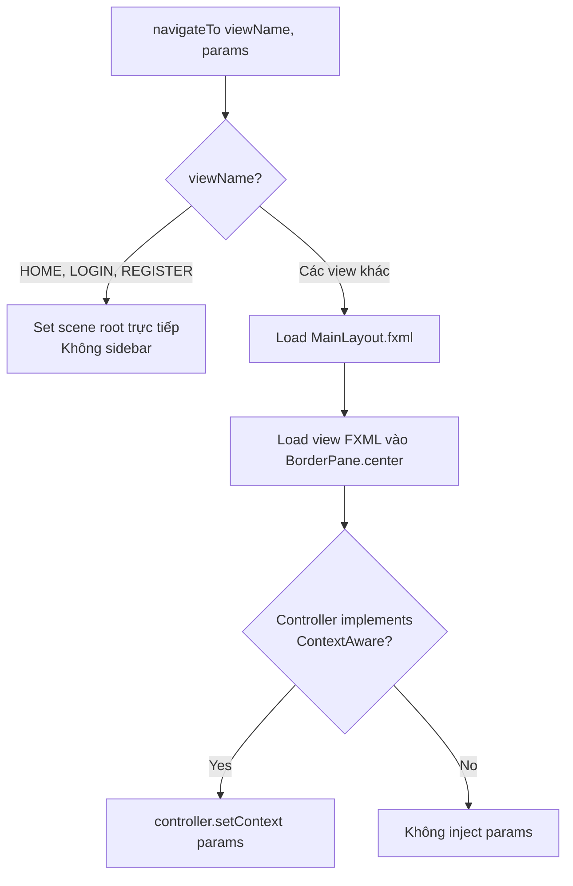
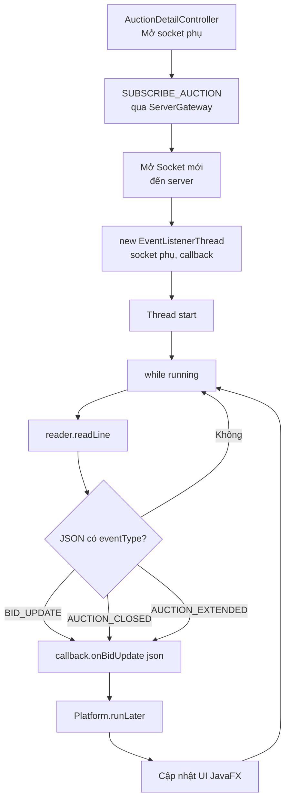
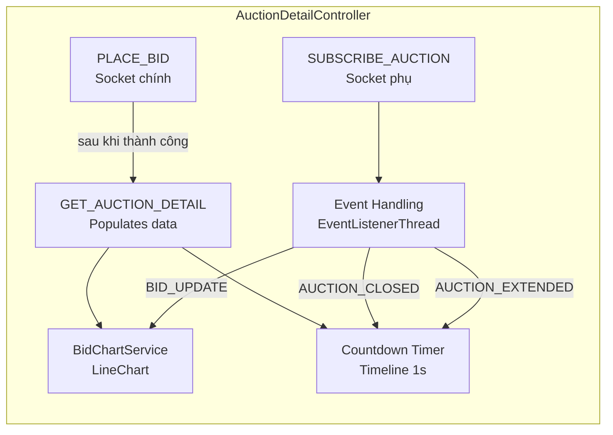

# Part 6: Client — JavaFX UI, Networking & Controllers

## Lộ trình học Part 6

| Giai đoạn | Chủ đề | Mục tiêu |
|-----------|--------|----------|
| 6.1 | Kiến trúc tổng quan | Hiểu 3 tầng Client + 2-socket design |
| 6.2 | BidHubApp + Launcher | Hiểu bootstrap JavaFX + UI Guard |
| 6.3 | ServerGateway | Hiểu Singleton TCP gateway + synchronized sendRequest |
| 6.4 | ClientSession | Hiểu local state: token, userId, role |
| 6.5 | ViewRouter + ContextAware | Hiểu navigation + parameter injection |
| 6.6 | NetworkTask | Hiểu JavaFX Task wrapper cho background I/O |
| 6.7 | EventListenerThread | Hiểu socket phụ nhận realtime event |
| 6.8 | BidChartService | Hiểu biểu đồ giá LineChart realtime |
| 6.9 | UiUtils + Views | Hiểu helper methods + constants |
| 6.10 | 12 Controllers | Hiểu logic từng controller |
| 6.11 | Controllers chi tiết | Hiểu AuctionDetail (3 luồng) + SellerDashboard (2 tab) + Notification |
| 6.12 | Cheat Sheet | Tổng hợp nhanh toàn bộ Client |

---

## Giai đoạn 6.1: Kiến Trúc Tổng Quan Client

### 6.1.1 Sơ đồ 3 tầng



**Giải thích sơ đồ**: 3 tầng rõ ràng — Controllers (UI logic), Networking (TCP communication), Services (utilities). **2-socket design**: Socket chính cho request/response, Socket phụ cho realtime events.

### 6.1.2 2-Socket Design — Tại sao cần 2 socket?

- **Socket chính** (ServerGateway): Gửi request → nhận response. Synchronous — `sendRequest()` block đến khi có response.
- **Socket phụ** (EventListenerThread): Chỉ nhận event từ server. Asynchronous — chạy nền, không block UI.

**Tại sao không dùng 1 socket?** → Nếu đang `readLine()` chờ response → server push event → event xen vào → parse lỗi. 2 socket = 2 luồng riêng biệt → không conflict.

**Tại sao chọn 2-Socket Design thay vì 1 socket + multiplexing?** Vì TCP socket là stream — nếu response và event cùng đi trên 1 socket → phải phân biệt bằng parser (check eventType), dễ bị race condition khi readLine() chờ response nhưng nhận event. 2 socket = 2 luồng riêng biệt → không conflict, code đơn giản hơn. Ưu điểm: tách biệt concern (request/response vs event), dễ debug, không cần phức tạp protocol framing. Nhược điểm: mở 2 kết nối TCP — nhưng với localhost, overhead không đáng kể.

---

## Giai đoạn 6.2: BidHubApp + Launcher — Bootstrap JavaFX

### 6.2.1 Code logic

```java
// Launcher.java — 8 lines
public class Launcher {
    public static void main(String[] args) {
        BidHubApp.main(args); // Gọi thẳng JavaFX app
    }
}
```

**Tại sao cần Launcher?** → JavaFX module system yêu cầu main class không extend `Application`. Launcher là entry point "trống" → gọi `BidHubApp.main()`.

```java
// BidHubApp.java — 84 lines

public class BidHubApp extends Application {
    @Override
    public void start(Stage primaryStage) throws IOException {
        // 1. Khởi tạo ViewRouter
        ViewRouter.getInstance().initialize(primaryStage);
        
        // 2. Load HomeView.fxml
        Parent root = FXMLLoader.load(getClass().getResource("/fxml/HomeView.fxml"));
        
        // 3. UI GUARD — Khóa toàn bộ giao diện
        root.setDisable(true); // Chặn click khi chưa kết nối server
        
        // 4. Hiển thị scene
        Scene scene = new Scene(root, 1024, 720);
        primaryStage.setScene(scene);
        primaryStage.show();
        
        // 5. Kết nối server (background thread)
        connectToServer(root);
    }
    
    private void connectToServer(Parent root) {
        NetworkTask<Void> connectTask = new NetworkTask<>(() -> {
            ServerGateway.getInstance().connect(
                ServerGateway.getInstance().getServerHost(),
                ServerGateway.getInstance().getServerPort());
            return null;
        });
        
        connectTask.setOnSucceeded(e -> {
            root.setDisable(false); // GỠ UI GUARD — cho phép thao tác
        });
        
        connectTask.setOnFailed(e -> {
            Alert alert = new Alert(Alert.AlertType.ERROR,
                "Không kết nối được Server...");
            alert.showAndWait();
            Platform.exit(); // Thoát app
        });
        
        new Thread(connectTask).start(); // Chạy trên background thread
    }
}
```

**Logic UI Guard**: `root.setDisable(true)` → toàn bộ UI bị mờ + không click được. Sau khi kết nối thành công → `setDisable(false)` → UI hoạt động bình thường. Ngăn user thao tác khi chưa có kết nối.

---

## Giai đoạn 6.3: ServerGateway — Singleton TCP Gateway

### 6.3.1 Sơ đồ sendRequest



**Giải thích sơ đồ**: `sendRequest()` là `synchronized` — chỉ 1 controller gửi request tại 1 thời điểm. Nếu không đồng bộ → 2 controller cùng gửi → response bị lẫn.

### 6.3.2 Code logic chi tiết

```java
// ServerGateway.java — 148 lines

public final class ServerGateway {
    private static volatile ServerGateway instance;
    private Socket socket;
    private PrintWriter writer;
    private BufferedReader reader;
    private String serverHost;
    private int serverPort;

    private ServerGateway() { loadConfig(); }

    // Singleton — Double-checked locking
    public static ServerGateway getInstance() {
        if (instance == null) {
            synchronized (ServerGateway.class) {
                if (instance == null) instance = new ServerGateway();
            }
        }
        return instance;
    }

    // Đọc config từ client.properties
    private void loadConfig() {
        // Đọc server.host (default: localhost) + server.port (default: 9090)
    }

    // KẾT NỐI — Mở socket + streams
    public void connect(String host, int port) throws IOException {
        if (isConnected()) disconnect(); // Đóng kết nối cũ
        socket = new Socket(host, port);
        writer = new PrintWriter(socket.getOutputStream(), true); // autoFlush
        reader = new BufferedReader(new InputStreamReader(socket.getInputStream()));
    }

    // GỬI REQUEST — synchronized chống interleaving
    public synchronized MessageResponse sendRequest(MessageRequest request) throws IOException {
        if (!isConnected()) throw new IOException("Chưa kết nối server");
        writer.println(MessageMapper.toJson(request));   // Gửi
        String responseLine = reader.readLine();          // Nhận
        if (responseLine == null) throw new IOException("Server đóng kết nối");
        return MessageMapper.fromJson(responseLine, MessageResponse.class);
    }

    // NGẮT KẾT NỐI
    public void disconnect() {
        if (socket != null && !socket.isClosed()) {
            try { socket.close(); } catch (IOException ignored) {}
        }
        socket = null; writer = null; reader = null;
    }

    public boolean isConnected() {
        return socket != null && socket.isConnected() && !socket.isClosed();
    }
}
```

**Logic**:
- `loadConfig()`: Đọc `client.properties` từ classpath. Nếu không có → dùng default (localhost:9090).
- `connect()`: Tạo `Socket` + `PrintWriter` (gửi) + `BufferedReader` (nhận). `autoFlush=true` → mỗi `println()` tự gửi.
- `sendRequest()`: `synchronized` → serialize tất cả request. Chỉ 1 request đang xử lý tại 1 thời điểm.
- `disconnect()`: Đóng socket → null tất cả references.

### 6.3.3 Q&A phòng vệ

- **"Tại sao synchronized?"** → Nếu 2 controller cùng gọi `sendRequest()` → 2 JSON gửi xen lẫn → server đọc được 1 dòng lẫn → parse lỗi. `synchronized` = queue tuần tự.
- **"sendRequest block FX thread?"** → CÓ. Đó là lý do phải dùng `NetworkTask` (xem 6.6).
- **"readLine() block mãi?"** → Có, đến khi server trả response hoặc đóng socket. Nếu server treo → client treo. Production cần timeout.

---

## Giai đoạn 6.4: ClientSession — Trạng Thái Đăng Nhập

### 6.4.1 Code logic

```java
// ClientSession.java — 76 lines

public final class ClientSession {
    private static volatile ClientSession instance;
    private String token;
    private String currentUserId;
    private String currentUsername;
    private String currentRole; // BIDDER | SELLER | ADMIN

    // Singleton — DCL
    public static ClientSession getInstance() { /* ... */ }

    // LOGIN — Lưu toàn bộ trạng thái
    public void login(String token, String userId, String username, String role) {
        this.token = token;
        this.currentUserId = userId;
        this.currentUsername = username;
        this.currentRole = role;
    }

    // LOGOUT — Xóa toàn bộ
    public void logout() {
        this.token = null;
        this.currentUserId = null;
        this.currentUsername = null;
        this.currentRole = null;
    }

    public boolean isLoggedIn() { return token != null; }
    public String getToken() { return token; }
    public String getCurrentRole() { return currentRole; }
    // ...
}
```

**Logic**: Đơn giản nhất trong hệ thống — chỉ là data holder. `login()` lưu 4 giá trị, `logout()` xóa tất cả. Controller đọc `isLoggedIn()`, `getCurrentRole()` để quyết định hiển thị.

### 6.4.2 Tương tác với Server-side Session

- **Client** `ClientSession`: Lưu token + role + username → HIỂN THỊ UI (tên user, nút admin, v.v.)
- **Server** `Session`: Lưu authenticatedUserId + userRole → XÁC THỰC request
- **Server** `SessionManager`: Lưu token↔userId map → TRA CỨU token
- **Flow**: Client login → server trả token → ClientSession.login() → mọi request sau gửi kèm token

---

## Giai đoạn 6.5: ViewRouter + ContextAware — Điều Hướng Màn Hình

### 6.5.1 Sơ đồ logic navigateTo



**Giải thích sơ đồ**: Có 2 loại view — Auth view (Home/Login/Register) hiển thị toàn màn hình, Main view hiển thị trong MainLayout (có sidebar).

### 6.5.2 Code logic chi tiết

```java
// ViewRouter.java — 113 lines

public void navigateTo(String viewName, Map<String, Object> params) {
    boolean isAuthView = viewName.equals(Views.LOGIN) 
        || viewName.equals(Views.REGISTER) 
        || viewName.equals(Views.HOME);

    String fxmlPath = "/fxml/" + viewName + ".fxml";
    FXMLLoader loader = new FXMLLoader(getClass().getResource(fxmlPath));
    Parent root = loader.load();

    // Inject params nếu controller implement ContextAware
    Object controller = loader.getController();
    if (controller instanceof ContextAware ca && !params.isEmpty()) {
        ca.setContext(params);
    }

    if (isAuthView) {
        // Auth view → thay toàn bộ scene root
        primaryStage.getScene().setRoot(root);
        mainLayout = null;
    } else {
        // Main view → load vào BorderPane.center (có sidebar)
        if (mainLayout == null) {
            mainLayout = FXMLLoader.load(getClass().getResource("/fxml/MainLayout.fxml"));
            primaryStage.getScene().setRoot(mainLayout);
        }
        mainLayout.setCenter(root);
    }
}

// ContextAware.java — 17 lines
public interface ContextAware {
    void setContext(Map<String, Object> params);
}
```

**Logic**:
- **isAuthView**: Login/Register/Home = toàn màn hình, không sidebar. Các view khác = nằm trong MainLayout.
- **ContextAware**: Controller cần tham số (ví dụ: `AuctionDetailController` cần `auctionId`) → implement `ContextAware` → `setContext(params)` được gọi tự động.
- **MainLayout**: `BorderPane` — sidebar bên trái, content ở center. Chỉ load 1 lần, sau đó thay center.

### 6.5.3 Ví dụ thực tế

```java
// Điều hướng sang chi tiết auction — truyền auctionId
ViewRouter.getInstance().navigateTo(Views.AUCTION_DETAIL,
    Map.of("auctionId", selectedAuctionId));

// AuctionDetailController implement ContextAware
public class AuctionDetailController implements ContextAware {
    private String auctionId;
    
    @Override
    public void setContext(Map<String, Object> params) {
        this.auctionId = (String) params.get("auctionId");
        loadAuctionDetail(); // Dùng auctionId để gọi API
    }
}
```

---

## Giai đoạn 6.6: NetworkTask — Background I/O Wrapper

### 6.6.1 Code logic

```java
// NetworkTask.java — 38 lines

public final class NetworkTask<T> extends Task<T> {
    private final Callable<T> callable;

    public NetworkTask(Callable<T> callable) {
        this.callable = callable;
    }

    @Override
    protected T call() throws Exception {
        return callable.call(); // Chạy trên background thread
    }
}
```

### 6.6.2 Tại sao cần NetworkTask?

- **Vấn đề**: `ServerGateway.sendRequest()` là blocking I/O. Gọi trên FX thread → UI đóng băng.
- **Giải pháp**: `NetworkTask<T>` extends `javafx.concurrent.Task` → chạy trên background thread.
- **Quan trọng**: `setOnSucceeded()` và `setOnFailed()` tự động chạy trên FX thread → cập nhật UI an toàn.

### 6.6.3 Cách sử dụng — Pattern chuẩn

```java
// Pattern: Gửi request trên background + cập nhật UI trên FX thread
NetworkTask<MessageResponse> task = new NetworkTask<>(() -> 
    ServerGateway.getInstance().sendRequest(
        new MessageRequest("PLACE_BID", ClientSession.getInstance().getToken(), payload)
    )
);

task.setOnSucceeded(e -> {
    MessageResponse resp = task.getValue();
    if (resp.isOk()) {
        UiUtils.showInfo("Thành công", "Đặt giá thành công!");
        updateBidDisplay(resp);
    } else {
        UiUtils.showError("Lỗi", resp.getMessage());
    }
});

task.setOnFailed(e -> {
    UiUtils.showError("Lỗi kết nối", "Không thể kết nối server");
});

new Thread(task).start(); // Khởi chạy background thread
```

---

## Giai đoạn 6.7: EventListenerThread — Socket Phụ Nhận Realtime Event

### 6.7.1 Sơ đồ luồng



**Giải thích sơ đồ**: Khi user vào trang AuctionDetail → mở socket phụ → subscribe → EventListenerThread chạy nền → nhận event → callback → `Platform.runLater()` → cập nhật UI.

### 6.7.2 Code logic chi tiết

```java
// EventListenerThread.java — 78 lines

public class EventListenerThread implements Runnable {
    private final BufferedReader reader;
    private final BidUpdateCallback callback;
    private final ObjectMapper mapper;
    private volatile boolean stopRequested;

    @Override
    public void run() {
        while (!stopRequested) {
            String line = reader.readLine();
            if (line == null) break; // Server đóng kết nối
            
            JsonNode json = mapper.readTree(line);
            String eventType = json.path("eventType").asText("");
            if (!eventType.isEmpty()) {
                callback.onBidUpdate(line); // Gọi callback
            }
        }
    }

    public void stop() { this.stopRequested = true; }
}
```

```java
// BidUpdateCallback.java — 23 lines
@FunctionalInterface
public interface BidUpdateCallback {
    void onBidUpdate(String eventJson);
}
```

**Logic**:
- `readLine()`: Block đến khi có event → không tốn CPU khi chờ.
- `eventType`: Kiểm tra JSON có field `eventType` không → có = event (BID_UPDATE, AUCTION_CLOSED, AUCTION_EXTENDED), không = response bình thường (bỏ qua).
- `callback.onBidUpdate()`: Chạy trên background thread → PHẢI dùng `Platform.runLater()` trong callback để cập nhật UI.
- `volatile stopRequested`: Dừng thread an toàn. `volatile` đảm bảo giá trị mới nhất visible.

### 6.7.3 Cách AuctionDetailController sử dụng

```java
// Trong AuctionDetailController
private void subscribeToAuction(String auctionId) {
    // 1. Mở socket phụ
    Socket eventSocket = new Socket(host, port);
    BufferedReader reader = new BufferedReader(
        new InputStreamReader(eventSocket.getInputStream()));
    PrintWriter writer = new PrintWriter(eventSocket.getOutputStream(), true);
    
    // 2. Gửi SUBSCRIBE_AUCTION qua socket phụ
    writer.println(MessageMapper.toJson(
        new MessageRequest("SUBSCRIBE_AUCTION", token, payload)));
    
    // 3. Khởi động EventListenerThread
    eventListener = new EventListenerThread(reader, eventJson -> {
        Platform.runLater(() -> { // QUAN TRỌNG: UI update trên FX thread
            JsonNode node = mapper.readTree(eventJson);
            String eventType = node.path("eventType").asText();
            switch (eventType) {
                case "BID_UPDATE" -> updateBidDisplay(node);
                case "AUCTION_CLOSED" -> showAuctionClosed(node);
                case "AUCTION_EXTENDED" -> updateCountdown(node);
            }
        });
    });
    new Thread(eventListener).start();
}

// Cleanup khi rời trang
private void cleanup() {
    if (eventListener != null) eventListener.stop();
    if (eventSocket != null) eventSocket.close();
}
```

---

## Giai đoạn 6.8: BidChartService — Biểu Đồ Giá Realtime

### 6.8.1 Code logic

```java
// BidChartService.java — 107 lines

public final class BidChartService {
    private final XYChart.Series<String, Number> series;
    
    public void addDataPoint(LocalDateTime time, double price, String bidderName) {
        String timeStr = time.format(DateTimeFormatter.ofPattern("HH:mm:ss"));
        XYChart.Data<String, Number> data = new XYChart.Data<>(timeStr, price);
        
        // Tooltip khi hover
        data.nodeProperty().addListener((obs, oldNode, newNode) -> {
            if (newNode != null) {
                Tooltip tooltip = new Tooltip(
                    "Người đặt: " + bidderName + "\nGiá: " + price);
                Tooltip.install(newNode, tooltip);
            }
        });
        series.getData().add(data);
    }
}
```

**Logic**: Mỗi bid → thêm 1 data point vào LineChart. Trục X = thời gian (HH:mm:ss), trục Y = giá. Tooltip hiển thị tên bidder + giá khi hover.

---

## Giai đoạn 6.9: UiUtils + Views

### UiUtils — 5 helper methods

| Method | Mục đích | Ví dụ |
|--------|----------|-------|
| `showLoading(Button, ProgressIndicator)` | Disable button + hiện spinner → trả Runnable để revert | `Runnable done = showLoading(btn, spinner); ... done.run();` |
| `showError(String, String)` | Hiện Alert lỗi trên FX thread | `UiUtils.showError("Lỗi", "Giá không hợp lệ");` |
| `showInfo(String, String)` | Hiện Alert thông tin | `UiUtils.showInfo("OK", "Đăng ký thành công");` |
| `applyNumericFilter(TextField)` | Chỉ cho nhập số + dấu chấm | `applyNumericFilter(priceField);` |
| `validateNotEmpty / validatePositiveNumber` | Validate input → hiện lỗi nếu sai | `if (!validateNotEmpty(nameField, "Tên")) return;` |

### Views — 12 constants

```java
HOME, LOGIN, REGISTER, AUCTION_LIST, AUCTION_DETAIL, 
CREATE_ITEM, CREATE_AUCTION, ADMIN_VIEW, NOTIFICATION_VIEW, 
ITEM_CATALOG, SELLER_DASHBOARD, BIDDER_ITEMS
```

Mỗi constant = tên file FXML (không có .fxml). `ViewRouter` nối thành `/fxml/ViewName.fxml`.

---

## Giai đoạn 6.10: 12 Controllers Tổng Quan

### Bảng tổng hợp

| Controller | View | Role | API calls | Chức năng chính |
|-----------|------|------|-----------|----------------|
| HomeController | HomeView | Public | GET_HOME_STATS, GET_AUCTION_LIST | Trang chủ + thống kê + hot auctions |
| LoginController | LoginView | Public | LOGIN | Đăng nhập |
| RegisterController | RegisterView | Public | REGISTER | Đăng ký |
| MainLayoutController | MainLayout | All | LOGOUT | Sidebar + điều hướng |
| AuctionListController | AuctionListView | All | GET_AUCTION_LIST | Danh sách auction + filter |
| AuctionDetailController | AuctionDetailView | All | GET_AUCTION_DETAIL, PLACE_BID, SUBSCRIBE_AUCTION | Chi tiết + bid + realtime |
| CreateItemController | CreateItemView | SELLER | CREATE_ITEM | Tạo sản phẩm |
| CreateAuctionController | CreateAuctionView | SELLER | CREATE_AUCTION, LIST_MY_ITEMS | Tạo phiên đấu giá |
| AdminController | AdminView | ADMIN | 9 admin APIs | Quản trị hệ thống |
| NotificationController | NotificationView | All | GET_NOTIFICATIONS, SEND_NOTIFICATION, MARK_NOTIFICATION_READ | Danh sách thông báo + bộ lọc + admin gửi |
| ItemCatalogController | ItemCatalogView | All | GET_ITEM_LIST, GET_ITEM_DETAIL | Duyệt sản phẩm |
| SellerDashboardController | SellerDashboardView | SELLER | LIST_MY_ITEMS, GET_MY_AUCTIONS, UPDATE_ITEM, DELETE_ITEM, CANCEL_AUCTION | Quản lý sản phẩm và phiên đấu giá |

### Pattern chung cho mọi Controller

```java
// Mỗi controller follow pattern này:
@FXML public void initialize() {
    // 1. Setup UI bindings
    btnAction.setOnAction(e -> handleAction());
}

private void handleAction() {
    // 2. Validate input
    if (!UiUtils.validateNotEmpty(field, "Tên")) return;
    
    // 3. Show loading
    Runnable done = UiUtils.showLoading(btn, spinner);
    
    // 4. Gửi request trên background
    NetworkTask<MessageResponse> task = new NetworkTask<>(() -> 
        ServerGateway.getInstance().sendRequest(request));
    
    task.setOnSucceeded(e -> {
        done.run(); // Hide loading
        MessageResponse resp = task.getValue();
        if (resp.isOk()) {
            // 5a. Thành công → cập nhật UI
        } else {
            // 5b. Business error → hiện message
            UiUtils.showError("Lỗi", resp.getMessage());
        }
    });
    
    task.setOnFailed(e -> {
        done.run();
        UiUtils.showError("Lỗi kết nối", "...");
    });
    
    new Thread(task).start();
}
```

---

## Giai đoạn 6.11: Controllers Chi Tiết — AuctionDetail, SellerDashboard, Notification

### 6.11.1 3 luồng song song

AuctionDetailController chạy 3 luồng đồng thời:



**Giải thích sơ đồ**: 
- **Luồng chính**: Load auction detail → populate UI + chart + countdown
- **Luồng event**: Subscribe → nhận realtime event → cập nhật chart/countdown
- **Luồng bid**: User đặt giá → gửi PLACE_BID → nếu OK → reload detail

### 6.11.2 Luồng 1: Load Auction Detail

```java
private void loadAuctionDetail() {
    MessageRequest req = new MessageRequest("GET_AUCTION_DETAIL", 
        ClientSession.getInstance().getToken(), 
        mapper.createObjectNode().put("auctionId", auctionId));
    
    NetworkTask<MessageResponse> task = new NetworkTask<>(
        () -> ServerGateway.getInstance().sendRequest(req));
    
    task.setOnSucceeded(e -> {
        MessageResponse resp = task.getValue();
        if (resp.isOk()) {
            populateUI(resp.getPayload());       // Điền dữ liệu
            populateBidHistory(resp);            // Lịch sử bid
            populateChart(resp);                 // Biểu đồ giá
            startCountdown(auction.endTime);     // Đếm ngược
        }
    });
    new Thread(task).start();
}
```

### 6.11.3 Luồng 2: Subscribe Realtime Events

```java
private void subscribeToAuction() {
    // Mở socket PHỤ riêng
    eventSocket = new Socket(host, port);
    // ... setup reader/writer ...
    
    // Gửi SUBSCRIBE
    writer.println(MessageMapper.toJson(subscribeRequest));
    
    // Khởi động listener
    eventListener = new EventListenerThread(reader, eventJson -> {
        Platform.runLater(() -> {
            JsonNode node = mapper.readTree(eventJson);
            switch (node.path("eventType").asText()) {
                case "BID_UPDATE" -> handleBidUpdate(node);      // Cập nhật giá + chart
                case "AUCTION_CLOSED" -> handleAuctionClosed(node); // Hiện kết quả
                case "AUCTION_EXTENDED" -> handleExtended(node);    // Cập nhật countdown
            }
        });
    });
    new Thread(eventListener).start();
}
```

### 6.11.4 Luồng 3: Place Bid

```java
@FXML private void handlePlaceBid() {
    double bidAmount = Double.parseDouble(bidField.getText().trim());
    
    // Validate client-side
    if (bidAmount <= currentHighestBid) {
        UiUtils.showError("Lỗi", "Giá phải cao hơn giá hiện tại");
        return;
    }
    
    // Gửi PLACE_BID
    MessageRequest req = new MessageRequest("PLACE_BID",
        ClientSession.getInstance().getToken(),
        mapper.createObjectNode()
            .put("auctionId", auctionId)
            .put("bidAmount", bidAmount));
    
    NetworkTask<MessageResponse> task = new NetworkTask<>(
        () -> ServerGateway.getInstance().sendRequest(req));
    
    task.setOnSucceeded(e -> {
        MessageResponse resp = task.getValue();
        if (resp.isOk()) {
            UiUtils.showInfo("Thành công", "Đặt giá thành công!");
            // Không cần reload — event socket sẽ push BID_UPDATE
        } else {
            UiUtils.showError("Lỗi", resp.getMessage());
        }
    });
    new Thread(task).start();
}
```

### 6.11.5 Countdown Timer

```java
private void startCountdown(LocalDateTime endTime) {
    countdownTimeline = new Timeline(
        new KeyFrame(Duration.seconds(1), e -> {
            Duration remaining = Duration.between(LocalDateTime.now(), endTime);
            if (remaining.isNegative()) {
                lblCountdown.setText("ĐÃ KẾT THÚC");
                countdownTimeline.stop();
            } else {
                lblCountdown.setText(formatDuration(remaining));
            }
        })
    );
    countdownTimeline.setCycleCount(Animation.INDEFINITE);
    countdownTimeline.play();
}
```

**Logic**: `Timeline` chạy mỗi 1 giây → tính thời gian còn lại → cập nhật label. Nếu endTime đã qua → hiện "ĐÃ KẾT THÚC" + dừng timeline.

### 6.11.6 Cleanup — Quan trọng!

```java
// PHẢI cleanup khi rời trang — nếu không → leak socket + thread
private void cleanup() {
    if (countdownTimeline != null) countdownTimeline.stop();
    if (eventListener != null) eventListener.stop();
    if (eventSocket != null && !eventSocket.isClosed()) {
        try { eventSocket.close(); } catch (IOException ignored) {}
    }
}
```

**Tại sao phải cleanup?** → Nếu không: Timeline chạy mãi, EventListenerThread đọc socket đã đóng → exception, Socket không đóng → leak file descriptor → server-side session không được unsubscribe → memory leak.

### 6.11.7 SellerDashboardController — Quản Lý Sản Phẩm và Phiên Đấu Giá

SellerDashboardController sử dụng thiết kế **2 tab**: tab "San Pham Cua Toi" (Sản Phẩm Của Tôi) và tab "Phien Dau Gia" (Phiên Đấu Giá). Tất cả thao tác đều dùng `NetworkTask` cho async communication — không block UI.

#### Tab "San Pham Cua Toi" — Quản lý sản phẩm

```java
// Trạng thái sản phẩm hiển thị trên card
String statusText = switch (aStatus) {
    case "AUCTIONING" -> "Đang đấu giá";
    case "SOLD"       -> "Đã bán";
    default           -> "Chưa đấu giá";  // AVAILABLE
};
```

| Trạng thái Item | Hiển thị | Nút Sửa | Nút Xóa |
|----------------|----------|---------|---------|
| AVAILABLE | Chưa đấu giá | Bật | Bật |
| AUCTIONING | Đang đấu giá | **Tắt** | **Tắt** |
| SOLD | Đã bán | Bật | Bật |

**Hành động trên sản phẩm:**

- **createItem**: Điều hướng sang `CreateItemView` — không gọi API trực tiếp
- **editItem**: Hiện overlay chỉnh sửa (tên, mô tả, giá, imageUrl) → gửi `UPDATE_ITEM`
- **deleteItem**: Hiện Alert xác nhận → gửi `DELETE_ITEM` — **bị vô hiệu hóa nếu AUCTIONING**

```java
// Không cho sửa/xóa nếu đang đấu giá
if ("AUCTIONING".equals(aStatus)) {
    btnEdit.setDisable(true);
    btnDelete.setDisable(true);
}
```

#### Tab "Phien Dau Gia" — Quản lý phiên đấu giá

| Trạng thái Auction | Hiển thị | Nút "Xem" | Nút "Hủy phiên" |
|-------------------|----------|-----------|-----------------|
| OPEN | Sắp bắt đầu | Bật | Bật |
| RUNNING | Đang diễn ra | Bật | **Tắt** |
| CLOSED | Đã kết thúc | Bật | **Tắt** |

**Hành động trên phiên đấu giá:**

- **view detail**: Điều hướng sang `AuctionDetailView` với `Map.of("auctionId", aucId)`
- **cancelAuction**: Hiện Alert xác nhận → gửi `CANCEL_AUCTION` — **chỉ khả dụng khi OPEN (chưa bắt đầu)**

```java
// Chỉ cho hủy khi đang OPEN (chưa bắt đầu)
if ("RUNNING".equals(status) || "FINISHED".equals(status)) {
    btnCancel.setDisable(true);
}
```

#### Fallback khi GET_MY_AUCTIONS thất bại

```java
// Nếu endpoint GET_MY_AUCTIONS không khả dụng
// → fallback: lấy GET_AUCTION_LIST rồi lọc theo sellerName hiện tại
private void loadMyAuctionsFallback() {
    String myUsername = ClientSession.getInstance().getCurrentUsername();
    // Lọc: myUsername.equalsIgnoreCase(n.path("sellerName").asText(""))
}
```

### 6.11.8 NotificationController — Thông Báo và Admin Panel

NotificationController hiển thị danh sách thông báo với **bộ lọc** và **admin panel** gửi thông báo hệ thống.

#### Danh sách thông báo + Bộ lọc

3 bộ lọc: **Tất cả** (ALL), **Chưa đọc** (UNREAD), **Hệ thống** (SYSTEM).

- Click vào thông báo → đánh dấu đã đọc + gửi `MARK_NOTIFICATION_READ` lên server
- Nút "Đánh dấu tất cả đã đọc" → gửi `MARK_NOTIFICATION_READ` cho mỗi thông báo chưa đọc
- Hiển thị số lượng chưa đọc: `lblUnreadCount.setText(unread + " thông báo chưa đọc")`

```java
// Lọc thông báo theo filter hiện tại
List<NotificationItem> filtered = allNotifications.stream()
    .filter(n -> switch (currentFilter) {
        case "UNREAD" -> !n.isRead();
        case "SYSTEM" -> "SYSTEM".equals(n.getType());
        default -> true;  // ALL
    })
    .toList();
```

#### Demo notifications khi server không khả dụng

```java
// Khi server chưa hỗ trợ endpoint → hiện thông báo mẫu
if (allNotifications.isEmpty()) {
    addDemoNotifications(); // 2 thông báo mẫu: "Chào mừng đến BidHub!" + "Hướng dẫn đặt giá"
}
```

#### Admin panel — Gửi thông báo hệ thống

- Chỉ hiển thị khi `ClientSession.getInstance().getCurrentRole() == "ADMIN"`
- Nhập tiêu đề + nội dung → gửi `SEND_NOTIFICATION` → broadcast đến toàn bộ user
- Nếu server chưa hỗ trợ → thêm vào danh sách local (graceful degradation)

```java
// Admin gửi thông báo
ObjectNode payload = mapper.createObjectNode();
payload.put("title", title);
payload.put("message", message);
payload.put("type", "SYSTEM");
MessageRequest req = new MessageRequest("SEND_NOTIFICATION", token, payload);
```

---

## Giai đoạn 6.12: Cheat Sheet — Client Module

### Tổng quan nhanh

| Component | Pattern | Mục đích |
|-----------|---------|----------|
| Launcher | Entry point | Gọi BidHubApp.main() |
| BidHubApp | JavaFX Application | Bootstrap + UI Guard + connect |
| ServerGateway | Singleton | TCP socket request/response |
| ClientSession | Singleton | Lưu token + userId + role |
| ViewRouter | Singleton | Điều hướng màn hình + param injection |
| NetworkTask | JavaFX Task | Background I/O wrapper |
| EventListenerThread | Observer | Socket phụ nhận realtime event |
| BidChartService | Service | LineChart giá realtime |
| UiUtils | Utility | Loading, Alert, Validate |
| Views | Constants | 12 tên màn hình |

### 8 Singleton trong BidHub (Client + Server)

| # | Singleton | Module | Mục đích |
|---|-----------|--------|----------|
| 1 | ServerGateway | Client | TCP connection |
| 2 | ClientSession | Client | Login state |
| 3 | ViewRouter | Client | Navigation |
| 4 | AuctionManager | Server | RAM cache |
| 5 | SessionManager | Server | Token↔userId |
| 6 | NotificationBroker | Server | Observer |
| 7 | DbConnectionProvider | Server | JDBC connection pool |
| 8 | ConfigLoader | Server | server.properties |

### 2-Socket Design tóm tắt

| Socket | Mục đích | Protocol | Thread |
|--------|----------|----------|--------|
| Chính (ServerGateway) | Request/Response | Synchronous | NetworkTask background |
| Phụ (EventListener) | Realtime Events | Asynchronous | EventListenerThread daemon |

### Quy tắc JavaFX bắt buộc

1. **KHÔNG BAO GIỜ** gọi blocking I/O trên FX thread → dùng `NetworkTask`
2. **KHÔNG BAO GIỜ** sửa UI từ background thread → dùng `Platform.runLater()`
3. **LUÔN** cleanup Timeline + Thread + Socket khi rời trang
4. **LUÔN** kiểm tra `ClientSession.getInstance().isLoggedIn()` trước khi gửi request cần auth
5. **LUÔN** handle cả `setOnSucceeded` (OK) LẪN `setOnFailed` (lỗi kết nối)
