# 🏗️ BidHub Auction System — Part 1: Tổng Quan Kiến Trúc Hệ Thống

> **Mục tiêu**: Hiểu RÕ RÀNG toàn bộ hệ thống BidHub từ macro đến micro — kiến trúc 3 module, luồng kết nối, giao thức truyền thông, mô hình dữ liệu, và mối liên kết giữa mọi thành phần. Mỗi đoạn mã đều được giải thích **tại sao cần**, **hoạt động ra sao**, và **áp dụng thế nào trong BidHub**.

---

## 📋 Lộ Trình Học Tập (A → Z)

| Giai đoạn | Nội dung | Mức độ |
|-----------|----------|--------|
| 1 | Bức tranh toàn cảnh: Kiến trúc 3 module | Cơ bản |
| 2 | Luồng kết nối Client-Server: TCP Socket | Cơ bản |
| 3 | Giao thức truyền thông: JSON Request/Response | Cơ bản |
| 4 | Cơ sở dữ liệu: Schema SQLite & Index | Trung bình |
| 5 | Entry Point: Server khởi động như thế nào | Trung bình |
| 6 | Thread Pool & Xử lý đồng thời | Nâng cao |
| 7 | Mô hình phân quyền 3 Role | Trung bình |
| 8 | State Machine của Auction | Nâng cao |
| 9 | Singleton Pattern — Dùng ở đâu & Tại sao | Nâng cao |
| 10 | Observer Pattern — Realtime Notification | Nâng cao |
| 11 | Cheat Sheet Tổng hợp | Ôn tập |

---

## Giai đoạn 1: Bức Tranh Toàn Cảnh — Kiến Trúc 3 Module

### 1.1 Sơ đồ kiến trúc tổng thể

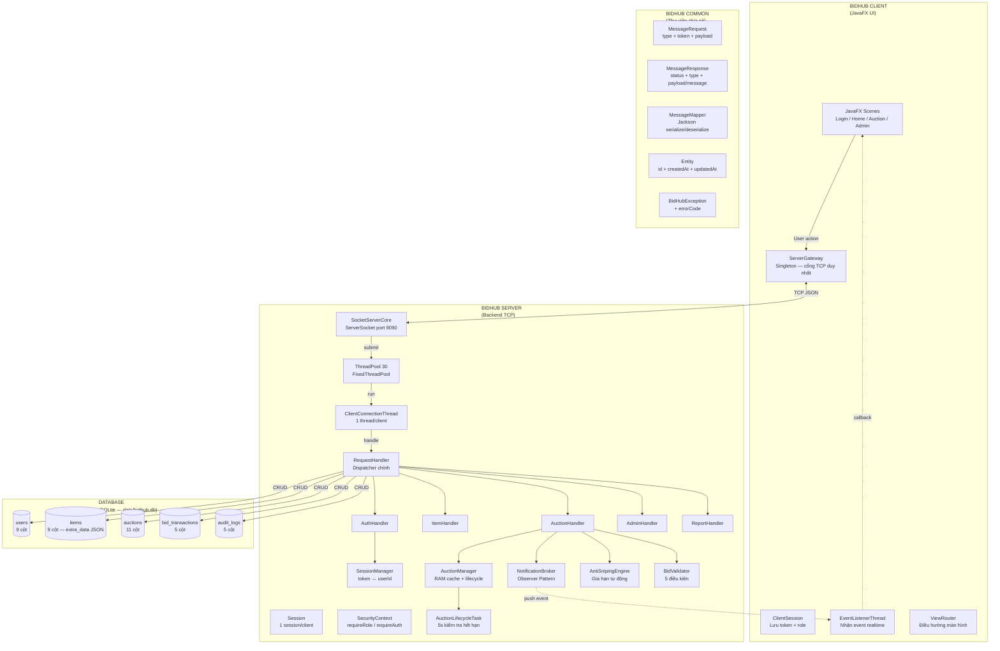

### 1.2 Giải thích sơ đồ — "Thầy giảng trên bảng"

**Bạn hãy tưởng tượng BidHub như một tòa nhà 3 tầng:**

- **Tầng 1 — Common (Móng nhà)**: Chứa những thứ mà cả Client và Server đều dùng chung. Nếu thay đổi giao thức truyền thông (thêm field vào MessageRequest), chỉ cần sửa 1 chỗ ở Common, cả 2 bên tự động cập nhật. Đây chính là lý do tồn tại của module `bidhub-common`.

- **Tầng 2 — Server (Trung tâm xử lý)**: Là "bộ não" của hệ thống. Mọi logic nghiệp vụ đều nằm đây: xác thực, tạo phiên đấu giá, đặt giá, kiểm tra toàn vẹn dữ liệu... Server không có giao diện, chỉ nghe và trả lời qua TCP.

- **Tầng 3 — Client (Giao diện người dùng)**: Là "mặt tiền" bằng JavaFX. Client chỉ gửi request và hiển thị response — KHÔNG chứa logic nghiệp vụ. Ví dụ: kiểm tra giá đặt có hợp lệ không là việc của Server (BidValidator), không phải Client.

### 1.3 Cấu trúc Maven Multi-Module

```
Auction-System/                    ← Root POM (parent)
├── bidhub-common/                 ← Module 1: Thư viện chia sẻ
│   └── src/main/java/com/bidhub/common/
│       ├── exception/             ← 7 class: BidHubException + 6 subclass
│       ├── model/                 ← 1 class: Entity (abstract base)
│       └── network/               ← 3 class: MessageRequest, MessageResponse, MessageMapper
│
├── bidhub-server/                 ← Module 2: Backend
│   └── src/main/java/com/bidhub/server/
│       ├── config/                ← 3 class: ConfigLoader, DbConnectionProvider, MigrationRunner
│       ├── dao/                   ← 5 class DAO: User, Item, Auction, Bid, AuditLog
│       ├── event/                 ← 3 class Event: BidUpdate, AuctionClosed, AuctionExtended
│       ├── model/                 ← 17 class: User hierarchy, Item hierarchy, Auction, BidTransaction...
│       ├── network/               ← 8 class: SocketServerCore, ClientConnectionThread, Session, RequestHandler + 5 Handler
│       ├── service/               ← 9 class: AuthService, SessionManager, AuctionManager, BidValidator...
│       └── utils/                 ← 1 class: Calculator
│
├── bidhub-client/                 ← Module 3: JavaFX Frontend
│   └── src/main/java/com/bidhub/client/
│       ├── controller/            ← 11 class: Login, Register, Home, Auction, Admin...
│       ├── navigation/            ← 2 class: ViewRouter, ContextAware
│       ├── network/               ← 5 class: ServerGateway, ClientSession, EventListenerThread...
│       ├── service/               ← 1 class: BidChartService
│       └── util/                  ← 2 class: UiUtils, Views
│
└── docs/                          ← Tài liệu dự án
```

**Tại sao phải chia module?**

| Cách tiếp cận | Ưu điểm | Nhược điểm |
|---------------|---------|------------|
| ✅ **Multi-Module** | Code chia sẻ (Common) không duplicate; Build từng module riêng; Team chia việc rõ ràng | Cấu hình Maven phức tạp hơn |
| ❌ **Monolith 1 module** | Đơn giản cấu hình | Code client/server trộn lẫn; Phải copy-paste class chung; Không scale được |

**Trong BidHub**: `bidhub-common` là dependency của cả `bidhub-server` và `bidhub-client`. Điều này đảm bảo `MessageRequest`, `MessageResponse`, `MessageMapper`, `Entity`, và `BidHubException` đều là **1 phiên bản duy nhất** — không bao giờ xảy ra tình trạng server dùng `MessageRequest` phiên bản A còn client dùng phiên bản B.

---

## Giai đoạn 2: Luồng Kết Nối Client-Server — TCP Socket

### 2.1 Sơ đồ luồng kết nối

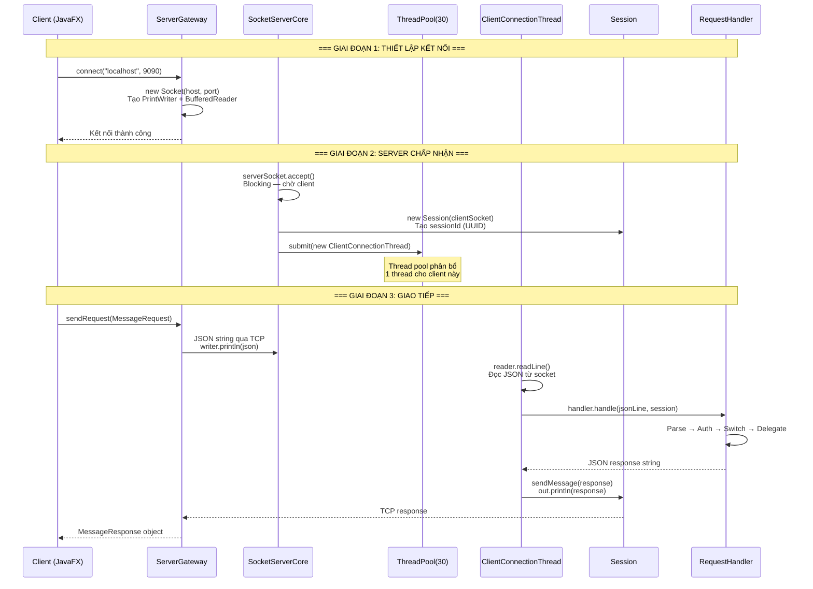

### 2.2 Giải thích chi tiết từng bước

**Bước 1 — Client kết nối (`ServerGateway.connect()`)**

```java
// ServerGateway.java — Client side
public void connect(String host, int port) throws IOException {
    if (isConnected()) disconnect();  // Tránh rò rỉ kết nối cũ
    socket = new Socket(host, port);
    writer = new PrintWriter(socket.getOutputStream(), true); // autoFlush=true
    reader = new BufferedReader(new InputStreamReader(socket.getInputStream()));
}
```

**Logic**: Mở 1 TCP socket đến `localhost:9090`. `autoFlush=true` nghĩa là mỗi khi gọi `println()`, dữ liệu lập tức được đẩy đi, không nằm trong buffer. Nếu client đã có kết nối cũ mà chưa đóng → gọi `disconnect()` trước để tránh **resource leak** (rò rỉ socket).

**Bước 2 — Server chấp nhận kết nối (`SocketServerCore.start()`)**

```java
// SocketServerCore.java — Server side
while (running) {
    Socket clientSocket = serverSocket.accept();     // Chờ blocking
    Session session = new Session(clientSocket);     // Bọc socket thành Session
    threadPool.submit(new ClientConnectionThread(session, requestHandler)); // Giao cho thread pool
}
```

**Logic**: `ServerSocket.accept()` là **blocking call** — thread đứng chờ cho đến khi có client kết nối. Mỗi client mới được bọc trong `Session` (chứa socket + sessionId + trạng thái auth), rồi giao cho `ThreadPool` xử lý. Không tạo thread mới cho mỗi client (tránh OOM), mà tái sử dụng thread từ pool 30.

**Bước 3 — ClientConnectionThread xử lý vòng đời client**

```java
// ClientConnectionThread.java
while ((line = reader.readLine()) != null) {     // Đọc từng dòng JSON
    String response = handler.handle(line, session); // Xử lý
    session.sendMessage(response);                    // Trả lời
}
// Khi client ngắt → readLine() trả null → thoát vòng lặp
// finally: session.disconnect() + NotificationBroker.unsubscribeAll()
```

**Logic**: Vòng lặp `readLine()` chạy liên tục. Mỗi dòng JSON từ client là 1 request. Khi client ngắt kết nối (đóng app, Ctrl+C), `readLine()` trả về `null` → thoát vòng lặp. Khối `finally` **luôn luôn** chạy, đảm bảo socket được đóng và client bị hủy đăng ký khỏi NotificationBroker.

### 2.3 So sánh với cách sai

| ✅ Cách đúng (BidHub) | ❌ Cách sai / kém hiệu quả |
|---|---|
| Fixed ThreadPool 30 → kiểm soát tài nguyên | `new Thread()` cho mỗi client → 1000 client = 1000 thread → OOM |
| `readLine()` trong while → client ngắt thì thoát sạch | Không check null → thread treo vĩnh viễn |
| `finally` block cleanup → không rò rỉ | Thiếu cleanup → socket leak, subscriber leak |
| `synchronized sendMessage()` → thread-safe | Không đồng bộ → 2 thread cùng ghi → JSON corrupt |

---

## Giai đoạn 3: Giao Thức Truyền Thông — JSON Request/Response

### 3.1 Định dạng giao thức

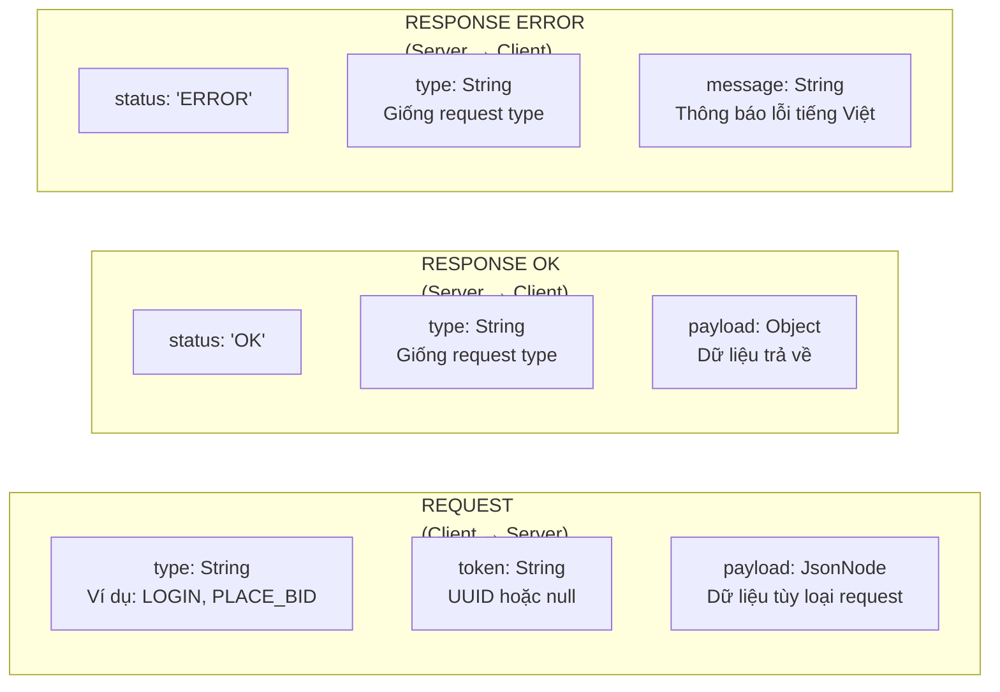

### 3.2 MessageRequest — Chi tiết logic mã nguồn

```java
// MessageRequest.java
@JsonIgnoreProperties(ignoreUnknown = true)  // ← TẠI SAO CẦN?
public class MessageRequest {
    private String type;      // Lệnh: LOGIN, REGISTER, PLACE_BID...
    private String token;     // UUID token hoặc null
    private JsonNode payload; // Dữ liệu linh hoạt — JsonNode chấp nhận bất kỳ cấu trúc JSON nào

    public boolean isValid() {
        return type != null && !type.isBlank(); // Chỉ cần type không rỗng
    }
}
```

**Giải thích từng điểm quan trọng:**

**`@JsonIgnoreProperties(ignoreUnknown = true)`** — Đây là "lá chắn tương thích ngược". Giả sử tuần sau bạn thêm field `requestId` vào MessageRequest. Client cũ không gửi `requestId` → Jackson không crash mà chỉ bỏ qua. Ngược lại, nếu không có annotation này, client cũ gửi thiếu field mới → Jackson ném `UnrecognizedPropertyException` → **server crash toàn bộ**.

**`JsonNode payload`** — Tại sao không dùng `Map<String, Object>` hay `Object`? Vì `JsonNode` từ Jackson cho phép bạn:
- Kiểm tra field có tồn tại không: `payload.has("username")`
- Lấy giá trị an toàn: `payload.path("auctionId").asText("")` — không ném NPE
- Chấp nhận cấu trúc lồng nhau: `payload.get("extras").get("brand")`
- Chấp nhận cả mảng: `payload.get("items")` là ArrayNode

**`isValid()`** — Chỉ cần `type` không rỗng. Token và payload có thể null tùy loại request (PING không cần payload, GET_ITEM_LIST không cần token).

### 3.3 MessageResponse — Factory Method Pattern

```java
// MessageResponse.java
@JsonInclude(JsonInclude.Include.NON_NULL)     // Bỏ field null khỏi JSON
@JsonIgnoreProperties(ignoreUnknown = true)
public class MessageResponse {
    private String status;   // "OK" hoặc "ERROR"
    private String type;     // Giống request type
    private Object payload;  // Dữ liệu trả về (chỉ khi OK)
    private String message;  // Thông báo lỗi (chỉ khi ERROR)

    // Factory method — KHÔNG dùng constructor trực tiếp
    public static MessageResponse ok(String type, Object payload) { ... }
    public static MessageResponse error(String type, String message) { ... }
}
```

**Tại sao dùng Factory Method thay vì constructor?**

- **Tránh nhầm lẫn**: Constructor `new MessageResponse("OK", "LOGIN", payload, null)` — bạn phải nhớ tham số thứ 3 là payload hay message. Factory method rõ ràng: `ok("LOGIN", payload)` vs `error("LOGIN", "Sai mật khẩu")`.
- **Đóng gói logic**: `ok()` tự động set `status = "OK"`, `error()` tự động set `status = "ERROR"`. Không thể vô tình set sai.
- **@JsonInclude(NON_NULL)**: Khi response OK, field `message` là null → KHÔNG xuất hiện trong JSON. Giảm băng thông, client không nhận được field rác.

### 3.4 Ví dụ giao thức thực tế

**LOGIN Request → Response:**
```json
// Client gửi:
{"type":"LOGIN","token":null,"payload":{"username":"alice","password":"12345678"}}

// Server trả về (thành công):
{"status":"OK","type":"LOGIN","payload":{"token":"a1b2c3d4-...","userId":"uuid-...","username":"alice","role":"BIDDER"}}

// Server trả về (lỗi):
{"status":"ERROR","type":"LOGIN","message":"Tên đăng nhập hoặc mật khẩu không đúng."}
```

**PLACE_BID Request → Response:**
```json
// Client gửi:
{"type":"PLACE_BID","token":"a1b2c3d4-...","payload":{"auctionId":"auc-123","bidAmount":5000000}}

// Server trả về (thành công):
{"status":"OK","type":"PLACE_BID","payload":{"auctionId":"auc-123","currentHighestBid":5000000.0,"highestBidderId":"uuid-..."}}
```

### 3.5 MessageMapper — Tại sao là static final?

```java
// MessageMapper.java
public final class MessageMapper {
    private static final ObjectMapper MAPPER = new ObjectMapper(); // Khởi tạo 1 lần duy nhất

    static {
        MAPPER.registerModule(new JavaTimeModule());
        MAPPER.disable(SerializationFeature.WRITE_DATES_AS_TIMESTAMPS);
    }

    public static String toJson(Object obj) { ... }    // Serialize
    public static <T> T fromJson(String json, Class<T> clazz) { ... } // Deserialize
}
```

**Tại sao `static final`?** `ObjectMapper` mất khoảng **65ms** để khởi tạo (phân tích annotation, đăng ký module...). Nếu tạo mới mỗi request, với 1000 request/giây → 65 giây chỉ dành cho tạo ObjectMapper! Khai báo `static final` → tạo 1 lần, tái sử dụng mãi mãi. ObjectMapper là **thread-safe** sau khi cấu hình xong.

**`JavaTimeModule` + `WRITE_DATES_AS_TIMESTAMPS=false`**: Mặc định Jackson serialize `LocalDateTime` thành mảng số `[2024,5,18,14,30,0]`. Với module này + disable timestamps, Jackson sẽ serialize thành chuỗi ISO `"2024-05-18T14:30:00"` — dễ đọc, dễ parse, tương thích tốt hơn.

---

## Giai đoạn 4: Cơ Sở Dữ Liệu — Schema SQLite & Index

### 4.1 Sơ đồ ER (Entity-Relationship)

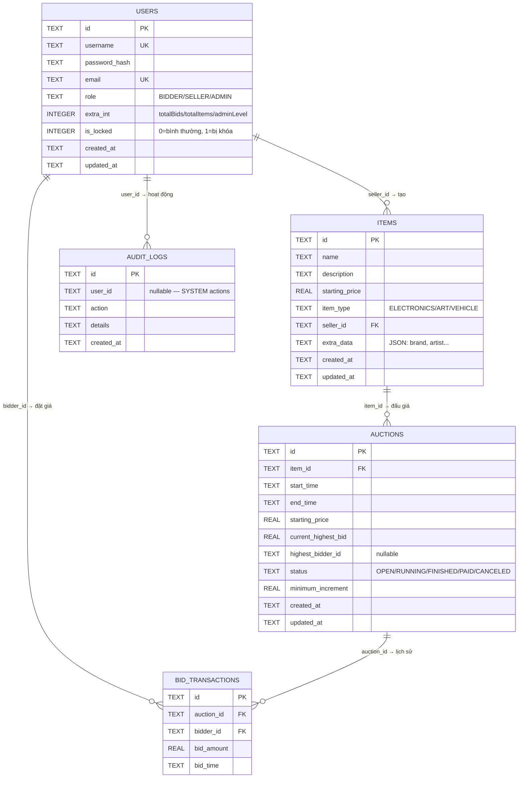

### 4.2 Giải thích chi tiết từng bảng

#### Bảng `users` — 9 cột

**Logic**: Mỗi user có 1 `role` xác định quyền. `extra_int` là cột đa năng — tùy role mà mang ý nghĩa khác:
- BIDDER: `totalBidsPlaced` (tổng số lần đặt giá)
- SELLER: `totalItemsListed` (tổng sản phẩm đã đăng)
- ADMIN: `adminLevel` (cấp quản trị)

**`is_locked`**: Khi ADMIN khóa tài khoản, cột này = 1. Login handler kiểm tra trước khi cấp token — user bị khóa không thể đăng nhập dù mật khẩu đúng.

**`password_hash`**: KHÔNG LƯU mật khẩu gốc. Chỉ lưu SHA-256 hash (64 ký tự hex). Xác minh bằng `MessageDigest.isEqual()` thay vì `String.equals()` để chống **timing attack** (tấn công đo thời gian phản hồi).

#### Bảng `items` — 9 cột, đặc biệt `extra_data`

**`extra_data`**: Đây là cột **JSON** chứa field đặc thù theo loại sản phẩm. Ví dụ:

```json
// ELECTRONICS
{"brand":"Apple","warrantyMonths":12,"imageUrl":"https://..."}

// ART
{"artist":"Picasso","yearCreated":1937,"imageUrl":"https://..."}

// VEHICLE
{"manufacturer":"Toyota","year":2020,"mileageKm":50000,"imageUrl":"https://..."}
```

**Tại sao dùng JSON thay vì cột riêng?** Nếu thêm loại sản phẩm JEWELRY (trang sức), bạn cần thêm cột `gemstone`, `carat`, `purity`... → phải ALTER TABLE, sửa schema, migration phức tạp. Với JSON, chỉ cần thêm field vào `extra_data` — không thay đổi schema.

**`imageUrl`**: Lưu trong `extra_data` JSON, KHÔNG có cột riêng. BidHub chỉ lưu URL ảnh web (như imgur), KHÔNG upload file.

#### Bảng `auctions` — 11 cột

**Không có `seller_id`** — phải JOIN qua items để biết seller. Tại sao? Vì quan hệ là: Item thuộc Seller, Auction thuộc Item. Auction không cần seller_id trực tiếp → tránh **data redundancy** (dư thừa dữ liệu). Nếu lưu seller_id ở cả items và auctions → khi sửa, phải sửa 2 nơi → nguy cơ inconsistent.

**`minimum_increment`**: Bước giá tối thiểu giữa 2 lần đặt. Ví dụ: giá hiện tại 1,000,000 VND, minimum_increment = 100,000 VND → lần đặt tiếp phải >= 1,100,000 VND.

### 4.3 Index — Tại sao cần & Tác động thế nào

```sql
CREATE INDEX idx_auctions_status ON auctions(status);           -- WHERE status = 'RUNNING'
CREATE INDEX idx_auctions_item_id ON auctions(item_id);         -- JOIN items
CREATE INDEX idx_items_seller_id ON items(seller_id);           -- WHERE seller_id = ?
CREATE INDEX idx_bid_transactions_auction_id ON bid_transactions(auction_id); -- Lịch sử bid
CREATE INDEX idx_bid_transactions_bidder_id ON bid_transactions(bidder_id);  -- Bidder thống kê
CREATE INDEX idx_audit_logs_user_id ON audit_logs(user_id);     -- WHERE user_id = ?
CREATE INDEX idx_audit_logs_created_at ON audit_logs(created_at); -- ORDER BY time
CREATE UNIQUE INDEX idx_users_email ON users(email);            -- Email không trùng
```

**Không có index** → Mỗi query là **full table scan** O(n). Ví dụ: tìm auctions đang RUNNING → quét toàn bộ bảng, so sánh từng dòng.

**Có index** → Tìm kiếm **B-tree** O(log n). Database nhảy thẳng đến vùng dữ liệu cần.

**Trade-off**: Index tăng tốc đọc nhưng làm chậm viết (INSERT/UPDATE phải cập nhật cả index). Trong BidHub, đọc nhiều hơn viết → Index là hợp lý.

---

## Giai đoạn 5: Entry Point — Server Khởi Động Thế Nào

### 5.1 Sơ đồ luồng khởi động

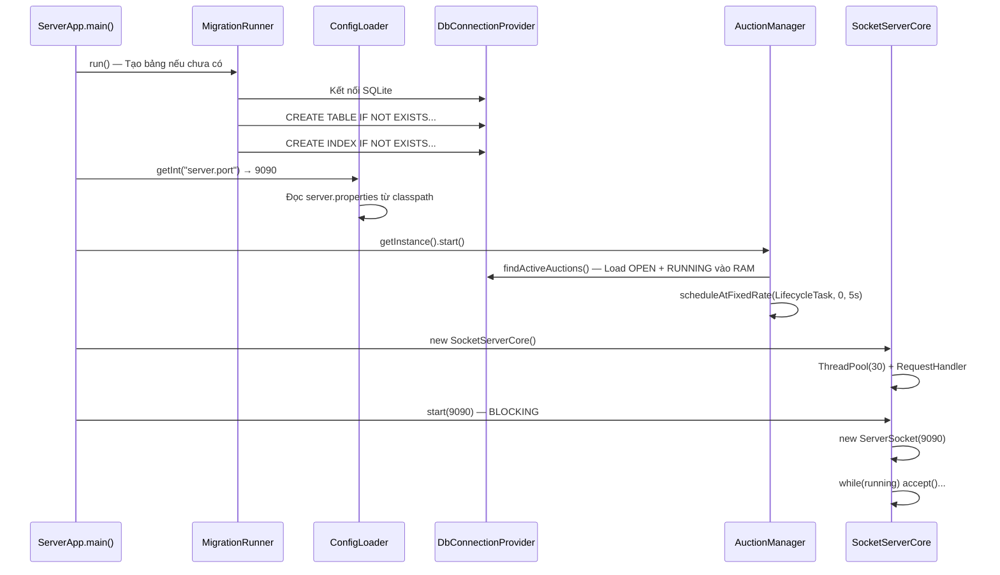

### 5.2 Giải thích từng bước

**Bước 1 — `MigrationRunner.run()`**: Chạy script `schema.sql` — tạo bảng nếu chưa có. Dùng `IF NOT EXISTS` nên chạy nhiều lần không lỗi. Đây là cơ chế **auto-migration** — không cần tạo DB thủ công.

**Bước 2 — `ConfigLoader.getInt("server.port")`**: Đọc từ `server.properties`. Nếu key không tồn tại → ném `IllegalArgumentException` → server không khởi động. Fail-fast tốt hơn silent fail.

**Bước 3 — `AuctionManager.getInstance().start()`**: Đây là bước **quan trọng nhất** — load tất cả auction đang active (OPEN + RUNNING) từ DB vào RAM (`ConcurrentHashMap`). Tại sao? Vì khi server khởi động lại, các auction đang chạy cần được tiếp tục xử lý. Nếu không load vào RAM → auction hết hạn nhưng không ai đóng → bug nghiêm trọng.

**`scheduleAtFixedRate(LifecycleTask, 0, 5, SECONDS)`**:
- `initialDelay = 0`: Chạy ngay lập tức — xử lý auction đã hết hạn trong lúc server down
- `period = 5`: Chạy lại mỗi 5 giây

**Bước 4 — `SocketServerCore.start(9090)`**: Blocking call — thread chính đứng chờ ở đây mãi mãi cho đến khi `shutdown()` được gọi.

---

## Giai đoạn 6: Thread Pool & Xử Lý Đồng Thời

### 6.1 Sơ đồ luồng đồng thời

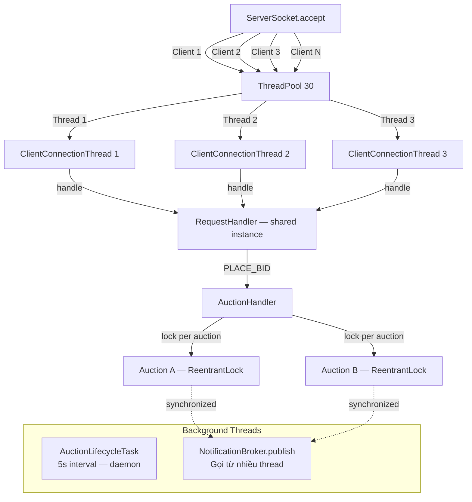

### 6.2 Giải thích cơ chế đồng thời

**Vấn đề cốt lõi**: Khi 2 client cùng đặt giá trên 1 auction cùng lúc, điều gì xảy ra?

```java
// KHÔNG CÓ LOCK — Race Condition:
// Thread 1: đọc currentHighestBid = 1,000,000
// Thread 2: đọc currentHighestBid = 1,000,000  ← CÙNG GIÁ TRỊ CŨ!
// Thread 1: ghi 1,500,000 → OK
// Thread 2: ghi 1,200,000 → GHI ĐÈ! Giá反而 GIẢM!
```

**Giải pháp của BidHub — ReentrantLock per Auction:**

```java
// AuctionHandler.handlePlaceBid()
Auction auction = AuctionManager.getInstance().getAuction(auctionId);
auction.getLock().lock();    // ← Khóa CHÍNH XÁC auction này
try {
    bidValidator.validate(auction, userId, bidAmount);  // Kiểm tra dưới lock
    // Lưu bid, cập nhật giá — tất cả trong lock
    txConn.setAutoCommit(false);
    new BidDao(txConn).save(bid);
    auction.setCurrentHighestBid(bidAmount);
    auction.setHighestBidderId(userId);
    new AuctionDao(txConn).updateHighestBid(auctionId, bidAmount, userId);
    txConn.commit();
} finally {
    auction.getLock().unlock(); // ← Luôn unlock
}
```

**Tại sao ReentrantLock thay vì `synchronized`?**
- **Granular locking**: Mỗi auction có lock riêng → đặt giá auction A không chờ auction B
- **Reentrant**: Cùng thread có thể lock nhiều lần (trong `AuctionLifecycleTask.closeAuction()` cũng cần lock)
- **Transaction + Lock**: Lock bảo vệ RAM, transaction bảo vệ DB — kết hợp 2 tầng

**Tại sao FixedThreadPool(30)?**

| Pool Type | Ưu điểm | Nhược điểm |
|-----------|---------|------------|
| `newFixedThreadPool(30)` | Giới hạn tài nguyên; Thread tái sử dụng | Có thể từ chối nếu > 30 client đồng thời |
| `newCachedThreadPool()` | Tự động mở rộng; Không từ chối | Không giới hạn → 1000 client = 1000 thread → OOM |
| `newSingleThreadExecutor()` | Đơn giản; Không race condition | Xử lý tuần tự → chậm |

BidHub chọn FixedThreadPool(30) vì đây là hệ thống học tập, 30 concurrent users là đủ. Trong production, có thể dùng `ThreadPoolExecutor` với queue và rejection policy.

---

## Giai đoạn 7: Mô Hình Phân Quyền 3 Role

### 7.1 Sơ đồ phân quyền

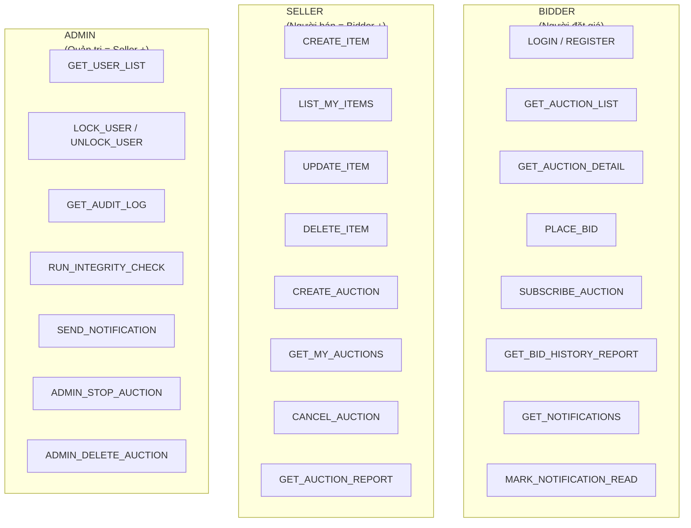

### 7.2 Cơ chế kiểm tra quyền — SecurityContext

```java
// SecurityContext.java — 2 method cốt lõi
public static String requireAuthenticated(Session session) {
    if (session == null || !session.isAuthenticated())
        throw new AuthenticationException("Bạn chưa đăng nhập.");
    return session.getAuthenticatedUserId();
}

public static String requireRole(Session session, UserRole required) {
    String userId = requireAuthenticated(session); // Phải login trước
    if (session.getUserRole() != required)
        throw new AuthenticationException("Không đủ quyền.");
    return userId;
}
```

**Luồng kiểm tra 2 tầng trong RequestHandler:**

1. **Tầng 1 — AUTH_REQUIRED Set**: `RequestHandler.AUTH_REQUIRED` chứa danh sách các lệnh cần đăng nhập. Nếu type nằm trong set mà session chưa auth → trả về lỗi ngay, không cần vào handler.

2. **Tầng 2 — SecurityContext trong handler**: Mỗi handler gọi `SecurityContext.requireRole()` để kiểm tra role cụ thể. Ví dụ: `CREATE_ITEM` cần `SELLER`, `LOCK_USER` cần `ADMIN`.

**Tại sao 2 tầng?** Tầng 1 là bộ lọc nhanh — loại bỏ request chưa login mà không cần gọi handler. Tầng 2 là kiểm tra chi tiết — đảm bảo đúng role.

### 7.3 User Hierarchy — OOP trong BidHub

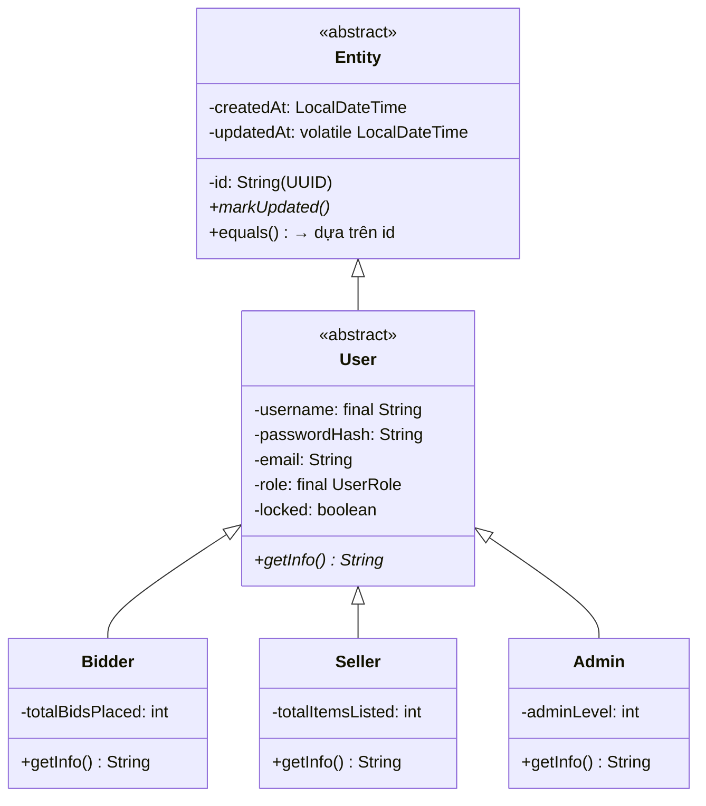

**Logic inheritance**: `Bidder`, `Seller`, `Admin` kế thừa `User` → kế thừa `Entity`. Mỗi subclass thêm field riêng và override `getInfo()`. Khi UserDao đọc từ DB, nó dựa vào cột `role` để tạo đúng subclass:

```java
// UserDao.mapRow() — Polymorphism tại DAO layer
User user = switch (role) {
    case BIDDER -> new Bidder(id, createdAt, updatedAt, ...);
    case SELLER -> new Seller(id, createdAt, updatedAt, ...);
    case ADMIN  -> new Admin(id, createdAt, updatedAt, ...);
};
```

---

## Giai đoạn 8: State Machine Của Auction

### 8.1 Sơ đồ chuyển trạng thái

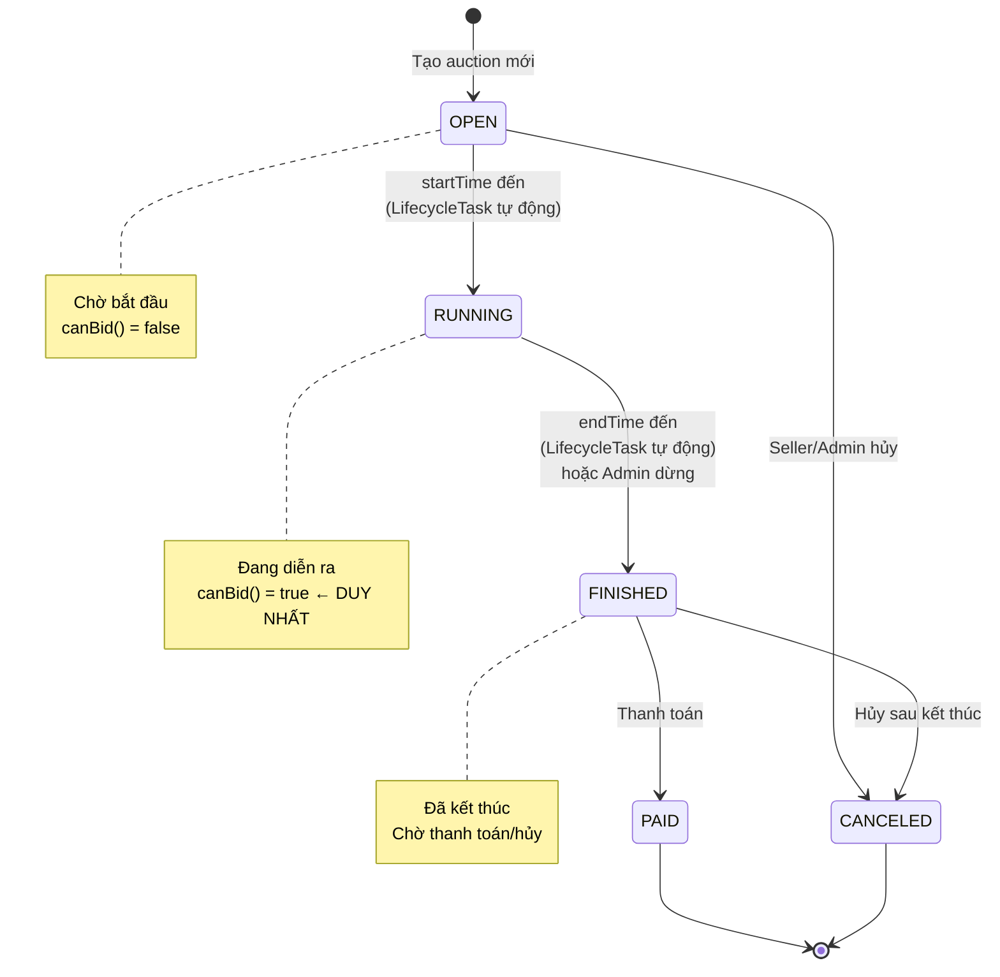

### 8.2 Giải thích State Machine

**Tại sao dùng enum với abstract method thay vì if-else?**

```java
// ❌ Cách sai — if-else rải rác, khó bảo trì
if (status == "RUNNING") canBid = true;
else canBid = false;

// ✅ Cách đúng — Enum abstract method
public enum AuctionStatus {
    OPEN   { public boolean canBid() { return false; } },
    RUNNING{ public boolean canBid() { return true; } },   // DUY NHẤT
    FINISHED { public boolean canBid() { return false; } },
    // ...
    public abstract boolean canBid(); // Bắt buộc mỗi trạng thái phải implement
}
```

**Ưu điểm**:
- Thêm trạng thái mới (ví dụ: `SUSPENDED`) → compiler bắt buộc implement `canBid()` và `isTerminal()` → không quên
- Logic nằm trong chính enum → không cần if-else rải rác ở nhiều file
- `canTransitionTo()` kiểm tra chuyển đổi hợp lệ → `transitionTo()` ném exception nếu sai

**Luồng tự động — AuctionLifecycleTask (5 giây/lần):**

```java
// LifecycleTask.run()
for (Auction auction : activeList) {
    // OPEN → RUNNING: khi startTime <= now
    if (auction.getStatus() == OPEN && !auction.getStartTime().isAfter(now))
        activateAuction(auction);  // Cập nhật RAM + DB

    // RUNNING → FINISHED: khi endTime < now
    if (auction.getEndTime().isBefore(now) && auction.getStatus() == RUNNING)
        closeAuction(auction);  // Tìm winner + Xóa RAM + Notify + Audit
}
```

**Tại sao 5 giây?** Khoảng thời gian này là **trade-off**:
- Ngắn hơn (1s) → phát hiện nhanh hơn nhưng tốn CPU
- Dài hơn (30s) → tiết kiệm CPU nhưng auction hết hạn đến 30s mới đóng → trải nghiệm kém
- 5 giây là hợp lý cho hệ thống đấu giá

---

## Giai đoạn 9: Singleton Pattern — Dùng Ở Đâu & Tại Sao

### 9.1 Các Singleton trong BidHub

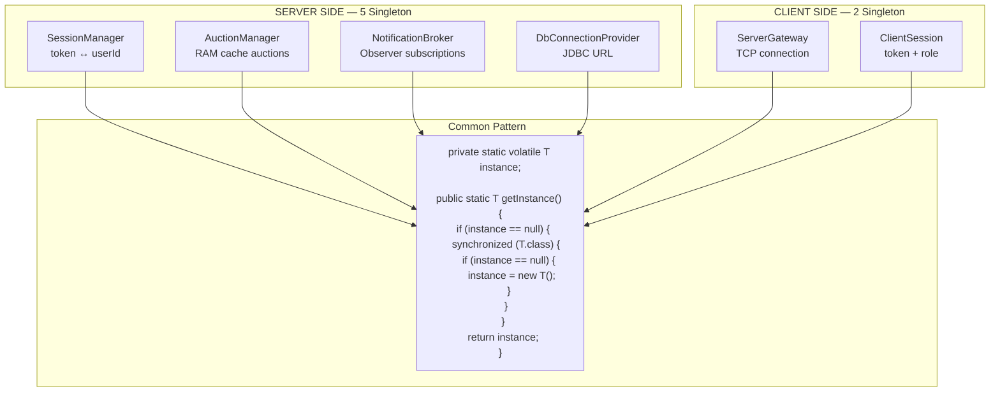

### 9.2 Giải thích Double-Checked Locking

**Tại sao `volatile`?** JVM có thể **reorder** (sắp xếp lại) lệnh. Không có `volatile`, thread B có thể thấy `instance != null` TRƯỚC khi constructor chạy xong → sử dụng object nửa vời → crash.

```java
// ❌ Không volatile — có thể bị reorder
instance = new T();  // Thread B thấy instance != null NHƯNG constructor chưa xong!

// ✅ Có volatile — ngăn reorder
private static volatile T instance;
```

**Tại sao check null 2 lần?** Lần 1 (không sync) → nhanh, không tốn performance. Lần 2 (trong sync) → chính xác, ngăn 2 thread tạo 2 instance.

**Tại sao mỗi class là Singleton?**

| Singleton | Lý do |
|-----------|-------|
| `SessionManager` | 1 bộ mapping token↔userId duy nhất. Nếu tạo 2 instance → token hợp lệ ở instance này nhưng không ở instance kia |
| `AuctionManager` | 1 cache RAM duy nhất. Nếu 2 instance → auction A nằm ở instance 1, bid ở instance 2 không thấy → bug |
| `NotificationBroker` | 1 bộ subscriber duy nhất. Nếu 2 instance → subscribe ở instance 1, publish ở instance 2 → không nhận được event |
| `DbConnectionProvider` | 1 JDBC URL duy nhất. Nếu 2 instance → 2 connection pool → tốn tài nguyên |
| `ServerGateway` (client) | 1 socket duy nhất. Nếu 2 instance → 2 kết nối song song → server xử lý 2 session khác nhau cho cùng 1 user |
| `ClientSession` (client) | 1 trạng thái login duy nhất. Nếu 2 instance → login ở instance A, check ở instance B → false |

---

## Giai đoạn 10: Observer Pattern — Realtime Notification

### 10.1 Sơ đồ Observer Pattern trong BidHub

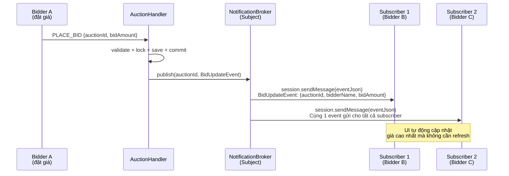

### 10.2 Giải thích NotificationBroker

**Cấu trúc dữ liệu**:
```java
ConcurrentHashMap<String, CopyOnWriteArrayList<Session>> subscribers;
// Key: auctionId
// Value: Danh sách Session đã subscribe auction đó
```

**Tại sao `CopyOnWriteArrayList`?** Khi publish event, broker duyệt qua danh sách subscriber. Nếu cùng lúc có thread khác subscribe/unsubscribe → `ConcurrentModificationException` với `ArrayList` thường. `CopyOnWriteArrayList` tạo bản copy khi modify → iteration an toàn.

**3 loại Event**:

| Event | Khi nào phát sinh | Ai nhận |
|-------|-------------------|---------|
| `BidUpdateEvent` | Ai đó đặt giá thành công | Tất cả subscriber của auction |
| `AuctionClosedEvent` | Auction hết giờ / admin đóng | Tất cả subscriber |
| `AuctionExtendedEvent` | Anti-Sniping gia hạn | Tất cả subscriber |

**Client nhận event — EventListenerThread:**

```java
// Chạy trên background thread, đọc liên tục từ socket
while (!stopRequested) {
    String line = reader.readLine();
    JsonNode json = mapper.readTree(line);
    String eventType = json.path("eventType").asText("");
    if (!eventType.isEmpty()) {
        callback.onBidUpdate(line);  // → Cập nhật UI qua Platform.runLater()
    }
    // Response thường (status: OK/ERROR) — bo qua
}
```

**Vấn đề**: Client chỉ có 1 socket, dùng cho cả request-response VÀ event. Khi nào là response, khi nào là event? **Đáp án**: Event có field `eventType` (BID_UPDATE, AUCTION_CLOSED, AUCTION_EXTENDED), response có field `status` (OK, ERROR). `EventListenerThread` phân biệt bằng cách check `eventType`.

**Tuy nhiên**: Trong kiến trúc hiện tại, `ServerGateway.sendRequest()` đọc response từ `reader.readLine()`, còn `EventListenerThread` cũng đọc từ cùng `reader`. Đây là **race condition tiềm ẩn** — cần cơ chế chia stream hoặc phân luồng xử lý. Đây là 1 trong những bug đã xác nhận ở phiên bản trước.

---

## Giai đoạn 11: Cheat Sheet Tổng Hợp

### Kiến trúc — Nhớ 3 tầng

| Tầng | Module | Chức năng | Công nghệ |
|------|--------|-----------|-----------|
| Móng | `bidhub-common` | Giao thức + Model + Exception | Jackson JSON |
| Não | `bidhub-server` | Logic nghiệp vụ + DB + Socket | TCP + SQLite + Thread Pool |
| Mặt tiền | `bidhub-client` | JavaFX UI + Network | JavaFX + Socket |

### Luồng kết nối — Nhớ 4 bước

1. Client → `ServerGateway.connect()` → Mở TCP socket
2. Server → `ServerSocket.accept()` → Tạo `Session` → Giao cho `ThreadPool`
3. `ClientConnectionThread` → Vòng lặp `readLine()` → `RequestHandler.handle()`
4. `RequestHandler` → Parse JSON → Auth check → Switch type → Delegate handler → Response

### Giao thức — Nhớ 2 format

- **Request**: `{"type":"LOGIN","token":null,"payload":{...}}`
- **Response OK**: `{"status":"OK","type":"LOGIN","payload":{...}}`
- **Response ERROR**: `{"status":"ERROR","type":"LOGIN","message":"..."}`

### Database — Nhớ 5 bảng

| Bảng | Cột đặc biệt | Mục đích |
|------|--------------|----------|
| `users` | `extra_int` đa năng, `is_locked` | Quản lý người dùng |
| `items` | `extra_data` JSON | Sản phẩm + metadata linh hoạt |
| `auctions` | Không có `seller_id` | Phiên đấu giá + trạng thái |
| `bid_transactions` | Chỉ 5 cột | Lịch sử đặt giá |
| `audit_logs` | `user_id` nullable | Nhật ký hệ thống |

### Phân quyền — Nhớ 3 role

- **BIDDER**: Xem + Đặt giá
- **SELLER**: BIDDER + Tạo sản phẩm + Tạo phiên
- **ADMIN**: SELLER + Quản lý user + Audit + Thông báo

### Auction — Nhớ 5 trạng thái

```
OPEN → RUNNING → FINISHED → PAID
  ↓                  ↓
CANCELED          CANCELED
```

### Đồng thời — Nhớ 3 cơ chế

1. **ReentrantLock per Auction** — Bảo vệ bid đồng thời
2. **ConcurrentHashMap** — Thread-safe cho cache RAM
3. **CopyOnWriteArrayList** — An toàn khi duyệt + modify đồng thời

### Pattern — Nhớ 4 pattern chính

| Pattern | Ở đâu | Mục đích |
|---------|--------|----------|
| Singleton | 6 class | 1 instance duy nhất toàn hệ thống |
| Observer | NotificationBroker | Push event realtime |
| Factory Method | ItemCreator | Tạo Item đúng subclass |
| State Machine | AuctionStatus | Quản lý trạng thái Auction |

### Anti-Sniping — Nhớ 2 tham số

- `snipe.threshold = 60s` → Bid trong 60 giây cuối → kích hoạt
- `snipe.extension = 60s` → Gia hạn thêm 60 giây mỗi lần

---

> **Tiếp theo**: Part 2 sẽ đi sâu vào **Module Common** — chi tiết từng class Entity, Exception hierarchy, và MessageMapper. Sau đó Part 3 sẽ phân tích **Module Server** — toàn bộ logic xử lý của 5 Handler + 9 Service.
