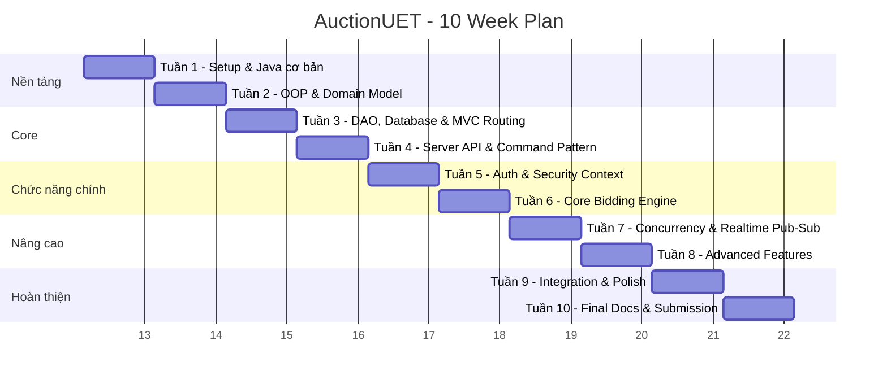

# 🏗️ KẾ HOẠCH 10 TUẦN — HỆ THỐNG ĐẤU GIÁ TRỰC TUYẾN (AuctionUET)

## 👥 Thành viên nhóm

| Ký hiệu | Họ tên | Mã SV| Vai trò chính (xoay vòng) |
|----------|--------|-----|---------------------------|
| **Đăng** | Tiến Đăng  | Server Core & Database |
| **Quốc Minh** | [Họ tên đầy đủ] | Networking & Protocol |
| **Công Minh** | [Họ tên đầy đủ] | Client GUI (JavaFX) |
| **Khoa** | Trần Đăng Khoa | Business Logic & Testing |

> [!IMPORTANT]
> **Vai trò chính ≠ Chỉ làm phần đó.** Mỗi người có trách nhiệm **hiểu toàn bộ hệ thống**. Vai trò chính chỉ xác định ai là người **chịu trách nhiệm code đầu tiên** cho phần đó. Các tuần sau, mọi người sẽ review chéo và làm task ở phần khác để đảm bảo hiểu hết.

---

## 📅 QUY TRÌNH LÀM VIỆC HẰNG TUẦN

### Lịch tuần cố định (áp dụng mỗi tuần)

| Ngày | Hoạt động | Chi tiết |
|------|-----------|----------|
| **Thứ 2 (Tối)** | 🎯 **Kick-off Meeting** (30 phút) | Review task tuần mới, phân công rõ ràng, giải đáp thắc mắc từ tuần trước |
| **Thứ 3–4** | 💻 **Tự học + Code** | Mỗi người làm task cá nhân trên branch riêng |
| **Thứ 5 (Tối)** | 🔍 **Mid-week Check-in** (15 phút) | Báo tiến độ, nêu blocker, hỗ trợ nhau |
| **Thứ 6–7** | 💻 **Hoàn thành task + Viết test** | Hoàn thiện code, viết JUnit test, push lên GitHub |
| **Chủ nhật (Sáng)** | 📝 **Code Review + PR Merge** (1 tiếng) | Review chéo PR, merge vào `main`, demo cho nhau xem |

### Quy tắc Git

```
Branching:  main ← develop ← feature/tuan-X-ten-nguoi-mo-ta
PR format:  [Tuần X] Tên người - Mô tả ngắn
Commit:     feat: thêm class User / fix: sửa lỗi bid validation
```

**Mỗi PR cần ít nhất 2 người approve** trước khi merge → đảm bảo ai cũng đọc code người khác.

### Quy tắc Review chéo (BẮT BUỘC)

Mỗi tuần, mỗi người phải review **code của ít nhất 2 người khác** và trả lời được:
1. Code này làm gì?
2. Interface/class nào được dùng? Tại sao?
3. Có edge case nào chưa xử lý không?

---

## 🗺️ TỔNG QUAN 10 TUẦN



---

## 📚 TUẦN 1: Thiết lập môi trường & Học Git + Maven + JavaFX cơ bản

### 🎯 Mục tiêu
- Cài đặt toàn bộ công cụ cần thiết
- Hiểu cách dùng Git (branch, commit, PR, merge)
- Hiểu Maven project structure
- Chạy được ứng dụng JavaFX "Hello World"
- Tạo project skeleton trên GitHub

### 📖 Phần TỰ HỌC (ai cũng phải làm)

| # | Nội dung | Tài liệu | Đầu ra kiểm tra |
|---|----------|-----------|-----------------|
| 1 | Cài JDK 21, IntelliJ IDEA, Scene Builder | [Adoptium JDK](https://adoptium.net), [IntelliJ](https://jetbrains.com/idea) | Chạy `java -version` → JDK 21 |
| 2 | Học Git cơ bản | [Git tutorial](https://learngitbranching.js.org) | Tạo branch, commit, push, tạo PR thành công |
| 3 | Học Maven cơ bản | [Maven in 5 min](https://maven.apache.org/guides/getting-started/maven-in-five-minutes.html) | Hiểu `pom.xml`, chạy `mvn compile`, `mvn test` |
| 4 | JavaFX Hello World | [OpenJFX Getting Started](https://openjfx.io/openjfx-docs/) | Hiểu FXML + Controller, chạy cửa sổ Hello World |

### 🔨 Nhiệm vụ cá nhân

#### Đăng — Khởi tạo Maven Multi-Module Project
```
Branch: feature/tuan-1-dang-maven-setup
```
**Task:**
1. Tạo Maven multi-module project: `auction-server` và `auction-client`
2. Cấu hình `pom.xml` cha với các dependencies chung (JUnit 5, Gson)
3. Cấu hình `auction-client/pom.xml` với JavaFX dependencies
4. Cấu hình `auction-server/pom.xml` cơ bản
5. Thêm `.gitignore` chuẩn (loại bỏ `target/`, `.idea/`, `*.iml`)

**✅ Test đầu ra:**
- `mvn compile` chạy thành công ở cả 2 module
- `mvn clean package` không lỗi
- Cấu trúc thư mục đúng chuẩn Maven

---

#### Quốc Minh — Thiết lập Git Workflow & CI/CD
```
Branch: feature/tuan-1-quocminh-git-cicd
```
**Task:**
1. Tạo file `.github/workflows/ci.yml` chạy `mvn test` khi push/PR
2. Tạo `CONTRIBUTING.md` mô tả quy trình PR
3. Tạo branch protection rule cho `main` (require 2 reviews)
4. Tạo PR template `.github/pull_request_template.md`
5. Tạo Issue template `.github/ISSUE_TEMPLATE/bug_report.md`

**✅ Test đầu ra:**
- Push lên GitHub → GitHub Actions chạy → ✅ Pass
- PR template hiện khi tạo PR mới
- Không thể merge trực tiếp vào `main` mà không có review

---

#### Công Minh — JavaFX Hello World + Scene Builder
```
Branch: feature/tuan-1-congminh-javafx-hello
```
**Task:**
1. Tạo `MainView.fxml` bằng Scene Builder với: Label "AuctionUET", Button "Start"
2. Tạo `MainController.java` xử lý sự kiện click button (3 trạng thái màu)
3. Tạo `ClientApp.java` load FXML và hiển thị Stage
4. Tạo file `docs/javafx-guide.md` giải thích Stage/Scene/Node/FXML/Controller

**✅ Test đầu ra:**
- Chạy `ClientApp` → Cửa sổ JavaFX hiện ra
- Click button "Start" 3 lần → màu xanh → cam → đỏ
- FXML file mở được trong Scene Builder

---

#### Khoa — JUnit Test Setup + Coding Convention
```
Branch: feature/tuan-1-khoa-test-convention
```
**Task:**
1. Thêm JUnit 5 dependency vào `pom.xml`
2. Tạo `Calculator.java` với đầy đủ: cộng, trừ, nhân, chia, lũy thừa, giai thừa
3. Viết `CalculatorTest.java` với ≥ 15 test cases (bao gồm edge cases)
4. Tạo file `docs/STYLE_GUIDE.md` tóm tắt Google Java Style Guide (6 mục)

**✅ Test đầu ra:**
- `mvn test` → ≥ 15 tests pass, 0 failures
- Test chia 0 → `assertThrows(ArithmeticException.class)`
- `STYLE_GUIDE.md` đầy đủ với ví dụ ✅/❌

---

## 📚 TUẦN 2: OOP Design — Domain Model & Class Hierarchy

### 🎯 Mục tiêu
- Thiết kế class diagram cho toàn bộ hệ thống
- Implement các entity class chính
- Áp dụng 4 trụ OOP: Encapsulation, Inheritance, Polymorphism, Abstraction
- Áp dụng Design Pattern: Factory Method
- Viết test cho mọi class tạo ra

### 📖 Phần TỰ HỌC (ai cũng phải làm)

| # | Nội dung | Đầu ra kiểm tra |
|---|----------|-----------------|
| 1 | Abstract class vs Interface | Giải thích được khi nào dùng cái nào, cho ví dụ thực tế |
| 2 | Design Pattern: Factory Method | Vẽ được UML diagram, viết được ví dụ nhỏ hoàn chỉnh |
| 3 | Java Enum | Viết được `AuctionStatus`, `UserRole` với phương thức |
| 4 | Java Generics cơ bản | Hiểu `List<T>`, viết được generic method |
| 5 | UUID trong Java | Dùng `UUID.randomUUID()` để tạo ID duy nhất |

### 🔨 Nhiệm vụ cá nhân

#### Đăng — Entity Base & User Hierarchy
```
Branch: feature/tuan-2-dang-user-model
```
**Task:**
1. Tạo `Entity.java` (abstract class): `id` (UUID), `createdAt`, `updatedAt`
2. Tạo `User.java` (abstract, extends Entity): `username`, `password` (hashed), `email`, `role`
3. Tạo `Bidder.java`, `Seller.java`, `Admin.java` (extends User)
4. Tạo enum `UserRole` { BIDDER, SELLER, ADMIN } với method `getDisplayName()`
5. Mỗi class: override `toString()`, `equals()`, `hashCode()`, có method `getInfo(): String`

**✅ Test đầu ra:**
```java
@Test void testBidderCreation()     → Bidder có role = BIDDER
@Test void testSellerCreation()     → Seller có role = SELLER
@Test void testAdminCreation()      → Admin có role = ADMIN
@Test void testPolymorphism()       → List<User> chứa cả 3 loại, gọi getInfo() khác nhau
@Test void testEncapsulation()      → private fields, chỉ truy cập qua getter/setter
@Test void testEntityTimestamps()   → createdAt != null sau khi tạo object
@Test void testUniqueId()           → Tạo 2 Entity → id khác nhau
```

---

#### Quốc Minh — Item Hierarchy & Factory Pattern
```
Branch: feature/tuan-2-quocminh-item-factory
```
**Task:**
1. Tạo `Item.java` (abstract, extends Entity): `name`, `description`, `startingPrice`, `sellerId`
2. Tạo `Electronics.java`, `Art.java`, `Vehicle.java` (extends Item) — mỗi class có field riêng biệt
3. Tạo enum `ItemType` { ELECTRONICS, ART, VEHICLE } với method `getLabel()`
4. Tạo `ItemFactory.java` (Factory Method Pattern): `createItem(ItemType type, String name, ...) : Item`
5. Tạo interface `Displayable` với method `printInfo(): void` — implement ở tất cả Item subclasses

**✅ Test đầu ra:**
```java
@Test void testFactoryCreatesElectronics()  → ItemFactory trả về đúng Electronics instance
@Test void testFactoryCreatesArt()          → ItemFactory trả về đúng Art instance
@Test void testFactoryCreatesVehicle()      → ItemFactory trả về đúng Vehicle instance
@Test void testPolymorphicPrintInfo()       → List<Item> gọi printInfo() → output khác nhau cho mỗi loại
@Test void testItemStartingPriceNotNegative() → startingPrice < 0 → throw IllegalArgumentException
@Test void testItemTypeLabel()              → ItemType.ELECTRONICS.getLabel() → "Điện tử"
```

---

#### Công Minh — Auction & BidTransaction
```
Branch: feature/tuan-2-congminh-auction-model
```
**Task:**
1. Tạo `Auction.java` (extends Entity): `itemId`, `startTime`, `endTime`, `currentHighestBid`, `highestBidderId`, `status (AuctionStatus)`
2. Tạo enum `AuctionStatus` { OPEN, RUNNING, FINISHED, PAID, CANCELED } với method `isTerminal(): boolean` và `canBid(): boolean`
3. Tạo `BidTransaction.java` (extends Entity): `auctionId`, `bidderId`, `bidAmount`, `bidTime`
4. Tạo method `Auction.isValidBid(double bidAmount): boolean` kiểm tra bidAmount > currentHighestBid và status == RUNNING
5. Tạo method `Auction.transitionTo(AuctionStatus newStatus)` với validation trạng thái hợp lệ

**✅ Test đầu ra:**
```java
@Test void testAuctionStatusTransition_OpenToRunning()   → OPEN → RUNNING hợp lệ
@Test void testAuctionStatusTransition_RunningToFinished() → RUNNING → FINISHED hợp lệ
@Test void testAuctionStatusTransition_InvalidTransition() → FINISHED → RUNNING → throw IllegalStateException
@Test void testIsValidBid_BidHigherThanCurrent()         → bid 500 khi current 400 → true
@Test void testIsValidBid_BidLowerThanCurrent()          → bid 300 khi current 400 → false
@Test void testIsTerminal_FinishedStatus()                → FINISHED.isTerminal() → true
@Test void testIsTerminal_RunningStatus()                 → RUNNING.isTerminal() → false
```

---

#### Khoa — Exception Hierarchy & Validation
```
Branch: feature/tuan-2-khoa-exception-validation
```
**Task:**
1. Tạo `AuctionException.java` (extends RuntimeException): base exception của hệ thống
2. Tạo các subclasses: `InvalidBidException`, `AuctionNotFoundException`, `UserNotFoundException`, `AuthenticationException`, `ItemNotFoundException`
3. Mỗi exception có: `errorCode: String`, constructor `(String message)` và `(String message, Throwable cause)`
4. Tạo `ValidationUtils.java` với static methods: `requireNonNull()`, `requirePositive()`, `requireNotBlank()`, `requireValidEmail()`
5. Viết ≥ 15 test cases cho toàn bộ exception và validation logic

**✅ Test đầu ra:**
```java
@Test void testInvalidBidException_HasErrorCode()         → exception.getErrorCode() không null
@Test void testRequireNonNull_NullInput_ThrowsException() → requireNonNull(null) → NullPointerException
@Test void testRequirePositive_NegativeInput()            → requirePositive(-1) → IllegalArgumentException
@Test void testRequireNotBlank_EmptyString()              → requireNotBlank("") → throw exception
@Test void testRequireValidEmail_InvalidFormat()          → "not-an-email" → throw exception
@Test void testExceptionInheritance()                     → InvalidBidException instanceof AuctionException → true
```

---

## 📚 TUẦN 3: Database DAO & MVC Routing

### 🎯 Mục tiêu
- Kết nối được SQLite database từ ứng dụng Java
- Xây dựng tầng DAO theo chuẩn Generic BaseDao
- Thiết lập hệ thống điều hướng màn hình JavaFX dùng ViewRouter + ViewContext
- Hoàn thiện skeleton FXML cho các màn hình chính
- Khởi tạo interface tầng Service để chuẩn bị cho Tuần 4–5

### 📖 Phần TỰ HỌC (ai cũng phải làm)

| # | Nội dung | Đầu ra kiểm tra |
|---|----------|-----------------|
| 1 | JDBC cơ bản (Connection, PreparedStatement, ResultSet) | Viết được đoạn code kết nối SQLite và truy vấn 1 bảng |
| 2 | Design Pattern: Singleton (thread-safe, double-checked locking) | Giải thích tại sao cần `volatile` + double-checked locking |
| 3 | Design Pattern: DAO (Data Access Object) | Vẽ được sơ đồ tầng DAO, giải thích Generic DAO |
| 4 | JavaFX: FXMLLoader, `getResource()`, chuyển đổi Scene | Code được việc chuyển từ màn hình A sang B khi click button |
| 5 | SQL cơ bản: CREATE TABLE, INSERT, SELECT, UPDATE, DELETE | Viết được schema.sql cho bảng `users` |

### 🔨 Nhiệm vụ cá nhân

#### Đăng — Database Connection & Schema Migration
```
Branch: feature/tuan-3-dang-database-setup
```
**Task:**
1. Thêm dependency `sqlite-jdbc` (org.xerial, version 3.45.1.0) vào `auction-server/pom.xml`
2. Tạo `DbConnectionProvider.java` (package `com.auctionuet.server.config`):
   - Pattern: Singleton với double-checked locking (`private static volatile DbConnectionProvider instance`)
   - Field: `dataSource: SQLiteDataSource` hoặc trực tiếp quản lý `Connection`
   - Method: `getInstance(): DbConnectionProvider`, `getConnection(): Connection`, `closeConnection(Connection conn): void`
   - Constructor private, nhận đường dẫn DB từ config file hoặc biến môi trường
3. Tạo `schema.sql` (resources/db/): định nghĩa 4 bảng chính:
   - `users` (id TEXT PRIMARY KEY, username TEXT UNIQUE, password_hash TEXT, email TEXT, role TEXT, created_at TEXT, updated_at TEXT)
   - `items` (id TEXT PRIMARY KEY, name TEXT, description TEXT, starting_price REAL, item_type TEXT, seller_id TEXT, created_at TEXT, updated_at TEXT)
   - `auctions` (id TEXT PRIMARY KEY, item_id TEXT, start_time TEXT, end_time TEXT, current_highest_bid REAL, highest_bidder_id TEXT, status TEXT, created_at TEXT, updated_at TEXT)
   - `bid_transactions` (id TEXT PRIMARY KEY, auction_id TEXT, bidder_id TEXT, bid_amount REAL, bid_time TEXT)
4. Tạo `MigrationRunner.java` (package `com.auctionuet.server.config`):
   - Method: `run(Connection conn): void` — đọc `schema.sql`, tách từng statement, thực thi `CREATE TABLE IF NOT EXISTS`
   - Được gọi tự động khi server khởi động

**✅ Test đầu ra:**
- `DbConnectionProvider.getInstance()` gọi 2 lần → trả về cùng 1 instance (`assertSame`)
- `getConnection()` trả về `Connection` không null, `isClosed() == false`
- Sau khi `MigrationRunner.run()` → 4 bảng tồn tại (query `sqlite_master` để verify)
- File `auction.db` được tạo trong thư mục data/

---

#### Quốc Minh — Generic BaseDao & UserDaoImpl
```
Branch: feature/tuan-3-quocminh-user-dao
```
**Task:**
1. Tạo interface `BaseDao<T, ID>` (package `com.auctionuet.server.dao`):
   - Method: `save(T entity): void`, `findById(ID id): Optional<T>`, `findAll(): List<T>`, `update(T entity): void`, `deleteById(ID id): void`
2. Tạo abstract class `AbstractDao<T>` implement `BaseDao<T, String>`:
   - Field: `dbConnectionProvider: DbConnectionProvider`
   - Method abstract: `mapResultSetToEntity(ResultSet rs): T`
   - Method chung: protected helper `executeQuery(String sql, Object... params): ResultSet`
3. Tạo interface `UserDao` extends `BaseDao<User, String>`:
   - Method: `findByUsername(String username): Optional<User>`, `findByEmail(String email): Optional<User>`, `existsByUsername(String username): boolean`
4. Tạo `UserDaoImpl.java` extends `AbstractDao<User>` implements `UserDao`:
   - Implement đầy đủ tất cả method của `UserDao`
   - `mapResultSetToEntity(ResultSet rs): User` → dùng `UserRole.valueOf(rs.getString("role"))` để xác định Bidder/Seller/Admin và tạo đúng subclass
   - Password lưu dưới dạng raw hash (BCrypt sẽ được tích hợp ở Tuần 5)

**✅ Test đầu ra:**
- `userDaoImpl.save(bidder)` → sau đó `findById(bidder.getId())` → trả về đúng Bidder object
- `findByUsername("nonexistent")` → `Optional.empty()`
- `existsByUsername("admin")` sau khi save admin → `true`
- `findAll()` sau khi save 3 users → trả về `List` size = 3
- Test `mapResultSetToEntity`: row có `role = "BIDDER"` → trả về instance của `Bidder`

---

#### Công Minh — ViewRouter & FXML Skeleton
```
Branch: feature/tuan-3-congminh-viewrouter-fxml
```
**Task:**
1. Tạo `ViewContext.java` (package `com.auctionuet.client.navigation`):
   - Field: `params: Map<String, Object>` (lưu tham số truyền giữa các màn hình)
   - Method: `put(String key, Object value): ViewContext` (fluent API), `get(String key): Object`, `getAs(String key, Class<T> type): T`, `clear(): void`
2. Tạo `ViewRouter.java` (package `com.auctionuet.client.navigation`):
   - Pattern: Singleton
   - Field: `primaryStage: Stage`, `viewCache: Map<String, Parent>` (optional caching)
   - Method: `initialize(Stage stage): void` (gọi 1 lần khi app start), `navigateTo(String viewName): void`, `navigateTo(String viewName, ViewContext context): void`, `goBack(): void`
   - Quy ước `viewName`: các hằng số String trong class `Views` (ví dụ `Views.LOGIN`, `Views.AUCTION_LIST`)
   - Cơ chế: load FXML tương ứng với viewName, inject `ViewContext` vào Controller (thông qua interface `ContextAware`)
3. Tạo interface `ContextAware`:
   - Method: `setContext(ViewContext context): void`
4. Tạo FXML skeleton (chưa có logic) cho các màn hình:
   - `LoginView.fxml` + `LoginController.java`: TextField username, PasswordField password, Button đăng nhập, Label lỗi
   - `RegisterView.fxml` + `RegisterController.java`: TextField name/email/username/password, Button đăng ký
   - `AuctionListView.fxml` + `AuctionListController.java`: ListView/TableView danh sách phiên, Button tạo mới
5. Tất cả Controller implement `ContextAware`

**✅ Test đầu ra:**
- `ViewRouter.getInstance()` gọi 2 lần → cùng 1 instance
- `ViewRouter.navigateTo(Views.LOGIN, context)` → `LoginController.setContext(context)` được gọi (dùng mock hoặc kiểm tra trực tiếp)
- `ViewContext.put("userId", "abc").get("userId")` → "abc"
- `ViewContext.getAs("amount", Double.class)` với value là `Double` → cast đúng, không exception
- Tất cả FXML mở được trong Scene Builder không lỗi

---

#### Khoa — AuctionDaoImpl & BidDaoImpl & Service Interfaces
```
Branch: feature/tuan-3-khoa-auction-bid-dao
```
**Task:**
1. Tạo interface `AuctionDao` extends `BaseDao<Auction, String>`:
   - Method: `findActiveAuctions(): List<Auction>`, `findByItemId(String itemId): Optional<Auction>`, `updateStatus(String auctionId, AuctionStatus status): void`, `updateHighestBid(String auctionId, double amount, String bidderId): void`
2. Tạo `AuctionDaoImpl.java` extends `AbstractDao<Auction>` implements `AuctionDao`:
   - `findActiveAuctions()`: query WHERE status = 'RUNNING'
   - `updateStatus()`: UPDATE auctions SET status = ? WHERE id = ?
   - `mapResultSetToEntity()`: map đầy đủ tất cả fields, parse `AuctionStatus` từ String
3. Tạo interface `BidDao` extends `BaseDao<BidTransaction, String>`:
   - Method: `findByAuctionId(String auctionId): List<BidTransaction>`, `getHighestBid(String auctionId): Optional<BidTransaction>`, `countByAuctionId(String auctionId): int`
4. Tạo `BidDaoImpl.java` extends `AbstractDao<BidTransaction>` implements `BidDao`
5. Khai báo 3 interface Service (chưa cần implement, chỉ cần khai báo method signatures):
   - `UserService` (package `com.auctionuet.server.service`): `register(...)`, `login(...)`, `findById(...)`
   - `AuctionService`: `createAuction(...)`, `getActiveAuctions()`, `closeAuction(...)`
   - `BidService`: `placeBid(...)`, `getBidHistory(...)`

**✅ Test đầu ra:**
- `auctionDaoImpl.save(auction)` → `findById(id)` trả về đúng object, status đúng
- `findActiveAuctions()` chỉ trả về auctions có status = RUNNING
- `updateHighestBid(id, 1000.0, bidderId)` → `findById(id).getCurrentHighestBid()` == 1000.0
- `bidDaoImpl.getHighestBid(auctionId)` → trả về BidTransaction có bidAmount cao nhất
- Interface `UserService`, `AuctionService`, `BidService` compile được (có đủ method signatures)

---

## 📚 TUẦN 4: Server API & Command Pattern

### 🎯 Mục tiêu
- Dựng được Socket Server lắng nghe kết nối từ Client
- Thiết kế JSON Protocol dùng Jackson (không dùng Gson)
- Áp dụng Command Pattern: Client gửi JSON → Server ánh xạ thành `Command` object → gọi `execute(Session session)`
- Xây dựng `ServerGateway` phía Client chạy nền bằng JavaFX `Task<T>`
- Kết nối được Client và Server, ping-pong thành công

### 📖 Phần TỰ HỌC (ai cũng phải làm)

| # | Nội dung | Đầu ra kiểm tra |
|---|----------|-----------------|
| 1 | Java Socket (ServerSocket, Socket, InputStream/OutputStream) | Viết được mini chat 2 chiều bằng Socket thuần |
| 2 | Java Thread Pool (ExecutorService, Executors.newFixedThreadPool) | Giải thích tại sao dùng pool thay vì `new Thread()` |
| 3 | Jackson ObjectMapper (serialize/deserialize JSON) | Deserialize chuỗi JSON thành POJO và ngược lại |
| 4 | Design Pattern: Command | Vẽ UML, giải thích tại sao Command tách biệt "yêu cầu" với "thực thi" |
| 5 | JavaFX Task<T> và Platform.runLater() | Giải thích tại sao phải dùng Task cho network call |

### 🔨 Nhiệm vụ cá nhân

#### Đăng — SocketServerCore & ServerContext
```
Branch: feature/tuan-4-dang-socket-server
```
**Task:**
1. Thêm dependency Jackson (`com.fasterxml.jackson.core:jackson-databind:2.17.1`) vào parent `pom.xml` trong `<dependencyManagement>`, và khai báo dùng ở `auction-server/pom.xml`
2. Tạo `SocketServerCore.java` (package `com.auctionuet.server.network`):
   - Field: `serverSocket: ServerSocket`, `threadPool: ExecutorService` (dùng `Executors.newFixedThreadPool(20)`)
   - Method: `start(int port): void` — vòng lặp `accept()` liên tục, mỗi connection tạo `ClientConnectionThread` và submit vào `threadPool`
   - Method: `shutdown(): void` — đóng `serverSocket`, gọi `threadPool.shutdown()`
3. Tạo `ClientConnectionThread.java` (implements `Runnable`):
   - Field: `socket: Socket`, `session: Session`, `commandInvoker: CommandInvoker`
   - Method: `run()` — vòng lặp đọc từng dòng JSON từ `BufferedReader`, gọi `commandInvoker.invoke(jsonLine, session)`, gửi JSON response qua `PrintWriter`
4. Tạo `Session.java` (package `com.auctionuet.server.network`):
   - Field: `sessionId: String` (UUID), `socket: Socket`, `out: PrintWriter`, `authenticatedUserId: String` (null nếu chưa login)
   - Method: `sendMessage(String jsonResponse): void`, `isAuthenticated(): boolean`, `getAuthenticatedUserId(): String`
5. Tạo `ServerContext.java` (Singleton):
   - Field: `activeSessions: ConcurrentHashMap<String, Session>`
   - Method: `addSession(Session)`, `removeSession(String sessionId)`, `getSession(String sessionId)`, `getAllSessions(): Collection<Session>`

**✅ Test đầu ra:**
- `SocketServerCore.start(8888)` → server lắng nghe port 8888 không crash
- Tạo `Socket("localhost", 8888)` từ test → kết nối thành công
- `ServerContext.getInstance()` gọi 2 lần → cùng 1 instance
- `Session.sendMessage("{}")` → client nhận được `"{}"` qua InputStream

---

#### Quốc Minh — JSON Protocol & Command Interface
```
Branch: feature/tuan-4-quocminh-protocol-command
```
**Task:**
1. Thiết kế JSON Message Protocol:
   - **Request** format: `{ "type": "PING", "payload": { ... } }`
   - **Response** format: `{ "status": "OK" | "ERROR", "type": "PING_RESPONSE", "payload": { ... }, "message": "..." }`
   - Tạo `MessageRequest.java` (POJO): field `type: String`, `payload: JsonNode` (Jackson)
   - Tạo `MessageResponse.java` (POJO): field `status: String`, `type: String`, `payload: Object`, `message: String`
   - Tạo `MessageMapper.java`: dùng `ObjectMapper` để serialize/deserialize, method `toJson(Object): String`, `fromJson(String, Class<T>): T`
2. Tạo interface `Command` (package `com.auctionuet.server.command`):
   - Method: `execute(Session session, JsonNode payload): MessageResponse`
3. Tạo `PingCommand.java` implements `Command`:
   - `execute()` trả về `MessageResponse` với status="OK", type="PING_RESPONSE", payload chứa server timestamp

**✅ Test đầu ra:**
- `MessageMapper.toJson(response)` → chuỗi JSON hợp lệ (có thể parse lại)
- `MessageMapper.fromJson("{\"type\":\"PING\",\"payload\":{}}", MessageRequest.class)` → `request.getType()` == "PING"
- `new PingCommand().execute(mockSession, emptyPayload)` → response.getStatus() == "OK"
- `MessageResponse` với status "ERROR" serialize đúng, giữ nguyên field `message`

---

#### Khoa — CommandInvoker & Command Registry
```
Branch: feature/tuan-4-khoa-command-invoker
```
**Task:**
1. Tạo `CommandInvoker.java` (package `com.auctionuet.server.command`):
   - Field: `commandRegistry: Map<String, Command>` (HashMap, key = type string từ JSON)
   - Method: `register(String type, Command command): void` — đăng ký command vào registry
   - Method: `invoke(String jsonLine, Session session): String` — parse JSON lấy `type`, tìm `Command` trong registry, gọi `command.execute(session, payload)`, serialize response thành JSON string
   - Nếu `type` không tìm thấy → trả về `MessageResponse` với status="ERROR", message="Unknown command type: [type]"
2. Tạo `CommandRegistry.java` — class cấu hình (không phải Singleton) chứa method `registerAll(CommandInvoker invoker)`:
   - Đăng ký tất cả commands hiện có: `invoker.register("PING", new PingCommand())`
   - Đây là nơi tập trung thêm commands mới mỗi tuần
3. Viết test cho `CommandInvoker`:

**✅ Test đầu ra:**
- `invoker.invoke("{\"type\":\"PING\",\"payload\":{}}", mockSession)` → JSON string có status="OK"
- `invoker.invoke("{\"type\":\"UNKNOWN\",\"payload\":{}}", mockSession)` → JSON string có status="ERROR"
- `commandRegistry.size()` sau `registerAll()` → ≥ 1 (ít nhất PingCommand đã đăng ký)
- JSON response luôn hợp lệ (không throw exception với mọi input JSON hợp lệ)

---

#### Công Minh — ServerGateway (Client-side) & Network UI State
```
Branch: feature/tuan-4-congminh-server-gateway
```
**Task:**
1. Thêm dependency Jackson vào `auction-client/pom.xml`
2. Tạo `ServerGateway.java` (package `com.auctionuet.client.network`, Singleton):
   - Field: `socket: Socket`, `reader: BufferedReader`, `writer: PrintWriter`, `connected: boolean`
   - Method: `connect(String host, int port): void` — khởi tạo socket và streams
   - Method: `sendRequest(MessageRequest request): MessageResponse` — serialize request → gửi qua socket → đọc response → deserialize, **KHÔNG** gọi trực tiếp từ JavaFX Application Thread
   - Method: `disconnect(): void`, `isConnected(): boolean`
3. Tạo `NetworkTask<T>.java` (extends `javafx.concurrent.Task<T>`):
   - Generic wrapper: nhận `Callable<T>` trong constructor (là lambda gọi `ServerGateway.sendRequest(...)`)
   - Method: `call()` thực thi callable, bắt exception và wrap thành `NetworkException`
4. Tạo enum `ConnectionState` { DISCONNECTED, CONNECTING, CONNECTED, ERROR }
5. Cập nhật `LoginController.java`: khi click button đăng nhập → tạo `NetworkTask`, bind `progressIndicator.visibleProperty()` với `task.runningProperty()`, disable button khi task đang chạy, dùng `Platform.runLater()` để cập nhật UI sau khi nhận kết quả

**✅ Test đầu ra:**
- `ServerGateway.connect("localhost", 8888)` khi server đang chạy → `isConnected()` == true
- `ServerGateway.sendRequest(pingRequest)` → nhận về `MessageResponse` với status="OK"
- `LoginController` khi click → button bị disabled, spinner hiện → request xong → button enabled lại (demo trực quan)
- `ServerGateway.connect(...)` khi server không chạy → `isConnected()` == false, không crash app

---

## 📚 TUẦN 5: Security Context & User Authentication

### 🎯 Mục tiêu
- Tích hợp BCrypt để hash và verify password
- Implement đầy đủ luồng Login, Register, Logout qua Command Pattern
- Xây dựng `SecurityContext` lưu trạng thái authentication phía Server
- `SessionManager` quản lý token in-memory
- Hoàn thiện UI Login/Register với validation ngay trên màn hình

### 📖 Phần TỰ HỌC (ai cũng phải làm)

| # | Nội dung | Đầu ra kiểm tra |
|---|----------|-----------------|
| 1 | Password hashing (tại sao không lưu plaintext, bcrypt là gì) | Giải thích salt và cost factor của bcrypt |
| 2 | Token-based authentication (session token, UUID token) | Vẽ được flow: Login → nhận token → gửi token trong mỗi request |
| 3 | JavaFX Binding (StringProperty, BooleanProperty) | Viết được code bind label text với property tự động update |
| 4 | Input Validation (tại sao validate cả Client lẫn Server) | Liệt kê 5 loại lỗi validation phổ biến |
| 5 | Exception Handling trong Command | Giải thích tại sao Command không nên throw exception ra ngoài mà phải trả về MessageResponse lỗi |

### 🔨 Nhiệm vụ cá nhân

#### Đăng — BCrypt Integration & SessionManager
```
Branch: feature/tuan-5-dang-bcrypt-session
```
**Task:**
1. Thêm dependency `org.mindrot:jbcrypt:0.4` vào `auction-server/pom.xml`
2. Tạo `AuthenticationService.java` (package `com.auctionuet.server.service.impl`):
   - Method: `hashPassword(String plainPassword): String` — dùng `BCrypt.hashpw(password, BCrypt.gensalt(12))`
   - Method: `verifyPassword(String plainPassword, String hashedPassword): boolean` — dùng `BCrypt.checkpw()`
   - Method: `generateToken(): String` — dùng `UUID.randomUUID().toString()`
   - Method: `validateToken(String token): boolean` — kiểm tra token tồn tại trong `SessionManager`
3. Tạo `SessionManager.java` (Singleton, package `com.auctionuet.server.network`):
   - Field: `tokenToUserId: ConcurrentHashMap<String, String>` (token → userId)
   - Field: `userIdToToken: ConcurrentHashMap<String, String>` (userId → token, để logout)
   - Method: `createSession(String userId): String` — tạo token, lưu mapping, trả về token
   - Method: `invalidateSession(String token): void` — xóa cả 2 mapping
   - Method: `getUserIdByToken(String token): Optional<String>`
   - Method: `getTokenByUserId(String userId): Optional<String>`

**✅ Test đầu ra:**
- `hashPassword("secret")` → chuỗi bắt đầu bằng `$2a$`
- `verifyPassword("secret", hash)` → true; `verifyPassword("wrong", hash)` → false
- `sessionManager.createSession("user-1")` → trả về token dài 36 ký tự (UUID format)
- `getUserIdByToken(token)` → Optional chứa "user-1"
- `invalidateSession(token)` → `getUserIdByToken(token)` → `Optional.empty()`

---

#### Quốc Minh — LoginCommand, RegisterCommand, LogoutCommand & SecurityContext
```
Branch: feature/tuan-5-quocminh-auth-commands
```
**Task:**
1. Tạo `SecurityContext.java` (package `com.auctionuet.server.security`):
   - Method static: `getUserId(Session session): Optional<String>` — tra cứu `session.getAuthenticatedUserId()`
   - Method static: `requireAuthenticated(Session session): String` — nếu chưa auth → throw `AuthenticationException("Not authenticated")`
   - Method static: `hasRole(Session session, UserRole role): boolean`
2. Tạo `LoginCommand.java` implements `Command`:
   - Payload mong đợi: `{ "username": "...", "password": "..." }`
   - Logic: `UserDao.findByUsername()` → `AuthenticationService.verifyPassword()` → `SessionManager.createSession()` → set `session.authenticatedUserId` → trả về token trong payload response
   - Nếu sai credentials → status="ERROR", message="Invalid username or password"
3. Tạo `RegisterCommand.java` implements `Command`:
   - Payload: `{ "username", "password", "email", "role" }`
   - Logic: kiểm tra `UserDao.existsByUsername()` → hash password → tạo User object → `UserDao.save()` → trả về user info (không có password)
4. Tạo `LogoutCommand.java` implements `Command`:
   - Dùng `SecurityContext.requireAuthenticated(session)` → `SessionManager.invalidateSession()` → clear `session.authenticatedUserId`
5. Đăng ký 3 commands mới vào `CommandRegistry`

**✅ Test đầu ra:**
- `LoginCommand.execute()` với credentials đúng → status="OK", payload có `token`
- `LoginCommand.execute()` với sai password → status="ERROR"
- `RegisterCommand.execute()` với username đã tồn tại → status="ERROR"
- `RegisterCommand.execute()` hợp lệ → `UserDao.findByUsername()` tìm thấy user
- `LogoutCommand.execute()` với session chưa auth → `AuthenticationException`

---

#### Công Minh — LoginView & RegisterView hoàn chỉnh
```
Branch: feature/tuan-5-congminh-login-register-ui
```
**Task:**
1. Hoàn thiện `LoginView.fxml`:
   - TextField `username`, PasswordField `password`
   - Button "Đăng nhập" — bind `disableProperty` khi field rỗng (dùng `Bindings.or`)
   - ProgressIndicator ẩn khi không loading
   - Label lỗi (màu đỏ, ẩn mặc định) — hiện khi có lỗi từ server
   - Link/Button "Chưa có tài khoản? Đăng ký" → navigate tới RegisterView
2. Hoàn thiện `LoginController.java`:
   - Khi click đăng nhập: disable button, hiện spinner → `NetworkTask` gọi `LoginCommand` → nếu OK: lưu token vào `ClientSession` singleton và navigate tới `AuctionListView` → nếu ERROR: hiện label lỗi
3. Hoàn thiện `RegisterView.fxml` + `RegisterController.java`:
   - Fields: username, email, password, confirm password, dropdown chọn role (BIDDER/SELLER)
   - Validate real-time: confirm password không khớp → label đỏ hiện ngay
   - Submit: gọi `RegisterCommand` → thành công → navigate tới Login với thông báo thành công
4. Tạo `ClientSession.java` (Singleton phía client):
   - Field: `token: String`, `currentUser: UserDto` (DTO chứa id, username, role, không có password)
   - Method: `login(String token, UserDto user)`, `logout()`, `isLoggedIn(): boolean`, `getToken(): String`

**✅ Test đầu ra:**
- Login với credentials đúng (server đang chạy) → chuyển sang AuctionListView
- Login với credentials sai → label lỗi đỏ hiện, không chuyển màn hình
- Register với password != confirmPassword → label "Mật khẩu không khớp" hiện ngay khi nhập
- Button đăng nhập disabled khi username/password rỗng

---

#### Khoa — InputValidator (Fluent API) & Auth Test Suite
```
Branch: feature/tuan-5-khoa-validator-tests
```
**Task:**
1. Tạo `InputValidator.java` (package `com.auctionuet.server.utils`):
   - Fluent API builder pattern: `InputValidator.of(value).notEmpty().minLength(6).maxLength(50).validate()`
   - Methods: `notEmpty(): InputValidator`, `minLength(int min): InputValidator`, `maxLength(int max): InputValidator`, `validEmail(): InputValidator`, `matches(String regex, String errorMsg): InputValidator`
   - Method terminal: `validate(): void` — throw `ValidationException` nếu có lỗi (chứa list các lỗi), `isValid(): boolean`, `getErrors(): List<String>`
2. Viết test suite toàn diện cho luồng authentication — ít nhất 20 test cases:
   - Login với username đúng, password đúng → OK
   - Login với username đúng, password sai → ERROR
   - Login với username không tồn tại → ERROR
   - Register với email không hợp lệ → ERROR
   - Register trùng username → ERROR
   - Logout sau khi login → session bị xóa
   - Request cần auth với token hết hạn/sai → ERROR
   - SQL Injection trong username: `'; DROP TABLE users; --` → không crash, trả lỗi bình thường

**✅ Test đầu ra:**
- `InputValidator.of("").notEmpty().isValid()` → false
- `InputValidator.of("abc@gmail.com").validEmail().isValid()` → true
- `InputValidator.of("not-email").validEmail().isValid()` → false
- `InputValidator.of("ab").minLength(3).validate()` → throw `ValidationException`
- 20 test cases authentication: tất cả pass

---

## 📚 TUẦN 6: Core Bidding Engine

### 🎯 Mục tiêu
- Xây dựng `AuctionManager` quản lý các phiên đấu giá đang chạy trên RAM
- Implement `AuctionLifecycleTask` tự động đóng phiên hết hạn
- Implement `PlaceBidCommand` với `BidValidator` kiểm tra luật đặt giá
- Hoàn thiện UI màn hình danh sách đấu giá và chi tiết đấu giá (có đồng hồ đếm ngược)
- Viết `BidServiceImpl` ghi Bid hợp lệ xuống database

### 📖 Phần TỰ HỌC (ai cũng phải làm)

| # | Nội dung | Đầu ra kiểm tra |
|---|----------|-----------------|
| 1 | Java ScheduledExecutorService | Viết code chạy task lặp lại mỗi 5 giây |
| 2 | JavaFX Timeline & KeyFrame | Tạo được countdown timer đếm ngược 60s → 0s trên Label |
| 3 | Business Rule Validation (tách biệt validation khỏi logic chính) | Giải thích tại sao BidValidator là class riêng |
| 4 | Transactional thinking (tại sao đặt giá phải atomic) | Mô tả kịch bản 2 người đặt giá cùng lúc — điều gì có thể sai |
| 5 | JavaFX TableView & ObservableList | Bind TableView với ObservableList, tự cập nhật khi list thay đổi |

### 🔨 Nhiệm vụ cá nhân

#### Đăng — AuctionManager & AuctionLifecycleTask
```
Branch: feature/tuan-6-dang-auction-manager
```
**Task:**
1. Tạo `AuctionManager.java` (Singleton, package `com.auctionuet.server.auction`):
   - Field: `activeAuctions: ConcurrentHashMap<String, Auction>` (key = auctionId)
   - Field: `scheduler: ScheduledExecutorService` (dùng `Executors.newSingleThreadScheduledExecutor()`)
   - Method: `start(): void` — khởi động scheduler, load active auctions từ DB vào RAM
   - Method: `addAuction(Auction auction): void`, `removeAuction(String auctionId): void`
   - Method: `getAuction(String auctionId): Optional<Auction>`, `getAllActiveAuctions(): Collection<Auction>`
   - Method: `shutdown(): void`
2. Tạo `AuctionLifecycleTask.java` (implements `Runnable`):
   - Chạy mỗi 5 giây thông qua `scheduler.scheduleAtFixedRate()`
   - Logic: duyệt tất cả auction trong `AuctionManager`, nếu `endTime` đã qua và status == RUNNING → gọi `closeAuction(auction)`
   - `closeAuction(Auction)`: update status → FINISHED trong DB, xác định winner (highest bid), notify qua `NotificationBroker` (sẽ dùng ở Tuần 7, tạm thời bỏ trống)
3. Tạo `CreateAuctionCommand.java` implements `Command`:
   - Yêu cầu auth (`SecurityContext.requireAuthenticated`) và role SELLER
   - Payload: `{ "itemId", "startingPrice", "durationMinutes" }`
   - Tạo Auction object, save vào DB, add vào `AuctionManager`

**✅ Test đầu ra:**
- `AuctionManager.getInstance()` gọi 2 lần → cùng instance
- `addAuction(auction)` → `getAuction(id)` → Optional có auction
- `AuctionLifecycleTask.run()` với auction có `endTime` trong quá khứ → auction status đổi thành FINISHED
- `AuctionLifecycleTask.run()` với auction chưa hết hạn → status không thay đổi

---

#### Quốc Minh — PlaceBidCommand & BidValidator
```
Branch: feature/tuan-6-quocminh-place-bid-command
```
**Task:**
1. Tạo `BidValidator.java` (package `com.auctionuet.server.auction`):
   - Method: `validate(Auction auction, String bidderId, double bidAmount): void` — throw `InvalidBidException` với message rõ ràng nếu:
     - `auction.getStatus() != RUNNING` → "Phiên đấu giá không ở trạng thái RUNNING"
     - `bidAmount <= auction.getCurrentHighestBid()` → "Giá đặt phải cao hơn giá hiện tại là [x]"
     - `auction.getItem().getSellerId().equals(bidderId)` → "Người bán không thể tự đặt giá"
2. Tạo `PlaceBidCommand.java` implements `Command`:
   - Yêu cầu auth, role BIDDER
   - Payload: `{ "auctionId": "...", "bidAmount": 1500.0 }`
   - Logic: lấy `Auction` từ `AuctionManager` → `BidValidator.validate()` → tạo `BidTransaction` → `BidDao.save()` → `AuctionDao.updateHighestBid()` → cập nhật object `Auction` trong `AuctionManager` → trả về response
3. Đăng ký `PlaceBidCommand` và `CreateAuctionCommand` vào `CommandRegistry`
4. Tạo `GetAuctionListCommand.java` — không cần auth, trả về list `AuctionDto` (DTO bỏ các field không cần thiết)

**✅ Test đầu ra:**
- `BidValidator.validate()` với bid thấp hơn → `InvalidBidException` với message chứa giá hiện tại
- `BidValidator.validate()` với seller tự bid → `InvalidBidException` message "Người bán không thể tự đặt giá"
- `BidValidator.validate()` với bid hợp lệ → không throw exception
- `PlaceBidCommand.execute()` hợp lệ → `AuctionManager.getAuction(id).getCurrentHighestBid()` == bidAmount mới

---

#### Công Minh — AuctionListView & AuctionDetailView với Countdown Timer
```
Branch: feature/tuan-6-congminh-auction-ui
```
**Task:**
1. Hoàn thiện `AuctionListView.fxml` + `AuctionListController.java`:
   - `TableView<AuctionDto>` với các cột: Tên sản phẩm, Giá hiện tại, Thời gian kết thúc, Trạng thái
   - Bind với `ObservableList<AuctionDto>` — khi list thay đổi, TableView tự cập nhật
   - Button "Xem chi tiết" → navigate tới `AuctionDetailView` kèm `ViewContext` chứa `auctionId`
   - Button "Tạo phiên mới" (chỉ hiện nếu role == SELLER) → mở dialog tạo auction
   - Khi màn hình load: gọi `GetAuctionListCommand` qua `NetworkTask` để fetch danh sách
2. Tạo `AuctionDetailView.fxml` + `AuctionDetailController.java`:
   - Hiển thị thông tin auction: tên, mô tả, giá hiện tại, người dẫn đầu, thời gian kết thúc
   - **Countdown Timer**: dùng `javafx.animation.Timeline` với `KeyFrame` lặp mỗi 1 giây, tính `Duration.between(now, endTime)` và cập nhật Label "Còn lại: HH:MM:SS"
   - TextField nhập giá đặt + Button "Đặt giá" → gọi `PlaceBidCommand`
   - Khi `endTime` đã qua → dừng Timeline, hiện "Phiên đã kết thúc", disable nút Đặt giá

**✅ Test đầu ra:**
- `AuctionListView` load → fetch được list từ server (demo trực quan)
- Countdown Timer hiển thị đúng HH:MM:SS và đếm ngược mỗi giây
- Khi phiên hết giờ (endTime qua) → Label chuyển thành "Phiên đã kết thúc", button disabled
- Nhấn "Đặt giá" với giá hợp lệ → server nhận PlaceBidCommand, trả OK

---

#### Khoa — BidServiceImpl & Test Cases cho Bidding Logic
```
Branch: feature/tuan-6-khoa-bid-service-tests
```
**Task:**
1. Implement `BidServiceImpl.java` (implements `BidService`):
   - `placeBid(String auctionId, String bidderId, double amount): BidTransaction`:
     - Gọi `AuctionManager.getAuction()` → `BidValidator.validate()` → tạo `BidTransaction` → `BidDao.save()` → `AuctionDao.updateHighestBid()` → return transaction
   - `getBidHistory(String auctionId): List<BidTransaction>`: gọi `BidDao.findByAuctionId()`
   - `getHighestBid(String auctionId): Optional<BidTransaction>`: gọi `BidDao.getHighestBid()`
2. Viết ≥ 10 test cases cho bidding logic:

**✅ Test đầu ra:**
```java
@Test void testPlaceBid_ValidBid_UpdatesAuction()          → auction.getCurrentHighestBid() đúng
@Test void testPlaceBid_BidLowerThanCurrent_ThrowsException() → InvalidBidException
@Test void testPlaceBid_SellerBidsOwnAuction_ThrowsException() → InvalidBidException
@Test void testPlaceBid_AuctionNotRunning_ThrowsException() → InvalidBidException
@Test void testPlaceBid_AuctionNotFound_ThrowsException()  → AuctionNotFoundException
@Test void testGetBidHistory_ReturnsChronologicalOrder()   → list sorted by bidTime
@Test void testGetHighestBid_EmptyAuction_ReturnsEmpty()   → Optional.empty()
@Test void testGetHighestBid_AfterOneBid_ReturnsThatBid()  → Optional có bid đó
@Test void testMultipleBids_HighestBidUpdates()            → sau 3 bids, highest là bid cao nhất
@Test void testPlaceBid_SavesToBidTransactions()           → bidDao.findByAuctionId().size() tăng lên 1
```

---

## 📚 TUẦN 7: Concurrency & Realtime Pub-Sub

### 🎯 Mục tiêu
- Đảm bảo thread-safe cho luồng đặt giá bằng Granular Locking (ReentrantLock per Auction)
- Xây dựng `NotificationBroker` (Pub-Sub pattern) đẩy `BidUpdateEvent` tới tất cả client đang xem phiên
- Client lắng nghe event từ Server, dùng `Platform.runLater()` cập nhật UI an toàn
- Viết Stress Test kiểm tra không có "Lost Update" khi 50 thread cùng bid vào 1 phiên

### 📖 Phần TỰ HỌC (ai cũng phải làm)

| # | Nội dung | Đầu ra kiểm tra |
|---|----------|-----------------|
| 1 | ReentrantLock vs synchronized | Giải thích 2 điểm khác biệt, khi nào dùng ReentrantLock |
| 2 | Race condition & Lost Update | Mô tả kịch bản Lost Update với 2 thread, vẽ sơ đồ timeline |
| 3 | Observer / Pub-Sub Pattern | Vẽ UML Observer Pattern, phân biệt Observer và Pub-Sub |
| 4 | ConcurrentHashMap, CopyOnWriteArrayList | Tại sao cần thread-safe collection thay vì HashMap thường |
| 5 | JavaFX Platform.runLater() | Giải thích điều gì xảy ra nếu update UI từ background thread |

### 🔨 Nhiệm vụ cá nhân

#### Đăng — ReentrantLock Granular Locking trong Auction
```
Branch: feature/tuan-7-dang-reentrantlock
```
**Task:**
1. Cập nhật `Auction.java` (model):
   - Thêm field `lock: ReentrantLock` (khởi tạo `new ReentrantLock()` trong constructor)
   - Method: `getLock(): ReentrantLock`
   - Lưu ý: `lock` là `transient` (không serialize khi save vào DB)
2. Cập nhật `PlaceBidCommand.java` — áp dụng locking:
   - Logic mới: `auction.getLock().lock()` → `try { BidValidator.validate() → BidDao.save() → AuctionDao.updateHighestBid() → cập nhật auction object } finally { auction.getLock().unlock() }`
   - Đảm bảo `unlock()` luôn được gọi dù có exception
3. Cập nhật `AuctionManager.addAuction()`:
   - Khi load auction từ DB vào RAM → tạo mới `ReentrantLock` cho auction đó (vì lock không serialize được)
4. Viết `LockingTest.java` (trong test module):
   - Tạo `ExecutorService` với 10 threads, tất cả cùng gọi `PlaceBidCommand` vào 1 auction
   - Dùng `CountDownLatch` để đảm bảo tất cả thread bắt đầu cùng lúc
   - Assert: chỉ 1 bid thắng (highest bid = bid cao nhất trong 10 bids), không có 2 bid cùng là highest

**✅ Test đầu ra:**
- `LockingTest`: 10 threads bid → chỉ 1 bid cuối cùng được ghi nhận là highest, không có inconsistency
- `PlaceBidCommand` khi lock bị chiếm bởi thread khác → thread chờ (block) thay vì ghi đè
- `auction.getLock()` trả về cùng 1 instance ReentrantLock (không tạo mới mỗi lần gọi)
- Exception trong validate → lock vẫn được release (`finally` block hoạt động đúng)

---

#### Quốc Minh — NotificationBroker & BidUpdateEvent
```
Branch: feature/tuan-7-quocminh-notification-broker
```
**Task:**
1. Tạo `BidUpdateEvent.java` (package `com.auctionuet.server.event`):
   - Field: `auctionId: String`, `newHighestBid: double`, `highestBidderId: String`, `highestBidderUsername: String`, `updatedAt: String` (ISO timestamp)
   - Method: `toJson(): String` — serialize thành JSON dùng `MessageMapper`
2. Tạo `AuctionClosedEvent.java`:
   - Field: `auctionId: String`, `winnerId: String`, `winnerUsername: String`, `finalPrice: double`
3. Tạo `NotificationBroker.java` (Singleton, package `com.auctionuet.server.event`):
   - Field: `subscriptions: ConcurrentHashMap<String, CopyOnWriteArrayList<Session>>` (key = auctionId)
   - Method: `subscribe(String auctionId, Session session): void`
   - Method: `unsubscribe(String auctionId, Session session): void`
   - Method: `unsubscribeAll(Session session): void` — dùng khi client disconnect
   - Method: `publish(String auctionId, BidUpdateEvent event): void` — duyệt subscribers, gọi `session.sendMessage(json)` cho mỗi session
   - Method: `publishAuctionClosed(String auctionId, AuctionClosedEvent event): void`
4. Cập nhật `PlaceBidCommand` — sau khi bid thành công: tạo `BidUpdateEvent`, gọi `NotificationBroker.publish(auctionId, event)`
5. Tạo `SubscribeAuctionCommand.java` implements `Command`:
   - Payload: `{ "auctionId": "..." }`
   - Gọi `NotificationBroker.subscribe(auctionId, session)`

**✅ Test đầu ra:**
- `NotificationBroker.subscribe(auctionId, session1)` sau đó `publish(auctionId, event)` → `session1.sendMessage()` được gọi
- 2 sessions cùng subscribe cùng auctionId → `publish()` → cả 2 đều nhận
- `unsubscribe(auctionId, session1)` → `publish()` → session1 không nhận nữa
- `publish()` khi session đã disconnect (sendMessage throw IOException) → không crash broker, chỉ log warning và remove session

---

#### Công Minh — Client lắng nghe Event & Realtime UI Update
```
Branch: feature/tuan-7-congminh-realtime-client
```
**Task:**
1. Tạo `EventListenerThread.java` (package `com.auctionuet.client.network`):
   - Chạy trong background thread riêng (không phải JavaFX Application Thread)
   - Vòng lặp đọc dòng JSON từ `ServerGateway` liên tục (blocking read)
   - Phân loại JSON nhận được: nếu `type == "BID_UPDATE"` → parse thành `BidUpdateEvent` → gọi callback
   - Interface `EventCallback`: `onBidUpdate(BidUpdateEvent event): void`
2. Cập nhật `AuctionDetailController.java`:
   - Subscribe vào auction khi màn hình mở (gọi `SubscribeAuctionCommand`)
   - Implement `EventCallback.onBidUpdate()`:
     - **BẮT BUỘC** dùng `Platform.runLater(() -> { ... })` để update UI
     - Update: Label giá hiện tại, Label người dẫn đầu
     - Animation: Label giá highlight màu xanh → fade về trắng trong 2 giây (dùng `FillTransition` hoặc CSS transition)
   - Khi rời màn hình (unsubscribe), dừng lắng nghe event
3. Tạo `BidUpdateEvent.java` (phía client, package `com.auctionuet.client.model`):
   - Mirror của server-side, dùng Jackson deserialize

**✅ Test đầu ra:**
- Khi `PlaceBidCommand` được gửi từ Client A → Server xử lý → Client B (đang xem cùng auction) nhận `BidUpdateEvent` → UI cập nhật giá mới mà không cần refresh (demo trực quan với 2 cửa sổ)
- Không có exception "Not on FX Application Thread" trong console
- Animation highlight xuất hiện mỗi khi giá thay đổi

---

#### Khoa — Stress Test: ConcurrentBidTest
```
Branch: feature/tuan-7-khoa-concurrent-stress-test
```
**Task:**
1. Tạo `ConcurrentBidTest.java` (package `com.auctionuet.server.test`):
   - Setup: Tạo 1 auction RUNNING, 50 user bidder (tạo trực tiếp trong DB test)
   - Dùng `ExecutorService threadPool = Executors.newFixedThreadPool(50)`
   - Dùng `CountDownLatch startSignal = new CountDownLatch(1)` để tất cả 50 thread bắt đầu đúng lúc
   - Mỗi thread: chờ signal → gọi trực tiếp `PlaceBidCommand.execute()` với bid amount là random trong khoảng `[currentBid+1, currentBid+1000]`
   - Assert sau khi tất cả thread hoàn thành:
     - Tổng số `BidTransaction` trong DB == số bid thành công (không bị duplicate hay lost)
     - `auction.getCurrentHighestBid()` == `bidDao.getHighestBid(auctionId).getBidAmount()` (nhất quán giữa RAM và DB)
     - Không có 2 BidTransaction nào có cùng `bidAmount` và `auctionId` mà cùng là highest
2. Thêm scenario **"Lost Update" detection**: sau stress test, verify không có bid nào trong DB có amount > currentHighestBid mà không được ghi nhận là highest

**✅ Test đầu ra:**
- Test chạy với 50 threads không bị deadlock (hoàn thành trong vòng 30 giây)
- Không có `ConcurrentModificationException` hay `IllegalMonitorStateException`
- `auction.getCurrentHighestBid()` sau test == highest bid trong `bid_transactions` table
- Chạy test 3 lần liên tiếp → kết quả nhất quán (không flaky)

---

## 📚 TUẦN 8: Advanced Features

### 🎯 Mục tiêu
- Implement Auto-Bidding Agent với PriorityQueue
- Implement Anti-Sniping Engine (gia hạn thời gian khi có bid cuối)
- Xây dựng Realtime Price Chart bằng AreaChart JavaFX
- Viết Test Cases cực đoan cho AutoBid conflicts

### 📖 Phần TỰ HỌC (ai cũng phải làm)

| # | Nội dung | Đầu ra kiểm tra |
|---|----------|-----------------|
| 1 | Java PriorityQueue (so sánh Comparator, min-heap vs max-heap) | Viết được PriorityQueue sắp xếp theo thời gian đăng ký |
| 2 | Strategy Pattern | Vẽ UML, giải thích tại sao AutoBid có thể là Strategy |
| 3 | JavaFX AreaChart, XYChart.Series, XYChart.Data | Thêm được 1 data point vào AreaChart từ background thread |
| 4 | Hook / Post-processing pattern | Giải thích cách PlaceBidCommand trigger AutoBidAgent |
| 5 | Anti-sniping algorithm concept (eBay, timed auction extension) | Tìm 1 ví dụ thực tế về anti-sniping trong ứng dụng thật |

### 🔨 Nhiệm vụ cá nhân

#### Đăng — AutoBidAgent
```
Branch: feature/tuan-8-dang-autobid-agent
```
**Task:**
1. Tạo `AutoBidConfig.java` (package `com.auctionuet.server.auction`):
   - Field: `bidderId: String`, `auctionId: String`, `maxBid: double`, `increment: double`, `registeredAt: LocalDateTime`
2. Tạo `AutoBidAgent.java` (Singleton):
   - Field: `autoBidQueues: ConcurrentHashMap<String, PriorityQueue<AutoBidConfig>>` (key = auctionId)
   - `PriorityQueue` sắp xếp theo `registeredAt` (người đăng ký trước được ưu tiên khi tie)
   - Method: `register(AutoBidConfig config): void` — thêm vào queue của auctionId tương ứng
   - Method: `cancel(String bidderId, String auctionId): void` — xóa config khỏi queue
   - Method: `triggerAutoBid(String auctionId, double currentBid, String lastBidderId): void`:
     - Gọi sau mỗi `PlaceBidCommand` thành công
     - Lấy config hàng đầu queue (người đăng ký sớm nhất) mà `bidderId != lastBidderId`
     - Tính `nextBid = currentBid + config.increment`
     - Nếu `nextBid <= config.maxBid` → gọi `PlaceBidCommand` thay mặt bidder đó
     - Đệ quy: trigger tiếp nếu vẫn còn AutoBid khác phản hồi (giới hạn vòng lặp tối đa 10 lần để tránh infinite loop)
3. Tạo `RegisterAutoBidCommand.java` implements `Command`:
   - Payload: `{ "auctionId", "maxBid", "increment" }`
   - Yêu cầu auth + role BIDDER
   - Validate: `maxBid > auction.getCurrentHighestBid()`, `increment > 0`
4. Cập nhật `PlaceBidCommand`: sau khi bid thành công → gọi `AutoBidAgent.triggerAutoBid()`

**✅ Test đầu ra:**
- `AutoBidAgent.register()` với 2 config cùng auctionId → `triggerAutoBid()` ưu tiên người đăng ký trước
- AutoBid không vượt `maxBid`: config `maxBid=1000`, currentBid=950, increment=100 → AutoBid không kích hoạt (vì 950+100=1050 > 1000)
- Bid thủ công 200 → AutoBid của người có maxBid=500, increment=50 → tự động đặt 250

---

#### Quốc Minh — AntiSnipingEngine
```
Branch: feature/tuan-8-quocminh-anti-sniping
```
**Task:**
1. Tạo `AntiSnipingEngine.java` (package `com.auctionuet.server.auction`):
   - Constant: `SNIPE_THRESHOLD_SECONDS = 60` (có bid mới trong 60s cuối → gia hạn), `EXTENSION_SECONDS = 60` (gia hạn thêm 60s)
   - Method: `check(Auction auction): boolean` — kiểm tra bid mới có rơi vào SNIPE_THRESHOLD không (so sánh `now` với `auction.getEndTime()`)
   - Method: `extend(Auction auction): void`:
     - `auction.setEndTime(auction.getEndTime().plusSeconds(EXTENSION_SECONDS))`
     - `AuctionDao.update(auction)` — lưu endTime mới xuống DB
     - Tạo `AuctionExtendedEvent` và push qua `NotificationBroker`
2. Tạo `AuctionExtendedEvent.java`:
   - Field: `auctionId: String`, `newEndTime: String`, `extensionSeconds: int`
3. Cập nhật `PlaceBidCommand`: sau khi bid thành công và trước khi return → gọi `AntiSnipingEngine.check(auction)`, nếu true → `AntiSnipingEngine.extend(auction)`
4. Cập nhật `AuctionDetailController` (client): lắng nghe `AuctionExtendedEvent` → cập nhật endTime hiển thị và restart Countdown Timer

**✅ Test đầu ra:**
- Bid được đặt khi còn 30s → `AntiSnipingEngine.check()` → true (30 < 60)
- Bid được đặt khi còn 90s → `AntiSnipingEngine.check()` → false (90 > 60)
- Sau `extend()`: `auction.getEndTime()` = thời gian cũ + 60s
- `extend()` cập nhật đúng vào DB (`AuctionDao.findById()` sau extend → endTime mới)

---

#### Công Minh — Realtime Price Chart (AreaChart JavaFX)
```
Branch: feature/tuan-8-congminh-price-chart
```
**Task:**
1. Tạo `PriceChartView.fxml` + `PriceChartController.java` (hoặc tích hợp thẳng vào `AuctionDetailView`):
   - `AreaChart<String, Number>` (trục X: timestamp dạng "HH:mm:ss", trục Y: giá đấu)
   - `NumberAxis yAxis` với `lowerBound` = startingPrice, `upperBound` = tự động scale
   - `CategoryAxis xAxis`
2. Tạo `BidChartService.java` (phía client):
   - Field: `bidSeries: XYChart.Series<String, Number>` — 1 series duy nhất cho auction đang xem
   - Method: `initialize(double startingPrice): void` — thêm data point đầu tiên (giá khởi điểm)
   - Method: `addDataPoint(double bidAmount, LocalDateTime bidTime): void` — **BẮT BUỘC** gọi trong `Platform.runLater()`, thêm `new XYChart.Data<>(timeStr, bidAmount)` vào series
3. Cập nhật `AuctionDetailController`:
   - Khi nhận `BidUpdateEvent` → gọi `BidChartService.addDataPoint(event.getNewHighestBid(), now)`
   - Chart tự cập nhật không cần refresh
4. Load lịch sử bid khi vào màn hình: gọi `GetBidHistoryCommand` → parse list → thêm tất cả data points vào chart theo thứ tự thời gian

**✅ Test đầu ra:**
- Mở AuctionDetailView → Chart hiện với 1 điểm (giá khởi điểm)
- Đặt giá mới → chart tự thêm 1 điểm mới (trực quan)
- 5 bids liên tiếp → chart có 6 điểm (1 khởi điểm + 5 bids), đường đi lên theo giá
- Không có "Not on FX Application Thread" exception

---

#### Khoa — AutoBid Conflict Test Cases
```
Branch: feature/tuan-8-khoa-autobid-tests
```
**Task:**
1. Viết test suite cực đoan cho AutoBid:

**✅ Test đầu ra:**
```java
@Test void testAutoBid_SingleConfig_BidsAutomatically()
    // Bid thủ công 100 → AutoBid (maxBid=500, increment=50) tự động đặt 150

@Test void testAutoBid_TwoConfigs_FirstRegisteredWins()
    // BidderA (maxBid=300) và BidderB (maxBid=300) đều register AutoBid
    // BidderA đăng ký trước → BidderA thắng tại mốc 300

@Test void testAutoBid_TwoConfigs_HigherMaxBidWins()
    // BidderA (maxBid=400) và BidderB (maxBid=300), increment=50
    // Bid thủ công 200 → AutoBid chain: B→250, A→300, B→không đặt (300+50>300), A thắng tại 300

@Test void testAutoBid_ExceedsMaxBid_DoesNotBid()
    // AutoBid (maxBid=200, increment=100), currentBid=150 → 150+100=250 > 200 → không AutoBid

@Test void testAutoBid_Cancel_StopsAutoBidding()
    // Register AutoBid → cancel → bid thủ công mới → AutoBid không kích hoạt

@Test void testAutoBid_AuctionClosed_NoAutoBid()
    // Đặt AutoBid → auction chuyển FINISHED → không trigger

@Test void testAutoBid_SellerCannotRegisterAutoBid()
    // Seller cố register AutoBid cho auction của mình → Exception

@Test void testAutoBid_InfiniteLoopProtection()
    // 2 AutoBid cùng increment, cùng maxBid → sau tối đa 10 vòng lặp, dừng lại
```

---

## 📚 TUẦN 9: Integration, Logging & Code Polish

### 🎯 Mục tiêu
- Thay thế toàn bộ `System.out.println` bằng SLF4J + Logback
- Xử lý memory leak và server shutdown graceful
- Implement Socket reconnection retry với exponential backoff
- Polish UI: CSS theme nhất quán, Snackbar error notification
- Tích hợp JaCoCo coverage ≥ 70%, hoàn thiện CI/CD

### 📖 Phần TỰ HỌC (ai cũng phải làm)

| # | Nội dung | Đầu ra kiểm tra |
|---|----------|-----------------|
| 1 | SLF4J + Logback (thêm dependency, tạo logback.xml, dùng Logger) | Cấu hình được log ra file + console với format đẹp |
| 2 | Memory leak trong Java (reference leak, listener leak) | Liệt kê 3 nguyên nhân phổ biến gây memory leak |
| 3 | Graceful shutdown (ShutdownHook, `addShutdownHook`) | Viết được ShutdownHook đóng socket server khi Ctrl+C |
| 4 | Exponential backoff (retry với thời gian chờ tăng dần) | Giải thích công thức: `waitTime = baseDelay * 2^retryCount` |
| 5 | JaCoCo Maven plugin (setup, generate report, enforce minimum coverage) | Generate được HTML report, đọc được % coverage |

### 🔨 Nhiệm vụ cá nhân

#### Đăng — Memory Leak Fix & Graceful Shutdown
```
Branch: feature/tuan-9-dang-shutdown-memoryleak
```
**Task:**
1. Thêm dependencies SLF4J + Logback vào parent `pom.xml`:
   - `org.slf4j:slf4j-api:2.0.13`
   - `ch.qos.logback:logback-classic:1.5.6`
2. Tạo `logback.xml` (resources/): cấu hình 2 appender:
   - `ConsoleAppender`: pattern `[%d{HH:mm:ss}] [%level] [%thread] %logger{20} - %msg%n`
   - `FileAppender`: ghi ra `logs/auction-server.log`, `RollingFileAppender` với `MaxHistory=7`
3. **Fix memory leak**: khi `ClientConnectionThread` kết thúc (client disconnect):
   - Gọi `ServerContext.removeSession(sessionId)`
   - Gọi `NotificationBroker.unsubscribeAll(session)`
   - Đóng socket streams: `reader.close()`, `writer.close()`, `socket.close()`
   - Dùng `logger.info("Session {} cleaned up", sessionId)` thay vì `System.out.println`
4. Implement graceful shutdown:
   - `Runtime.getRuntime().addShutdownHook(new Thread(() -> { auctionManager.shutdown(); socketServerCore.shutdown(); }))` — gọi trong `ServerApp.main()`
   - `SocketServerCore.shutdown()`: gửi `{"type": "SERVER_SHUTDOWN"}` tới tất cả sessions trước khi đóng

**✅ Test đầu ra:**
- Sau 100 connect/disconnect → `ServerContext.getAllSessions().size()` == 0 (không leak)
- `logs/auction-server.log` được tạo và có nội dung sau khi server chạy
- Ctrl+C → server log "Graceful shutdown initiated..." và đóng sạch
- Không còn `System.out.println` nào trong `auction-server` module (verify bằng `grep`)

---

#### Quốc Minh — SLF4J Migration & Socket Reconnection
```
Branch: feature/tuan-9-quocminh-logging-reconnect
```
**Task:**
1. Thêm SLF4J dependency vào `auction-client/pom.xml` + tạo `logback.xml` cho client
2. Thay thế **tất cả** `System.out.println` trong `auction-server` module bằng SLF4J Logger:
   - Mỗi class cần logger: `private static final Logger logger = LoggerFactory.getLogger(ClassName.class)`
   - Dùng đúng level: DEBUG cho flow thông thường, INFO cho sự kiện quan trọng, WARN cho tình huống bất thường, ERROR cho lỗi nghiêm trọng
3. Implement reconnection logic trong `ServerGateway.java` (client):
   - Method: `connectWithRetry(String host, int port, int maxRetries): void`
   - Sau mỗi lần fail: `waitTime = 1000 * Math.pow(2, retryCount)` ms (max cap: 30s)
   - Sau `maxRetries` lần fail → throw `ConnectionException("Cannot connect after X retries")`
4. Xử lý tất cả network error cases trong `EventListenerThread`:
   - `SocketException` (connection reset): log WARN, notify UI "Mất kết nối", thử reconnect
   - `JsonParseException` (malformed JSON từ server): log ERROR, skip message, tiếp tục đọc
   - `IOException` tổng quát: log ERROR, tăng error counter

**✅ Test đầu ra:**
- `grep -r "System.out.println" auction-server/src/main/java` → không có kết quả
- `connectWithRetry("localhost", 8888, 3)` khi server không chạy → thử 3 lần với delay 1s→2s→4s → throw `ConnectionException`
- `connectWithRetry()` khi server chạy → kết nối thành công ở lần thử đầu
```java
@Test void testMalformedJson_DoesNotCrashListener()     → gửi "{bad json}" → listener tiếp tục chạy
@Test void testRetryLogic_ExponentialBackoff()           → mock server down, verify delay tăng dần
```

---

#### Công Minh — CSS Polish & Snackbar Error Notification
```
Branch: feature/tuan-9-congminh-ui-polish
```
**Task:**
1. Tạo `styles/main.css` (resources/): định nghĩa CSS variables và classes chung:
   - Color palette: `#1E3A5F` (primary navy), `#F5A623` (accent orange), `#2ECC71` (success green), `#E74C3C` (error red)
   - Classes: `.btn-primary`, `.btn-secondary`, `.btn-danger`, `.card`, `.input-field`, `.label-error`
   - Apply vào tất cả FXML: `stylesheets="@../styles/main.css"`
2. Tạo `SnackbarNotification.java` (package `com.auctionuet.client.ui`):
   - Method static: `show(Pane parent, String message, NotificationType type, int durationMs): void`
   - `NotificationType`: enum { SUCCESS, ERROR, INFO, WARNING } — mỗi loại có màu khác nhau
   - Animation: slide-in từ bottom → hiển thị → fade-out tự động sau `durationMs`
   - Thay thế tất cả `Alert.showAndWait()` không cần thiết bằng Snackbar
3. Thêm empty states:
   - `AuctionListView` khi không có auction → VBox với icon 🔨 và Label "Chưa có phiên đấu giá nào. Hãy tạo phiên mới!"
4. Đảm bảo responsive layout: test resize cửa sổ → TableView/ListView co giãn theo, không overflow

**✅ Test đầu ra:**
- App chạy → tất cả màn hình có cùng color scheme (không có màu "random")
- Snackbar hiện khi đặt giá thất bại → tự biến mất sau 3 giây
- Resize cửa sổ → layout không vỡ (demo trực quan)
- Không còn `Alert.showAndWait()` cho thông báo lỗi thông thường

---

#### Khoa — JaCoCo Coverage ≥ 70% & CI/CD Hoàn chỉnh
```
Branch: feature/tuan-9-khoa-jacoco-cicd
```
**Task:**
1. Thêm JaCoCo Maven plugin vào parent `pom.xml`:
   ```xml
   <plugin>
       <groupId>org.jacoco</groupId>
       <artifactId>jacoco-maven-plugin</artifactId>
       <version>0.8.12</version>
       <executions>
           <execution>
               <goals><goal>prepare-agent</goal></goals>
           </execution>
           <execution>
               <id>report</id>
               <phase>test</phase>
               <goals><goal>report</goal></goals>
           </execution>
           <execution>
               <id>check</id>
               <goals><goal>check</goal></goals>
               <configuration>
                   <rules>
                       <rule>
                           <limits>
                               <limit>
                                   <counter>LINE</counter>
                                   <value>COVEREDRATIO</value>
                                   <minimum>0.60</minimum>
                               </limit>
                           </limits>
                       </rule>
                   </rules>
               </configuration>
           </execution>
       </executions>
   </plugin>
   ```
2. Chạy `mvn test jacoco:report` → xem HTML report tại `target/site/jacoco/index.html`
3. Bổ sung test cho các class chưa đủ coverage (ưu tiên: `BidValidator`, `BidServiceImpl`, `AuctionDaoImpl`, `AuthenticationService`)
4. Cập nhật `.github/workflows/ci.yml`:
   - Thêm bước `mvn jacoco:check` — build fail nếu coverage < 60%
   - Thêm bước upload `jacoco-report` artifact lên GitHub Actions
5. Viết Javadoc đầy đủ cho tất cả `public` class và method trong `service/` và `command/`

**✅ Test đầu ra:**
- `mvn test` → ≥ 60 test cases, 0 failures
- `mvn jacoco:report` → HTML report, `service/` line coverage ≥ 70%
- `mvn jacoco:check` với coverage < 60% → BUILD FAILURE (verify bằng cách tạm xóa 1 test)
- GitHub Actions: push → CI chạy → jacoco report được upload thành artifact

---

## 📚 TUẦN 10: Final Documentation & Submission

### 🎯 Mục tiêu
- Full integration test end-to-end toàn bộ luồng hệ thống
- Viết tài liệu đầy đủ: README, ARCHITECTURE, DESIGN_PATTERNS, DEMO_SCRIPT
- Chuẩn bị demo cho giảng viên
- Tag release và submit

### 📖 Phần TỰ HỌC (ai cũng phải làm)

| # | Nội dung | Đầu ra kiểm tra |
|---|----------|-----------------|
| 1 | Mermaid Diagram syntax (sequence, class diagram) | Vẽ được sequence diagram cho luồng PlaceBid trong file Markdown |
| 2 | Javadoc (tags: @param, @return, @throws, @see) | Viết Javadoc chuẩn cho 1 method phức tạp |
| 3 | UML Class Diagram | Vẽ được class diagram cho Command Pattern đã implement |
| 4 | Conventional Commits specification | Giải thích format, liệt kê 5 commit type với ví dụ |

### 🔨 Nhiệm vụ cá nhân

#### Đăng — Final Integration Test & README
```
Branch: feature/tuan-10-dang-final-integration
```
**Task:**
1. Viết `EndToEndTest.java` — test luồng đầy đủ:
   - Register → Login → Seller tạo Item → Seller tạo Auction → Bidder A subscribe auction → Bidder A đặt giá → Bidder B nhận BidUpdateEvent → Bidder B đặt giá cao hơn → Anti-Sniping check → AutoBid của Bidder A kick in → Auction kết thúc → Winner xác định
2. Viết `README.md` đầy đủ:
   - Mô tả project + screenshot chính (≥ 5 ảnh)
   - Thành viên nhóm + đóng góp từng người
   - Prerequisites: JDK 21, Maven 3.x
   - Cách chạy: `mvn clean package` → `java -jar auction-server.jar` → `mvn javafx:run -pl auction-client`
   - Kiến trúc tổng quan (1 sơ đồ Mermaid)
3. Tạo `docs/ARCHITECTURE.md`:
   - Class diagram tổng thể (Mermaid)
   - Mô tả từng tầng: Network Layer, Command Layer, Service Layer, DAO Layer, Model Layer
4. Cleanup toàn bộ: xóa code commented-out, unused imports, TODO comments cũ

---

#### Quốc Minh — Sequence Diagrams & Design Pattern Docs
```
Branch: feature/tuan-10-quocminh-docs
```
**Task:**
1. Vẽ sequence diagram (Mermaid) cho 5 luồng chính:
   - Luồng Login (Client → ServerGateway → Socket → LoginCommand → SessionManager)
   - Luồng PlaceBid (Client → PlaceBidCommand → ReentrantLock → BidValidator → BidDao → NotificationBroker → subscribers)
   - Luồng AutoBid (PlaceBidCommand → AutoBidAgent → triggerAutoBid → PlaceBidCommand đệ quy)
   - Luồng Anti-Sniping (PlaceBidCommand → AntiSnipingEngine.check → extend → NotificationBroker → AuctionExtendedEvent)
   - Luồng Realtime Update (BidUpdateEvent → NotificationBroker.publish → EventListenerThread → Platform.runLater → UI)
2. Tạo `docs/DESIGN_PATTERNS.md`:
   - **Singleton**: DbConnectionProvider, AuctionManager, SessionManager, NotificationBroker, ViewRouter — tại sao cần, lợi ích, code snippet tên class + method
   - **Factory Method**: ItemFactory — tại sao, diagram
   - **Command**: CommandInvoker + CommandRegistry + tất cả XxxCommand — diagram, flow giải thích
   - **Observer/Pub-Sub**: NotificationBroker + BidUpdateEvent + EventListenerThread — diagram
   - **DAO**: BaseDao + AbstractDao + XxxDaoImpl — tại sao tách tầng DAO
3. Cập nhật `docs/API_PROTOCOL.md` — liệt kê đầy đủ tất cả `type` strings: PING, LOGIN, REGISTER, LOGOUT, CREATE_AUCTION, PLACE_BID, GET_AUCTION_LIST, GET_BID_HISTORY, SUBSCRIBE_AUCTION, REGISTER_AUTO_BID

---

#### Công Minh — Demo Script & Final UI Fixes
```
Branch: feature/tuan-10-congminh-demo
```
**Task:**
1. Tạo `docs/DEMO_SCRIPT.md` (~10 phút demo):
   - Bước 1 (1 phút): Mở 2 cửa sổ Client A (Seller) và Client B, Client C (Bidder)
   - Bước 2 (2 phút): A đăng ký, đăng nhập, tạo Item, tạo Auction 5 phút
   - Bước 3 (3 phút): B và C đăng nhập, vào xem auction, B đặt giá → C nhận realtime update → C đặt giá cao hơn → B nhận realtime update → Chart cập nhật
   - Bước 4 (2 phút): Demo AutoBid — B set AutoBid maxBid=10000 → C đặt tay → B auto-outbid
   - Bước 5 (2 phút): Demo Anti-Sniping — đặt endTime ~1 phút sau, đặt giá trong 60s cuối → thấy đồng hồ tự gia hạn
2. Tạo `demo-data.sql` (resources/): INSERT dữ liệu mẫu (3 users, 3 items, 2 auctions)
3. Fix last-minute UI bugs (gather từ feedback của cả nhóm)
4. Đảm bảo app chạy được trên máy khác: không hardcode `localhost` — đọc từ config file `client.properties` (`server.host`, `server.port`)

---

#### Khoa — Final Testing & Submission Checklist
```
Branch: feature/tuan-10-khoa-submission
```
**Task:**
1. Chạy toàn bộ test suite: `mvn test` → 0 failures → chụp ảnh kết quả
2. Tạo `docs/SUBMISSION_CHECKLIST.md` — tick từng tiêu chí trong barem:
   ```
   - [x] 0.5đ Thiết kế lớp: Entity, User/Bidder/Seller/Admin, Item/Electronics/Art/Vehicle, Auction, BidTransaction
   - [x] 1.0đ OOP: Encapsulation (private fields), Inheritance (cây kế thừa), Polymorphism (getInfo()), Abstraction (abstract Entity, User, Item)
   - [x] 1.0đ Design Patterns: Singleton (×5), Factory Method, Command (×10+ commands), Observer/Pub-Sub
   - [x] 1.0đ Quản lý người dùng & sản phẩm: Register, Login, Logout, CRUD Item
   - [x] 1.0đ Chức năng đấu giá: PlaceBid, BidValidator, AuctionLifecycle, AuctionStatus transitions
   - [x] 1.0đ Xử lý lỗi: InvalidBidException, AuthenticationException, custom exception hierarchy, validation
   - [x] 1.0đ Concurrent bidding: ReentrantLock per Auction, stress test 50 threads không lost update
   - [x] 0.5đ Realtime update: NotificationBroker, BidUpdateEvent, EventListenerThread, Platform.runLater
   - [x] 0.5đ Client-Server: Socket, SocketServerCore, ServerGateway, JSON Protocol
   - [x] 0.5đ MVC: FXML + Controller (client), Command-Service-Dao (server)
   - [x] 0.5đ Maven + convention + clean code: multi-module, Google Java Style, SLF4J
   - [x] 0.5đ Unit Test JUnit ≥ 60 cases
   - [x] 0.5đ CI/CD: GitHub Actions + JaCoCo ≥ 60% enforce
   - [x] 0.5đ Auto-Bidding: PriorityQueue, maxBid, increment, conflict resolution
   - [x] 0.5đ Anti-Sniping: 60s threshold, gia hạn 60s, AuctionExtendedEvent
   - [x] 0.5đ Price Chart: AreaChart, BidChartService, realtime data point
   ```
3. Tạo `docs/CONTRIBUTION.md`: bảng phần trăm đóng góp từng thành viên + mô tả chi tiết từng người đã làm gì
4. Tag final release: `git tag v1.0.0 -m "Final submission AuctionUET"`; Push: `git push origin v1.0.0`
5. **Quan trọng nhất**: Verify mỗi thành viên có thể giải thích code của mình VÀ code của người khác — tổ chức 1 buổi mock Q&A 30 phút

---

## 📊 BAREM CHẤM ĐIỂM — CHECKLIST CUỐI

| Tiêu chí | Điểm | Tuần hoàn thành | Người chịu trách nhiệm chính |
|----------|------|-----------------|-------------------------------|
| Thiết kế lớp & cây kế thừa (Entity, User, Item, Auction, BidTransaction) | 0.5 | Tuần 2 | Đăng + Quốc Minh |
| OOP principles (Encapsulation, Inheritance, Polymorphism, Abstraction) | 1.0 | Tuần 2 | Cả nhóm |
| Design Patterns (Singleton, Factory Method, Command, Observer/Pub-Sub) | 1.0 | Tuần 3, 4, 7 | Đăng + Quốc Minh + Khoa |
| Quản lý người dùng & sản phẩm (Register, Login, CRUD Item) | 1.0 | Tuần 5 | Quốc Minh + Công Minh |
| Chức năng đấu giá (PlaceBid, BidValidator, AuctionLifecycle) | 1.0 | Tuần 6 | Khoa + Quốc Minh + Công Minh |
| Xử lý lỗi & ngoại lệ (exception hierarchy, validation, error response) | 1.0 | Tuần 2, 5, 9 | Khoa + Quốc Minh |
| Concurrent bidding thread-safe (ReentrantLock Granular, stress test) | 1.0 | Tuần 7 | Đăng + Khoa |
| Realtime update (NotificationBroker Pub-Sub, BidUpdateEvent, Platform.runLater) | 0.5 | Tuần 7 | Quốc Minh + Công Minh |
| Kiến trúc Client-Server rõ ràng (Socket, SocketServerCore, ServerGateway) | 0.5 | Tuần 4 | Đăng + Quốc Minh |
| MVC (JavaFX+FXML+ViewRouter+ViewContext cho client; Command-Service-DAO cho server) | 0.5 | Tuần 3, 5 | Công Minh + Đăng |
| Maven, coding convention, clean code (SLF4J, Google Java Style, không System.out) | 0.5 | Tuần 1, 9 | Đăng + Quốc Minh |
| Unit Test JUnit cho logic quan trọng (≥ 60 test cases, JaCoCo ≥ 70% service layer) | 0.5 | Mỗi tuần | Khoa |
| CI/CD (GitHub Actions + JaCoCo enforce + test tự động) | 0.5 | Tuần 1, 9 | Quốc Minh + Khoa |
| **Tổng bắt buộc** | **9.0** | | |
| Auto-Bidding (PriorityQueue, maxBid, increment, conflict resolution by registeredAt) | 0.5 | Tuần 8 | Đăng + Khoa |
| Anti-Sniping (60s threshold, gia hạn 60s, AuctionExtendedEvent push realtime) | 0.5 | Tuần 8 | Quốc Minh + Công Minh |
| Price Chart Visualization (AreaChart realtime, BidChartService, addDataPoint) | 0.5 | Tuần 8 | Công Minh |
| **Tổng nâng cao (tối đa 1.5)** | **1.5** | | |
| **TỔNG** | **10.5** | | |

---

## 🔑 MẸO QUAN TRỌNG

> [!TIP]
> **Mỗi tuần PHẢI có merge vào develop/main.** Không để code chết trên branch riêng.

> [!TIP]
> **Thứ tự ưu tiên khi implement:** Model → DAO → Service → Command → UI. Không nhảy thẳng vào UI khi chưa có Service.

> [!WARNING]
> **Không dùng Gson.** Toàn bộ dự án dùng Jackson (`com.fasterxml.jackson.core:jackson-databind`). Nếu đã có Gson từ Tuần 1, hãy migrate sang Jackson ở đầu Tuần 4.

> [!WARNING]
> **Không dùng `System.out.println` từ Tuần 9 trở đi.** Tất cả log phải qua SLF4J Logger. CI/CD có thể cấu hình kiểm tra vi phạm này.

> [!WARNING]
> **Rule quan trọng nhất:** Mỗi thành viên phải giải thích được **BẤT KỲ phần code nào** trong project. Dùng code review meeting Chủ nhật để đảm bảo điều này.

> [!CAUTION]
> **Không copy-paste code từ AI mà không hiểu.** Giảng viên sẽ hỏi giải thích. Nếu không giải thích được → **0 điểm TOÀN NHÓM**.

### Công cụ giao tiếp nhóm đề xuất
- **Discord/Zalo Group**: chat hàng ngày
- **GitHub Issues**: track bugs & tasks
- **GitHub Projects (Kanban board)**: quản lý tiến độ trực quan

### Khi gặp khó khăn
1. Google search trước (15 phút)
2. Hỏi nhóm trên Discord/Zalo
3. Dùng AI để **giải thích concept** (nhưng phải hiểu trước khi dùng code)
4. Nếu vẫn stuck → mang lên meeting Thứ 5 để thảo luận
