# 📘 BidHub — Tổng Quan Hệ Thống Đấu Giá Trực Tuyến

> Tài liệu giải thích chi tiết cách hệ thống BidHub hoạt động, kèm sơ đồ UML.
> Viết cho người không có nền tảng kỹ thuật vẫn có thể hiểu được.

---

## 1. Hệ thống BidHub là gì?

BidHub là một **hệ thống đấu giá trực tuyến** — giống như trang eBay thu nhỏ. Người dùng có thể:

- **Đăng ký / Đăng nhập** tài khoản
- **Đăng sản phẩm** lên hệ thống (nếu là Người bán)
- **Tạo phiên đấu giá** cho sản phẩm
- **Đặt giá** (trả giá) trong phiên đấu giá đang diễn ra
- **Nhận thông báo** khi có người trả giá cao hơn (realtime)
- **Quản trị**: Admin có thể khoá/mở tài khoản, xem báo cáo

---

## 2. Kiến Trúc Tổng Quan (Nhìn từ trên cao)

### 2.1 Mô hình Client–Server

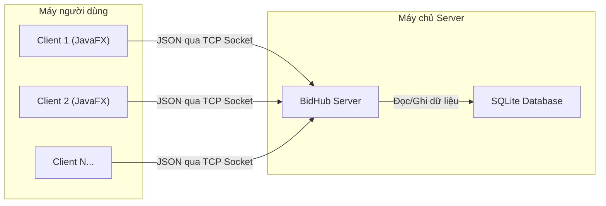

**Giải thích đơn giản:**
- **Client** = Ứng dụng trên máy người dùng (giao diện JavaFX)
- **Server** = Máy chủ xử lý mọi yêu cầu
- **Database** = Nơi lưu trữ dữ liệu (SQLite)
- Client và Server nói chuyện qua **TCP Socket** bằng tin nhắn **JSON**

### 2.2 Kiến Trúc Bên Trong Server

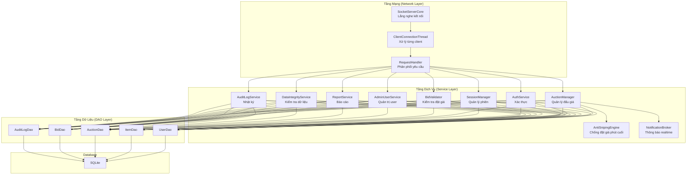

**Giải thích từng tầng:**

| Tầng | Vai trò | Ví dụ thực tế |
|------|---------|---------------|
| **Network** | Nhận/gửi tin nhắn từ client | Như lễ tân khách sạn — tiếp nhận yêu cầu |
| **Service** | Xử lý logic nghiệp vụ | Như bộ phận xử lý — kiểm tra, tính toán |
| **DAO** | Đọc/ghi database | Như thủ kho — lưu trữ và lấy dữ liệu |
| **Database** | Kho dữ liệu | Như tủ hồ sơ — nơi lưu trữ vĩnh viễn |

---

## 3. Sơ Đồ Lớp (Class Diagram) — Các Đối Tượng Chính

### 3.1 Hệ thống Người dùng (User Hierarchy)

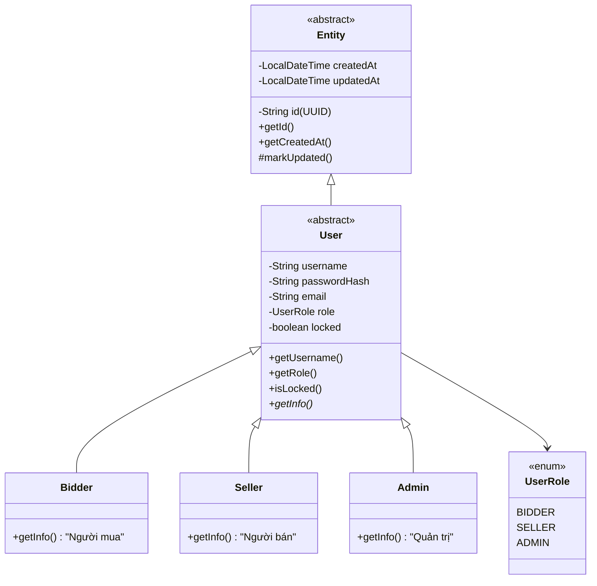

**Giải thích:**
- **Entity**: Lớp gốc — mọi đối tượng đều có `id` (mã định danh duy nhất) và thời gian tạo/cập nhật
- **User**: Người dùng — có tên đăng nhập, mật khẩu (đã mã hoá), email, vai trò
- **Bidder**: Người mua — đặt giá trong các phiên đấu giá
- **Seller**: Người bán — đăng sản phẩm và tạo phiên đấu giá
- **Admin**: Quản trị viên — khoá/mở tài khoản, xem báo cáo

### 3.2 Hệ thống Sản phẩm (Item Hierarchy)

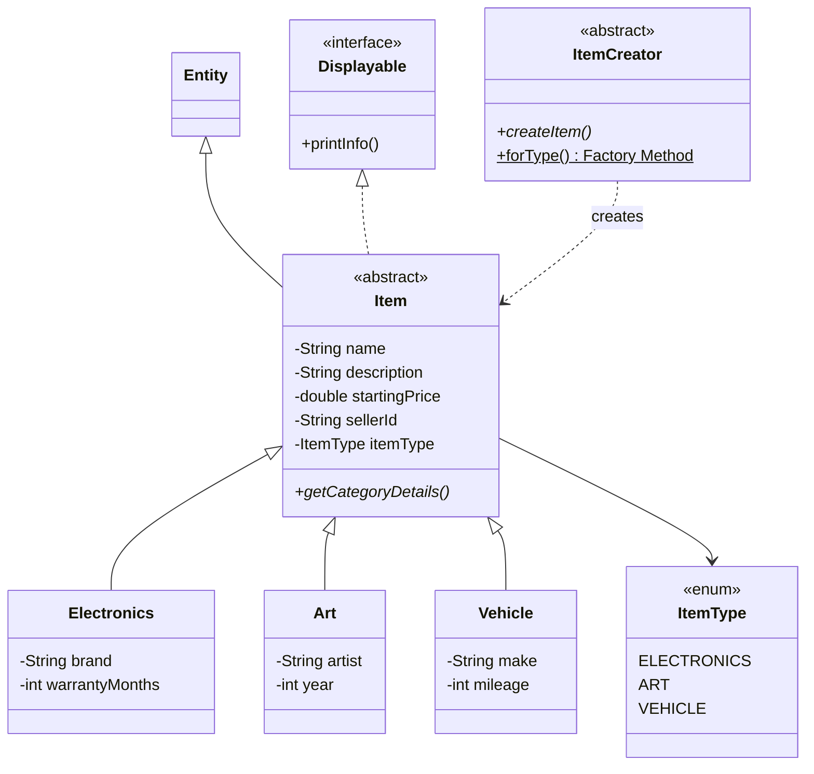

**Giải thích:**
- Sản phẩm có 3 loại: **Đồ điện tử**, **Nghệ thuật**, **Xe cộ**
- Mỗi loại có thông tin riêng (VD: Electronics có thương hiệu, bảo hành)
- **ItemCreator** dùng **Factory Method Pattern** để tạo sản phẩm đúng loại

### 3.3 Hệ thống Đấu giá

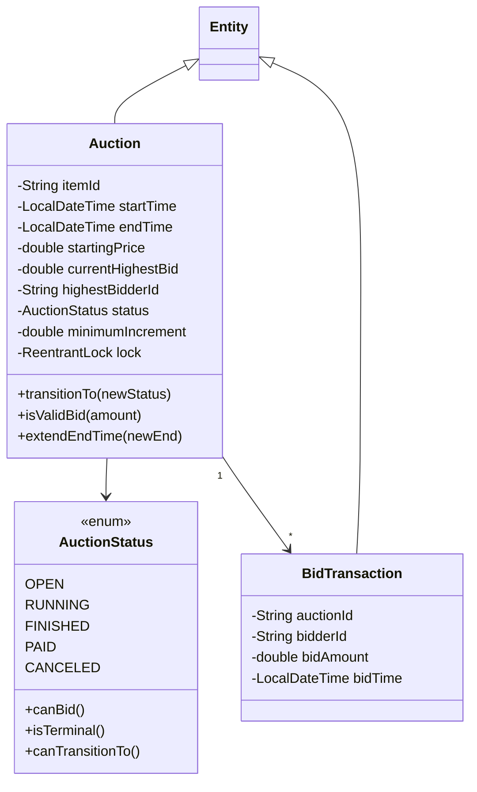

### 3.4 Vòng đời phiên đấu giá (State Machine)

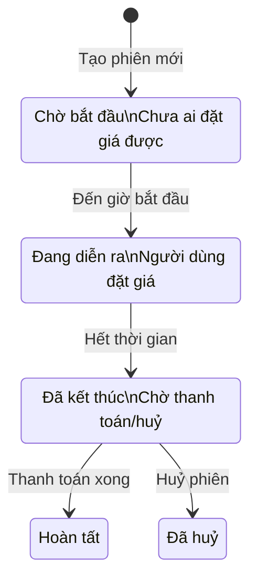

**Giải thích đơn giản:**
1. Seller tạo phiên → trạng thái **OPEN** (chờ)
2. Đến giờ → tự động chuyển sang **RUNNING** (đang chạy)
3. Hết giờ → tự động chuyển sang **FINISHED** (kết thúc)
4. Sau đó → **PAID** (đã thanh toán) hoặc **CANCELED** (huỷ)

---

## 4. Luồng Hoạt Động Chính

### 4.1 Đăng ký & Đăng nhập

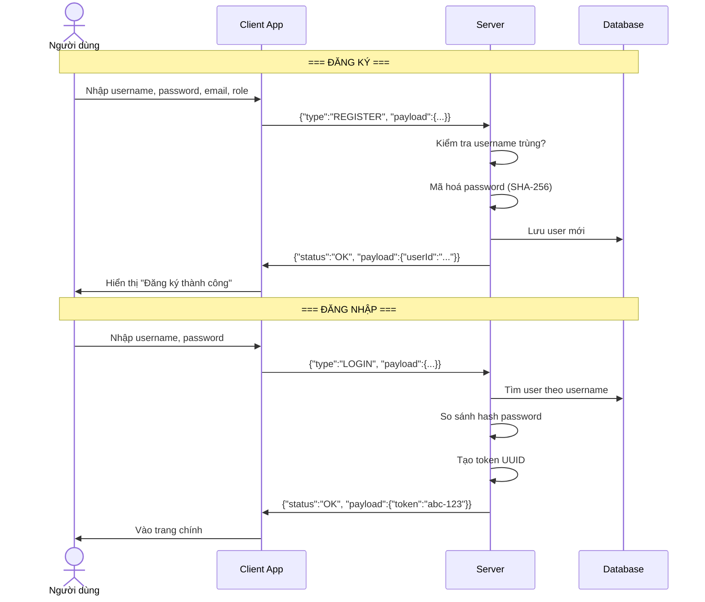

### 4.2 Tạo sản phẩm & Phiên đấu giá

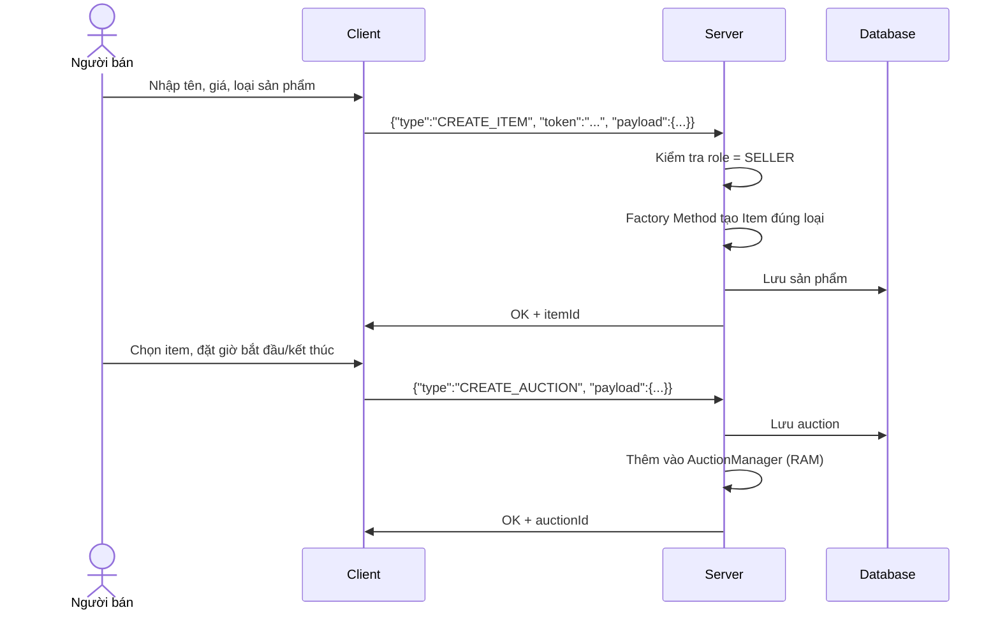

### 4.3 Đặt giá (Place Bid) — Luồng quan trọng nhất

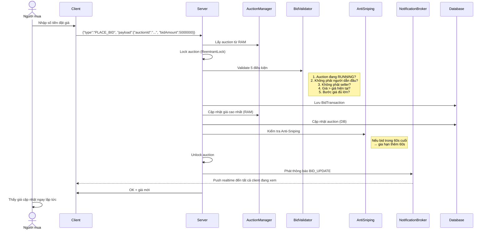

---

## 5. Design Patterns Sử Dụng

| Pattern | Nơi dùng | Giải thích đơn giản |
|---------|----------|---------------------|
| **Singleton** | `AuctionManager`, `SessionManager`, `NotificationBroker` | Chỉ có 1 instance duy nhất trong toàn hệ thống — như 1 "ông quản lý" duy nhất |
| **Factory Method** | `ItemCreator` → `ElectronicsCreator`, `ArtCreator`, `VehicleCreator` | Tạo sản phẩm đúng loại tự động — như nhà máy sản xuất theo đơn hàng |
| **Observer** | `NotificationBroker` (subscribe/publish) | Khi có bid mới → thông báo tất cả người đang xem — như đài phát thanh |
| **State Machine** | `AuctionStatus` (OPEN → RUNNING → FINISHED) | Phiên đấu giá tự động chuyển trạng thái — như đèn giao thông |
| **MVC** | `RequestHandler` (Controller), Service (Model), Client (View) | Tách riêng giao diện, xử lý, dữ liệu — dễ bảo trì |

---

## 6. Cây Exception (Xử lý lỗi)

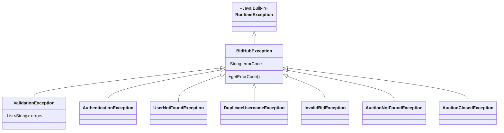

---

## 7. Cấu Trúc Module (Maven Multi-Module)

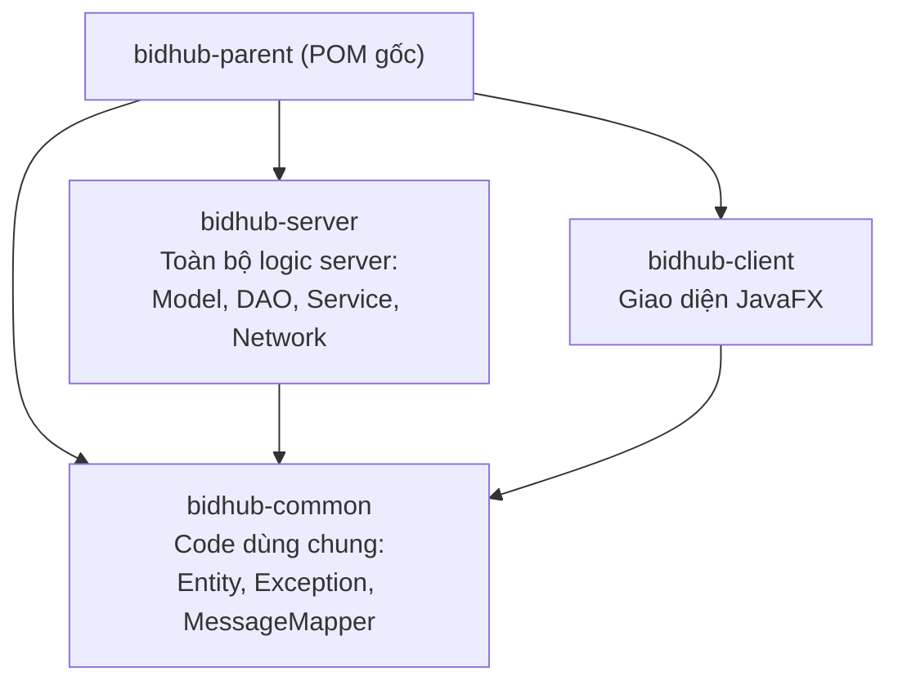

---

## 8. Kỹ Thuật Quan Trọng

### 8.1 Thread Safety (An toàn đa luồng)

Khi nhiều người đặt giá **cùng lúc**, hệ thống dùng:
- **ReentrantLock** trên mỗi Auction → chỉ 1 bid được xử lý tại 1 thời điểm
- **ConcurrentHashMap** → nhiều thread đọc/ghi an toàn
- **CopyOnWriteArrayList** → duyệt danh sách subscriber an toàn

### 8.2 Anti-Sniping (Chống đặt giá phút cuối)

Nếu ai đó đặt giá trong **60 giây cuối** → phiên tự động **gia hạn thêm 60 giây**. Điều này ngăn chiến thuật "chờ giây cuối mới đặt giá".

### 8.3 Audit Log (Nhật ký)

Mọi hành động quan trọng đều được ghi lại: đăng nhập, tạo sản phẩm, đặt giá, khoá tài khoản... Admin có thể xem toàn bộ lịch sử.

---

## 9. Phân Chia Công Việc Theo Tuần

| Tuần | Nội dung chính | Thành viên |
|------|---------------|------------|
| **1** | Setup project Maven, CI/CD, JUnit, docs | Cả nhóm |
| **2** | OOP Domain Model (Entity, User, Item, Auction, Exception) | Cả nhóm |
| **3** | Database SQLite + DAO layer | Đăng, Quốc Minh |
| **4** | TCP Socket Server + Client kết nối + PING | Quốc Minh, Đăng |
| **5** | Login/Register/Logout + CREATE_ITEM + GET_ITEM_LIST | Quốc Minh, Khoa |
| **6** | CREATE_AUCTION + PLACE_BID + BidValidator + AdminUserService | Đăng, Quốc Minh, Khoa |
| **7** | Observer/NotificationBroker + ReportService + Anti-Sniping + DataIntegrityService | Quốc Minh, Khoa |
| **8+** | Client GUI hoàn chỉnh, tích hợp, testing | Công Minh, cả nhóm |

---

## 10. Bảng Tổng Hợp API Commands

| Command | Yêu cầu đăng nhập | Role | Mô tả |
|---------|-------------------|------|-------|
| `PING` | ❌ | Ai cũng được | Kiểm tra server còn sống |
| `REGISTER` | ❌ | — | Đăng ký tài khoản mới |
| `LOGIN` | ❌ | — | Đăng nhập, nhận token |
| `LOGOUT` | ✅ | Ai cũng được | Đăng xuất |
| `CREATE_ITEM` | ✅ | SELLER | Tạo sản phẩm mới |
| `GET_ITEM_LIST` | ❌ | Ai cũng được | Xem danh sách sản phẩm |
| `DELETE_ITEM` | ✅ | SELLER (chủ sở hữu) | Xoá sản phẩm |
| `CREATE_AUCTION` | ✅ | SELLER | Tạo phiên đấu giá |
| `PLACE_BID` | ✅ | Ai cũng được | Đặt giá |
| `GET_AUCTION_LIST` | ❌ | Ai cũng được | Xem danh sách phiên |
| `GET_AUCTION_DETAIL` | ✅ | Ai cũng được | Xem chi tiết phiên |
| `SUBSCRIBE_AUCTION` | ❌ | Ai cũng được | Đăng ký nhận thông báo realtime |
| `GET_USER_LIST` | ✅ | ADMIN | Xem danh sách user |
| `LOCK_USER` | ✅ | ADMIN | Khoá tài khoản |
| `UNLOCK_USER` | ✅ | ADMIN | Mở khoá tài khoản |
| `GET_AUCTION_REPORT` | ✅ | SELLER/ADMIN | Báo cáo đấu giá |
| `GET_BID_HISTORY_REPORT` | ✅ | Ai cũng được | Lịch sử đặt giá |
| `GET_AUDIT_LOG` | ✅ | ADMIN | Nhật ký hệ thống |
| `RUN_INTEGRITY_CHECK` | ✅ | ADMIN | Kiểm tra toàn vẹn dữ liệu |

---

## 11. Sơ Đồ Deployment (Triển khai)

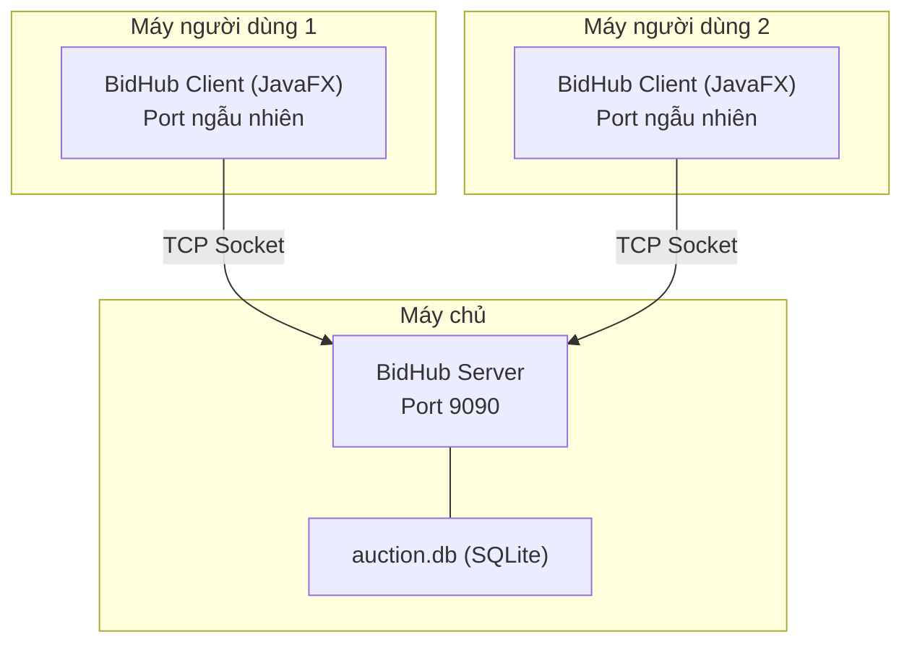

---

> **Tóm tắt**: BidHub là hệ thống đấu giá client-server viết bằng Java. Client dùng JavaFX, Server xử lý qua TCP Socket với JSON. Hệ thống áp dụng OOP, Design Patterns (Singleton, Factory, Observer, State Machine), đa luồng an toàn, và kiến trúc MVC phân tầng rõ ràng.
