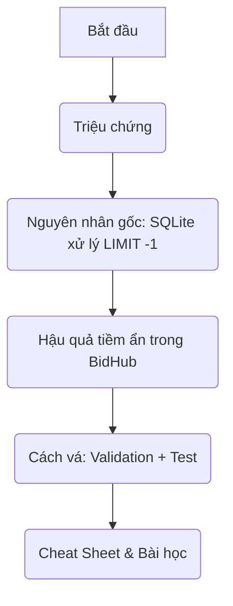

Chào bạn,

Hôm nay, chúng ta sẽ cùng mổ xẻ một lỗi **rất dễ mắc phải** khi làm việc với cơ sở dữ liệu – đặc biệt là SQLite – và cách nó có thể âm thầm phá hỏng ứng dụng BidHub nếu không được phát hiện kịp thời. Đây chính là **Lỗi 4** trong bản vá Tuần 4: `AuditLogDao.findRecent(-1)` trả về toàn bộ bảng thay vì ném lỗi.

---

## 🎯 Mục tiêu của bài giảng

Sau bài này, bạn sẽ:

- ✅ Hiểu **tại sao** `LIMIT -1` trong SQLite lại trả về tất cả bản ghi.
- ✅ Biết **hậu quả** khôn lường khi một lập trình viên vô tình (hoặc cố ý) gọi `findRecent(-1)`.
- ✅ Nắm được **cách vá đúng**: thêm validation ở tầng DAO và bảo vệ bằng test case.
- ✅ Áp dụng tư duy phòng thủ tương tự trong mọi method nhận tham số từ bên ngoài.

---

## 🧩 Lộ trình khám phá



---

### 1. Triệu chứng – “Sao nó không báo lỗi?”

Khi bạn viết:

```java
List<AuditLog> logs = auditLogDao.findRecent(-1);
```

Bạn kỳ vọng điều gì? Một ngoại lệ `IllegalArgumentException` vì limit không thể âm? Hay ít nhất là một danh sách rỗng?

Nhưng không – `findRecent(-1)` **vẫn chạy êm ru** và trả về **toàn bộ bản ghi audit trong database**. Trong lúc test với vài trăm dòng, bạn sẽ thấy log console ngập trong hàng ngàn dòng audit, ứng dụng chậm đi trông thấy, nhưng không có dấu hiệu nào cho thấy có lỗi xảy ra. Đây là một **silent bug** – lỗi âm thầm, khó phát hiện.

### 2. Nguyên nhân gốc – SQLite và “LIMIT -1”

Để hiểu tại sao, ta cần nhìn vào cách SQLite diễn giải mệnh đề `LIMIT`.

Trong SQLite, `LIMIT` nhận một biểu thức số nguyên. Nếu bạn truyền vào **giá trị âm**, SQLite sẽ coi đó là **“không có giới hạn”** (no limit) – tương đương với việc lược bỏ hoàn toàn mệnh đề `LIMIT`. Điều này được ghi rõ trong tài liệu chính thức của SQLite: *“If the LIMIT expression evaluates to a negative value, then there is no upper bound on the number of rows returned.”*

```mermaid
flowchart LR
    A[Gọi findRecent(-1)] --> B[JDBC: ps.setInt(1, -1)]
    B --> C[SQLite nhận LIMIT -1]
    C --> D{SQLite xử lý}
    D -->|Giá trị < 0| E[Không áp dụng giới hạn]
    E --> F[Truy vấn trả về TOÀN BỘ bảng]
```

Như vậy, câu lệnh:
```sql
SELECT * FROM audit_logs ORDER BY created_at DESC LIMIT -1
```
được SQLite thực thi như:
```sql
SELECT * FROM audit_logs ORDER BY created_at DESC
```

Bản thân JDBC driver không hề biết rằng `-1` là không hợp lệ về mặt nghiệp vụ – nó chỉ đơn thuần truyền tham số xuống database. Vì vậy, lỗi không nằm ở JDBC, cũng không ở SQLite, mà nằm ở **tầng DAO của chúng ta đã không kiểm tra tính hợp lệ của tham số đầu vào**.

### 3. Hậu quả tiềm ẩn trong BidHub

Tại sao đây là lỗi ở mức **🟡 Trung bình (Medium)**? Vì nó sẽ không làm crash server ngay lập tức, nhưng gây ra những hệ quả tiêu cực khó lường:

- **Hiệu năng suy giảm nghiêm trọng:** Nếu bảng `audit_logs` chứa hàng trăm nghìn bản ghi (sau vài tháng vận hành thực tế), việc `findRecent(-1)` sẽ kéo toàn bộ dữ liệu về Java heap, gây tốn RAM, tăng thời gian query, thậm chí `OutOfMemoryError`.
- **Làm nhiễu log và kết quả trả về:** Ở đâu đó trong code, một đồng nghiệp gọi `findRecent(-1)` để lấy “gần đây nhất” do sơ suất. Thay vì nhận được 10-20 bản ghi để hiển thị, họ nhận được **tất cả**, gây treo giao diện admin hoặc làm ngập console log.
- **Khó debug:** Không có exception, không có stacktrace. Lập trình viên sẽ mất hàng giờ để tìm ra nguyên nhân vì sao trang audit log bỗng dưng chậm kinh khủng.
- **Nguy cơ bảo mật thông tin:** Một API vô tình dump toàn bộ audit log (có thể chứa thông tin nhạy cảm) nếu limit bị bypass, trở thành lỗ hổng rò rỉ dữ liệu.

Do đó, vá lỗi này là cực kỳ quan trọng trước khi hệ thống đi vào hoạt động thực tế.

### 4. Cách vá – Phòng thủ ngay từ tầng DAO

Giải pháp rất đơn giản và theo đúng nguyên tắc **Fail Fast**: Hãy kiểm tra tham số ngay khi phương thức được gọi, và ném ngoại lệ nếu không hợp lệ.

#### Code vá:

```java
/**
 * Trả về N bản ghi mới nhất.
 *
 * @param limit số lượng tối đa cần lấy — phải > 0
 * @return danh sách tối đa {@code limit} bản ghi
 * @throws IllegalArgumentException nếu {@code limit} ≤ 0
 */
public List<AuditLog> findRecent(int limit) {
  if (limit <= 0) {
    throw new IllegalArgumentException("limit phải > 0, nhận được: " + limit);
  }
  // ... phần còn lại giữ nguyên ...
}
```

Tại sao nên ném `IllegalArgumentException`?
- Đây là ngoại lệ **runtime**, báo hiệu lỗi lập trình (caller truyền sai đối số). Người gọi hàm phải sửa code, không nên bắt ngoại lệ này và “chịu đựng”.
- Nó xuất hiện sớm, ngay khi phương thức được gọi, giúp developer **phát hiện lỗi ngay trong quá trình phát triển / test**, chứ không phải khi đã lên production.

#### Test case bảo vệ

Thêm hai test case vào `AuditLogDaoTest` để đảm bảo hành vi mới:

```java
@Test
@DisplayName("findRecent(0) → ném IllegalArgumentException")
void findRecent_zeroLimit_throwsException() {
  assertThrows(IllegalArgumentException.class, () -> dao.findRecent(0));
}

@Test
@DisplayName("findRecent(-1) → ném IllegalArgumentException (không trả về toàn bảng)")
void findRecent_negativeLimit_throwsException() {
  for (int i = 0; i < 5; i++) {
    dao.save(new AuditLog("u" + i, AuditActions.PLACE_BID, "{}"));
  }
  assertThrows(IllegalArgumentException.class, () -> dao.findRecent(-1));
}
```

Với test case này, nếu ai đó sau này vô tình sửa lại code mà bỏ validation, test sẽ đỏ ngay lập tức.

---

## 📋 Tổng kết & Cheat Sheet

| Khía cạnh | Trước vá (có lỗi) | Sau vá (an toàn) |
|-----------|-------------------|------------------|
| **Gọi `findRecent(-1)`** | Trả về **toàn bộ** bảng audit, không báo lỗi. | Ném `IllegalArgumentException` ngay lập tức. |
| **Tác động hiệu năng** | Có thể gây `OutOfMemoryError` nếu bảng lớn. | Không thể xảy ra, vì lời gọi sai bị chặn. |
| **Khả năng phát hiện lỗi** | Rất khó, chỉ thấy qua triệu chứng phụ (chậm, full RAM). | Phát hiện ngay khi chạy test hoặc ngay khi dev gọi sai. |
| **Nguyên tắc thiết kế** | Không có validation, tin tưởng tuyệt đối caller. | **Fail Fast** – kiểm tra tham số đầu vào, từ chối sớm. |

**Bài học rút ra:**
- Luôn **đừng tin tưởng** vào dữ liệu từ bên ngoài (kể cả từ đồng nghiệp trong cùng project). Mọi tham số cần được kiểm tra tính hợp lệ ở tầng thấp nhất có thể.
- Đối với các database query, hãy đặc biệt cẩn thận với các mệnh đề `LIMIT`, `OFFSET`, vì các giá trị âm có thể được database xử lý khác với mong đợi (SQLite bỏ qua, PostgreSQL ném lỗi, MySQL có thể khác).
- Việc thêm validation không chỉ giúp tránh lỗi, mà còn **tự làm tài liệu** cho phương thức – người khác nhìn vào signature và Javadoc sẽ biết ngay tham số cần thỏa mãn điều gì.

Hy vọng qua buổi trò chuyện nhỏ này, bạn đã hiểu rõ bản chất của Lỗi 4 và có thêm một “vũ khí” phòng thủ vững chắc trong túi đồ nghề của mình. Hãy luôn nhớ: **Fail Fast, Fix Early!**

Chúc bạn code vững vàng!
