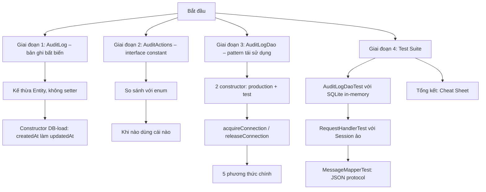
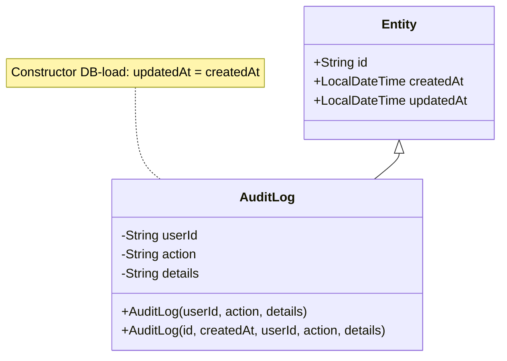

Chào bạn,

Hôm nay, chúng ta sẽ cùng khám phá trọn vẹn phần việc của Khoa trong Tuần 4: **AuditLog Model, AuditActions, AuditLogDao và toàn bộ hệ thống test cho tầng protocol**. Đây là hạ tầng ghi nhận mọi hành động quan trọng trong BidHub – thứ mà không có nó, hệ thống không thể truy vết, gỡ lỗi hay kiểm toán sau này. Hơn thế nữa, cách chúng ta thiết kế và kiểm thử các thành phần này chính là hình mẫu cho mọi module nghiệp vụ tiếp theo.

Bài giảng này được xây dựng giống hệt phong cách Bài 0.3 mà bạn đã quen thuộc: **lý thuyết cốt lõi → sơ đồ minh họa → code thực tế trong dự án → câu hỏi thường gặp → cheat sheet tổng kết**. Sau khi học xong, bạn sẽ hiểu rõ:

- Tại sao AuditLog phải là **immutable** và không có `updatedAt`.
- Vì sao `AuditActions` chọn **interface constant** thay vì enum.
- Cách `AuditLogDao` tuân thủ pattern DAO chuẩn với khả năng **inject connection** để test độc lập.
- Làm thế nào để viết test cho DAO với SQLite in‑memory và test cho `RequestHandler` mà không cần server thật.

---

## 🎯 Mục tiêu bài học

- ✅ Nắm vững triết lý **immutable audit record** và cách ánh xạ với `Entity`.
- ✅ Hiểu rõ pattern DAO có constructor inject, đảm bảo **unit test độc lập** với cơ sở dữ liệu thật.
- ✅ Biết cách tổ chức **interface constant** cho action codes, trade‑off giữa type‑safety và tính mở rộng.
- ✅ Làm chủ kỹ thuật viết **test đa tầng**: DAO test với SQLite in‑memory, protocol test với `Session` và `MessageMapper`.



---

## 🧩 Giai đoạn 1: AuditLog – Bản ghi bất biến, không có `updatedAt`

### 1.1 Tại sao phải là immutable?

Trong bất kỳ hệ thống đấu giá nào, audit log là bằng chứng pháp lý. Bạn không bao giờ muốn ai đó (dù là admin) có thể sửa một dòng log từ “user A đặt giá 50” thành “user B đặt giá 30”. Đó là gian lận. Vì vậy:

- **Không có setter** cho `userId`, `action`, `details`.
- Tất cả các trường đều được khởi tạo qua constructor và là `final` (ngầm định).
- Kế thừa `Entity` nhưng **không cho phép thay đổi `createdAt` hay `id`** sau khi tạo.

Nếu sau này phát hiện sai sót (ví dụ log nhầm người dùng), chúng ta **không UPDATE** bản ghi cũ. Chúng ta **thêm một bản ghi mới** với action `"CORRECTION"`, trong `details` ghi rõ: *“Sửa cho sự kiện id=xxx: thực tế người thực hiện là user B”*. Đây là nguyên tắc **Compensating Transaction**, giữ cho lịch sử luôn toàn vẹn.

### 1.2 Vấn đề `updatedAt` trong Entity

Lớp cha `Entity` có hai trường: `createdAt` và `updatedAt`. Nhưng bảng `audit_logs` trong schema **chỉ có `created_at`**, không có `updated_at`. Tại sao chúng ta không thêm cột `updated_at` vào bảng? Bởi vì:

- Audit log không bao giờ được cập nhật, nên `updated_at` là vô nghĩa.
- Nếu thêm cột, nó sẽ luôn NULL hoặc bằng `created_at`, gây lãng phí và hiểu nhầm rằng “log có thể thay đổi”.

Giải pháp của Khoa: **constructor DB‑load** truyền `createdAt` cho cả hai tham số của `Entity`:

```java
public AuditLog(String id, LocalDateTime createdAt,
                String userId, String action, String details) {
    super(id, createdAt, createdAt); // updatedAt = createdAt
    this.userId = userId;
    this.action = action;
    this.details = details;
}
```

Khi gọi `getUpdatedAt()`, nó trả về đúng thời điểm tạo. Điều này chấp nhận được về mặt ngữ nghĩa vì audit log không bao giờ thay đổi, thời điểm cập nhật cuối cùng cũng chính là thời điểm tạo. Đây là một **trade‑off kỹ thuật** để giữ base class chung mà không làm hỏng triết lý thiết kế.



---

## 🧩 Giai đoạn 2: AuditActions – Interface constant hay Enum?

### 2.1 Vì sao chọn interface constant?

Trong `AuditActions.java`, chúng ta khai báo:

```java
public interface AuditActions {
    String USER_LOGIN = "USER_LOGIN";
    String PLACE_BID = "PLACE_BID";
    // ...
}
```

Đây là các hằng số `String`. Đối thủ của nó là `enum`:

```java
public enum AuditAction {
    USER_LOGIN, PLACE_BID;
}
```

**Tại sao Khoa (và cả nhóm) chọn interface constant?**

| Tiêu chí | Interface constant | Enum |
|----------|-------------------|------|
| **Lưu trữ DB** | Giá trị String gốc, gán thẳng vào SQL. | Cần `.name()` hoặc converter. |
| **Mở rộng** | Thêm hằng số mới không làm hỏng code cũ, không cần biên dịch lại toàn bộ module. | Thêm enum constant đòi hỏi biên dịch lại tất cả nơi dùng. |
| **Type‑safety** | Không có – bạn có thể vô tình viết `"USER_LOGIN"` sai chính tả mà compiler không bắt. | Có – compiler bắt lỗi nếu bạn dùng giá trị không tồn tại. |
| **Sử dụng với SQL** | So sánh trực tiếp trong `WHERE action = ?` với String. | Vẫn phải map về String; nếu dùng ordinal thì nguy hiểm khi thay đổi thứ tự. |

Trong giai đoạn phát triển nhanh của BidHub, action mới được thêm liên tục (ví dụ: `AUCTION_EXTENDED`, `ITEM_DELETED`). Dùng interface constant giúp chúng ta **mở rộng không đau**, không phải build lại toàn bộ server. Rủi ro sai chính tả được giảm thiểu vì mọi nơi đều tham chiếu đến hằng số trong interface, không hardcode string.

**Khi nào nên dùng enum?** Khi tập giá trị là **cố định và nhỏ**, bạn muốn compiler bảo vệ bạn khỏi lỗi gõ sai. Ví dụ: `AuctionStatus` với ba giá trị `UPCOMING`, `ACTIVE`, `CLOSED` sẽ không bao giờ thay đổi, nên dùng enum.

---

## 🧩 Giai đoạn 3: AuditLogDao – Pattern DAO chuẩn mực

`AuditLogDao` được viết theo đúng pattern mà các DAO khác trong dự án (UserDao, ItemDao…) đã thiết lập từ Tuần 3. Cấu trúc này đảm bảo:

- **Tính nhất quán**: Mọi DAO đều có 2 constructor, `acquireConnection()`/`releaseConnection()`.
- **Khả năng kiểm thử độc lập**: Test có thể inject một `Connection` in‑memory, không cần database thật.

### 3.1 Hai constructor

```java
public class AuditLogDao {
    private final Connection injectedConn;

    // Constructor production
    public AuditLogDao() {
        this.injectedConn = null;
    }

    // Constructor test
    public AuditLogDao(Connection conn) {
        this.injectedConn = conn;
    }
    // ...
}
```

Trong môi trường production, `AuditLogDao` sẽ dùng `DbConnectionProvider` để lấy connection từ pool. Khi viết test, Khoa truyền thẳng một `Connection` được tạo từ `DriverManager.getConnection("jdbc:sqlite::memory:")`. Nhờ vậy, test không phụ thuộc vào file `bidhub.db`, không cần `ConfigLoader`, không cần `MigrationRunner`.

### 3.2 acquireConnection / releaseConnection

```java
private Connection acquireConnection() throws SQLException {
    return (injectedConn != null)
        ? injectedConn
        : DbConnectionProvider.getInstance().getConnection();
}

private void releaseConnection(Connection conn) {
    if (injectedConn == null) {
        DbConnectionProvider.getInstance().closeConnection(conn);
    }
}
```

- Nếu `injectedConn` khác null (test mode), ta dùng ngay connection đó và **không đóng lại** (test sẽ tự đóng sau khi hoàn tất).
- Nếu không (production mode), ta lấy connection từ provider và nhớ trả về sau khi dùng.

### 3.3 5 phương thức chính

| Phương thức | Mục đích |
|------------|----------|
| `save(AuditLog log)` | Chèn một bản ghi mới. |
| `findAll()` | Lấy toàn bộ log, mới nhất trước. |
| `findByUserId(String userId)` | Lọc log của một người dùng. |
| `findByAction(String action)` | Lọc log theo loại hành động. |
| `findRecent(int limit)` | Lấy `N` bản ghi gần đây nhất. |

Tất cả đều dùng `PreparedStatement` để tránh SQL injection và đảm bảo an toàn với tham số null.

**Ví dụ `save()` với null‑safe:**
```java
ps.setString(2, log.getUserId()); // nếu userId là null, JDBC ghi SQL NULL
```
Không cần kiểm tra `if (userId != null)` – JDBC tự xử lý. Đây là kiến thức quan trọng bạn đã biết từ Bài 0.4.

---

## 🧩 Giai đoạn 4: Test Suite – 15 test case mới, bảo vệ toàn bộ tầng audit

Khoa chịu trách nhiệm viết **3 file test** với tổng cộng 15 test case mới, nâng tổng số test của dự án lên tối thiểu 77. Chúng bao phủ cả ba khía cạnh: DAO, protocol handler và message mapper.

### 4.1 AuditLogDaoTest – 5 test case với SQLite in‑memory

```java
@BeforeEach
void setup() throws SQLException {
    conn = DriverManager.getConnection("jdbc:sqlite::memory:");
    try (Statement s = conn.createStatement()) {
        s.execute("""
            CREATE TABLE audit_logs (
              id TEXT PRIMARY KEY, user_id TEXT, action TEXT NOT NULL,
              details TEXT NOT NULL DEFAULT '', created_at TEXT NOT NULL)
            """);
    }
    dao = new AuditLogDao(conn);
}
```

Bảng `audit_logs` được tạo **thủ công ngay trong test**, không cần `schema.sql`. Điều này giúp test chạy cực nhanh và hoàn toàn biệt lập.

Các test case:
- `save_findAll_returnsRecord`: Lưu một log → tìm thấy đúng.
- `findByUserId_filtersCorrectly`: Lưu log của hai user → chỉ lọc đúng user.
- `findByAction_onlyMatchingAction`: Lưu hai loại action → lọc đúng action.
- `findRecent_limitsResults`: Lưu 10 bản ghi, gọi `findRecent(3)` → nhận tối đa 3.
- `save_nullUserId_succeeds`: Lưu log với `userId = null` (system action) → không crash, trường `user_id` là NULL.

### 4.2 RequestHandlerTest – 5 test case với Session ảo

Test này xác minh `RequestHandler` xử lý đúng:
- `ping_returnsOk`: Gửi PING → nhận pong và sessionId.
- `unknownCommand_returnsError`: Gửi lệnh không tồn tại → lỗi “Lệnh không xác định”.
- `malformedJson_returnsErrorNoException`: Gửi chuỗi không phải JSON → không crash, trả lỗi.
- `authRequired_unauthSession_returnsError`: Gọi PLACE_BID khi chưa login → bị từ chối.
- `nullType_returnsError`: JSON thiếu `type` → không crash, trả lỗi.

Điểm đáng chú ý: mỗi test đều tạo một `ServerSocket(0)` và `Socket` thật, nhưng chỉ dùng để khởi tạo `Session` với `PrintWriter`/`BufferedReader`. Không cần server thật chạy. Đây là kỹ thuật **unit test với socket loopback** mà không phụ thuộc mạng.

### 4.3 MessageMapperTest – 5 test case cho JSON protocol

- `ok_serializes`: `MessageResponse.ok()` tạo ra JSON có `status: OK` và `type: PING`.
- `error_noPayloadField`: Response lỗi không chứa `"payload"` (vì `@JsonInclude.NON_NULL`).
- `fromJson_extraFields_ignored`: Client gửi thêm field lạ → không crash.
- `fromJson_empty_throwsException`: Chuỗi rỗng → ném exception.
- `fromJson_minimal_doesNotCrash`: JSON chỉ có `{}` → các field null, không crash.

Những test này đảm bảo `MessageMapper` và các annotation Jackson hoạt động đúng như thiết kế.

---

## 📋 Tổng kết: Cheat Sheet

| Thành phần | Nguyên tắc chính | Áp dụng trong BidHub |
|-----------|-----------------|----------------------|
| **AuditLog** | Immutable, không setter, không `updatedAt` riêng. | Constructor DB‑load truyền `createdAt` cho cả `updatedAt`. |
| **AuditActions** | Interface constant giúp mở rộng dễ, hy sinh type‑safety. | Dùng trực tiếp trong SQL và code, tránh hardcode string. |
| **AuditLogDao** | 2 constructor, acquire/release, PreparedStatement. | Test inject connection in‑memory; production dùng `DbConnectionProvider`. |
| **DAO test** | SQLite in‑memory, tạo bảng thủ công. | Không phụ thuộc file `.db`, không cần `MigrationRunner`. |
| **Protocol test** | Dùng `ServerSocket(0)` tạo session ảo. | Không cần server thật, test nhanh và cô lập. |
| **MessageMapper** | `@JsonInclude(NON_NULL)`, `@JsonIgnoreProperties` bảo vệ protocol. | Đảm bảo forward/backward compatibility khi nâng cấp. |

**Điểm mấu chốt:** Phần việc của Khoa trong Tuần 4 không chỉ tạo ra một class DAO đơn thuần. Nó thiết lập một **hình mẫu về kiến trúc đa tầng với khả năng kiểm thử cao**, đảm bảo rằng mọi hành động trong hệ thống sẽ được ghi lại một cách an toàn, minh bạch, và dễ dàng truy vết. Những test case đi kèm chính là lưới an toàn cho toàn bộ các tuần tiếp theo.

Chúc bạn nắm thật vững phần kiến thức này – nó sẽ là nền móng cho `AuditLogService` ở Tuần 5 và hàng loạt tính năng giám sát sau này!
